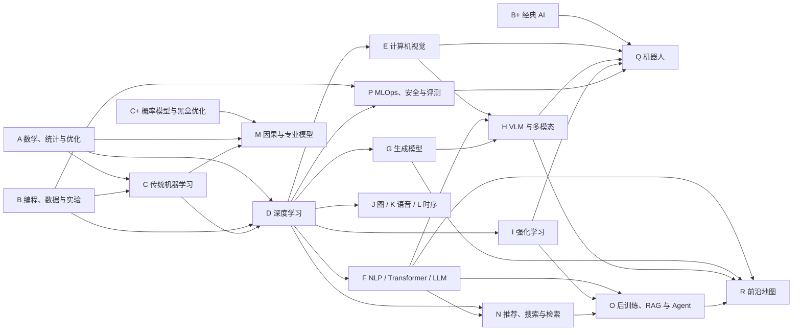

# 从这里开始

这套讲义按**依赖关系**而不是热度排列。GPT、VLM、Agent 和 VLA 看起来都能直接上手，但真正理解它们，需要概率统计、优化、深度学习、Transformer、视觉表征、检索或强化学习中的不同先修链。

- [返回分章总目录](../README.md)
- [打开单文件完整版](../../full/AI_Encyclopedia.md)
- [直接进入两周基础诊断](../06-projects/s-projects-assessment.md#s01-两周基础诊断)

## 一个知识点怎样才算学会

每个知识点都提供先修、定义、机制、精确资料、最小代码、检测题和常见坑。按下面的闭环学习，而不是只阅读正文：

1. **闭卷解释**：用 30 秒回答“它是什么、解决什么问题、何时会失败”。
2. **精读定位资料**：写清公式中每个符号、张量形状和假设，不追求一次读完整本教材。
3. **预测后运行**：先写下代码输出、曲线或消融趋势，再执行最小示例。
4. **空白复写**：合上讲义，从空文件重写核心机制，并固定随机种子。
5. **完成检测**：回答检测题或小实验，保留结果与错误样本。
6. **间隔复习**：在第 2、7、21 天闭卷重测，把遗忘点加入复习清单。

一个单元的建议通过标准：概念题正确率至少 80%，能独立复写最小代码，能指出至少一个失败条件，并能说清它与前后各一个知识点的关系。

## 标记约定

| 标记 | 含义 | 行动建议 |
|---|---|---|
| `核心` / `[核]` | 现代 AI 的共同主干 | 原则上按依赖顺序学习并完成检测 |
| `分支` | 对应方向的必修内容 | 选定方向后再系统学习 |
| `前沿` | 快速演进中的方法 | 记录任务、数据、指标、来源和核验日期 |
| `代码：可运行` | 安装所列依赖后可独立执行 | 先预测，再运行并修改一个变量 |
| `代码：机制示意` | 为解释机制而省略完整训练或生产层 | 不把它误当成可部署实现 |

## 环境策略

代码以 Python 3 和 CPU 优先，主要使用 NumPy、scikit-learn 与 PyTorch。不要在第一天安装所有包：进入一章时再创建独立环境，并记录 Python 与依赖版本。

最小基础环境可以这样建立：

```powershell
python -m venv .venv
.\.venv\Scripts\Activate.ps1
python -m pip install --upgrade pip
python -m pip install numpy scipy pandas matplotlib scikit-learn
```

进入深度学习、NLP 或强化学习章节时，再按对应官方安装说明添加 `torch`、`torchvision`、`transformers`、`datasets`、`tokenizers`、`gymnasium` 或 `networkx`。大型模型章节的目标通常是用小张量复现损失与数据流，不需要下载数十 GB 权重。

每次实验至少记录：

```text
日期 / 知识点编号 / Git commit
Python 与依赖版本 / 随机种子 / 设备
数据划分 / 基线 / 唯一改动
主指标 / 失败案例 / 下一步假设
```

## 宏观依赖图



## 按方向选路径

所有方向先确保 [A 数学](../01-foundations/a-math-statistics-optimization.md)、[B 实验基础](../01-foundations/b-programming-data-experiments.md)、[C 机器学习](../01-foundations/c-machine-learning.md) 与 [D 深度学习](../01-foundations/d-deep-learning.md) 中相关“核心”单元通过检测，再走下面的分支。

### LLM / Agent

[F NLP、Transformer 与 LLM](../02-perception-language/f-nlp-transformers-llms.md) → [N 检索](../03-decision-specialties/n-recommendation-search-retrieval.md) → [O 后训练、RAG 与 Agent](../04-systems-agents-robotics/o-llm-posttraining-rag-agents.md) → [P 工程与评测](../04-systems-agents-robotics/p-mlops-safety-evaluation.md) → [R 前沿](../05-frontier/r-frontier-2024-2026.md)

### CV / VLM

[E 计算机视觉](../02-perception-language/e-computer-vision.md) → [G 生成模型](../02-perception-language/g-generative-models.md) → [H VLM 与多模态](../02-perception-language/h-multimodal-vlm.md) → [P 工程与评测](../04-systems-agents-robotics/p-mlops-safety-evaluation.md) → [R 前沿](../05-frontier/r-frontier-2024-2026.md)

### 强化学习 / 机器人

[B+ 经典 AI](../01-foundations/b-plus-classical-ai.md) + [I 强化学习](../03-decision-specialties/i-reinforcement-learning.md) → [E 视觉](../02-perception-language/e-computer-vision.md) / [H 多模态](../02-perception-language/h-multimodal-vlm.md) → [Q 具身智能与机器人](../04-systems-agents-robotics/q-embodied-ai-robotics.md) → [P 安全与评测](../04-systems-agents-robotics/p-mlops-safety-evaluation.md)

### 数据科学 / 因果 / 推荐

[C 机器学习](../01-foundations/c-machine-learning.md) → [C+ 概率模型与黑盒优化](../01-foundations/c-plus-probabilistic-black-box.md) → [L 时间序列](../03-decision-specialties/l-time-series.md) / [M 因果推断](../03-decision-specialties/m-causal-inference.md) / [N 推荐与检索](../03-decision-specialties/n-recommendation-search-retrieval.md) → [P 工程与评测](../04-systems-agents-robotics/p-mlops-safety-evaluation.md)

### 图、语音或时间序列

完成共同主干后，按目标进入 [J 图神经网络](../03-decision-specialties/j-graph-neural-networks.md)、[K 语音与音频](../03-decision-specialties/k-speech-audio.md) 或 [L 时间序列](../03-decision-specialties/l-time-series.md)。这些章节中的“分支”单元在对应方向里应视为必修。

## 两周基础诊断入口

先打开 [S01 两周基础诊断](../06-projects/s-projects-assessment.md#s01-两周基础诊断)。诊断要求你完成 NumPy 线性/逻辑回归、PyTorch MLP 训练循环和数据泄漏识别；它的目的不是得到高分，而是确定应该补哪些知识。

建议节奏：

| 时间 | 任务 | 证据 |
|---|---|---|
| 第 1–2 天 | 闭卷完成数学、概率、张量形状与实验设计自测 | 错题清单与知识点编号 |
| 第 3–5 天 | NumPy 实现线性回归和逻辑回归；做数值梯度检查 | 梯度相对误差 `< 1e-5` |
| 第 6–8 天 | PyTorch 写 MLP 数据、训练、验证与 checkpoint 流程 | 能过拟合 64–256 个样本 |
| 第 9–10 天 | 在一个人为泄漏的数据流程中定位并修正问题 | 修正前后对照与原因解释 |
| 第 11–12 天 | 闭卷解释 bias–variance、交叉熵、正则化及三种数据划分 | 自测正确率至少 80% |
| 第 13–14 天 | 整理曲线、数值检查与 300 字缺口复盘 | 下一阶段补缺清单 |

诊断后的分流原则：

- 数学与概率解释不清：回到 [A](../01-foundations/a-math-statistics-optimization.md)，只补错题对应单元。
- 数据划分、指标或泄漏有误：优先补 [B](../01-foundations/b-programming-data-experiments.md)。
- 线性/逻辑回归或泛化概念薄弱：补 [C](../01-foundations/c-machine-learning.md)。
- 反向传播、训练循环或优化不稳：补 [D](../01-foundations/d-deep-learning.md)。
- 四项均通过：选择上面的一个方向路径，同时开始 [S 项目](../06-projects/s-projects-assessment.md)。

## 每次只做下一小步

现在不要从头收藏所有资料或安装全部依赖。先完成 S01 的第一项：闭卷写出线性回归的模型、均方误差、梯度形状和训练/验证/测试三者职责；再打开对应章节核对。你的错误清单，才是个人学习路线的真正起点。
