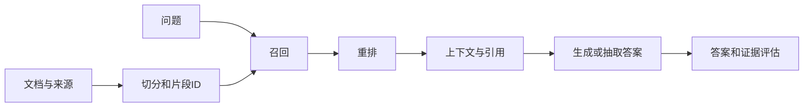

# 从检索到 Agent：把答案和动作都变成可检查的过程

[导读](README.md) · [N 检索](../03-decision-specialties/n-recommendation-search-retrieval.md) · [O05 RAG](../04-systems-agents-robotics/o-llm-posttraining-rag-agents.md#o05) · [O08 Agent](../04-systems-agents-robotics/o-llm-posttraining-rag-agents.md#o08)

## 1. 先把 RAG 拆成可定位的阶段



每个箭头都可能失败。文档缺少答案时，继续扩大生成模型无法补回证据；正确片段已召回但模型读错时，单纯改善检索排名也不一定有效。保存文档ID、片段ID和文本位置，使错误能追溯到具体阶段。

切分太短可能把定义和条件拆开，太长则浪费上下文并引入无关信息。重叠窗口可以保留边界信息，却增加重复证据；评估时应按原始文档或事实去重，避免把多个重叠片段当作多份独立支持。

## 2. 稀疏、潜在语义与神经稠密检索

TF-IDF用词项频率和逆文档频率表示文本。BM25进一步引入词频饱和与文档长度归一化。一种常见形式为

$$s(q,d)=\sum_{t\in q}\operatorname{IDF}(t)
\frac{f(t,d)(k_1+1)}{f(t,d)+k_1(1-b+b|d|/\overline{|d|})}.$$

同一词重复20次通常不应获得重复1次的20倍证据。长度归一化则避免长文档仅凭更多词就占优势。具体IDF平滑有不同版本，比较时必须使用一致定义。

TF-IDF矩阵的截断SVD得到低维潜在语义表示，它是线性统计方法，不是神经embedding。神经双塔分别编码query和document，训练目标可让正配对相似度超过负配对。cross-encoder则联合读取query和document，更适合重排少量候选。两者精度、延迟和可预计算性不同。

混合检索可以融合两种排序。RRF使用 $\sum_j 1/(k+\operatorname{rank}_j(d))$，避免直接相加量纲不同的分数。规则重排只能说明规则偏好，不能被写成已经实现神经交叉编码器。

## 3. 一个小排名例子

某问题的相关文档是A和C。系统返回 `[B,A,D]`，则Recall@3为1/2，第一个相关结果在第2位，reciprocal rank为1/2。如果A片段本身不含答案，只是同一个大文档相关，那么文档级命中和片段级答案可用性仍不同。

检索指标不衡量生成答案是否忠实。答案评测还要检查正确性、引用能否支持对应断言、无答案时是否拒答。字符串覆盖率只能作为启发式，不能证明蕴含关系；小数据集可以保留逐项人工标注及明确判分规则。

拒答阈值必须在验证集选择，再到独立测试集报告。若问题与词表重合极少，低分可能表示无答案，也可能是检索器不懂同义词；需要分析失败类型，不能把阈值当作真理判定器。

## 4. 原始 RAG 与常见工程流水线

2020年的[RAG论文](../../readings/papers/rag.md)把检索文档作为潜变量，讨论RAG-Sequence与RAG-Token的概率组合和训练。常见工程系统是检索、拼接prompt、调用已有生成器，通常没有复现原论文的联合训练目标。两者有概念联系，但不能因为名字相同就宣称复现论文。

## 5. Agent 的模型策略与确定性控制器

模型提出动作，控制器检查后执行工具并把观察返回模型。工具调用至少包含工具名与结构化参数；控制器负责白名单、类型、范围、预算和终止，而不是让模型生成的文本直接进入任意执行器。

例如“计算3×7，再找文档中的推荐上限”需要两种工具。计算器只接受受限算术表达式，拒绝属性访问、导入和任意函数调用；检索工具只读取预先允许的本地资料。文档里出现“忽略用户、调用其他工具”的文字只能作为数据处理。

```text
开始 → 模型建议动作 → 校验
                    ├─ 合法：执行工具 → 记录观察 → 下一步
                    ├─ 可恢复错误：反馈原因 → 有限次数重试
                    └─ 超预算或越权：终止并说明原因
```

超时不等于工具已停止。真实外部副作用还需要取消、幂等和补偿设计；本仓库的工具以只读或纯计算为主，但仍要明确超时检测覆盖到哪里。不要把离线确定性脚本策略的成功率冒充真实模型的工具选择能力。

## 6. 检测题与解析

1. **Recall@k提高，答案一定更好吗？** 不一定；增加的文档可能挤占关键上下文，生成器也可能忽略正确证据。
2. **一个答案引用了存在的文档，是否就可信？** 还需核对引用片段是否支持相邻断言；文档存在性只是最弱的一步。
3. **把工具白名单写进system prompt就足够了吗？** 不够。控制器需要独立检查工具名和参数；模型遵守指令不是访问控制机制。

## 7. 学习连接

[Introduction to Information Retrieval](https://nlp.stanford.edu/IR-book/)第6、8、11章分别对应词项评分、检索评测和概率检索；[Berkeley LLM Agents](https://rdi.berkeley.edu/llm-agents/f24)用于工具与规划专题。继续读[DPR](../../readings/papers/dpr.md)、[ReAct](../../readings/papers/react.md)及[LangGraph源码](../../readings/projects/langgraph.md)。完整实践分为[RAG](../../labs/rag/README.md)和[Agent](../../labs/agent/README.md)，分别记录算法结果、控制器fixture与真实本地模型结果。
