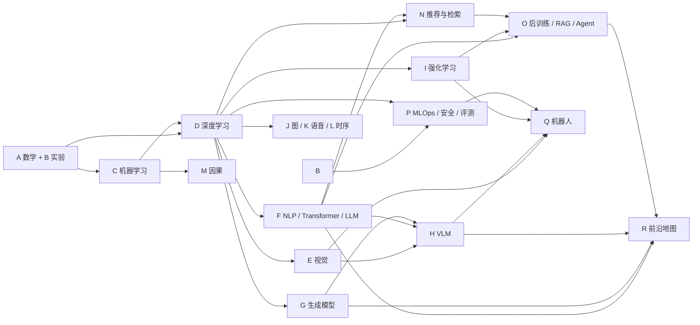

# Awesome AI 学习地图

> 一套按知识依赖组织、强调动手验证的中文 AI 百科全书。资料核验截止 **2026-08-11**。

这里是分章版讲义的总目录。第一次进入仓库，建议先阅读[开始学习](00-start/README.md)，完成两周诊断后再决定从哪里进入主线；需要全文搜索、离线阅读或保留原始连续上下文时，请使用[单文件完整版](../full/AI_Encyclopedia.md)。

## 怎样选择入口

- **不确定自己忘了多少**：先做 [S01 两周基础诊断](06-projects/s-projects-assessment.md#s01-两周基础诊断)，再按结果补 A–D。
- **希望系统重学**：依次学习 `A → B → C → D`，再选择一个方向分支。
- **已有扎实基础**：直接进入目标分支，但必须先检查该章“先修”并完成对应检测题。
- **只想查概念**：用 GitHub 搜索知识点编号（如 `F09`、`O04`）或术语；编号在分章版与完整版中一致。

## 分层目录

| 阶段 | 内容 | 目标与建议产出 |
|---|---|---|
| 0 | [开始学习](00-start/README.md) | 理解学习闭环、标记、环境与路径；完成基础诊断 |
| 1 | [基础层](01-foundations/) | 建立数学、实验、经典 AI、机器学习与深度学习共同主干 |
| 2 | [感知与语言](02-perception-language/) | 掌握视觉、Transformer/LLM、生成模型和 VLM |
| 3 | [决策与专业分支](03-decision-specialties/) | 进入强化学习、图、语音、时序、因果、推荐与检索 |
| 4 | [系统、Agent 与机器人](04-systems-agents-robotics/) | 把模型接入后训练、RAG、Agent、评测和具身系统 |
| 5 | [前沿地图](05-frontier/r-frontier-2024-2026.md) | 用主线知识理解 2024–2026 方法，并明确证据日期与边界 |
| 6 | [项目与验收](06-projects/s-projects-assessment.md) | 以基线、实验、消融和错误分析证明能力 |
| 7 | [资料索引](07-resources/t-source-index.md) | 按一手教材、课程、论文和官方文档回查来源 |

### 1. 基础层

- [A. 数学、统计与优化](01-foundations/a-math-statistics-optimization.md)
- [B. 编程、数据与实验基础](01-foundations/b-programming-data-experiments.md)
- [B+. 经典人工智能：搜索、约束、逻辑与规划](01-foundations/b-plus-classical-ai.md)
- [C. 传统机器学习](01-foundations/c-machine-learning.md)
- [C+. 概率模型与无梯度优化](01-foundations/c-plus-probabilistic-black-box.md)
- [D. 深度学习共同主干](01-foundations/d-deep-learning.md)

### 2. 感知与语言

- [E. 计算机视觉](02-perception-language/e-computer-vision.md)
- [F. NLP、Transformer 与 LLM](02-perception-language/f-nlp-transformers-llms.md)
- [G. 生成模型](02-perception-language/g-generative-models.md)
- [H. VLM 与多模态](02-perception-language/h-multimodal-vlm.md)

### 3. 决策与专业分支

- [I. 强化学习与 Deep RL](03-decision-specialties/i-reinforcement-learning.md)
- [J. 图神经网络](03-decision-specialties/j-graph-neural-networks.md)
- [K. 语音与音频](03-decision-specialties/k-speech-audio.md)
- [L. 时间序列](03-decision-specialties/l-time-series.md)
- [M. 因果推断](03-decision-specialties/m-causal-inference.md)
- [N. 推荐、搜索与检索](03-decision-specialties/n-recommendation-search-retrieval.md)

### 4. 系统、Agent 与机器人

- [O. LLM 后训练、RAG 与 Agent](04-systems-agents-robotics/o-llm-posttraining-rag-agents.md)
- [P. MLOps、安全与评测](04-systems-agents-robotics/p-mlops-safety-evaluation.md)
- [Q. 具身智能与机器人](04-systems-agents-robotics/q-embodied-ai-robotics.md)

### 5–7. 前沿、项目与资料

- [R. 2024–2026 前沿技术地图](05-frontier/r-frontier-2024-2026.md)
- [S. 综合项目与验收路线](06-projects/s-projects-assessment.md)
- [T. 总索引与资料使用说明](07-resources/t-source-index.md)

## 先修关系

下面是“最小可行先修”，不是要求把所有章节完整学完后才能继续。

| 目标方向 | 必需主干 | 推荐顺序 |
|---|---|---|
| LLM / Agent | A、B、C、D、F | `F → N → O → P → R` |
| CV / VLM | A、B、C、D、E | `E → G → H → P → R` |
| 强化学习 / 机器人 | A、B、C、D、I | `I → E/H → Q → P → R` |
| 数据科学 / 因果 | A、B、C | `C+ → L → M → N → P` |
| 图、语音或时序 | A、B、C、D | 按目标进入 `J`、`K` 或 `L` |

## 阶段验收

不要用“看完了”作为完成标准。每一阶段至少留下一个可复查产物。

| 阶段 | 最低验收标准 |
|---|---|
| A–B | 能解释符号与张量形状；代码可复现；能识别数据泄漏 |
| C–D | 能从零实现一个核心算法；训练/验证/测试职责清楚；有基线和错误分析 |
| E–N | 能完成所选方向的小项目；报告指标、消融、失败案例和适用边界 |
| O–Q | 能画出系统数据流和信任边界；组件可替换、可观测、可回归测试 |
| R | 能把论文主张拆成任务、数据、指标、日期和未验证假设 |
| S | 项目可由他人在干净环境复现，并通过章节给出的验收项 |

## 阅读约定

知识点编号是稳定引用；标签含义、环境策略和完整学习闭环见[开始学习](00-start/README.md)。遇到代码块时，先写下输出或趋势预测，再运行；遇到前沿结论时，优先回到原论文与官方文档，而不是只记二手总结。
