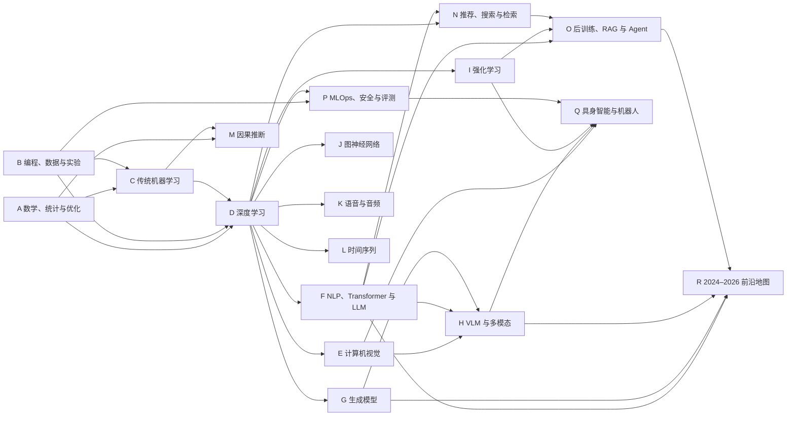

# Awesome AI Dictionary：从线性回归到现代基础模型

> 仓库导航：[项目首页](../README.md) · [分章学习目录](../docs/README.md)

> - **版本**：v1.0（资料核验截止 2026-08-11）
> - **语言与代码**：中文讲解，英文术语并列；Python / NumPy / scikit-learn / PyTorch 为主
> - **规模**：177 个知识单元（A01–R12）+ 11 个综合项目/验收单元（S01–S11）
> - **学习目标**：不是记忆术语，而是形成“解释 → 推导 → 实现 → 实验 → 说明边界”的完整能力。

---

## 0. 如何使用本讲义

这是一份按**知识依赖关系**而不是按热度排序的讲义。GPT、VLM、Agent、VLA 都不是平行的入门主题：它们分别依赖概率统计、优化、深度学习、Transformer、视觉表征、检索或强化学习等较长的先修链。

每个知识单元都包含：

- **先修**：开始前必须会什么；
- **定义与解析**：术语定义、直觉、适用边界；
- **公式/机制**：目标、前向计算和更新方式；
- **资料定位**：可直接跳转的一手教材、课程章节、论文小节或官方文档；
- **最小代码**：优先 CPU、小数据、固定随机种子的机制示例；
- **检测题/小实验**：必须先预测结果，再运行验证；
- **常见坑**：概念、实现和评估中的典型错误。

推荐对每个单元执行下面的学习闭环：

1. 不看资料，用 30 秒解释“它是什么、解决什么问题”。
2. 阅读指定位置，并把公式中的每个符号和张量形状写清楚。
3. 先预测代码输出或实验趋势，再运行代码。
4. 合上讲义，从空文件重写核心机制。
5. 完成检测题；在第 2、7、21 天再次闭卷测试。

通过标准：概念题正确率至少 80%，能独立复写最小代码，能指出至少一个失败条件，能把该单元连接到前后各一个知识点。

### 0.1 标记约定

- `核心`：现代 AI 的共同主干，建议顺序学习。
- `分支`：进入相应领域时变为必修。
- `前沿`：仍快速演进；结论必须带数据、任务与日期边界。
- `代码：可运行`：在列出的依赖存在时可独立运行。
- `代码：机制示意`：刻意省略数据下载、完整训练或生产安全层，只用于解释机制。

### 0.2 代码环境

代码片段按 Python 3、CPU 优先编写。不同章节可能使用：

```text
numpy, scipy, pandas, matplotlib, scikit-learn
torch, torchvision
transformers, datasets, tokenizers
gymnasium, networkx
```

本讲义不要求一开始安装全部依赖。进入某章时再建立独立环境并记录精确版本；不要在同一环境里无目的地堆包。大型模型章节通常用小张量复现损失或数据流，而不是下载数十 GB 权重。

### 0.3 宏观依赖图



### 0.4 推荐学习路径

第一轮共同主干：

```text
A 数学 → B 实验基础 → C 传统机器学习 → D 深度学习
→ E 视觉 + F 语言/Transformer + G 生成模型
→ H 多模态 → I 强化学习基础 → N 检索 → O Agent → P 工程评测
```

第二轮选择一个主攻分支：

- LLM/Agent：`F → N → O → P → R`
- CV/VLM：`E → G → H → P → R`
- 强化学习/机器人：`I → Q`，同时补控制、规划与安全；
- 数据科学/因果：`C → L/M/N → P`
- 图、语音等专业方向：进入 `J` 或 `K`，其“分支”单元全部视为必修。

### 0.5 章节导航

- [A. 数学、统计与优化](#a-数学统计与优化)
- [B. 编程、数据与实验基础](#b-编程数据与实验基础)
- [B+. 经典人工智能](#b-经典人工智能搜索约束逻辑与规划)
- [C. 传统机器学习](#c-传统机器学习)
- [C+. 概率函数模型与无梯度优化](#c-概率函数模型与无梯度优化)
- [D. 深度学习共同主干](#d-深度学习共同主干)
- [E. 计算机视觉](#e-计算机视觉)
- [F. NLP、Transformer 与 LLM](#f-nlptransformer-与-llm)
- [G. 生成模型](#g-生成模型)
- [H. VLM 与多模态](#h-vlm-与多模态)
- [I. 强化学习与 Deep RL](#i-强化学习与-deep-rl)
- [J. 图神经网络](#j-图神经网络)
- [K. 语音与音频](#k-语音与音频)
- [L. 时间序列](#l-时间序列)
- [M. 因果推断](#m-因果推断)
- [N. 推荐、搜索与检索](#n-推荐搜索与检索)
- [O. LLM 后训练、RAG 与 Agent](#o-llm-后训练rag-与-agent)
- [P. MLOps、安全与评测](#p-mlops安全与评测)
- [Q. 具身智能与机器人](#q-具身智能与机器人)
- [R. 2024–2026 前沿技术地图](#r-20242026-前沿技术地图)
- [S. 综合项目与验收路线](#s-综合项目与验收路线)
- [T. 总索引与资料使用说明](#t-总索引与资料使用说明)

---

## A. 数学、统计与优化

### A01 `[核]` 集合、函数、关系与逻辑记号

**先修：** 无。

**定义与解析：** 集合（set）描述对象的范围；函数（function）是从定义域到陪域、每个输入恰有一个输出的映射；关系（relation）是笛卡尔积的子集。命题逻辑中的否定、合取、析取、蕴含和量词，是读懂定理假设、算法不变量与概率事件的语法。

**公式/机制：** `f:X→Y`；`A⊆B ⇔ ∀x(x∈A⇒x∈B)`；逆否命题 `P⇒Q ≡ ¬Q⇒¬P`。证明“充要条件”必须分别证明两个方向。

**资料定位：** MIT *Mathematics for Computer Science*，[第 1 章 Propositions、第 4 章 Mathematical Data Types](https://courses.csail.mit.edu/6.042/spring18/mcs.pdf)。

```python
U = set(range(6))
even = {x for x in U if x % 2 == 0}
f = lambda x: x * x
image = {f(x) for x in even}
assert even <= U and image == {0, 4, 16}
print(even, image)
```

**检测题/小实验：** 写出“可微必连续”的逆命题、否命题与逆否命题，并判断哪些等价；用代码检查两个有限集合上的 De Morgan 律。

**常见坑：** 混淆“元素”和“子集”、定义域和实际观测样本；把 `P⇒Q` 错读成 `Q⇒P`；用若干例子代替一般性证明。

### A02 `[核]` 标量、向量、矩阵与张量

**先修：** A01。

**定义与解析：** 标量（scalar）是单个数，向量（vector）是一阶数组，矩阵（matrix）表示二维线性运算，张量（tensor）在工程语境中通常指多轴数值数组。形状（shape）既是数据布局，也是运算是否合法的类型约束。

**公式/机制：** `x∈R^d`，`A∈R^{m×d}`，批量线性映射 `Y=XA^T+b`；矩阵乘法收缩相邻维度，而 Hadamard 积 `A⊙B` 逐元素计算。

**资料定位：** Goodfellow 等 *Deep Learning*，[2.1 Scalars, Vectors, Matrices and Tensors；2.2 Multiplying Matrices and Vectors](https://www.deeplearningbook.org/contents/linear_algebra.html)。

```python
import numpy as np
x = np.array([1., 2., 3.])          # (3,)
X = np.stack([x, 2 * x])            # (2, 3)
W = np.array([[1., 0., -1.], [0., 1., 1.]])
b = np.array([0.5, -0.5])
Y = X @ W.T + b                      # (2, 2)
print(X.shape, W.shape, Y)
```

**检测题/小实验：** 不运行代码，先写出 `(32,10)@(10,4)` 和 `(32,10)*(10,)` 的输出形状；把最后一式改成显式循环并核对结果。

**常见坑：** 把 `*` 当矩阵乘、忽略一维数组没有“行/列”方向、未经检查就依赖广播，或把 batch 轴与 feature 轴互换。

### A03 `[核]` 向量空间、基、秩、线性映射与子空间

**先修：** A02。

**定义与解析：** 向量空间（vector space）对加法和数乘封闭；基（basis）是线性无关且张成全空间的向量组。矩阵是选定基后的线性映射；秩（rank）是像空间维数，零空间（null space）刻画被映到零的方向。

**公式/机制：** `rank(A)+nullity(A)=n`；若列满秩，`Ax=b` 至多一个解；换基改变坐标而不改变抽象向量。线性无关等价于 `Σ_i α_i v_i=0` 只有零系数解。

**资料定位：** *Deep Learning*，[2.3 Identity and Inverse Matrices；2.4 Linear Dependence and Span](https://www.deeplearningbook.org/contents/linear_algebra.html)。

```python
import numpy as np
A = np.array([[1., 2., 3.], [2., 4., 6.]])
rank = np.linalg.matrix_rank(A)
_, s, vt = np.linalg.svd(A)
null_vec = vt[-1]
print("rank=", rank, "nullity=", A.shape[1] - rank)
print("A v ≈", A @ null_vec, "singular values=", s)
```

**检测题/小实验：** 构造一个 `3×4`、秩为 2 的矩阵，数值求零空间并验证秩—零度定理；解释为何相关特征会使线性回归参数不唯一。

**常见坑：** 把“矩阵可逆”等同于“任何矩阵有逆”；把小但非零奇异值机械判零；混淆行空间、列空间和输入空间。

### A04 `[核]` 内积、范数、距离、正交与投影

**先修：** A02、A03。

**定义与解析：** 内积（inner product）给出长度和角度；范数（norm）度量大小；距离（metric）还需满足非负、对称与三角不等式。正交投影把向量分解为子空间内分量与正交残差，是最小二乘、PCA 和注意力相似度的共同几何语言。

**公式/机制：** `||x||_2=sqrt(x^Tx)`，`cos(x,y)=x^Ty/(||x||||y||)`；正交列矩阵 `Q` 上的投影为 `P=QQ^T`，且 `P^2=P=P^T`。

**资料定位：** *Deep Learning*，[2.5 Norms；2.6 Special Kinds of Matrices and Vectors](https://www.deeplearningbook.org/contents/linear_algebra.html)。

```python
import numpy as np
x = np.array([2., 1.])
q = np.array([1., 1.]); q /= np.linalg.norm(q)
proj = q * (q @ x)
residual = x - proj
cosine = (x @ q) / np.linalg.norm(x)
print("projection", proj, "residual", residual)
print("orthogonal?", np.isclose(q @ residual, 0), "cos", cosine)
```

**检测题/小实验：** 比较同一组二维点在 `L1`、`L2` 和余弦距离下的最近邻；证明投影残差与子空间正交。

**常见坑：** 未标准化就比较余弦与点积；认为任意“相异度”都是度量；用非正交基时仍套用 `QQ^T`。

### A05 `[核]` 特征分解、SVD、正定矩阵与二次型

**先修：** A03、A04。

**定义与解析：** 特征分解（eigendecomposition）寻找线性映射不改变方向的向量；SVD 适用于任意矩阵，将映射拆为旋转—缩放—旋转。正半定（PSD）矩阵满足所有二次型非负，常见于协方差、Hessian 与核矩阵。

**公式/机制：** 对称矩阵 `A=QΛQ^T`；任意 `X=UΣV^T`；`X^TX=VΣ²V^T`；`A≽0 ⇔ x^TAx≥0`。截断 SVD 给 Frobenius 范数下最佳低秩近似。

**资料定位：** *Deep Learning*，[2.7 Eigendecomposition；2.8 Singular Value Decomposition；2.11 The Determinant](https://www.deeplearningbook.org/contents/linear_algebra.html)。

```python
import numpy as np
X = np.array([[3., 1.], [1., 3.], [2., 2.]])
U, s, Vt = np.linalg.svd(X, full_matrices=False)
X_rank1 = s[0] * np.outer(U[:, 0], Vt[0])
C = X.T @ X
eig = np.linalg.eigvalsh(C)
print("singular values", s, "PSD eigenvalues", eig)
print("rank-1 error", np.linalg.norm(X - X_rank1))
```

**检测题/小实验：** 随机生成矩阵，验证 `X^TX` 的特征值等于奇异值平方；随截断秩增加绘制重构误差。

**常见坑：** 对非对称矩阵假设正交特征向量；直接求逆而非 `solve/lstsq`；把特征值与奇异值当成同一概念。

### A06 `[核]` 单变量与多变量微分、偏导和梯度

**先修：** A01、A02。

**定义与解析：** 导数（derivative）是局部线性变化率；偏导固定其他变量；梯度（gradient）收集标量函数对各坐标的偏导，并指向欧氏几何下最陡上升方向。方向导数把变化限定到方向 `v`。

**公式/机制：** `f(x+Δ)≈f(x)+∇f(x)^TΔ`；`D_v f=∇f^Tv`。对 `f(x)=||Ax-b||²/2`，有 `∇f=A^T(Ax-b)`。

**资料定位：** *Mathematics for Machine Learning*，[第 5 章 Vector Calculus，5.1–5.3](https://mml-book.github.io/book/mml-book.pdf)；*Deep Learning*，[4.3 Gradient-Based Optimization](https://www.deeplearningbook.org/contents/numerical.html)。

```python
import numpy as np
A = np.array([[1., 2.], [3., -1.]])
b = np.array([1., 0.]); x = np.array([.4, -.2])
f = lambda z: 0.5 * np.sum((A @ z - b) ** 2)
grad = A.T @ (A @ x - b)
eps = 1e-6
fd = np.array([(f(x + eps*np.eye(2)[i]) - f(x - eps*np.eye(2)[i]))/(2*eps) for i in range(2)])
print(grad, fd, np.linalg.norm(grad - fd))
```

**检测题/小实验：** 推导 `x^TAx` 在 `A` 非对称时的梯度；对不同 `eps` 做有限差分，观察截断误差与浮点误差的折中。

**常见坑：** 忽略向量形状；把梯度当普通“分数”；有限差分步长越小越好；漏掉均值损失中的样本数因子。

### A07 `[核]` Jacobian、Hessian、链式法则与矩阵微积分

**先修：** A02、A06。

**定义与解析：** Jacobian 是向量函数的一阶导数矩阵；Hessian 是标量函数的二阶偏导矩阵。链式法则把复合计算图上的局部导数相乘；反向模式自动微分高效计算“一个标量输出对很多参数”的梯度。

**公式/机制：** 若 `z=g(x), y=f(z)`，则 `J_{f∘g}=J_f J_g`；Hessian `H_ij=∂²f/∂x_i∂x_j`。反传计算 vector–Jacobian product，而非显式构造每层完整 Jacobian。

**资料定位：** *Mathematics for Machine Learning*，[5.4 Gradients of Matrices、5.5 Useful Identities for Computing Gradients](https://mml-book.github.io/book/mml-book.pdf)；PyTorch，[Automatic Differentiation with `torch.autograd`](https://docs.pytorch.org/tutorials/beginner/basics/autogradqs_tutorial.html)。

```python
import torch
x = torch.tensor([1., 2.], requires_grad=True)
A = torch.tensor([[2., 0.], [1., 3.]])
z = torch.tanh(A @ x)
y = (z ** 2).sum()
y.backward()
auto = x.grad.clone()
J = torch.diag(1 - z**2) @ A
manual = J.T @ (2 * z)
print(auto, manual)
```

**检测题/小实验：** 手算两层标量网络的前向值和梯度，再与 autograd 对比；解释反向模式为何适合训练、前向模式为何适合少输入多输出。

**常见坑：** Jacobian 乘法次序颠倒；原地修改破坏计算图；忘记梯度会累加；把 Hessian 的正定性误当成全局凸性。

### A08 `[核]` Taylor 展开、局部近似与曲率

**先修：** A07。

**定义与解析：** Taylor 展开用某点处的导数近似邻域内函数；一阶项给局部斜率，二阶 Hessian 给曲率。优化中的学习率、Newton 法和“平坦/尖锐”方向都可由局部二次模型理解。

**公式/机制：** `f(x+δ)≈f(x)+g^Tδ+δ^THδ/2`；一维 Newton 更新 `x←x-f'(x)/f''(x)`。余项意味着近似只在足够小邻域可靠。

**资料定位：** *Deep Learning*，[4.3.1 Beyond the Gradient: Jacobian and Hessian Matrices](https://www.deeplearningbook.org/contents/numerical.html)；*Mathematics for Machine Learning*，[5.2.6 Taylor Series](https://mml-book.github.io/book/mml-book.pdf)。

```python
import numpy as np
x0 = 0.4
f = np.sin
g, h = np.cos(x0), -np.sin(x0)
for delta in [1e-1, 5e-1, 1.0]:
    first = f(x0) + g * delta
    second = first + 0.5 * h * delta**2
    truth = f(x0 + delta)
    print(delta, abs(first-truth), abs(second-truth))
```

**检测题/小实验：** 对 `log(1+x)` 比较一阶、二阶近似误差随 `|x|` 的变化；为一个非凸函数找出 Hessian 为正但非全局最优的点。

**常见坑：** 把局部近似当全局等式；认为 Hessian 半正定必为严格极小值；直接显式求逆 Hessian 而忽略数值代价。

### A09 `[核]` 概率公理、条件概率与 Bayes 公式

**先修：** A01。

**定义与解析：** 概率空间由样本空间、事件集合和概率测度组成。条件概率是在已知事件后重新归一化；Bayes 公式把“原因给结果”的似然转换为“结果给原因”的后验，是分类、诊断和 Bayesian 学习的基础。

**公式/机制：** `P(A|B)=P(A∩B)/P(B)`；`P(A|B)=P(B|A)P(A)/P(B)`；全概率公式 `P(B)=Σ_i P(B|A_i)P(A_i)`。

**资料定位：** *Deep Learning*，[3.3 Probability Distributions；3.5 Conditional Probability；3.11 Bayes' Rule](https://www.deeplearningbook.org/contents/prob.html)。

```python
prevalence = 0.01
sensitivity = 0.95
specificity = 0.90
p_positive = sensitivity*prevalence + (1-specificity)*(1-prevalence)
posterior = sensitivity * prevalence / p_positive
print("P(disease | positive) =", round(posterior, 4))
odds_prior = prevalence / (1 - prevalence)
odds_post = odds_prior * sensitivity / (1 - specificity)
print("odds check =", odds_post / (1 + odds_post))
```

**检测题/小实验：** 改变患病率并画出阳性后验；解释为什么 95% 灵敏度的检测在低基率下仍可能有大量假阳性。

**常见坑：** 混淆 `P(A|B)` 与 `P(B|A)`；忽略基率；把互斥误当独立；条件事件概率为零时仍套公式。

### A10 `[核]` 随机变量、常见分布、期望与方差

**先修：** A09。

**定义与解析：** 随机变量（random variable）把随机结果映射为数值；离散变量用概率质量函数（PMF），连续变量用概率密度函数（PDF）。期望是按概率加权的长期平均，方差度量围绕均值的二阶波动；分布而非单次样本才是模型对象。

**公式/机制：** `E[X]=Σ_x xp(x)` 或 `∫xp(x)dx`；`Var(X)=E[(X-E[X])²]=E[X²]-E[X]²`。Bernoulli、Categorical、Gaussian、Exponential 是常用构件。

**资料定位：** *Deep Learning*，[3.2 Random Variables；3.8 Expectation, Variance and Covariance；3.9 Common Probability Distributions](https://www.deeplearningbook.org/contents/prob.html)。

```python
import numpy as np
rng = np.random.default_rng(0)
x = rng.normal(loc=2.0, scale=3.0, size=20_000)
print("sample mean/var", x.mean(), x.var())
values = np.array([0., 1., 2.])
pmf = np.array([0.2, 0.5, 0.3])
mu = values @ pmf
var = ((values - mu) ** 2) @ pmf
print("discrete mean/var", mu, var)
```

**检测题/小实验：** 推导 Bernoulli(`p`) 的均值和方差；分别从 Gaussian 与 Laplace 分布抽样，比较相同方差下极端值比例。

**常见坑：** 把密度值当区间概率；样本方差与总体方差分母混淆；只报均值而忽略分布形状和尾部。

### A11 `[核]` 联合、边缘、条件分布、独立性与协方差

**先修：** A10。

**定义与解析：** 联合分布（joint distribution）描述变量共同变化；边缘化消去不关心的变量；条件分布在给定信息后更新不确定性。独立意味着联合分解为边缘乘积，零协方差通常只说明无线性相关，并不保证独立。

**公式/机制：** `p(x)=Σ_y p(x,y)`；`p(x,y)=p(x|y)p(y)`；独立时 `p(x,y)=p(x)p(y)`；`Cov(X,Y)=E[(X-μ_X)(Y-μ_Y)]`。

**资料定位：** *Deep Learning*，[3.4 Marginal Probability；3.6 The Chain Rule；3.7 Independence and Conditional Independence；3.8 Expectation, Variance and Covariance](https://www.deeplearningbook.org/contents/prob.html)。

```python
import numpy as np
rng = np.random.default_rng(1)
z = rng.normal(size=10_000)
x = z + rng.normal(scale=.5, size=z.size)
y = z + rng.normal(scale=.5, size=z.size)
print("marginal corr", np.corrcoef(x, y)[0, 1])
rx, ry = x - z, y - z                  # 给定共同原因后的残差
print("conditional-residual corr", np.corrcoef(rx, ry)[0, 1])
```

**检测题/小实验：** 构造 `Y=X²`、对称分布的 `X`，验证 `Cov(X,Y)=0` 但不独立；用一张三变量表手算边缘与条件概率。

**常见坑：** 将相关解释为因果；把不相关等同独立；漏掉共同原因；从有限样本的小相关系数断言条件独立。

### A12 `[核]` 大数定律、中心极限定理与集中现象

**先修：** A10、A11。

**定义与解析：** 大数定律（LLN）说明独立同分布样本均值趋近总体期望；中心极限定理（CLT）说明适当标准化的样本均值趋近 Gaussian。集中不等式给有限样本偏离概率上界，是理解 mini-batch 噪声和统计置信度的基础。

**公式/机制：** `X̄_n→E[X]`；`√n(X̄_n-μ)/σ ⇒ N(0,1)`；Chebyshev：`P(|X-μ|≥t)≤σ²/t²`。CLT 不是“原分布会变成正态”。

**资料定位：** MIT OpenCourseWare 18.05，[Reading 6b: Central Limit Theorem and the Law of Large Numbers](https://ocw.mit.edu/courses/18-05-introduction-to-probability-and-statistics-spring-2022/resources/mit18_05_s22_class06-prep-b_pdf/)。

```python
import numpy as np
rng = np.random.default_rng(2)
for n in [2, 10, 100]:
    means = rng.exponential(size=(5000, n)).mean(axis=1)
    z = np.sqrt(n) * (means - 1.0)       # Exponential(1): μ=σ=1
    print(n, "mean/std/skew", z.mean(), z.std(),
          np.mean(((z-z.mean())/z.std())**3))
```

**检测题/小实验：** 以 Bernoulli 和重尾分布重复实验，观察均值误差如何随 `n` 缩小；说明 CLT 需要哪些条件、何时收敛很慢。

**常见坑：** 认为小样本也近似正态；忽略独立性和有限方差条件；把概率收敛误作每条样本路径单调收敛。

### A13 `[核]` 参数估计、MLE、MAP 与 Bayesian 推断

**先修：** A06、A09–A11。

**定义与解析：** 估计量（estimator）是由数据计算参数的规则。最大似然（MLE）选择使观测数据最可能的参数；MAP 最大化似然乘先验；完整 Bayesian 推断保留后验分布并对参数积分，而非只给点估计。

**公式/机制：** `θ_MLE=argmax_θ Σ_i log p(x_i|θ)`；`p(θ|D)∝p(D|θ)p(θ)`；`θ_MAP=argmax[log p(D|θ)+log p(θ)]`。Beta–Bernoulli 后验仍为 Beta。

**资料定位：** *Deep Learning*，[5.4 Estimators, Bias and Variance；5.5 Maximum Likelihood Estimation；5.6 Bayesian Statistics](https://www.deeplearningbook.org/contents/ml.html)。

```python
import numpy as np
x = np.array([1, 1, 0, 1, 0])
mle = x.mean()
alpha, beta = 2., 2.                 # Beta 先验
post_a, post_b = alpha+x.sum(), beta+len(x)-x.sum()
map_est = (post_a - 1) / (post_a + post_b - 2)
post_mean = post_a / (post_a + post_b)
print("MLE", mle, "MAP", map_est, "posterior mean", post_mean)
```

**检测题/小实验：** 改变样本量和 Beta 先验强度，画 MLE、MAP、后验均值；解释为何数据增多后合理先验影响减弱。

**常见坑：** 把似然 `p(D|θ)` 当后验 `p(θ|D)`；忽略 log-likelihood；把 MAP 称作完整 Bayesian 推断；先验由测试集调出。

### A14 `[核]` 置信区间、假设检验、Bootstrap 与显著性

**先修：** A12、A13。

**定义与解析：** 置信区间（confidence interval）是重复抽样程序的覆盖率陈述，不是固定参数“落在本次区间的概率”。假设检验用零假设下统计量的尾部概率衡量数据极端程度；Bootstrap 通过重采样近似估计量的抽样分布。

**公式/机制：** 大样本均值区间 `X̄±z_{1-α/2}s/√n`；`p-value=P(T≥T_obs|H0)`。显著不等于效应大，未显著也不等于两者相同。

**资料定位：** NIST/SEMATECH *e-Handbook*，[7.1.4 What are confidence intervals?](https://www.itl.nist.gov/div898/handbook/prc/section1/prc14.htm)；MIT OpenCourseWare 18.05，[Reading 24: Bootstrap confidence intervals](https://ocw.mit.edu/courses/18-05-introduction-to-probability-and-statistics-spring-2022/resources/mit18_05_s22_class24-prep_pdf/)。

```python
import numpy as np
rng = np.random.default_rng(3)
x = np.array([1.2, .8, 1.5, .9, 1.1, 2.0, .7])
idx = rng.integers(0, len(x), size=(5000, len(x)))
boot_means = x[idx].mean(axis=1)
lo, hi = np.quantile(boot_means, [.025, .975])
print("mean", x.mean(), "bootstrap 95% CI", (lo, hi))
print("P(bootstrap mean <= 1)", np.mean(boot_means <= 1.0))
```

**检测题/小实验：** 模拟 1000 次样本并检查 95% 区间的覆盖率；同时报效应量、区间和 p-value，比较各自回答的问题。

**常见坑：** 把 p-value 当零假设为真的概率；反复试验后只报告显著者；对强依赖序列进行普通 i.i.d. Bootstrap。

### A15 `[核]` 熵、交叉熵、KL 散度、互信息与编码长度

**先修：** A09–A11。

**定义与解析：** 熵（entropy）是不确定性的平均编码长度；交叉熵评价用分布 `q` 编码真实分布 `p` 的代价；KL 散度是额外编码代价。互信息衡量知道一个变量后另一个变量不确定性减少多少。

**公式/机制：** `H(p)=-Σp log p`；`H(p,q)=H(p)+D_KL(p||q)`；`D_KL=Σp log(p/q)≥0`；`I(X;Y)=D_KL(p(x,y)||p(x)p(y))`。

**资料定位：** *Deep Learning*，[3.13 Information Theory](https://www.deeplearningbook.org/contents/prob.html)。

```python
import numpy as np
p = np.array([0.8, 0.2])
q = np.array([0.6, 0.4])
H = -(p * np.log2(p)).sum()
CE = -(p * np.log2(q)).sum()
KL = (p * np.log2(p / q)).sum()
print("H, CE, KL", H, CE, KL)
assert np.allclose(CE, H + KL)
print("KL reverse", (q * np.log2(q / p)).sum())
```

**检测题/小实验：** 对固定 `p` 扫描二分类 `q`，找交叉熵最小点；用数值例子证明 KL 不对称，并说明它为何不是距离。

**常见坑：** 混用自然对数和二进制对数却比较绝对值；处理 `p=0`、`q=0` 不当；把低熵等同高质量预测。

### A16 `[核]` 浮点数、数值稳定性、条件数与数值线性代数

**先修：** A02、A05、A06。

**定义与解析：** 浮点数只有有限精度和动态范围；舍入、上溢、下溢和灾难性消减会让数学等价式产生不同数值结果。条件数描述输入微扰被问题本身放大的程度，稳定算法则避免额外放大误差。

**公式/机制：** `κ(A)=||A||||A^{-1}||`；稳定 log-sum-exp：`logΣe^{x_i}=m+logΣe^{x_i-m}`，其中 `m=max x_i`。解线性方程优先 `solve/lstsq`，避免显式逆。

**资料定位：** *Deep Learning*，[4.1 Overflow and Underflow；4.2 Poor Conditioning](https://www.deeplearningbook.org/contents/numerical.html)；NumPy，[Linear algebra routines](https://numpy.org/doc/stable/reference/routines.linalg.html)。

```python
import numpy as np
x = np.array([1000., 1001., 999.])
naive = np.log(np.exp(x).sum())       # overflow
m = x.max()
stable = m + np.log(np.exp(x - m).sum())
A = np.array([[1., 1.], [1., 1.000001]])
b = np.array([2., 2.000001])
print("naive/stable", naive, stable)
print("condition/solution", np.linalg.cond(A), np.linalg.solve(A, b))
```

**检测题/小实验：** 比较 `float16/32/64` 累加百万个小数的误差；扰动病态矩阵的 `b`，观察解的变化。

**常见坑：** 用完全相等比较浮点数；以为更高精度能修复病态问题；手写不稳定 softmax；显式计算逆矩阵。

### A17 `[核]` 梯度下降、凸性、约束优化与对偶思想

**先修：** A07、A08。

**定义与解析：** 优化寻找目标函数的最小点。凸函数的局部极小即全局极小；梯度下降沿负梯度迭代；约束问题可用投影、Lagrange 乘子或对偶处理。非凸深度网络通常只能寻求良好驻点。

**公式/机制：** `x_{t+1}=x_t-η∇f(x_t)`；凸性 `f(λx+(1-λ)y)≤λf(x)+(1-λ)f(y)`；Lagrangian `L(x,λ)=f(x)+λ^Tg(x)`。

**资料定位：** *Deep Learning*，[4.3 Gradient-Based Optimization；4.4 Constrained Optimization](https://www.deeplearningbook.org/contents/numerical.html)；*Mathematics for Machine Learning*，[第 7 章 Continuous Optimization](https://mml-book.github.io/book/mml-book.pdf)。

```python
import numpy as np
Q = np.diag([1., 8.]); c = np.array([-2., 1.])
x = np.array([2., 2.]); lr = 0.12
for _ in range(40):
    grad = Q @ x + c
    x -= lr * grad
    x = np.clip(x, -1., 1.)           # 投影到盒约束
objective = 0.5*x@Q@x + c@x
print("x", x, "f", objective, "grad", Q@x+c)
```

**检测题/小实验：** 对同一二次函数尝试稳定、过大和过小学习率；画轨迹并由最大特征值解释稳定上界。

**常见坑：** 梯度为零就宣称全局最优；不缩放特征却统一学习率；约束后只截断一次；把训练损失最小当泛化最好。

### A18 `[核]` 随机优化、经验风险、正则化与泛化

**先修：** A12、A13、A17。

**定义与解析：** 经验风险最小化（ERM）用有限样本平均损失近似总体风险。SGD 用 mini-batch 梯度作无偏或近似无偏估计；正则化限制有效容量以改善未见数据表现。泛化差距必须用未参与选择的数据估计。

**公式/机制：** `R(θ)=E_{(x,y)∼P}ℓ(fθ(x),y)`，`R̂_n=Σℓ_i/n`；`θ←θ-η(1/|B|)Σ_{i∈B}∇ℓ_i`；正则目标 `R̂+λΩ(θ)`。

**资料定位：** *Deep Learning*，[5.2 Capacity, Overfitting and Underfitting；5.9 Stochastic Gradient Descent](https://www.deeplearningbook.org/contents/ml.html)；[8.1 How Learning Differs from Pure Optimization](https://www.deeplearningbook.org/contents/optimization.html)。

```python
import numpy as np
rng = np.random.default_rng(4)
xtr = np.linspace(-1, 1, 18); ytr = np.sin(3*xtr)+rng.normal(0,.2,18)
xte = np.linspace(-1, 1, 200); yte = np.sin(3*xte)
Xtr = np.vander(xtr, 13, increasing=True)
Xte = np.vander(xte, 13, increasing=True)
for lam in [0., 1e-3, 1e-1]:
    w = np.linalg.solve(Xtr.T@Xtr + lam*np.eye(13), Xtr.T@ytr)
    print(lam, "train/test", np.mean((Xtr@w-ytr)**2), np.mean((Xte@w-yte)**2))
```

**检测题/小实验：** 改变多项式阶数、样本数和 `λ`，画训练/测试误差；解释正则化为何可能提高训练误差却降低测试误差。

**常见坑：** 在测试集调超参数；把 SGD 噪声一概视为缺陷；混淆 L2 penalty 与某些优化器中的 decoupled weight decay。

## B. 编程、数据与实验基础

### B01 `[核]` Python、NumPy、广播与向量化

**先修：** A02。

**定义与解析：** 向量化（vectorization）把逐元素 Python 循环改写成数组运算，让底层编译代码批量执行。广播（broadcasting）从尾轴对齐：维度相等或其中一个为 1 才兼容；它通常不复制数据，但产生的大型中间结果仍会消耗内存。

**公式/机制：** 若 `X∈R^{n×d}`、`μ∈R^d`，`X-μ` 将 `μ` 视作每行共享；批量两两差可写成 `X[:,None,:]-C[None,:,:]`，输出形状为 `(n,k,d)`。

**资料定位：** NumPy 用户指南，[Broadcasting—General broadcasting rules](https://numpy.org/doc/stable/user/basics.broadcasting.html#general-broadcasting-rules)；[NumPy quickstart—Less basic operations](https://numpy.org/doc/stable/user/quickstart.html#less-basic-operations)。

```python
import numpy as np
X = np.array([[1., 2.], [3., 4.], [5., 8.]])
C = np.array([[0., 0.], [4., 4.]])
diff = X[:, None, :] - C[None, :, :]
dist2 = (diff ** 2).sum(axis=-1)
nearest = dist2.argmin(axis=1)
loop = np.array([[((x-c)**2).sum() for c in C] for x in X])
print(dist2, nearest, np.allclose(dist2, loop))
```

**检测题/小实验：** 只用广播实现 100 个点与 5 个中心的距离矩阵；估算 `100000×1000×128` 中间数组的内存并提出分块方案。

**常见坑：** 轴对齐错误但结果仍可运行；用 `tile` 制造无谓副本；为追求一行代码生成超大中间张量；忘记整数数组除法与 dtype。

### B02 `[核]` 数据结构、算法复杂度与内存复杂度

**先修：** A01。

**定义与解析：** 时间复杂度描述输入规模增长时操作次数的量级；空间复杂度描述额外内存。数组支持常数时间索引，哈希表平均常数时间查找，堆适合动态取最值，图结构表示依赖关系。复杂度必须与常数、缓存和实际规模共同判断。

**公式/机制：** Big-O 给渐近上界；顺序扫描 `O(n)`，排序 `O(n log n)`，稠密矩阵乘法朴素约 `O(n³)`。训练还应估算参数、激活、梯度和优化器状态占用。

**资料定位：** Python 教程，[5. Data Structures：Lists、Sets、Dictionaries](https://docs.python.org/3/tutorial/datastructures.html)；Python Wiki，[TimeComplexity](https://wiki.python.org/moin/TimeComplexity)。

```python
import timeit
n = 20_000
items = list(range(n))
lookup = set(items)
t_list = timeit.timeit(lambda: n-1 in items, number=200)
t_set = timeit.timeit(lambda: n-1 in lookup, number=200)
print("list/set seconds", t_list, t_set)
top5 = sorted(items, reverse=True)[:5]
print("top5", top5)
```

**检测题/小实验：** 为 kNN 推理、全量 self-attention、mini-batch SGD 分别写时间/空间复杂度；用 `heapq.nlargest` 替换完整排序并比较。

**常见坑：** 只看 Big-O 不看数据布局；忽略中间张量；把哈希查找的平均复杂度当绝对保证；过早微优化而不先 profile。

### B03 `[核]` Git、环境、依赖、测试与调试

**先修：** B01。

**定义与解析：** 版本控制记录可审计的变更历史；隔离环境固定解释器与依赖边界；测试把预期行为变为可重复检查。最小可复现实验应含源码、环境声明、配置、随机种子、运行命令和产出，而不是只保存 notebook 输出。

**公式/机制：** 一次提交应代表一个可解释变更；单元测试遵循 arrange–act–assert；失败调试优先缩小到最小复现，再检查输入、形状、范围、梯度和状态。

**资料定位：** *Pro Git*，[2.2 Recording Changes to the Repository](https://git-scm.com/book/en/v2/Git-Basics-Recording-Changes-to-the-Repository)；pytest，[Get Started—Create your first test](https://docs.pytest.org/en/stable/getting-started.html#create-your-first-test)。

```python
def standardize(x):
    mean = sum(x) / len(x)
    var = sum((v - mean) ** 2 for v in x) / len(x)
    return [(v - mean) / var**0.5 for v in x]

z = standardize([1., 2., 3.])
assert abs(sum(z)) < 1e-12
assert abs(sum(v*v for v in z)/len(z) - 1) < 1e-12
print("tests passed", z)
```

**检测题/小实验：** 建一个只含函数和测试的小仓库；在新环境按 README 从零运行。故意制造 off-by-one、NaN 和形状错误，为每个错误添加回归测试。

**常见坑：** 提交数据、密钥或巨大模型；只写“能运行”的测试；环境文件不锁关键版本；调试时同时改多个变量。

### B04 `[核]` 张量、自动微分、GPU 与计算图工具

**先修：** A07、B01。

**定义与解析：** 张量库把数组运算、设备和自动微分统一起来。叶张量设置 `requires_grad=True` 后，运算构成动态计算图；对标量调用 `backward()` 反向累积梯度。设备迁移必须让参数和输入位于同一设备，本节示例刻意保持 CPU 友好。

**公式/机制：** 反向传播递归应用链式法则；默认计算 vector–Jacobian product。梯度存于 `.grad` 且会累加，因此每轮优化前需清零。

**资料定位：** PyTorch 基础教程，[Tensors](https://docs.pytorch.org/tutorials/beginner/basics/tensorqs_tutorial.html)；[Automatic Differentiation with `torch.autograd`](https://docs.pytorch.org/tutorials/beginner/basics/autogradqs_tutorial.html)。

```python
import torch
torch.manual_seed(0)
X = torch.randn(8, 3)
w = torch.randn(3, 1, requires_grad=True)
y = X @ w
loss = y.square().mean()
loss.backward()
print("loss", loss.item(), "grad shape", w.grad.shape)
with torch.no_grad():
    w -= 0.1 * w.grad
w.grad = None
```

**检测题/小实验：** 连续调用两次 `backward()` 观察梯度累加；分别用 autograd 和有限差分检查一个小网络参数梯度。

**常见坑：** 在计算图中误用 `.detach()` 或 `.item()`；参数和输入设备不同；原地运算破坏反传；把张量形状正确误当语义正确。

### B05 `[核]` 数据清洗、预处理、划分与数据泄漏

**先修：** A13、B01。

**定义与解析：** 训练集拟合参数，验证集选择模型，测试集只做最终一次无偏估计。任何使用验证/测试标签或整体统计量的预处理都会泄漏（data leakage）。时间、用户、设备或群组相关数据必须按真实部署边界划分。

**公式/机制：** 标准化参数 `μ_train,σ_train` 只能从训练集估计，再同样作用于其他划分。Pipeline 将 `fit` 的边界绑定到交叉验证折内，降低泄漏风险。

**资料定位：** scikit-learn，[12.2 Data leakage](https://scikit-learn.org/stable/common_pitfalls.html#data-leakage)；[8.1 Pipeline and composite estimators](https://scikit-learn.org/stable/modules/compose.html#pipeline)。

```python
from sklearn.datasets import make_classification
from sklearn.model_selection import train_test_split
from sklearn.pipeline import make_pipeline
from sklearn.preprocessing import StandardScaler
from sklearn.linear_model import LogisticRegression
X, y = make_classification(n_samples=300, random_state=0)
Xtr, Xte, ytr, yte = train_test_split(X, y, stratify=y, random_state=0)
model = make_pipeline(StandardScaler(), LogisticRegression(max_iter=500))
model.fit(Xtr, ytr)
print("held-out accuracy", model.score(Xte, yte))
```

**检测题/小实验：** 构造一个“先全数据标准化再交叉验证”的错误流程，与 Pipeline 比较；为同一用户多条记录改用 GroupKFold。

**常见坑：** 特征选择在划分前完成；测试集被反复查看；时间序列随机打乱；重复样本跨集合；用预测时不可获得的未来变量。

### B06 `[核]` 指标、基线、受控实验、复现与误差分析

**先修：** A14、B03、B05。

**定义与解析：** 指标必须匹配任务成本与类别分布。基线界定问题难度；受控实验一次改变一个因素；复现要求保存数据版本、种子和配置。总体分数之后还要按类别、群体和失败模式切片。

**公式/机制：** `Precision=TP/(TP+FP)`，`Recall=TP/(TP+FN)`，`F1=2PR/(P+R)`；ROC-AUC 衡量排序，PR-AUC 在稀有正例下更直观；校准评价概率而非硬分类。

**资料定位：** scikit-learn，[3.4 Metrics and scoring](https://scikit-learn.org/stable/modules/model_evaluation.html)；PyTorch，[Reproducibility](https://docs.pytorch.org/docs/stable/notes/randomness.html)。

```python
import numpy as np
from sklearn.metrics import accuracy_score, precision_recall_fscore_support
y = np.array([0]*95 + [1]*5)
pred_majority = np.zeros_like(y)
pred_candidate = np.array([0]*93 + [1]*2 + [0, 1, 1, 1, 1])
for name, pred in [("majority", pred_majority), ("candidate", pred_candidate)]:
    p, r, f, _ = precision_recall_fscore_support(y, pred, average="binary", zero_division=0)
    print(name, "accuracy", accuracy_score(y,pred), "P/R/F1", p, r, f)
```

**检测题/小实验：** 为癌症筛查、垃圾邮件和图像检索分别选主指标并说明错误成本；对五个随机种子报告均值、标准差和每次结果。

**常见坑：** 只报 accuracy；从多个指标中挑最好看的；没有朴素基线；单随机种子下宣称提升；把测试集误差分析变成继续调参。


## B+. 经典人工智能：搜索、约束、逻辑与规划

现代深度学习不是 AI 的全部。搜索、约束满足、逻辑和规划提供“显式状态、规则与可验证决策”的另一套工具，也直接连接强化学习、Agent 和机器人。

### B07 `[核心]` 状态空间、图搜索与问题建模

**先修**：A01 集合/函数、B02 复杂度。

**定义与解析**：搜索问题由状态集合、初始状态、动作、转移函数、动作代价和目标测试组成。关键不是先选 BFS/DFS，而是构造只保留决策所需信息的 search state。图搜索保存已到达状态，避免搜索树中的重复路径。

**机制**：BFS 以深度排序，UCS 以累计代价 $g(n)$ 排序；时间和内存取决于 branching factor、解深和重复状态。

**资料定位**：[Berkeley CS188 1.2 State Spaces](https://inst.eecs.berkeley.edu/~cs188/textbook/search/state.html) 与 [1.3 Uninformed Search](https://inst.eecs.berkeley.edu/~cs188/textbook/search/uninformed.html)。

```python
# 代码：可运行。BFS 求无权图最短动作序列。
from collections import deque
graph = {"S": [("A", "left"), ("B", "right")],
         "A": [("G", "down")], "B": [("A", "back")], "G": []}
q, reached = deque([("S", [])]), {"S"}
while q:
    state, path = q.popleft()
    if state == "G": break
    for nxt, action in graph[state]:
        if nxt not in reached:
            reached.add(nxt); q.append((nxt, path + [action]))
assert path == ["left", "down"]
```

**检测题/小实验**：把 `reached` 删除，加入环 `A→S`，观察扩展次数；为“吃完所有食物”设计状态，说明为何只存当前位置不够。

**常见坑**：把世界的所有信息都塞进搜索状态；用 list 做 membership；混淆搜索树节点与世界状态。

### B08 `[核心]` 启发式搜索与 A*

**先修**：B07、A04 距离。

**定义与解析**：启发式 $h(n)$ 估计从当前状态到目标的剩余代价。A* 按 $f(n)=g(n)+h(n)$ 扩展。树搜索中 admissible 表示不高估；图搜索通常还要求 consistency 或允许重新打开更便宜的路径。

**机制**：open list 每次弹出 $f$ 最小节点；若 $0\le h(n)\le h^*(n)$，则启发式 admissible。更强的 consistency 要求每条边满足 $h(n)\le c(n,n')+h(n')$，使图搜索不必反复重新打开已扩展节点。

**资料定位**：[CS188 1.4 Informed Search，尤其 1.4.3–1.4.5](https://inst.eecs.berkeley.edu/~cs188/textbook/search/informed.html)。

```python
# 代码：可运行。四邻域网格上的 A*。
import heapq
start, goal, walls = (0, 0), (3, 3), {(1, 1), (1, 2)}
h = lambda p: abs(p[0]-goal[0]) + abs(p[1]-goal[1])
frontier, best = [(h(start), 0, start, [])], {start: 0}
while frontier:
    _, g, p, path = heapq.heappop(frontier)
    if p == goal: break
    for d in ((1,0),(-1,0),(0,1),(0,-1)):
        q = (p[0]+d[0], p[1]+d[1]); ng = g + 1
        if 0 <= q[0] <= 3 and 0 <= q[1] <= 3 and q not in walls and ng < best.get(q, 1e9):
            best[q] = ng; heapq.heappush(frontier, (ng+h(q), ng, q, path+[q]))
assert len(path) == 6
```

**检测题/小实验**：把 $h$ 乘以 2，找一个不再保证最优的例子；比较 `h=0`、曼哈顿距离和真实剩余距离的扩展节点数。

**常见坑**：说“有启发式就最优”；关闭状态后不处理更低代价路径；用测试答案反向设计泄漏启发式。

### B09 `[核心]` 约束满足问题（CSP）

**先修**：A01 关系、B07 搜索。

**定义与解析**：CSP 由变量、每个变量的 domain 和 constraints 组成；目标是找到满足全部约束的赋值，而非优化神经网络损失。回溯搜索配合变量/取值排序、forward checking 和 arc consistency 可显著剪枝。

**机制**：回溯每次只扩展与已赋值变量一致的取值；MRV 优先选择剩余 domain 最小的变量，forward checking 删除邻居的不相容取值，AC-3 反复保证每个弧上的取值至少有一个支持值。

**资料定位**：[CS188 2.1 CSP 定义](https://inst.eecs.berkeley.edu/~cs188/textbook/csp/csps.html)、[2.2 求解](https://inst.eecs.berkeley.edu/~cs188/textbook/csp/solving.html)与[2.3 Filtering](https://inst.eecs.berkeley.edu/~cs188/textbook/csp/filtering.html)。

```python
# 代码：可运行。澳洲地图三色问题的最小回溯。
nodes = ["WA", "NT", "SA", "Q"]
edges = {tuple(sorted(e)) for e in [("WA","NT"),("WA","SA"),("NT","SA"),
                                    ("NT","Q"),("SA","Q")]}
colors = "RGB"
def solve(i=0, assign=None):
    assign = {} if assign is None else assign
    if i == len(nodes): return assign.copy()
    x = nodes[i]
    for c in colors:
        if all(assign.get(y) != c for y in nodes if tuple(sorted((x,y))) in edges):
            assign[x] = c
            out = solve(i+1, assign)
            if out: return out
            del assign[x]
solution = solve(); assert solution and solution["WA"] != solution["NT"]
```

**检测题/小实验**：加入 MRV 和 forward checking，统计递归次数；解释为何“所有变量选一个不同颜色”错误地增加了约束。

**常见坑**：把约束检查放到完整赋值后；混淆局部一致性和全局可解；没有明确 domain。

### B10 `[核心]` 对抗搜索、Minimax 与 Alpha–Beta

**先修**：B07、A17 最优化。

**定义与解析**：在双人零和、完全信息、轮流行动的有限博弈中，MAX 假设 MIN 也最优，选择最大化最坏结果的动作。Alpha–beta pruning 不改变 minimax 值，只剪掉不可能影响当前决定的分支；其效率强烈依赖动作排序。

**机制**：递推为 $V(s)=\max_a V(T(s,a))$（MAX 层）或 $V(s)=\min_a V(T(s,a))$（MIN 层）。若当前下界 $\alpha$ 已不小于上界 $\beta$，该分支不可能改变祖先决策，可以剪枝。

**资料定位**：[CS188 3.2 Minimax](https://inst.eecs.berkeley.edu/~cs188/textbook/games/minimax.html)；MCTS 见 [3.5](https://inst.eecs.berkeley.edu/~cs188/textbook/games/mcts.html)。

```python
# 代码：可运行。嵌套列表是博弈树，叶子是 MAX 视角效用。
tree = [[[3, 5], [2, 9]], [[0, 1], [7, 4]]]
def minimax(node, maximizing):
    if isinstance(node, int): return node
    values = [minimax(child, not maximizing) for child in node]
    return max(values) if maximizing else min(values)
value = minimax(tree, True)
assert value == 5
```

**检测题/小实验**：手算根节点值；实现 alpha–beta 并统计叶子访问数；改变子节点顺序，观察剪枝量但验证根值不变。

**常见坑**：真实对手随机却仍声称 minimax 概率最优；评估函数与终局效用混淆；把搜索深度增大当作无成本提升。

### B11 `[核心]` 命题逻辑、蕴含与规则推理

**先修**：A01 逻辑记号。

**定义与解析**：语法规定合法公式，语义给每个模型/世界赋真假值。知识库 $KB\models q$ 表示所有满足 $KB$ 的模型都满足 $q$；这不同于某个证明算法是否成功。Horn rule 的 forward chaining 可以从已知事实反复推出新事实。

**机制**：对 Horn 规则 $p_1\land\cdots\land p_k\Rightarrow q$，当全部前件已在事实集时加入 $q$，直到没有新事实。可靠性（soundness）和完备性（completeness）是证明算法相对语义的性质，不是同一个概念。

**资料定位**：[CS188 10.3 Propositional Logic](https://inst.eecs.berkeley.edu/~cs188/textbook/logic/propositional.html)、[10.4 Inference](https://inst.eecs.berkeley.edu/~cs188/textbook/logic/inference.html)与 [10.6 Forward Chaining](https://inst.eecs.berkeley.edu/~cs188/textbook/logic/forward.html)。

```python
# 代码：可运行。规则 antecedents -> consequent 的前向链。
facts = {"rain", "have_umbrella"}
rules = [({"rain", "have_umbrella"}, "stay_dry"),
         ({"stay_dry"}, "can_walk")]
changed = True
while changed:
    changed = False
    for need, out in rules:
        if need <= facts and out not in facts:
            facts.add(out); changed = True
assert "can_walk" in facts
```

**检测题/小实验**：删除 `have_umbrella` 后还能否推出 `stay_dry`？增加互相依赖但无初始事实的规则，解释为何不会凭空推出结论。

**常见坑**：把蕴含当作相关性；把“未证明”当作“为假”；规则冲突时没有一致性或优先级策略。

### B12 `[核心]` 自动规划、STRIPS 与执行监控

**先修**：B07–B11。

**定义与解析**：经典规划把动作写成 preconditions、add effects 和 delete effects，在符号状态空间中寻找使 goal 成立的动作序列。规划器给出的是离散计划；真实执行还需要感知、控制、前置/后置条件检查和失败恢复。

**机制**：若动作 $a$ 的前置条件满足，即 $\operatorname{pre}(a)\subseteq s$，则 STRIPS 状态更新为 $s'=(s\setminus\operatorname{del}(a))\cup\operatorname{add}(a)$；搜索目标是找到动作序列使 $G\subseteq s_T$。

**资料定位**：[AIMA 4e Chapter 11 Automated Planning 总目录](https://aima.cs.berkeley.edu/)；状态搜索背景回看 [CS188 1.2](https://inst.eecs.berkeley.edu/~cs188/textbook/search/state.html)。

```python
# 代码：可运行。极小 STRIPS 规划器。
from collections import deque
actions = {
 "pickup": ({"hand_empty", "object_on_table"}, {"holding"}, {"hand_empty"}),
 "place":  ({"holding"}, {"object_on_shelf", "hand_empty"}, {"holding"})}
start, goal = frozenset({"hand_empty", "object_on_table"}), {"object_on_shelf"}
q, seen = deque([(start, [])]), {start}
while q:
    state, plan = q.popleft()
    if goal <= state: break
    for name, (pre, add, delete) in actions.items():
        if pre <= state:
            nxt = frozenset((state - delete) | add)
            if nxt not in seen: seen.add(nxt); q.append((nxt, plan+[name]))
assert plan == ["pickup", "place"]
```

**检测题/小实验**：加入“货架被占用”前置条件与清理动作；模拟 `pickup` 后物体掉落，设计后置条件检查和局部恢复。

**常见坑**：计划出来就等同于执行成功；状态遗漏资源占用；动作无副作用模型；LLM 生成步骤后不做符号或物理验证。

---

## C. 传统机器学习

### C01 `[核]` 监督学习问题、假设空间与经验风险最小化

**先修：** A18、B05、B06。

**定义与解析：** 监督学习从输入—标签样本学习映射。任务由数据分布、假设空间（hypothesis class）、损失和评价协议共同定义；学习算法只是从假设空间选择模型的规则。ERM 最小化训练平均损失，泛化则关心同分布新样本上的总体风险。

**公式/机制：** `ĥ=argmin_{h∈H}(1/n)Σ_i ℓ(h(x_i),y_i)`；归纳偏置来自模型族、特征、正则和优化。分类输出分数、概率与决策三层对象，不应混为一谈。

**资料定位：** *Deep Learning*，[5.1 Learning Algorithms；5.2 Capacity, Overfitting and Underfitting](https://www.deeplearningbook.org/contents/ml.html)。

```python
import numpy as np
rng = np.random.default_rng(5)
X = rng.normal(size=(80, 1)); y = 2*X[:, 0] + rng.normal(scale=.5, size=80)
split = 60
X1 = np.c_[np.ones(len(X)), X]
w = np.linalg.lstsq(X1[:split], y[:split], rcond=None)[0]
mean_baseline = np.full(20, y[:split].mean())
pred = X1[split:] @ w
print("baseline/model MSE", np.mean((mean_baseline-y[split:])**2), np.mean((pred-y[split:])**2))
```

**检测题/小实验：** 为“预测明天是否流失”明确输入、标签时点、损失、主指标和部署分布；给出常数、规则和简单线性三层基线。

**常见坑：** 先选模型再定义问题；标签包含未来信息；把训练目标当业务指标；没有说明样本独立单位与部署分布。

### C02 `[核]` 线性回归、最小二乘、Ridge 与 Lasso

**先修：** A05、A13、A17、C01。

**定义与解析：** 线性回归对特征的线性组合建模条件均值。最小二乘对应同方差 Gaussian 噪声下的 MLE；Ridge 用 L2 收缩相关特征，Lasso 用 L1 产生稀疏系数。线性指对参数线性，特征本身可经非线性变换。

**公式/机制：** OLS：`min_w ||Xw-y||²`；满秩时 `w=(X^TX)^{-1}X^Ty`，实际用 QR/SVD；Ridge：加 `λ||w||²`；Lasso：加 `λ||w||_1`。

**资料定位：** scikit-learn，[1.1.1 Ordinary Least Squares、1.1.2 Ridge、1.1.3 Lasso](https://scikit-learn.org/stable/modules/linear_model.html#ordinary-least-squares)。

```python
import numpy as np
rng = np.random.default_rng(6)
X = rng.normal(size=(40, 3)); X[:, 2] = X[:, 0] + .01*rng.normal(size=40)
y = X @ np.array([2., -1., 2.]) + rng.normal(scale=.3, size=40)
for lam in [0., .1, 10.]:
    A = X.T@X + lam*np.eye(X.shape[1])
    w = np.linalg.solve(A, X.T@y)
    mse = np.mean((X@w-y)**2)
    print(lam, "coef", np.round(w, 2), "mse", round(mse, 3))
```

**检测题/小实验：** 增强两列共线性并重复抽样，比较 OLS/Ridge 系数方差；说明为何不应通过显式矩阵逆求解。

**常见坑：** 系数相关就解释为因果；正则化前不缩放；对截距也无意施加惩罚；以训练 `R²` 作为唯一依据。

### C03 `[核]` Logistic、Softmax、交叉熵与概率校准

**先修：** A15、A17、C01。

**定义与解析：** Logistic 回归把线性 log-odds 映射为二分类概率；Softmax 是多类推广。最小化负对数似然等价于交叉熵训练。排序、分类正确率与概率校准是不同性质：高准确率模型仍可能过度自信。

**公式/机制：** `p(y=1|x)=σ(w^Tx)`，`log[p/(1-p)]=w^Tx`；`p_k=e^{z_k}/Σ_je^{z_j}`；二分类梯度 `X^T(p-y)/n`。

**资料定位：** scikit-learn，[1.1.11 Logistic regression](https://scikit-learn.org/stable/modules/linear_model.html#logistic-regression)；[1.16 Probability calibration](https://scikit-learn.org/stable/modules/calibration.html)。

```python
import numpy as np
rng = np.random.default_rng(7)
X = rng.normal(size=(200, 2)); y = (X[:, 0]-X[:, 1] > 0).astype(float)
X = np.c_[np.ones(len(X)), X]; w = np.zeros(3)
for _ in range(300):
    z = np.clip(X @ w, -30, 30)
    p = 1 / (1 + np.exp(-z))
    w -= 0.3 * X.T @ (p-y) / len(y)
eps = 1e-9
loss = -np.mean(y*np.log(p+eps)+(1-y)*np.log(1-p+eps))
print("w", w, "log-loss", loss, "accuracy", np.mean((p>.5)==y))
```

**检测题/小实验：** 把所有 logit 乘 5，比较 accuracy、log-loss 和可靠性图；推导 softmax 交叉熵对 logit 的梯度 `p-y_onehot`。

**常见坑：** 对 softmax 前先取整；用不稳定的 `exp`；把 0.5 当所有成本场景的最佳阈值；在校准集上再报告最终性能。

### C04 `[核]` 特征缩放、缺失值、类别编码与特征工程

**先修：** B05、C01。

**定义与解析：** 预处理把原始字段变成模型可用表示。缩放影响距离、正则与梯度；缺失本身可能有信息但其机制需分析；类别变量通常用 one-hot、ordinal 或目标编码。所有“学习型”变换必须仅在训练折拟合。

**公式/机制：** 标准化 `z=(x-μ_train)/σ_train`；one-hot 不暗示类别顺序；缺失机制常区分 MCAR、MAR、MNAR。交互项与基函数能让线性模型表示非线性关系。

**资料定位：** scikit-learn，[8.3 Preprocessing data](https://scikit-learn.org/stable/modules/preprocessing.html)；[Column Transformer with Heterogeneous Data Sources](https://scikit-learn.org/stable/auto_examples/compose/plot_column_transformer_mixed_types.html)。

```python
import numpy as np
from sklearn.compose import ColumnTransformer
from sklearn.impute import SimpleImputer
from sklearn.preprocessing import OneHotEncoder, StandardScaler
from sklearn.pipeline import make_pipeline
X = np.array([[20., "A"], [np.nan, "B"], [40., "A"]], dtype=object)
prep = ColumnTransformer([
    ("num", make_pipeline(SimpleImputer(), StandardScaler()), [0]),
    ("cat", OneHotEncoder(handle_unknown="ignore"), [1])])
Z = prep.fit_transform(X)
print(Z.toarray() if hasattr(Z, "toarray") else Z)
```

**检测题/小实验：** 为有序等级和无序城市分别选择编码；在交叉验证外、内进行均值填补，比较泄漏造成的差异。

**常见坑：** 用整数编码无序类别；全数据拟合 scaler/imputer；线上出现新类别即报错；机械填补而不保留缺失指示。

### C05 `[核]` kNN、距离学习与原型方法

**先修：** A04、C04。

**定义与解析：** k 近邻（k-nearest neighbors）不显式拟合参数，而在预测时找距离最近的训练样本并投票/平均。小 `k` 方差大，大 `k` 偏差大；距离、缩放与维度决定“邻近”的含义。

**公式/机制：** 分类 `ŷ=mode{y_i:i∈N_k(x)}`；距离加权可用 `w_i=1/(d_i+ε)`。朴素查询约 `O(nd)`；高维中距离趋同，索引结构也会退化。

**资料定位：** scikit-learn，[1.6.1.1 Nearest Neighbors Classification](https://scikit-learn.org/stable/modules/neighbors.html#nearest-neighbors-classification)。

```python
import numpy as np
X = np.array([[0.,0.], [0.,1.], [3.,3.], [3.,4.]])
y = np.array([0, 0, 1, 1])
Q = np.array([[.2,.7], [2.8,3.5]])
dist2 = ((Q[:,None,:] - X[None,:,:])**2).sum(-1)
k = 3
idx = np.argpartition(dist2, k-1, axis=1)[:, :k]
pred = np.array([np.bincount(y[row]).argmax() for row in idx])
print(idx, pred)
```

**检测题/小实验：** 加入一个数值尺度大 100 倍的无关特征，比较缩放前后预测；画验证误差随 `k` 的曲线。

**常见坑：** 忽略缩放；用测试集选 `k`；偶数 `k` 的平票未定义；高维稀疏数据盲用欧氏距离。

### C06 `[核]` Naive Bayes、LDA 与 QDA

**先修：** A11、A13、C01。

**定义与解析：** 三者都是生成式分类器，先建模 `p(x|y)p(y)` 再用 Bayes 规则分类。Naive Bayes 假设给定类别后特征独立；LDA 假设各类 Gaussian 且共享协方差，得到线性边界；QDA 允许各类协方差不同，得到二次边界。

**公式/机制：** `ŷ=argmax_k [log p(y=k)+log p(x|y=k)]`；Gaussian 判别项含 Mahalanobis 距离。共享 `Σ` 时二次项抵消；类独立 `Σ_k` 则不抵消。

**资料定位：** scikit-learn，[1.9 Naive Bayes](https://scikit-learn.org/stable/modules/naive_bayes.html)；[1.2 LDA and QDA—Mathematical formulation](https://scikit-learn.org/stable/modules/lda_qda.html#mathematical-formulation-of-the-lda-and-qda-classifiers)。

```python
from sklearn.datasets import make_classification
from sklearn.model_selection import cross_val_score
from sklearn.naive_bayes import GaussianNB
from sklearn.discriminant_analysis import LinearDiscriminantAnalysis, QuadraticDiscriminantAnalysis
X, y = make_classification(n_samples=300, n_features=4, random_state=1)
models = [GaussianNB(), LinearDiscriminantAnalysis(),
          QuadraticDiscriminantAnalysis(reg_param=.05)]
for m in models:
    print(type(m).__name__, cross_val_score(m, X, y, cv=5).mean())
```

**检测题/小实验：** 模拟共享协方差和不同协方差两组数据，比较 LDA/QDA；检查小样本高维时 QDA 的协方差估计。

**常见坑：** 把“朴素独立”理解为边缘独立；忽略先验类概率；高维小样本协方差奇异；凭训练准确率选 LDA/QDA。

### C07 `[核]` 决策树、划分准则、剪枝与可解释性

**先修：** A15、C01。

**定义与解析：** 决策树递归选择特征阈值，使子节点标签更纯；叶节点输出均值或类别分布。树能表示非线性交互、无需缩放，但轴对齐切分不平滑且深树方差高。剪枝通过限制容量改善泛化。

**公式/机制：** Gini `1-Σ_k p_k²`，entropy `-Σ_kp_k log p_k`；选择最大杂质下降 `I(parent)-Σ_j(n_j/n)I(child_j)`。回归常最小化平方误差。

**资料定位：** scikit-learn，[1.10.7 Mathematical formulation](https://scikit-learn.org/stable/modules/tree.html#mathematical-formulation)；[1.10.9 Minimal Cost-Complexity Pruning](https://scikit-learn.org/stable/modules/tree.html#minimal-cost-complexity-pruning)。

```python
from sklearn.datasets import load_iris
from sklearn.tree import DecisionTreeClassifier, export_text
from sklearn.model_selection import train_test_split
X, y = load_iris(return_X_y=True)
Xtr, Xte, ytr, yte = train_test_split(X, y, stratify=y, random_state=0)
for depth in [1, 2, None]:
    tree = DecisionTreeClassifier(max_depth=depth, random_state=0).fit(Xtr, ytr)
    print(depth, tree.score(Xtr,ytr), tree.score(Xte,yte), tree.get_n_leaves())
print(export_text(tree, max_depth=2))
```

**检测题/小实验：** 手算一个二分类候选切分前后的 Gini；画深度与训练/验证误差，尝试 `ccp_alpha` 剪枝。

**常见坑：** 将单棵深树的 feature importance 当因果解释；忽略类别不均衡；用测试集决定深度；认为树完全无需数据清洗。

### C08 `[核]` Bagging、随机森林、Boosting 与 GBDT

**先修：** A18、C07。

**定义与解析：** 集成学习组合多个弱或不稳定模型。Bagging 并行训练 bootstrap 样本上的模型以降方差；随机森林再随机采样特征以降低树间相关；Boosting 顺序拟合前一轮残差/负梯度，主要降偏差但更易受噪声影响。

**公式/机制：** Bagging `f̄(x)=B^{-1}Σ_b f_b(x)`；若单树方差 `σ²`、相关系数 `ρ`，平均方差近似 `ρσ²+(1-ρ)σ²/B`；Gradient Boosting 更新 `F_m=F_{m-1}+ηh_m`。

**资料定位：** scikit-learn，[1.11.2 Forests of randomized trees](https://scikit-learn.org/stable/modules/ensemble.html#forest)；[1.11.4 Gradient Boosting](https://scikit-learn.org/stable/modules/ensemble.html#gradient-boosting)。

```python
from sklearn.datasets import make_moons
from sklearn.model_selection import cross_val_score
from sklearn.tree import DecisionTreeClassifier
from sklearn.ensemble import RandomForestClassifier, HistGradientBoostingClassifier
X, y = make_moons(n_samples=400, noise=.3, random_state=0)
models = [DecisionTreeClassifier(random_state=0),
          RandomForestClassifier(n_estimators=100, random_state=0),
          HistGradientBoostingClassifier(random_state=0)]
for m in models:
    print(type(m).__name__, cross_val_score(m, X, y, cv=5).mean())
```

**检测题/小实验：** 改变森林树数、单树深度和 Boosting 学习率，记录均值与训练时间；比较 permutation importance 与 impurity importance。

**常见坑：** 认为更多树必然过拟合；把 Boosting 的学习率和树数分开调；使用有偏的 impurity importance 解释高基数特征。

### C09 `[核]` 间隔、SVM 与核方法

**先修：** A04、A17、C01。

**定义与解析：** 支持向量机（SVM）寻找分隔两类且几何间隔最大的超平面；软间隔允许违例。核技巧只通过样本内积计算隐式高维特征，使线性间隔变成输入空间的非线性边界。

**公式/机制：** 软间隔原问题 `min_{w,b,ξ} ||w||²/2+CΣξ_i`，约束 `y_i(w^Tx_i+b)≥1-ξ_i`；hinge loss `max(0,1-yf(x))`；RBF 核 `exp(-γ||x-x'||²)`。

**资料定位：** scikit-learn，[1.4.7 Mathematical formulation](https://scikit-learn.org/stable/modules/svm.html#mathematical-formulation)；[1.4.6 Kernel functions](https://scikit-learn.org/stable/modules/svm.html#kernel-functions)。

```python
from sklearn.datasets import make_moons
from sklearn.pipeline import make_pipeline
from sklearn.preprocessing import StandardScaler
from sklearn.svm import SVC
X, y = make_moons(n_samples=250, noise=.2, random_state=1)
for kernel in ["linear", "rbf"]:
    model = make_pipeline(StandardScaler(), SVC(kernel=kernel, C=1, gamma="scale"))
    model.fit(X, y)
    svc = model[-1]
    print(kernel, "train acc/support", model.score(X,y), svc.n_support_)
```

**检测题/小实验：** 在 moons 数据上网格搜索 `C,γ` 并画边界；说明 `C` 增大如何改变间隔违例，及为何必须在 Pipeline 内缩放。

**常见坑：** 将核理解为显式生成新样本；不缩放特征；大样本直接使用核 SVM；在训练集可分就认为泛化良好。

### C10 `[核]` k-means、GMM、EM 与层次聚类

**先修：** A04、A13。

**定义与解析：** k-means 以平方距离最小化簇内离差，隐含球形、相近尺度簇假设。GMM 用多个 Gaussian 的加权和建模软簇；EM 在隐变量后验期望（E 步）与参数最大化（M 步）间迭代。层次聚类生成多尺度树状结构。

**公式/机制：** k-means 目标 `Σ_i||x_i-μ_{z_i}||²`；E 步责任度 `r_ik∝π_kN(x_i|μ_k,Σ_k)`；M 步用责任度加权更新参数。两者都易陷局部最优。

**资料定位：** scikit-learn，[2.3.2 K-means](https://scikit-learn.org/stable/modules/clustering.html#k-means)；[2.1 Gaussian mixture models](https://scikit-learn.org/stable/modules/mixture.html)。

```python
import numpy as np
rng = np.random.default_rng(8)
X = np.r_[rng.normal([-2,0], .5, (60,2)), rng.normal([2,0], .7, (60,2))]
centers = X[rng.choice(len(X), 2, replace=False)]
for _ in range(20):
    label = ((X[:,None,:]-centers[None,:,:])**2).sum(-1).argmin(1)
    new = np.stack([X[label==k].mean(0) for k in range(2)])
    if np.allclose(new, centers): break
    centers = new
print("centers", centers, "inertia", ((X-centers[label])**2).sum())
```

**检测题/小实验：** 对非球形 moons、不同方差和不同密度数据比较 k-means、GMM 与层次聚类；重复不同初始化并报告目标分布。

**常见坑：** 把簇编号当有序标签；用轮廓系数机械决定真实类别数；忽略缩放与离群点；空簇和局部最优未处理。

### C11 `[核]` PCA、降维、流形学习与可视化

**先修：** A05、C10。

**定义与解析：** PCA 寻找最大方差的正交方向，等价于中心化数据的最佳低秩线性重构。流形方法试图保留局部邻域或全局距离；用于可视化时，二维图是算法产生的投影，不能直接证明天然簇存在。

**公式/机制：** 中心化 `X_c=UΣV^T` 后，前 `r` 个主方向为 `V_r`，投影 `Z=X_cV_r`，解释方差比为 `σ_i²/Σ_jσ_j²`。PCA 对尺度和离群点敏感。

**资料定位：** scikit-learn，[2.5.1 PCA](https://scikit-learn.org/stable/modules/decomposition.html#pca)；[2.2 Manifold learning](https://scikit-learn.org/stable/modules/manifold.html)。

```python
import numpy as np
rng = np.random.default_rng(9)
t = rng.normal(size=200)
X = np.c_[t, 2*t + rng.normal(scale=.2, size=200), rng.normal(scale=.1, size=200)]
Xc = X - X.mean(0)
U, s, Vt = np.linalg.svd(Xc, full_matrices=False)
Z = Xc @ Vt[:2].T
Xhat = Z @ Vt[:2] + X.mean(0)
ratio = s**2 / (s**2).sum()
print("variance ratio", ratio, "reconstruction MSE", np.mean((X-Xhat)**2))
```

**检测题/小实验：** 比较未缩放与标准化后的 PCA；随维数画累计解释方差和重构误差；用不同随机种子运行 t-SNE/UMAP 比较稳定性。

**常见坑：** PCA 前忘记中心化；把主成分当原始特征因果；把 t-SNE 簇间距离作定量结论；在全数据拟合降维后交叉验证。

### C12 `[核]` 交叉验证、调参、类别不均衡与阈值选择

**先修：** B06、C01–C03。

**定义与解析：** 交叉验证（CV）复用训练数据估计模型选择性能；分层、分组和时间顺序应匹配采样结构。超参数选择与最终评估必须隔离；类别不均衡下可调整损失、采样或阈值，但要依据真实成本和校准概率。

**公式/机制：** k 折分数为各验证折指标均值；嵌套 CV 的外层估计选择流程，内层调参。阈值决策最小化 `C_FP P(FP)+C_FN P(FN)`，不必固定 0.5。

**资料定位：** scikit-learn，[3.1 Cross-validation](https://scikit-learn.org/stable/modules/cross_validation.html)；[3.3 Tuning the decision threshold](https://scikit-learn.org/stable/modules/classification_threshold.html)。

```python
import numpy as np
from sklearn.metrics import precision_recall_curve
y = np.array([0,0,0,0,0,1,1,1])
p = np.array([.05,.1,.2,.35,.6,.3,.55,.8])
precision, recall, thresholds = precision_recall_curve(y, p)
f1 = 2*precision*recall / np.maximum(precision+recall, 1e-12)
i = f1[:-1].argmax()
threshold = thresholds[i]
print("chosen on validation", threshold, "P/R/F1", precision[i], recall[i], f1[i])
print("predictions", (p >= threshold).astype(int))
```

**检测题/小实验：** 对普通 KFold、StratifiedKFold、GroupKFold、TimeSeriesSplit 各举一个适用场景；实现嵌套 CV 比较乐观偏差。

**常见坑：** 在全数据调参后仍把 CV 均值当无偏测试结果；忽略群组重复；先过采样再划分；按测试集挑阈值。

### C13 `[选]` 概率图模型、隐变量推断与 HMM

**先修：** A09–A13、C10。

**定义与解析：** 概率图模型用图表达联合分布的因子分解和条件独立。隐马尔可夫模型（HMM）假设离散隐状态满足一阶 Markov 性、观测在给定当前状态后条件独立；前向—后向用于边缘推断，Viterbi 求最可能状态路径，Baum–Welch 是 HMM 的 EM。

**公式/机制：** `p(z_{1:T},x_{1:T})=p(z_1)∏_{t=2}^Tp(z_t|z_{t-1})∏_{t=1}^Tp(x_t|z_t)`；前向量 `α_t(j)=p(x_{1:t},z_t=j)` 递推为发射概率乘转移加权和。

**资料定位：** *Deep Learning*，[第 16 章 Structured Probabilistic Models，16.1–16.4](https://www.deeplearningbook.org/contents/structured_prob.html)；hmmlearn，[Tutorial—Building HMM and generating samples](https://hmmlearn.readthedocs.io/en/stable/tutorial.html#building-hmm-and-generating-samples)。

```python
import numpy as np
pi = np.array([.6, .4])
A = np.array([[.7,.3], [.2,.8]])
B = np.array([[.9,.1], [.3,.7]])       # state × observation
obs = [0, 1, 1, 0]
alpha = pi * B[:, obs[0]]
for o in obs[1:]:
    alpha = (alpha @ A) * B[:, o]
likelihood = alpha.sum()
print("sequence likelihood", likelihood, "last-state posterior", alpha/likelihood)
```

**检测题/小实验：** 手算长度 3 序列的前向概率并与代码核对；加入每步归一化或 log-space，比较长序列下的下溢。

**常见坑：** 混淆“最可能路径”与每时刻边缘最可能状态；直接连乘导致下溢；状态编号被误作有语义标签；忽略模型不可辨识性。


## C+. 概率函数模型与无梯度优化

这一小节补足常规“监督学习→深度学习”课程容易略过、但在小数据不确定性、科学计算与不可微目标中很重要的三类工具。

### C14 `[选]` Gaussian Process、核先验与 Bayesian Optimization

**先修**：A05 正定矩阵，A09–A13 概率与 Bayesian 推断，C02 线性回归，C09 核方法。

**定义与解析**：Gaussian Process（GP）不是“高斯形状的一条曲线”，而是对函数的概率分布：任意有限个函数值都服从联合高斯分布，记作 $f\sim\mathcal{GP}(m,k)$。核 $k(x,x')$ 编码“两个输入的函数值应有多相似”；观测数据通过高斯条件分布把函数先验更新成后验。它不仅给预测均值，还给与数据距离、噪声和核假设相关的预测方差。Bayesian Optimization 再把这个后验当作昂贵黑盒目标的代理，以 acquisition function 权衡探索与利用。

**公式 / 机制**：令 $K_{ij}=k(x_i,x_j)$、观测噪声方差为 $\sigma_n^2$。测试点 $x_*$ 的后验均值和方差为
$$\mu_*=k_*^\top(K+\sigma_n^2I)^{-1}y,$$
$$\sigma_*^2=k(x_*,x_*)-k_*^\top(K+\sigma_n^2I)^{-1}k_*.$$
实际实现用 Cholesky 分解求解线性方程，不显式求逆。精确 GP 通常有 $O(n^3)$ 训练时间与 $O(n^2)$ 存储，因此不是大样本默认方案。

**精确资料**：Rasmussen & Williams 的开放教材 [*Gaussian Processes for Machine Learning* 章节页](https://gaussianprocess.org/gpml/chapters/)：Ch. 2 §2.2–2.3 学回归后验，Ch. 4 §4.1–4.2 学 covariance function；实现可对照 [scikit-learn Gaussian processes 用户指南](https://scikit-learn.org/stable/modules/gaussian_process.html)。

**代码（NumPy，CPU）**：

```python
import numpy as np
x = np.array([-1.0, 0.0, 1.0])[:, None]
y = np.sin(3 * x[:, 0])
xs = np.linspace(-2, 2, 80)[:, None]
rbf = lambda a, b: np.exp(-0.5 * (a - b.T) ** 2 / 0.7**2)
K = rbf(x, x) + 0.05**2 * np.eye(len(x))
L = np.linalg.cholesky(K)
alpha = np.linalg.solve(L.T, np.linalg.solve(L, y))
Ks = rbf(x, xs)
mean = Ks.T @ alpha
v = np.linalg.solve(L, Ks)
var = np.diag(rbf(xs, xs)) - np.sum(v * v, axis=0)
print(mean[[0, 40, -1]], np.sqrt(np.maximum(var[[0, 40, -1]], 0)))
```

**检测题 / 小实验**：把长度尺度 `0.7` 分别改为 `0.15` 与 `3.0`，画出均值和 $\mu\pm2\sigma$；解释哪一个先验更偏好快速变化的函数。再在方差最大的测试点加入一次观测，验证该区域的后验方差下降。

**常见误区**：把后验方差当作真实世界全部风险；只调核而不看边缘似然和残差；显式计算矩阵逆；把“置信高”误作“模型假设正确”。

---

### C15 `[选]` MCMC、变分推断与近似 Bayesian 计算

**先修**：A09–A15，C13 概率图模型。

**后续联系**：完成本单元后可在 G03 从生成模型角度重看 ELBO。

**定义与解析**：Bayesian 推断的目标是后验 $p(z\mid x)=p(x,z)/p(x)$，但证据 $p(x)=\int p(x,z)dz$ 往往算不出。MCMC 构造以目标后验为平稳分布的 Markov chain，用相关样本近似期望；变分推断（VI）选一个易处理的分布族 $q_\phi(z)$，把推断转化为优化。MCMC 渐近上更忠于目标但可能混合慢；VI 通常更快、更易扩展，却受分布族与优化偏差影响。

**公式 / 机制**：Metropolis–Hastings 从 proposal $q(z'\mid z)$ 提议新状态，以
$$a=\min\!\left(1,\frac{p(z'\mid x)q(z\mid z')}{p(z\mid x)q(z'\mid z)}\right)$$
接受。VI 则最大化
$$\operatorname{ELBO}=\mathbb E_q[\log p(x,z)]-\mathbb E_q[\log q_\phi(z)]
=\log p(x)-D_{KL}(q_\phi\Vert p(\cdot\mid x)).$$

**精确资料**：[Stanford CS228 课程页](https://cs.stanford.edu/~ermon/cs228/index.html) 的 Week 5 “Sampling”（Koller & Friedman Ch. 12）和 Week 9 “Exponential families; variational inference”（Wainwright & Jordan §3）；再读 [D2L §18.4 Markov Chain Monte Carlo](https://d2l.ai/chapter_gaussian-processes/mcmc.html) 的 Metropolis–Hastings 推导与代码。

**代码（随机游走 Metropolis，CPU）**：

```python
import numpy as np
rng = np.random.default_rng(0)
logp = lambda z: -0.5 * z**2                 # N(0, 1)，常数省略
z, samples, accepted = 8.0, [], 0
for t in range(12_000):
    proposal = z + rng.normal(scale=1.2)
    if np.log(rng.random()) < logp(proposal) - logp(z):
        z, accepted = proposal, accepted + 1
    if t >= 2_000:                            # 丢弃 burn-in
        samples.append(z)
samples = np.asarray(samples)
print(samples.mean(), samples.std(), accepted / 12_000)
```

**检测题 / 小实验**：把 proposal 标准差改为 `0.02`、`1.2`、`20`，比较接受率、自相关与有效样本量；说明“接受率最高”为什么不等于“估计最好”。用四条不同初值的链检查它们是否混到同一分布区域。

**常见误区**：把迭代次数当作独立样本数；只看接受率不看 trace/autocorrelation；漏掉 burn-in 与多链诊断；认为 ELBO 更大就保证近似覆盖全部后验模式；把近似推断输出当成经过校准的真概率。

---

### C16 `[选]` 进化算法、随机搜索与黑盒优化

**先修**：A17–A18 优化，B06 受控实验，C14 Bayesian Optimization。

**后续联系**：完成后可与 I01 的探索—利用并列比较。

**定义与解析**：黑盒优化只要求能查询 $f(x)$，不要求目标可微、连续或有解析式。随机搜索建立重要基线；进化算法维护一组候选，反复执行选择、变异和重组，让高质量候选更可能产生下一代。它们适合离散结构、仿真器、编译器参数或梯度不可靠的目标，但样本效率常低于可用正确梯度时的一阶方法。

**公式 / 机制**：最简单的 evolution strategy 可从 $x_i=\mu+\sigma\epsilon_i$、$\epsilon_i\sim\mathcal N(0,I)$ 采样，按 fitness 选出前 $k$ 个并更新
$$\mu\leftarrow\frac1k\sum_{i\in\text{elite}}x_i.$$
“population → evaluate → select → vary”是机制骨架，不同算法在分布更新、协方差、自适应步长和约束处理上不同。

**精确资料**：[Nevergrad 官方 Optimization 文档](https://github.com/facebookresearch/nevergrad/blob/main/docs/optimization.md) 的 “Ask and tell interface” 与 evolutionary algorithm 示例；理论脉络可读 [ACM Computing Surveys: Quality-Diversity Optimization](https://dl.acm.org/doi/10.1145/3462622) §2（进化搜索基础）和 §3（quality-diversity 容器/选择）。

**代码（极简 evolution strategy，CPU）**：

```python
import numpy as np
rng = np.random.default_rng(7)
f = lambda x: (x[..., 0] - 2) ** 2 + 3 * (x[..., 1] + 1) ** 2
mean, sigma = np.zeros(2), 2.0
for generation in range(60):
    population = mean + sigma * rng.normal(size=(40, 2))
    scores = f(population)
    elite = population[np.argsort(scores)[:8]]
    mean = elite.mean(axis=0)
    sigma *= 0.96
print(mean, f(mean))
```

**检测题 / 小实验**：与同样 2,400 次函数查询的 uniform random search 比较；在 20 个随机种子上报告中位数与四分位数，而不是挑最好的一次。再把 `sigma` 固定，观察收敛速度和最终误差。

**常见误区**：不计算 query budget 就宣称优于梯度法；只报单个幸运种子；过早缩小变异尺度；把 genetic/evolutionary 算法当作天然全局最优保证；在目标可微且梯度廉价时仍盲目使用昂贵黑盒搜索。

---

## D. 深度学习共同主干

### D01 `[核]` 感知机、神经元、MLP 与激活函数

**先修：** B04、C02、C03。

**定义与解析：** 神经元先做仿射变换再过非线性；多层感知机（MLP）通过层级复合学习非线性函数。没有激活时，多层线性层仍等价于一层。ReLU 计算简单且缓解饱和，sigmoid/tanh 常用于概率输出或门控。

**公式/机制：** `h^{(l)}=φ(W^{(l)}h^{(l-1)}+b^{(l)})`，`ŷ=g(W^{(L)}h^{(L-1)}+b)`；宽度提供并行特征，深度提供函数复合。

**资料定位：** *Deep Learning*，[第 6 章 Deep Feedforward Networks，6.1 Example: Learning XOR；6.3 Hidden Units](https://www.deeplearningbook.org/contents/mlp.html)。

```python
import torch
from torch import nn
torch.manual_seed(0)
X = torch.tensor([[0.,0.], [0.,1.], [1.,0.], [1.,1.]])
model = nn.Sequential(nn.Linear(2, 4), nn.Tanh(), nn.Linear(4, 1))
logits = model(X)
print(model)
print("input/hidden-output shapes", X.shape, logits.shape)
print("probabilities", logits.sigmoid().detach().squeeze())
```

**检测题/小实验：** 证明两层无激活线性网络可合并；训练 XOR，分别替换 ReLU、tanh、sigmoid 并比较收敛与隐藏表示。

**常见坑：** 把“神经元像生物神经元”当机制解释；分类输出层重复 sigmoid；张量 batch/feature 轴弄反；盲目加深而无基线。

### D02 `[核]` 计算图、反向传播与自动微分

**先修：** A07、B04、D01。

**定义与解析：** 计算图把复杂函数拆为可微基本操作；反向传播（backpropagation）从标量损失逆拓扑遍历，复用中间梯度。自动微分是对程序应用链式法则，不是符号化简，也不是有限差分。

**公式/机制：** 若 `u=f(x), v=g(u), L=h(v)`，则 `∂L/∂x=(∂u/∂x)^T(∂v/∂u)^T∂L/∂v`。反向模式时间通常与一次前向同阶，但需保存中间激活。

**资料定位：** *Deep Learning*，[6.5 Back-Propagation and Other Differentiation Algorithms](https://www.deeplearningbook.org/contents/mlp.html)；PyTorch，[Automatic Differentiation with `torch.autograd`](https://docs.pytorch.org/tutorials/beginner/basics/autogradqs_tutorial.html)。

```python
import torch
x = torch.tensor(2., requires_grad=True)
a = x * x
b = torch.sin(a)
loss = b + 0.1 * a
loss.backward()
manual = 2*x.detach()*torch.cos(x.detach()**2) + 0.2*x.detach()
print("autograd/manual", x.grad.item(), manual.item())
x.grad = None
```

**检测题/小实验：** 画出 `L=(wx+b-y)²` 的计算图并手算每条边的局部导数；用 central difference 做参数级 gradient check。

**常见坑：** 每步未清梯度；跨 iteration 保留图导致内存增长；不可微点误认为无法训练；对非标量调用 backward 不给上游向量。

### D03 `[核]` 输出分布、任务损失与复合目标

**先修：** A13、A15、D01。

**定义与解析：** 输出层和损失共同声明条件分布：Gaussian 均值配 MSE，Bernoulli logit 配 binary cross-entropy，Categorical logits 配 cross-entropy。损失是训练代理目标；多任务/复合目标还需处理量纲、权重和冲突梯度。

**公式/机制：** NLL `L=-Σ_i log p_θ(y_i|x_i)`；MSE 对应固定方差 Gaussian；交叉熵直接接 logits 可用 log-sum-exp 保持稳定；复合损失 `L=Σ_jλ_jL_j`。

**资料定位：** *Deep Learning*，[6.2 Gradient-Based Learning，Cost Functions](https://www.deeplearningbook.org/contents/mlp.html)；PyTorch，[Loss functions](https://docs.pytorch.org/docs/stable/nn.html#loss-functions)。

```python
import torch
from torch.nn import functional as F
logits = torch.tensor([[2., .1, -1.], [.2, .3, 1.2]], requires_grad=True)
target = torch.tensor([0, 2])
ce = F.cross_entropy(logits, target)
probs = logits.softmax(-1)
manual = -torch.log(probs[torch.arange(2), target]).mean()
aux = 0.01 * logits.square().mean()
(ce + aux).backward()
print(ce.item(), manual.item(), logits.grad)
```

**检测题/小实验：** 为多标签分类、单标签多类、回归带异方差分别选择输出与损失；改变复合权重并比较各项梯度范数。

**常见坑：** CrossEntropyLoss 前先 softmax；类别索引与 one-hot 接口混淆；损失下降就代表业务指标改善；复合项尺度差几个数量级。

### D04 `[核]` 参数初始化、信号传播与梯度稳定性

**先修：** A05、D02。

**定义与解析：** 初始化要打破神经元对称性，并让前向激活与反向梯度在深度上传播时不过度放大或衰减。Xavier 适配近线性/tanh，He/Kaiming 适配 ReLU；具体增益取决于激活和 fan-in/fan-out。

**公式/机制：** Xavier 常取 `Var(W)=2/(fan_in+fan_out)`；ReLU 的 Kaiming 初始化常取 `Var(W)=2/fan_in`。饱和激活、过大谱半径与不当偏置都会破坏传播。

**资料定位：** *Deep Learning*，[8.4 Parameter Initialization Strategies](https://www.deeplearningbook.org/contents/optimization.html)；PyTorch，[`torch.nn.init`](https://docs.pytorch.org/docs/stable/nn.init.html)。

```python
import torch
from torch import nn
torch.manual_seed(0)
model = nn.Sequential(*sum(([nn.Linear(128,128), nn.ReLU()] for _ in range(8)), []))
for m in model:
    if isinstance(m, nn.Linear): nn.init.kaiming_normal_(m.weight); nn.init.zeros_(m.bias)
x = torch.randn(256, 128)
for i, layer in enumerate(model):
    x = layer(x)
    if isinstance(layer, nn.ReLU): print(i, round(x.std().item(), 3))
```

**检测题/小实验：** 对 20 层 ReLU MLP 比较全零、标准正态、Xavier、Kaiming 初始化的激活/梯度标准差。

**常见坑：** 所有权重初始化为零；忽略激活函数选择 gain；只看参数分布不看逐层激活与梯度；把随机种子当初始化策略。

### D05 `[核]` SGD、Momentum、Adam 与学习率调度

**先修：** A17、A18、D02。

**定义与解析：** SGD 用 mini-batch 梯度更新；Momentum 累积低频一致方向、抑制高频震荡；Adam 按一、二阶矩自适应缩放。学习率通常是最重要超参数，调度器定义训练过程中步长变化。

**公式/机制：** Momentum：`v_t=βv_{t-1}+g_t, θ←θ-ηv_t`；Adam：对 `m_t,v_t` 做偏差校正后 `θ←θ-ηm̂/(√v̂+ε)`。AdamW 将 weight decay 与损失梯度解耦。

**资料定位：** *Deep Learning*，[8.3 Basic Algorithms；8.8 Strategies for Choosing the Learning Rate](https://www.deeplearningbook.org/contents/optimization.html)；PyTorch，[Optimizing Model Parameters](https://docs.pytorch.org/tutorials/beginner/basics/optimization_tutorial.html)。

```python
import torch
p = torch.tensor([4., -3.], requires_grad=True)
opt = torch.optim.AdamW([p], lr=.2, weight_decay=.01)
sched = torch.optim.lr_scheduler.StepLR(opt, step_size=10, gamma=.5)
for step in range(30):
    loss = ((p - torch.tensor([1., 2.]))**2).sum()
    opt.zero_grad(); loss.backward(); opt.step(); sched.step()
    if step in [0, 9, 19, 29]:
        print(step, loss.item(), p.detach().tolist(), sched.get_last_lr()[0])
```

**检测题/小实验：** 在条件数很大的二次碗上画 SGD、Momentum、Adam 轨迹；做 learning-rate range test，再比较 constant/cosine schedule。

**常见坑：** 同时改优化器和学习率却归因于优化器；scheduler 调用时机错误；忘记 `zero_grad`；把 Adam 的 L2 penalty 当 AdamW。

### D06 `[核]` Weight Decay、Dropout、早停与数据增强

**先修：** A18、D03、D05。

**定义与解析：** 正则化旨在降低泛化误差。Weight decay 收缩参数；Dropout 训练时随机屏蔽单元；早停用验证性能限制有效训练时长；数据增强编码任务不变性并扩大观测支持。它们改变机制不同，不应无脑叠加。

**公式/机制：** L2 目标 `L+λ||w||²/2`；Dropout `h̃=m⊙h/(1-p), m∼Bernoulli(1-p)`，保持期望；早停保存最佳验证检查点而非最后一步。

**资料定位：** *Deep Learning*，[7.1 Parameter Norm Penalties；7.8 Early Stopping；7.12 Dropout](https://www.deeplearningbook.org/contents/regularization.html)。

```python
import torch
from torch import nn
torch.manual_seed(0)
drop = nn.Dropout(p=.5)
x = torch.ones(1000)
drop.train(); samples = torch.stack([drop(x) for _ in range(50)])
print("train mean/zero fraction", samples.mean().item(), (samples==0).float().mean().item())
drop.eval(); y = drop(x)
print("eval unchanged", torch.equal(x, y))
w = torch.tensor([3., 4.])
print("L2 penalty", 0.5 * w.square().sum())
```

**检测题/小实验：** 在小数据 MLP 上分别消融 weight decay、dropout、早停；记录训练误差、验证误差和最佳 epoch。

**常见坑：** 验证/推理时忘记 `eval()`；增强破坏标签语义；用测试集早停；把更多正则化默认当更好。

### D07 `[核]` BatchNorm、LayerNorm 与 RMSNorm

**先修：** A11、D02、D04。

**定义与解析：** 归一化稳定特征尺度并改善优化。BatchNorm 按 batch 与空间轴统计每通道均值方差，训练和推理行为不同；LayerNorm 对每个样本的特征轴归一化；RMSNorm 只按均方根缩放、不减均值，常用于 Transformer。

**公式/机制：** `x̂=(x-μ)/√(σ²+ε), y=γx̂+β`；BN 推理使用运行统计，LN 使用当前样本统计；残差网络中归一化位置会改变优化性质。

**资料定位：** 原始 BatchNorm 论文，[Ioffe & Szegedy 2015](https://proceedings.mlr.press/v37/ioffe15.html)；PyTorch，[`BatchNorm1d`](https://docs.pytorch.org/docs/stable/generated/torch.nn.BatchNorm1d.html) 与 [`LayerNorm`](https://docs.pytorch.org/docs/stable/generated/torch.nn.LayerNorm.html)。

```python
import torch
from torch import nn
torch.manual_seed(0)
x = torch.randn(4, 6) * 3 + 5
bn, ln = nn.BatchNorm1d(6), nn.LayerNorm(6)
y_bn, y_ln = bn(x), ln(x)
print("BN feature means", y_bn.mean(0).round(decimals=4))
print("LN sample means", y_ln.mean(1).round(decimals=4))
bn.eval()
print("BN eval uses running stats", bn(x).mean().item())
```

**检测题/小实验：** 将 batch size 从 64 降到 2，观察 BN 稳定性；手写 LN 并与 PyTorch 结果核对轴和 `eps`。

**常见坑：** 混淆归一化轴；BN 推理仍处于 train；认为归一化可替代输入预处理；忽略小 batch 和分布漂移。

### D08 `[核]` 训练循环、微型过拟合、检查点与系统调试

**先修：** B06、D02–D07。

**定义与解析：** 可靠训练循环明确 train/eval 模式、数据、损失、反传、更新、日志和检查点边界。微型过拟合（overfit a tiny batch）是首要冒烟测试：模型若不能记住几十个样本，应先查实现而非加算力。

**公式/机制：** 每步顺序通常为 `zero_grad → forward → loss → backward → optional clip → step`；验证阶段使用 `eval()` 与 `no_grad()`；最佳检查点由预先指定验证指标选择。

**资料定位：** PyTorch，[Quickstart—Optimizing the Model Parameters](https://docs.pytorch.org/tutorials/beginner/basics/quickstart_tutorial.html#optimizing-the-model-parameters)；*Deep Learning*，[第 11 章 Practical Methodology，11.2–11.5](https://www.deeplearningbook.org/contents/guidelines.html)。

```python
import torch
from torch import nn
torch.manual_seed(1)
X = torch.randn(16, 4); y = (X[:, 0] > 0).long()
model = nn.Sequential(nn.Linear(4, 16), nn.ReLU(), nn.Linear(16, 2))
opt = torch.optim.Adam(model.parameters(), lr=.05)
for step in range(120):
    model.train(); logits = model(X); loss = nn.functional.cross_entropy(logits, y)
    opt.zero_grad(); loss.backward(); opt.step()
model.eval()
with torch.no_grad(): acc = (model(X).argmax(1)==y).float().mean()
print("tiny-batch loss/accuracy", loss.item(), acc.item())
```

**检测题/小实验：** 故意打乱标签对齐、冻结参数或删除 `zero_grad`，根据曲线定位；实现保存/恢复后下一步损失一致的检查点测试。

**常见坑：** 验证时仍启用 dropout/BN 更新；平均 batch loss 未按样本数加权；只保存权重不保存优化器和配置；训练失败先调大模型。

### D09 `[核]` Embedding、表征学习与度量学习

**先修：** A04、D01、D03。

**定义与解析：** 表征学习把原始对象映射到可供下游任务使用的向量。Embedding 是可学习查表或编码器输出；度量学习让相似样本更近、不同样本更远。表示好坏必须由目标任务和不变性定义，二维可视化只是诊断。

**公式/机制：** 查表 `e_i=E[i]`；triplet loss `max(0,d(a,p)-d(a,n)+m)`；余弦相似度常配 L2 归一化。负样本选择决定训练信号难度，也可能引入假负例。

**资料定位：** *Deep Learning*，[第 15 章 Representation Learning，15.1–15.4](https://www.deeplearningbook.org/contents/representation.html)；PyTorch，[`TripletMarginLoss`](https://docs.pytorch.org/docs/stable/generated/torch.nn.TripletMarginLoss.html)。

```python
import torch
from torch import nn
torch.manual_seed(0)
table = nn.Embedding(6, 3)
anchor = table(torch.tensor([0, 1]))
positive = table(torch.tensor([0, 1])) + .05
negative = table(torch.tensor([4, 5]))
loss = nn.TripletMarginLoss(margin=.5)(anchor, positive, negative)
loss.backward()
active_rows = (table.weight.grad.norm(dim=1) > 0).nonzero().squeeze()
print("loss", loss.item(), "gradient rows", active_rows)
```

**检测题/小实验：** 训练一个小型类别 embedding，比较随机负例与 hard negative；用 Recall@k 而非仅 t-SNE 图评价检索。

**常见坑：** 把向量距离天然解释为语义；未归一化却比较余弦/点积；负样本实际同类；只看漂亮降维图。

### D10 `[核]` 残差、门控、递归与状态传递结构

**先修：** D01、D02、D04。

**定义与解析：** 残差连接学习输入上的修正，使深层网络保留恒等路径；门控用数据依赖系数控制信息保留与更新；递归网络在时间上共享参数并传递状态。三者都在缓解深长计算路径中的信息与梯度损失。

**公式/机制：** Residual：`y=x+F(x)`；门控：`h'=g⊙candidate+(1-g)⊙h`；RNN：`h_t=φ(W_xx_t+W_hh_{t-1})`。LSTM/GRU 用加性状态路径与门控制长期依赖。

**资料定位：** 原始 ResNet 论文，[Deep Residual Learning for Image Recognition](https://arxiv.org/abs/1512.03385)；*Deep Learning*，[第 10 章 Sequence Modeling: Recurrent and Recursive Nets，10.2、10.10](https://www.deeplearningbook.org/contents/rnn.html)。

```python
import torch
from torch import nn
torch.manual_seed(0)
x = torch.randn(2, 5, 8)              # batch, time, feature
block = nn.Sequential(nn.Linear(8, 8), nn.ReLU(), nn.Linear(8, 8))
residual = x + block(x)
gru = nn.GRU(input_size=8, hidden_size=8, batch_first=True)
sequence, h_last = gru(residual)
gate = torch.sigmoid(torch.tensor([-3., 0., 3.]))
old, new = torch.ones(3), torch.zeros(3)
mixed = gate*new + (1-gate)*old
print(residual.shape, sequence.shape, h_last.shape, mixed)
```

**检测题/小实验：** 比较 20 层 MLP 有无残差时输入层梯度；手算一个标量 GRU 门值极端为 0/1 时的信息流。

**常见坑：** 残差两支形状不匹配；认为残差必然无损；RNN 隐状态未按序列边界重置；把门值当硬开关。

### D11 `[核]` 迁移学习、微调、冻结策略与参数高效适配

**先修：** D06、D08、D09。

**定义与解析：** 迁移学习复用源任务学到的参数或表示。线性探针只训练新头；部分/全量微调逐步释放骨干；参数高效微调（PEFT）仅训练 adapter、prompt 或低秩增量。策略取决于数据量、域差、算力和遗忘风险。

**公式/机制：** LoRA 令 `W'=W+BA`，其中秩 `r≪min(d_in,d_out)`，冻结 `W` 仅训练 `A,B`；判别学习率常让头部学习率大于底层。

**资料定位：** PyTorch，[Transfer Learning for Computer Vision Tutorial](https://docs.pytorch.org/tutorials/beginner/transfer_learning_tutorial.html)；LoRA 原始论文，[Low-Rank Adaptation of Large Language Models](https://arxiv.org/abs/2106.09685)。

```python
import torch
from torch import nn
backbone = nn.Sequential(nn.Linear(10, 16), nn.ReLU(), nn.Linear(16, 8))
for p in backbone.parameters(): p.requires_grad = False
head = nn.Linear(8, 3)
model = nn.Sequential(backbone, head)
X = torch.randn(12, 10); y = torch.randint(0, 3, (12,))
loss = nn.functional.cross_entropy(model(X), y)
loss.backward()
print("backbone grad", backbone[0].weight.grad, "head grad", head.weight.grad.norm())
```

**检测题/小实验：** 在小数据上比较线性探针、最后一层解冻、全量微调；记录参数量、训练时间和验证性能，而非只比准确率。

**常见坑：** 冻结参数却让 BN 运行统计继续变化；新头未重置；源域差异很大仍盲目冻结；PEFT 参数少就误认为显存一定很少。

### D12 `[核]` 自监督、对比学习与掩码建模

**先修：** A15、D09、D11。

**定义与解析：** 自监督学习从数据本身构造监督信号。对比学习拉近同一实例的两个视图、推远其他实例；掩码建模从上下文恢复被遮蔽内容。增强或遮蔽策略定义模型被鼓励忽略与保留的信息。

**公式/机制：** InfoNCE 对正对 `(i,i)` 最小化 `-log exp(sim(z_i,z'_i)/τ)/Σ_jexp(sim(z_i,z'_j)/τ)`；温度 `τ` 控制分布尖锐度。掩码目标只在选定位置计损失。

**资料定位：** SimCLR 原始论文，[A Simple Framework for Contrastive Learning of Visual Representations](https://proceedings.mlr.press/v119/chen20j.html)；MAE 原始论文，[Masked Autoencoders Are Scalable Vision Learners](https://arxiv.org/abs/2111.06377)。

```python
import torch
from torch.nn import functional as F
torch.manual_seed(0)
z1 = F.normalize(torch.randn(6, 8), dim=1)
z2 = F.normalize(z1 + .15*torch.randn(6, 8), dim=1)
temperature = .2
logits = z1 @ z2.T / temperature
labels = torch.arange(len(z1))
loss = F.cross_entropy(logits, labels)
retrieval = (logits.argmax(1) == labels).float().mean()
print("InfoNCE/retrieval@1", loss.item(), retrieval.item())
```

**检测题/小实验：** 扫描增强强度和温度，比较线性探针与最近邻性能；构造假负例并观察 InfoNCE 梯度方向。

**常见坑：** 增强破坏语义；batch 太小却无 memory bank；把预训练损失低等同迁移好；线性探针协议不一致。

### D13 `[核]` Attention、Multi-Head Attention 与 Transformer 公共结构

**先修：** A15、D02、D09。

**定义与解析：** Attention 让查询（query）按与键（key）的匹配权重聚合值（value）；多头机制在多个投影子空间并行建模关系。Transformer 块通常由 attention、前馈网络、残差与 LayerNorm 构成，Mask 控制可见边。

**公式/机制：** `Attention(Q,K,V)=softmax(QK^T/√d_k)V`；缩放防止高维点积使 softmax 饱和；self-attention 的标准时间/显存随序列长度二次增长。

**资料定位：** 原始论文，[Attention Is All You Need](https://arxiv.org/abs/1706.03762)，第 3.2 节；PyTorch，[Transformer building blocks](https://docs.pytorch.org/tutorials/intermediate/transformer_building_blocks.html)。

```python
import math, torch
torch.manual_seed(0)
x = torch.randn(1, 4, 6)
Q, K, V = x, x, x
scores = Q @ K.transpose(-2, -1) / math.sqrt(x.size(-1))
causal = torch.triu(torch.ones(4, 4, dtype=torch.bool), diagonal=1)
scores = scores.masked_fill(causal, float("-inf"))
weights = scores.softmax(-1)
out = weights @ V
print("weights", weights[0])
print("row sums/output shape", weights.sum(-1), out.shape)
```

**检测题/小实验：** 手算两 token、单头 attention；删除 `√d_k` 比较 logits/entropy；检查 causal mask 上三角权重是否严格为零。

**常见坑：** Mask 方向反了；padding 与 causal mask 混淆；softmax 轴错误；认为 attention 权重天然等于因果解释。

### D14 `[核]` 表达能力、优化偏置、泛化与 Scaling Law

**先修：** A18、D01、D05。

**定义与解析：** 通用逼近定理说明足够宽的网络可在一定条件下逼近连续函数，但不保证参数高效、可学或能泛化。过参数化网络的实际解还由初始化、优化路径和数据决定，这称为隐式偏置。Scaling Law 是特定分布和训练制度下损失随模型、数据、算力的经验规律。

**公式/机制：** 典型经验式 `L(N,D,C)≈L_∞+aN^{-α}+bD^{-β}`；容量增大可同时降低训练误差并在合适正则/数据下改善测试误差。外推前必须检查数据、token 和算力定义。

**资料定位：** *Deep Learning*，[6.4.1 Universal Approximation Properties and Depth](https://www.deeplearningbook.org/contents/mlp.html)；Kaplan 等，[Scaling Laws for Neural Language Models](https://arxiv.org/abs/2001.08361)。

```python
import torch
from torch import nn
torch.manual_seed(0)
x = torch.linspace(-1, 1, 64).unsqueeze(1); y = torch.sin(5*x)
for width in [2, 8, 32]:
    net = nn.Sequential(nn.Linear(1,width), nn.Tanh(), nn.Linear(width,1))
    opt = torch.optim.Adam(net.parameters(), lr=.03)
    for _ in range(250):
        loss = (net(x)-y).square().mean()
        opt.zero_grad(); loss.backward(); opt.step()
    params = sum(p.numel() for p in net.parameters())
    print(width, params, loss.item())
```

**检测题/小实验：** 多随机种子比较宽度、参数量、训练/验证误差；在 log-log 坐标拟合经验幂律并检查残差，禁止用三个点宣称普适定律。

**常见坑：** 用存在性定理推断 SGD 必能找到解；将训练集记忆等同泛化；从单一模型族外推 scaling；忽略数据质量和计算预算。

### D15 `[核]` 不确定性、校准、OOD 与对抗鲁棒性

**先修：** C03、D03、D08。

**定义与解析：** Aleatoric uncertainty 来自观测噪声，epistemic uncertainty 来自知识不足。校准要求“置信度约 0.8 的样本约 80% 正确”；OOD 检测识别训练分布外输入；对抗鲁棒性研究微小、刻意扰动下的行为。三者相关但不能互相替代。

**公式/机制：** ECE 将置信度分箱后计算 `Σ_b(n_b/n)|acc_b-conf_b|`；温度缩放用 `softmax(z/T)` 在校准集优化 `T`；FGSM `x'=x+ε sign(∇_xL)`。

**资料定位：** Guo 等，[On Calibration of Modern Neural Networks](https://proceedings.mlr.press/v70/guo17a.html)；Hendrycks & Gimpel，[A Baseline for Detecting Misclassified and Out-of-Distribution Examples](https://arxiv.org/abs/1610.02136)；Goodfellow 等，[Explaining and Harnessing Adversarial Examples](https://arxiv.org/abs/1412.6572)。

```python
import numpy as np
conf = np.array([.55,.62,.71,.78,.83,.88,.93,.97])
correct = np.array([1,0,1,0,1,1,0,1])
edges = np.linspace(0, 1, 6)
ece = 0.0
for lo, hi in zip(edges[:-1], edges[1:]):
    mask = (conf > lo) & (conf <= hi)
    if mask.any():
        ece += mask.mean() * abs(correct[mask].mean() - conf[mask].mean())
        print((lo,hi), "acc/conf", correct[mask].mean(), conf[mask].mean())
print("ECE", ece)
```

**检测题/小实验：** 制作 reliability diagram，并在独立校准集做温度缩放；比较干净、常见扰动、OOD、FGSM 四组性能。

**常见坑：** 以最大 softmax 概率当可靠不确定性；在测试集校准；只测一种攻击；把 OOD 检出率高误作模型在 OOD 上预测正确。

### D16 `[选]` 混合精度、分布式训练、性能剖析、剪枝与量化

**先修：** A16、B04、D08。

**定义与解析：** 系统优化的目标是在精度约束下减少时间、显存、通信或部署成本。混合精度让部分算子用低精度并对脆弱操作保留高精度；数据并行复制模型、切分 batch 并同步梯度；剪枝移除结构，量化减少位宽。应先 profile 再优化瓶颈。

**公式/机制：** 参数内存约 `参数量×每元素字节数`，训练还含梯度、激活和优化器状态；同步数据并行近似 `g=(1/R)Σ_rg_r`。理论 FLOPs 降低不保证墙钟时间下降。

**资料定位：** PyTorch，[Automatic Mixed Precision recipe](https://docs.pytorch.org/tutorials/recipes/recipes/amp_recipe.html)；[Getting Started with Distributed Data Parallel](https://docs.pytorch.org/tutorials/intermediate/ddp_tutorial.html)。

```python
import torch
from torch import nn
model = nn.Sequential(nn.Linear(512, 1024), nn.ReLU(), nn.Linear(1024, 10))
n = sum(p.numel() for p in model.parameters())
bytes_fp32 = sum(p.numel()*p.element_size() for p in model.parameters())
model16 = model.half()
bytes_fp16 = sum(p.numel()*p.element_size() for p in model16.parameters())
print("parameters", n)
print("fp32/fp16 MiB", bytes_fp32/2**20, bytes_fp16/2**20)
print("stored dtype", next(model16.parameters()).dtype)
```

**检测题/小实验：** 用 profiler 分解数据加载、前向、反向和优化器耗时；比较 FP32/混合精度的吞吐、峰值内存与数值误差；量化后同时测体积和延迟。

**常见坑：** 只报理论 FLOPs；把显存减半等同速度翻倍；不同硬件上比较吞吐却不说明环境；压缩后不重新评测分布切片。

## E. 计算机视觉

### E01 图像表示、成像、颜色、采样与增强 `[核心·成熟]`

- **先修**：A02、A10、B01、B05、D06。
- **定义与解析**：数字图像是采样网格上的强度/颜色张量，常写成 `N×C×H×W`。成像把连续辐照度经光学、曝光、传感器响应、量化变为像素；颜色空间只是坐标系，不等于人的完整色觉。增强是在“标签应保持不变”的变换族上采样，隐含了任务不变性假设。
- **公式/机制**：采样率不足会混叠；缩小前应低通。标准化为 `x'=(x-μ)/σ`。经验风险加增强后为 `E_(x,y) E_(t~T) L(f(t(x)),y)`；若裁剪删掉目标或翻转改变语义，该假设失效。
- **资料定位**：[D2L 14.1 Image Augmentation，§14.1.1–14.1.3](https://d2l.ai/chapter_computer-vision/image-augmentation.html)；[Szeliski《Computer Vision》2e 官网，电子版 Ch.2 Image Formation、Ch.3 Image Processing](https://szeliski.org/Book/)。
- **最小代码（可运行，NumPy）**：

```python
import numpy as np
rng = np.random.default_rng(0)
x = rng.integers(0, 256, (4, 4, 3), dtype=np.uint8)
x = x[:, ::-1]                         # 水平翻转
x = x[::2, ::2].astype(np.float32)     # 仅示意下采样；真实缩小先低通
mean, std = x.mean((0, 1)), x.std((0, 1)).clip(1e-6)
z = (x - mean) / std
print(z.shape, np.round(z.mean((0, 1)), 5))
```

- **检测题/小实验**：先预测“文字识别、左右手分类、普通猫狗分类”中水平翻转分别是否保标签；再比较“直接隔点采样”和“2×2 均值后采样”的棋盘格混叠。
- **常见坑**：混用 `HWC/CHW`；训练/验证归一化统计不一致；把测试增强结果用于挑模型造成泄漏；认为所有几何增强都安全。

### E02 滤波、边缘、局部特征、多视几何与传统视觉 `[分支·成熟]`

- **先修**：A02、A04、A05、A16、B01、E01。
- **定义与解析**：滤波用局部算子抑噪或提取频率；边缘是强度快速变化，不天然等于物体边界。局部特征由检测器、描述子、匹配器组成；多视几何利用同一 3D 点在多相机中的投影约束恢复姿态/结构。
- **公式/机制**：离散相关 `y[i,j]=Σ_(u,v) k[u,v]x[i+u,j+v]`；Sobel 近似 `∇I`。针孔模型 `s p=K[R|t]P`；匹配点满足极线约束 `p'^T F p=0`，但纹理弱、重复纹理、退化运动会使估计不稳。
- **资料定位**：[Szeliski 2e 官网电子版，Ch.3 Image Processing、Ch.7 Feature Detection and Matching、Ch.11 Structure from Motion](https://szeliski.org/Book/)；官网说明 PDF 内含章节/公式超链接。
- **最小代码（可运行，NumPy Sobel）**：

```python
import numpy as np
x = np.arange(25, dtype=float).reshape(5, 5)
kx = np.array([[-1, 0, 1], [-2, 0, 2], [-1, 0, 1]])
ky = kx.T
p = np.pad(x, 1, mode="edge")
gx = np.empty_like(x); gy = np.empty_like(x)
for i in range(5):
    for j in range(5):
        gx[i, j] = (p[i:i+3, j:j+3] * kx).sum()
        gy[i, j] = (p[i:i+3, j:j+3] * ky).sum()
print(np.hypot(gx, gy))
```

- **检测题/小实验**：为什么高斯平滑后再求导通常比先求导更稳？把图像整体加常数，Sobel 响应应如何变化？
- **常见坑**：把数学卷积与库中的互相关混为一谈；用像素距离直接匹配不同视角；RANSAC 内点多就断言几何正确；忽略相机标定和坐标系。

### E03 CNN、卷积、等变性与感受野 `[核心·成熟]`

- **先修**：A07、B04、D01–D06、E01–E02。
- **定义与解析**：CNN 用局部连接与参数共享编码平移结构。卷积层对平移近似**等变**，池化/全局汇聚才可能带来一定不变性；步幅、边界填充和下采样都会破坏严格等变。
- **公式/机制**：`Y[o,i,j]=b_o+Σ_cuv W[o,c,u,v]X[c,i+u,j+v]`，输出宽 `⌊(W+2P-D(K-1)-1)/S⌋+1`。连续 `L` 个步幅 1、`3×3` 层的理论感受野为 `1+2L`，有效感受野通常更集中。
- **资料定位**：[CS231n ConvNets，Convolutional Layer 的 Local Connectivity、Spatial Arrangement、Parameter Sharing](https://cs231n.github.io/convolutional-networks/)（同页给出输出尺寸公式与 NumPy 索引例）。
- **最小代码（可运行，PyTorch）**：

```python
import torch
torch.manual_seed(0)
conv = torch.nn.Conv2d(1, 2, 3, padding=1, bias=False)
x = torch.randn(1, 1, 8, 8)
y = conv(x)
xs = torch.roll(x, shifts=1, dims=3)
ys = conv(xs)
err = (torch.roll(y, 1, 3)[:, :, :, 1:-1] - ys[:, :, :, 1:-1]).abs()
print(y.shape, err.max().item())
```

- **检测题/小实验**：解释为何代码排除边界后误差更小；给出 `K=5,S=2,P=2,D=1,W=32` 的输出宽。
- **常见坑**：把通道数叫“空间深度”；默认卷积严格平移不变；只算理论感受野不查信息路径；忘记 dilation 对有效核大小的影响。

### E04 ResNet、EfficientNet、ConvNeXt 与现代骨干 `[核心·成熟]`

- **先修**：D04、D07、D10、D14、E03。
- **定义与解析**：骨干网络把图像变为分层特征。ResNet 学残差 `F(x)` 并走捷径；EfficientNet 联合缩放深度/宽度/分辨率；ConvNeXt 用现代训练与大核、分组卷积等设计重新审视纯 ConvNet。它们是设计族，不存在跨数据/预算永远最优者。
- **公式/机制**：残差块 `y=x+F(x)` 给梯度一条恒等路径；尺寸/通道改变时用投影捷径。复合缩放写作 `d=α^φ,w=β^φ,r=γ^φ`，受计算量约束约为 `αβ²γ²≈2`。
- **资料定位**：[ResNet，CVPR 2016 §3.1–3.3、Fig.2](https://openaccess.thecvf.com/content_cvpr_2016/html/He_Deep_Residual_Learning_CVPR_2016_paper.html)；[EfficientNet，ICML 2019 §3 Compound Model Scaling](https://proceedings.mlr.press/v97/tan19a.html)；[ConvNeXt，CVPR 2022 §2–3](https://openaccess.thecvf.com/content/CVPR2022/html/Liu_A_ConvNet_for_the_2020s_CVPR_2022_paper.html)。
- **最小代码（可运行，PyTorch）**：

```python
import torch
class Block(torch.nn.Module):
    def __init__(self, c):
        super().__init__()
        self.f = torch.nn.Sequential(torch.nn.Conv2d(c, c, 3, padding=1),
                                     torch.nn.ReLU(),
                                     torch.nn.Conv2d(c, c, 3, padding=1))
    def forward(self, x):
        return torch.relu(x + self.f(x))
torch.manual_seed(0)
x = torch.randn(2, 4, 8, 8, requires_grad=True)
y = Block(4)(x).mean(); y.backward()
print(y.item(), x.grad.norm().item())
```

- **检测题/小实验**：将 `x+self.f(x)` 改成 `self.f(x)`，在 20–50 层小网络中比较初始梯度范数；通道翻倍时捷径为什么不能直接相加？
- **常见坑**：把残差理解为“永不梯度消失”；只比参数量不比 FLOPs/延迟/分辨率；把论文训练配方带来的收益全归因于结构。

### E05 图像分类、定位、归因与可解释性 `[核心·较成熟]`

- **先修**：C03、C12、D03、D08、D11、D15、E03–E04。
- **定义与解析**：分类预测全图标签；定位还要给目标位置。归因方法回答“当前输出对哪些输入/特征敏感”，不是因果解释，也不证明模型用了人类认可的概念。解释质量应做忠实性、稳定性与随机化检查。
- **公式/机制**：多类损失 `L=-log softmax(z)_y`；Grad-CAM 对类别 `c` 取 `α_k^c=mean_(ij) ∂y^c/∂A^k_ij`，热图 `ReLU(Σ_k α_k^c A^k)`。热图分辨率受最后特征图限制。
- **资料定位**：[CS231n Transfer Learning，Fine-tuning ConvNets 与固定特征](https://cs231n.github.io/transfer-learning/)；[Grad-CAM，ICCV 2017 §3、Fig.2](https://openaccess.thecvf.com/content_ICCV_2017/html/Selvaraju_Grad-CAM_Visual_Explanations_ICCV_2017_paper.html)。
- **最小代码（可运行，输入梯度归因）**：

```python
import torch
torch.manual_seed(0)
model = torch.nn.Sequential(torch.nn.Flatten(), torch.nn.Linear(16, 3))
x = torch.randn(1, 1, 4, 4, requires_grad=True)
score = model(x)[0, 1]
score.backward()
attr = (x * x.grad).detach().abs()[0, 0]
print(attr, "top-pixel=", divmod(attr.argmax().item(), 4))
```

- **检测题/小实验**：随机重置模型权重后，若“解释图”几乎不变说明什么？比较预测概率与 logit 的梯度，饱和时哪个更可能接近零？
- **常见坑**：把显著图当分割掩码；只展示好看的个例；以解释的一致性代替正确性；用测试集反复挑增强/阈值。

### E06 目标检测与实例分割 `[分支·成熟]`

- **先修**：C12、D03、D08、E03–E05。
- **定义与解析**：检测输出类别、置信度和框；实例分割再为每个实例输出掩码。两阶段方法先提候选再分类回归，一阶段方法密集预测；端到端集合预测则用匹配消除手工锚框/NMS 依赖。
- **公式/机制**：框回归、分类和掩码损失组成 `L=L_cls+λ_box L_box+λ_mask L_mask`。IoU=`|A∩B|/|A∪B|`；NMS 按分数保留框并抑制高 IoU 重复框。AP 是整条 precision–recall 曲线的汇总，不是单一准确率。
- **资料定位**：[Faster R-CNN，NeurIPS 2015 §3 Region Proposal Networks、§4 unified training](https://proceedings.neurips.cc/paper/2015/hash/14bfa6bb14875e45bba028a21ed38046f-Abstract.html)；[Mask R-CNN，ICCV 2017 §3、RoIAlign](https://openaccess.thecvf.com/content_ICCV_2017/html/He_Mask_R-CNN_ICCV_2017_paper.html)。
- **最小代码（可运行，NumPy NMS）**：

```python
import numpy as np
boxes = np.array([[0,0,2,2], [0.5,0.5,2.5,2.5], [3,3,4,4]], float)
scores = np.array([.9, .8, .7]); keep = []
order = scores.argsort()[::-1]
while order.size:
    i = order[0]; keep.append(i)
    xx1 = np.maximum(boxes[i,0], boxes[order[1:],0])
    yy1 = np.maximum(boxes[i,1], boxes[order[1:],1])
    xx2 = np.minimum(boxes[i,2], boxes[order[1:],2])
    yy2 = np.minimum(boxes[i,3], boxes[order[1:],3])
    inter = np.maximum(0, xx2-xx1) * np.maximum(0, yy2-yy1)
    area = lambda b: (b[:,2]-b[:,0]) * (b[:,3]-b[:,1])
    iou = inter / (area(boxes[[i]])[0] + area(boxes[order[1:]]) - inter)
    order = order[1:][iou <= .5]
print(keep)
```

- **检测题/小实验**：调 NMS 阈值从 0.1 到 0.9，预测重复数和漏检趋势；同一 AP 下，小目标召回是否必然相同？
- **常见坑**：坐标端点是否含边导致 IoU 偏差；在不同 IoU/尺度定义间直接比 AP；数据增强后未同步变换框/掩码；类别不平衡只看总 loss。

### E07 语义分割、深度估计、光流与稠密预测 `[分支·成熟]`

- **先修**：A04、C03、D03、E02–E04。
- **定义与解析**：稠密预测为每个像素/位置输出类别、深度、法线或二维运动。编码器压缩语义，解码器恢复空间细节；跳连融合不同尺度。单目深度常只有相对尺度，光流是表观对应而非真实 3D 速度。
- **公式/机制**：语义分割常用逐像素交叉熵与 Dice/IoU；深度用 `L1`、尺度不变损失；经典光流亮度恒常线性化为 `I_x u+I_y v+I_t=0`，一条方程不能唯一解二维流（孔径问题）。
- **资料定位**：[FCN，CVPR 2015 §3 Fully Convolutional Networks、§4 segmentation architecture](https://openaccess.thecvf.com/content_cvpr_2015/html/Long_Fully_Convolutional_Networks_2015_CVPR_paper.html)；[RAFT，ECCV 2020 §3，correlation volumes 与 recurrent updates](https://www.ecva.net/papers/eccv_2020/papers_ECCV/html/3526_ECCV_2020_paper.php)。
- **最小代码（可运行，像素交叉熵）**：

```python
import torch
torch.manual_seed(0)
logits = torch.randn(2, 4, 8, 8, requires_grad=True)
target = torch.randint(0, 4, (2, 8, 8))
target[:, :2] = 255                    # ignore 区域
loss = torch.nn.functional.cross_entropy(logits, target, ignore_index=255)
loss.backward()
pred = logits.argmax(1)
print(loss.item(), pred.shape, logits.grad.norm().item())
```

- **检测题/小实验**：全预测背景时 pixel accuracy 可能很高而 mIoU 很低，构造一个 10 像素例子；单目深度整体乘 2 为何可能仍保持相对几何？
- **常见坑**：插值标签时使用双线性造成非法类别；忽略 void label；把 optical flow 当物体速度；训练/评测深度单位和尺度对齐不一致。

### E08 ViT、视觉自监督与视觉基础模型 `[核心·较成熟；基础模型持续演进]`

- **先修**：D09、D12–D14、E01、E03–E04。
- **定义与解析**：ViT 把图像切成 patch token 后用 Transformer；视觉自监督通过对比、掩码重建或教师—学生目标从无人工标签图像学习表征。“视觉基础模型”强调可迁移范围与规模，但并非任意任务零样本都可靠。
- **公式/机制**：patch 展平后 `z_0=[x_cls;x_p^1E;…]+E_pos`；自注意力为 `softmax(QK^T/√d)V`，计算随 token 数平方增长。对比损失拉近同图增强视图；掩码建模只重建被遮 patch；DINO 类方法匹配教师/学生分布并避免坍塌。
- **资料定位**：[ViT，ICLR 2021 §3、Eq.(1)–(4)](https://openreview.net/forum?id=YicbFdNTTy)；[DINOv2 §3 automatic data curation、§4 discriminative self-supervised pretraining](https://arxiv.org/abs/2304.07193) 与[官方代码](https://github.com/facebookresearch/dinov2)。
- **最小代码（可运行，patch token）**：

```python
import torch
torch.manual_seed(0)
x = torch.randn(2, 3, 16, 16)
patch = torch.nn.Conv2d(3, 12, kernel_size=4, stride=4)
t = patch(x).flatten(2).transpose(1, 2)  # [B, 16, 12]
cls = torch.zeros(2, 1, 12)
seq = torch.cat([cls, t], dim=1)
attn = torch.nn.MultiheadAttention(12, 3, batch_first=True)
y, w = attn(seq, seq, seq)
print(seq.shape, y.shape, w.shape)
```

- **检测题/小实验**：patch 从 `16×16` 改为 `8×8` 时 token 数与注意力矩阵元素数各变几倍？冻结骨干线性探测与全量微调分别测什么？
- **常见坑**：把 patch embedding 当语义分词；只报线性探测不报迁移设置；把数据规模效应归因于单个目标；将发布方称“foundation”当作跨域能力证据。

### E09 视频理解、3D 视觉、点云与 NeRF `[分支·较成熟；世界建模解释仍前沿]`

- **先修**：A04–A05、E02–E08、F07（学习时可后补）。
- **定义与解析**：视频模型还要建模时间与运动；点云是无序 3D 点集；多视 3D 依赖相机几何；NeRF 用坐标网络表示位置/方向到密度与颜色的连续辐射场，再可微体渲染。新视角合成好不等于恢复了唯一真实几何或物理规律。
- **公式/机制**：点集函数需对排列不变，如 `g({x_i})=γ(max_i h(x_i))`。NeRF 光线颜色 `C(r)=Σ_i T_i α_i c_i`，`α_i=1-exp(-σ_iδ_i)`、`T_i=Π_(j<i)(1-α_j)`；姿态误差/稀疏视角会产生伪影。
- **资料定位**：[PointNet，CVPR 2017 §3.2 symmetric function](https://openaccess.thecvf.com/content_cvpr_2017/html/Qi_PointNet_Deep_Learning_CVPR_2017_paper.html)；[NeRF，ECCV 2020 §4 volume rendering、§5 positional encoding](https://www.ecva.net/papers/eccv_2020/papers_ECCV/html/1473_ECCV_2020_paper.php)；[I3D，CVPR 2017 §3 two-stream inflated 3D ConvNet](https://openaccess.thecvf.com/content_cvpr_2017/html/Carreira_Quo_Vadis_Action_CVPR_2017_paper.html)。
- **最小代码（可运行，体渲染离散合成）**：

```python
import torch
sigma = torch.tensor([.2, 1.0, .4])
delta = torch.tensor([.5, .5, 1.0])
rgb = torch.tensor([[1.,0.,0.], [0.,1.,0.], [0.,0.,1.]])
alpha = 1 - torch.exp(-sigma * delta)
survive = torch.cat([torch.ones(1), 1 - alpha[:-1]])
T = torch.cumprod(survive, dim=0)
weights = T * alpha
print(weights, (weights[:, None] * rgb).sum(0))
```

- **检测题/小实验**：随机打乱点顺序，`max_i h(x_i)` 是否变化？令所有 `σ→0` 或首个 `σ→∞`，渲染颜色各趋向什么？
- **常见坑**：把帧独立分类叫视频理解；混淆相机坐标/世界坐标；NeRF 密度当可直接测得的实体；由生成视频“看似合理”推断模型已学会物理。边界截至 **2026-08-11**。

## F. NLP、Transformer 与 LLM

### F01 语言层次、Unicode、规范化与语料 `[核心·成熟]`

- **先修**：B01、B05–B06、A10。
- **定义与解析**：自然语言有字符、形态、词法、句法、语义、语用等层次；模型看到的是编码后的符号序列。Unicode code point、UTF-8 code unit/byte、用户感知字素不是同一对象。语料是带来源、许可、时间与采样偏差的数据集，而非“自然语言本身”。
- **公式/机制**：NFC/NFD 保持规范等价，NFKC/NFKD 还折叠兼容字符，可能抹去语义区分。语料经验分布 `p_data(x)=count(x)/N` 受抓取、过滤、去重和混合权重共同决定；下游偏差不能仅靠扩大参数消除。
- **资料定位**：[Unicode UAX #15 v17.0，§1.1 Canonical and Compatibility Equivalence、§1.2 Normalization Forms、§1.3 Process](https://unicode.org/reports/tr15/)；[T5/JMLR，§2.2 Colossal Clean Crawled Corpus](https://jmlr.org/papers/v21/20-074.html)。
- **最小代码（可运行，标准库）**：

```python
import unicodedata as ud
a, b = "é", "e\u0301"
print(a == b, len(a), len(b), a.encode(), b.encode())
for form in ("NFC", "NFD", "NFKC"):
    x, y = ud.normalize(form, a), ud.normalize(form, b)
    print(form, x == y, [hex(ord(c)) for c in x])
print(ud.normalize("NFKC", "① ℌ"))
```

- **检测题/小实验**：为什么 `len(s)` 不一定是屏幕字符数？比较 NFC 与 NFKC 处理数学字母、圈号数字的结果，并判断你的任务能否接受信息折叠。
- **常见坑**：先按 byte 截断再解码；把小写化/繁简转换当无损规范化；训练/推理清洗不同；忽略来源许可、隐私、时间污染和语言覆盖。

### F02 分词、子词、BPE、WordPiece 与词表 `[核心·成熟]`

- **先修**：F01、A10、B01。
- **定义与解析**：tokenizer 把字符串确定性映射为 ID 序列并尽量可逆。子词在词级 OOV 与字符级长序列间折中；BPE 反复合并高频相邻符号，WordPiece 用似然/打分选合并，SentencePiece 可直接在原始字符串上训练。token 不是词，也不跨模型通用。
- **公式/机制**：词表 `V` 与模型 embedding/output 维度耦合；序列计算成本随 token 数增长。BPE 每轮选 `argmax_(a,b) count(a,b)` 并替换；实际系统还要规定预分词、字节回退、特殊 token 与规范化。
- **资料定位**：[BPE for NMT，ACL 2016 §3](https://aclanthology.org/P16-1162/)；[SentencePiece，EMNLP 2018 §2 system overview、§3](https://aclanthology.org/D18-2012/)；[BERT §3.4，WordPiece vocabulary](https://aclanthology.org/N19-1423/)。
- **最小代码（可运行，玩具 BPE）**：

```python
symbols = list("lower") + ["</w>"]
for a, b in [("l", "o"), ("lo", "w"), ("e", "r")]:
    out, i = [], 0
    while i < len(symbols):
        if i + 1 < len(symbols) and (symbols[i], symbols[i+1]) == (a, b):
            out.append(a + b); i += 2
        else:
            out.append(symbols[i]); i += 1
    symbols = out
    print(symbols)
```

- **检测题/小实验**：同一中英混合句分别按字符、空格词、子词计长度；词表增大时 embedding 参数、平均序列长度和稀有 token 学习次数如何变化？
- **常见坑**：只保存词表不保存 tokenizer 配置/合并表；新增特殊 token 后不扩 embedding；在 token 化后去重；用“token 数”直接比较不同 tokenizer 的数据量。

### F03 BoW、TF-IDF 与传统文本分类 `[核心·成熟]`

- **先修**：A02、A10、C03、B05–B06、F01–F02。
- **定义与解析**：Bag-of-Words 用词项计数向量表示文档，忽略大部分顺序；n-gram 补局部顺序。TF-IDF 降低跨文档普遍词的权重，配线性分类器仍是强、便宜、可解释的基线。
- **公式/机制**：常见 `tfidf(t,d)=tf(t,d)[log((1+n)/(1+df(t)))+1]`，再做 L2 归一化；逻辑回归为 `p(y|x)=softmax(Wx+b)`。公式变体很多，复现实验须固定 tokenizer、idf 平滑和归一化。
- **资料定位**：[scikit-learn User Guide 8.2.3.5，Tf–idf term weighting（含实现公式与参数）](https://scikit-learn.org/stable/modules/feature_extraction.html#tfidf-term-weighting)；[CS229 公共讲义 Notes 1，Logistic Regression](https://cs229.stanford.edu/notes2022fall/lecture1.pdf)。
- **最小代码（可运行，scikit-learn）**：

```python
from sklearn.feature_extraction.text import TfidfVectorizer
from sklearn.linear_model import LogisticRegression
docs = ["good fast", "great good", "bad slow", "awful bad"]
y = [1, 1, 0, 0]
vec = TfidfVectorizer(ngram_range=(1, 2))
X = vec.fit_transform(docs)
clf = LogisticRegression(random_state=0).fit(X, y)
print(clf.predict(vec.transform(["good", "bad slow"])), X.shape)
```

- **检测题/小实验**：把词序反转，unigram 特征是否变化？只在训练折 `fit` 与全数据 `fit` TF-IDF，对验证分数有何潜在差别？
- **常见坑**：验证/测试参与词表与 IDF 拟合；稀疏矩阵无意转 dense；只用 accuracy 处理不均衡；拿神经模型和未调参、未用 n-gram 的弱基线比较。

### F04 分布式语义、Word2Vec 与静态词向量 `[核心·成熟]`

- **先修**：A04、A09–A10、A15、D09、F03。
- **定义与解析**：分布式假设认为上下文相似的词具有相似表示。Skip-gram 由中心词预测上下文，CBOW 反向；负采样把大词表 softmax 近似为真假词对二分类。静态词向量每个词一个向量，不能随语境消歧。
- **公式/机制**：负采样目标 `log σ(v'_o·v_c)+Σ_(i=1)^k E_(w_i~P_n) log σ(-v'_(w_i)·v_c)`；两套 embedding（中心/上下文）角色不同。余弦相似只反映训练分布几何，不自动等于语义真值。
- **资料定位**：[Mikolov et al., NeurIPS 2013，§2 Skip-gram、§2.2 Negative Sampling](https://proceedings.neurips.cc/paper/2013/hash/9aa42b31882ec039965f3c4923ce901b-Abstract.html)。
- **最小代码（可运行，PyTorch 单个负采样步）**：

```python
import torch
torch.manual_seed(0)
vin = torch.nn.Embedding(8, 4); vout = torch.nn.Embedding(8, 4)
center = torch.tensor([1]); pos = torch.tensor([2]); neg = torch.tensor([3,4,5])
vc = vin(center)
pos_score = (vc * vout(pos)).sum()
neg_score = (vc * vout(neg)).sum(1)
loss = -torch.nn.functional.logsigmoid(pos_score)
loss -= torch.nn.functional.logsigmoid(-neg_score).sum()
loss.backward()
print(loss.item(), vin.weight.grad[1])
```

- **检测题/小实验**：把负样本数从 1 增到 20，损失尺度和计算量如何变？“bank”两个词义为何会挤在一个向量里？
- **常见坑**：把类比偶然性当逻辑推理；未处理高频词采样；混淆输入/输出向量；用含社会偏差的向量而不做审计。

### F05 RNN、LSTM 与 GRU `[核心·成熟]`

- **先修**：A07、D02、D04、D10、F04。
- **定义与解析**：RNN 用共享转移函数逐步更新状态；LSTM/GRU 用门控为信息提供更直接的跨步路径，缓解但不消除长依赖与梯度问题。递归是顺序瓶颈，却适合流式、小状态任务。
- **公式/机制**：基本 RNN `h_t=φ(W_xx_t+W_hh_(t-1)+b)`；LSTM 用输入/遗忘/输出门更新 `c_t=f_t⊙c_(t-1)+i_t⊙g_t`；BPTT 沿时间展开，共享参数梯度为各步贡献之和。
- **资料定位**：[D2L 10.1 Long Short-Term Memory，门公式与 Fig.10.1.3](https://d2l.ai/chapter_recurrent-modern/lstm.html)；[D2L 10.2 GRU，Reset/Update Gates](https://d2l.ai/chapter_recurrent-modern/gru.html)。
- **最小代码（可运行，PyTorch）**：

```python
import torch
torch.manual_seed(0)
cell = torch.nn.GRUCell(3, 5)
x = torch.randn(2, 4, 3, requires_grad=True)
h = torch.zeros(2, 5)
states = []
for t in range(x.size(1)):
    h = cell(x[:, t], h); states.append(h)
loss = states[-1].square().mean(); loss.backward()
print(torch.stack(states).shape, x.grad[:, 0].norm().item())
```

- **检测题/小实验**：把序列长度从 4 增到 100，比较首步输入梯度；双向 RNN 为什么不能无延迟用于严格在线生成？
- **常见坑**：padding 步仍更新状态；hidden/state 形状混乱；训练时未 detach 跨 batch 状态；认为门控能可靠记住任意长度信息。

### F06 Seq2Seq、编码器—解码器与注意力 `[核心·成熟]`

- **先修**：A04、D13、F05。
- **定义与解析**：Seq2Seq 把变长输入编码为状态，再自回归解码输出；固定单向量瓶颈促成注意力：每个解码步按相关性汇聚全部编码状态。teacher forcing 加快训练，但推理时模型消费自身输出，形成暴露偏差。
- **公式/机制**：`e_ti=score(s_(t-1),h_i)`，`α_t=softmax(e_t)`，`c_t=Σ_i α_ti h_i`，再预测 `p(y_t|y_<t,c_t)`；padding 位置必须 mask。注意力权重是信息混合系数，不自动是可信解释。
- **资料定位**：[Bahdanau et al.，ICLR 2015 §3 Learning to Align and Translate、Eq.(4)–(6)](https://arxiv.org/abs/1409.0473)；[D2L 11.4 Bahdanau Attention](https://d2l.ai/chapter_attention-mechanisms-and-transformers/bahdanau-attention.html)。
- **最小代码（可运行，加性注意力形状）**：

```python
import torch
torch.manual_seed(0)
keys = torch.randn(2, 5, 4)             # encoder states
query = torch.randn(2, 1, 4)            # decoder state
Wk, Wq, v = torch.nn.Linear(4, 6), torch.nn.Linear(4, 6), torch.nn.Linear(6, 1)
scores = v(torch.tanh(Wk(keys) + Wq(query))).squeeze(-1)
scores[:, -1] = -torch.inf              # 假设末位 padding
alpha = scores.softmax(-1)
context = (alpha[..., None] * keys).sum(1)
print(alpha, context.shape, alpha.sum(1))
```

- **检测题/小实验**：全 mask 一行会发生什么数值问题？训练时 100% teacher forcing 而推理逐步生成，输入分布发生了什么变化？
- **常见坑**：softmax 维度错；mask 在 softmax 后才乘零且不重归一；将注意力热图直接解释为因果；目标序列未右移导致偷看当前 token。

### F07 Transformer、位置编码、Mask 与 KV Cache `[核心·成熟]`

- **先修**：A02、A04、A16、D07、D13、F06。
- **定义与解析**：Transformer 以多头注意力和逐位置前馈层替代循环；自注意力本身对 token 排列等变，必须注入位置。因果 mask 禁止看未来；KV cache 在自回归推理中复用旧 token 的 key/value，但不会免掉新 query 与全部历史的注意力计算。
- **公式/机制**：`Attention(Q,K,V)=softmax(QK^T/√d_k+M)V`；多头先投影再拼接。正弦位置编码固定，learned absolute 学表，RoPE 在 Q/K 子空间施加随位置变化的旋转，使点积含相对位置信息。
- **资料定位**：[Transformer，NeurIPS 2017 §3.2 Attention、§3.4 Embeddings、§3.5 Positional Encoding](https://proceedings.neurips.cc/paper_files/paper/2017/hash/3f5ee243547dee91fbd053c1c4a845aa-Abstract.html)；[RoPE §3 Proposed Method](https://arxiv.org/abs/2104.09864)。
- **最小代码（可运行，因果自注意力）**：

```python
import torch, math
torch.manual_seed(0)
x = torch.randn(1, 4, 8)
q, k, v = (torch.nn.Linear(8, 8, bias=False)(x) for _ in range(3))
score = q @ k.transpose(-2, -1) / math.sqrt(8)
mask = torch.triu(torch.ones(4, 4, dtype=torch.bool), diagonal=1)
score = score.masked_fill(mask, -torch.inf)
a = score.softmax(-1)
y = a @ v
print(a[0], y.shape)
```

- **检测题/小实验**：验证第 0 行只能关注自己；把输入 token 同步置换且不加位置编码，输出应如何置换？KV cache 为何主要省去旧 token 的 K/V 投影？
- **常见坑**：把 padding mask、causal mask、loss mask 混用；缩放除以 `√d_model` 而非头维；cache 位置索引错位；把 RoPE 外推当成训练长度外必然可靠。

### F08 因果、掩码与 Encoder–Decoder 语言建模目标 `[核心·成熟]`

- **先修**：A09、A15、D03、F02、F07。
- **定义与解析**：因果 LM 预测下一个 token；掩码 LM 从双向上下文恢复被遮 token；encoder–decoder 去噪把受损输入映射回目标跨度/文本。目标决定可见信息和训练信号，不等同于具体模型品牌。
- **公式/机制**：CLM 为 $L=-\sum_t\log p(x_t\mid x_{<t})$；MLM 为 $L=-\sum_{t\in M}\log p(x_t\mid x_{\setminus M})$；seq2seq 为 $L=-\sum_t\log p(y_t\mid y_{<t},\tilde{x})$。只对指定位置计 loss；标签移位和 mask 是防止信息泄漏的核心。
- **资料定位**：[BERT §3.1，Masked LM 与 Next Sentence Prediction](https://aclanthology.org/N19-1423/)；[GPT-1 §3.1 Unsupervised pre-training](https://cdn.openai.com/research-covers/language-unsupervised/language_understanding_paper.pdf)；[T5 §3.1–3.3，text-to-text 与 unsupervised objectives](https://jmlr.org/papers/v21/20-074.html)。
- **最小代码（可运行，三种 loss mask）**：

```python
import torch
torch.manual_seed(0)
B, T, V = 2, 5, 11
logits = torch.randn(B, T, V)
ids = torch.randint(0, V, (B, T))
clm = torch.nn.functional.cross_entropy(logits[:, :-1].reshape(-1, V), ids[:, 1:].reshape(-1))
masked = torch.tensor([[0,1,0,1,0], [0,0,1,0,0]], dtype=torch.bool)
mlm = torch.nn.functional.cross_entropy(logits[masked], ids[masked])
valid = ids.ne(0); seq2seq = torch.nn.functional.cross_entropy(logits[valid], ids[valid])
print(clm.item(), mlm.item(), seq2seq.item())
```

- **检测题/小实验**：若 CLM 的输入和标签同位置对齐且模型有残差，会出现什么捷径？MLM 为何不天然适合逐 token 左到右生成？
- **常见坑**：padding 也计入 loss；把 `[MASK]` 留在下游真实输入；错误 shift 造成当前 token 泄漏；将 NSP、sentence order 等辅助目标视作 BERT 必不可少定义。

### F09 BERT、GPT 与 T5 `[核心·成熟]`

- **先修**：F07–F08、D11–D12。
- **定义与解析**：BERT 是双向 Transformer encoder 的掩码预训练范式，适合理解/编码；GPT 是 decoder-only 因果语言模型，统一为续写；T5 是 encoder–decoder，把任务写成 text-to-text。三者边界来自可见性、结构和目标，而非参数规模。
- **公式/机制**：BERT 输出上下文化 token 表征；GPT 分解联合概率 `Π_t p(x_t|x_<t)`；T5 encoder 全局读输入、decoder 因果生成并 cross-attend encoder memory。微调可更新全模型、头部或参数高效适配器。
- **资料定位**：[BERT，NAACL 2019 §3 architecture/input/pretraining、§4 fine-tuning](https://aclanthology.org/N19-1423/)；[GPT-1 §3 Framework](https://cdn.openai.com/research-covers/language-unsupervised/language_understanding_paper.pdf)；[T5/JMLR §3 systematic study、Fig.1](https://jmlr.org/papers/v21/20-074.html)。
- **最小代码（可运行，三种可见性）**：

```python
import torch
torch.manual_seed(0)
layer = torch.nn.TransformerEncoderLayer(8, 2, batch_first=True)
encoder = torch.nn.TransformerEncoder(layer, 1)
x = torch.randn(1, 4, 8)
bert = encoder(x)                         # 双向 encoder
causal = torch.triu(torch.full((4, 4), -torch.inf), diagonal=1)
gpt = encoder(x, mask=causal)             # 用同层示意 decoder 自注意力可见性
dec = torch.nn.TransformerDecoder(torch.nn.TransformerDecoderLayer(8, 2, batch_first=True), 1)
t5 = dec(x[:, :2], encoder(x), tgt_mask=causal[:2, :2])
print(bert.shape, gpt.shape, t5.shape)
```

- **检测题/小实验**：分类任务为何常取 BERT 的 pooled/特殊 token 表征，而抽取任务需逐 token 输出？T5 decoder 若无 cross-attention 会退化成什么？
- **常见坑**：把“GPT”泛指所有 LLM；用 encoder 的双向 mask 做生成训练；只按架构名推断数据/能力；把预训练目标成绩当下游可靠性保证。

### F10 预训练数据、去重、Scaling 与配比 `[核心·较成熟；配方快速演进]`

- **先修**：A13、A18、B05–B06、D14、F01–F09。
- **定义与解析**：预训练系统由数据来源、许可/治理、过滤、去重、采样配比、tokenizer、训练预算共同定义。scaling law 是给定范围内损失随模型/数据/计算的经验幂律拟合；compute-optimal 配比取决于架构、数据质量和训练制度，不是自然常数。
- **公式/机制**：常见拟合 `L(N,D)=E+A/N^α+B/D^β`；固定计算近似 `C≈kND` 时在参数量 `N` 与 token 数 `D` 间权衡。近重复去重既降低记忆/污染，也会改变长尾与语言分布。
- **资料定位**：[OpenAI Scaling Laws §3、Fig.1](https://arxiv.org/abs/2001.08361)；[Chinchilla，NeurIPS 2022 §2–3 compute-optimal scaling](https://proceedings.neurips.cc/paper_files/paper/2022/hash/c1e2faff6f588870935f114ebe04a3e5-Abstract-Conference.html)；[Llama 3 report §3 Pre-training：data、scaling、training](https://arxiv.org/abs/2407.21783)。
- **最小代码（可运行，玩具预算搜索）**：

```python
import numpy as np
C = 1e8
N = np.logspace(2, 6, 200)
D = C / N
E, A, B, alpha, beta = 1.0, 20.0, 30.0, .4, .3  # 仅玩具拟合
loss = E + A / N**alpha + B / D**beta
i = loss.argmin()
print(f"N={N[i]:.0f}, D={D[i]:.0f}, loss={loss[i]:.3f}")
```

- **检测题/小实验**：改变 `alpha/beta`，最优配比如何移动？去重为何可能同时降低 benchmark 分数（去掉污染）又提高真实泛化？
- **常见坑**：跨论文直接套指数；把 token 数等同信息量；忽略测试污染和训练数据时间边界；模型报告未公开完整数据时仍声称已复现。结论边界截至 **2026-08-11**。

### F11 Greedy、Beam、采样与约束解码 `[核心·成熟]`

- **先修**：A09–A10、A15、F08–F09。
- **定义与解析**：greedy 每步取最大概率；beam 保留若干高累积分序列；随机采样从截断/重标定分布取样；约束解码限制合法 token 或结构。解码改变输出分布，却不能补回模型没学到的事实。
- **公式/机制**：温度 `p_i∝exp(z_i/T)`；top-k 仅保留 k 个，top-p 保留累计概率至少 p 的最小集合；beam 常按 `Σ_t log p(y_t|y_<t)` 并做长度归一。低温不等于校准，高 beam 可能放大长度/重复偏置。
- **资料定位**：[Hugging Face Transformers 官方 Generation strategies：greedy、sampling、beam、speculative decoding](https://huggingface.co/docs/transformers/main/en/generation_strategies)；[Holtzman et al., ICLR 2020 §3 Nucleus Sampling](https://openreview.net/forum?id=rygGQyrFvH)。
- **最小代码（可运行，top-p 单步）**：

```python
import torch
torch.manual_seed(0)
logits = torch.tensor([2.0, 1.2, .5, .1, -1.]) / .8
order = logits.argsort(descending=True)
prob = logits[order].softmax(0)
keep = prob.cumsum(0) - prob <= .90       # 保留越过阈值的那个 token
candidates, p = order[keep], prob[keep]
p = p / p.sum()
sample = candidates[torch.multinomial(p, 1)]
print(candidates.tolist(), p.tolist(), sample.item())
```

- **检测题/小实验**：温度趋近 0/无穷时分布怎样？构造一个 greedy 首步最优却整句概率低于另一序列的二步例子。
- **常见坑**：softmax 后再除温度；top-p 集合未重归一；比较采样方法却不固定随机种子/预算；结构约束只保证语法，不保证语义与安全。

### F12 SFT、指令数据、Chat Template 与 PEFT/LoRA `[核心·较成熟；工具接口会变]`

- **先修**：D11、F02、F08–F11。
- **定义与解析**：SFT 用示范 `(instruction,response)` 的 token 级交叉熵教模型遵循交互格式；chat template 将角色消息序列化为模型训练时的特殊 token 协议。PEFT 只训练小量参数；LoRA 把线性层增量限制为低秩。SFT 不是偏好优化，也不能保证事实性。
- **公式/机制**：`W'=W+(α/r)BA`，`A∈R^(r×d_in),B∈R^(d_out×r)`，冻结 `W`；常把 prompt token loss 置 `-100`，只监督 assistant response。合并 LoRA 便于推理，但合并/量化顺序影响误差。
- **资料定位**：[LoRA，ICLR 2022 §4.1、Eq.(3)](https://openreview.net/forum?id=nZeVKeeFYf9) 与[微软官方实现](https://github.com/microsoft/LoRA)；[Transformers 官方 Chat templates，Using apply_chat_template](https://huggingface.co/docs/transformers/main/en/chat_templating)；[TRL 官方 SFTTrainer，Quick start、Expected dataset type](https://huggingface.co/docs/trl/main/en/sft_trainer)。
- **最小代码（可运行，LoRA 线性层）**：

```python
import torch
torch.manual_seed(0)
d_in, d_out, r, alpha = 6, 4, 2, 4
W = torch.randn(d_out, d_in)              # 视为冻结基座
A = torch.nn.Parameter(torch.randn(r, d_in) * .01)
B = torch.nn.Parameter(torch.zeros(d_out, r))
x = torch.randn(3, d_in)
y = x @ (W + (alpha / r) * (B @ A)).T
loss = y.square().mean(); loss.backward()
print(y.shape, A.grad.norm().item(), B.grad.norm().item())
```

- **检测题/小实验**：为什么 `B=0` 初始化时首步 `A.grad` 可能为 0 而 `B.grad` 非 0？同一消息用两个 chat template 序列化，token loss 能直接比较吗？
- **常见坑**：训练/推理模板不一致；特殊 token 重复；prompt、padding 也计 loss；把“可训练参数少”误解为显存一定极低（激活仍在）；`main` 文档接口可能漂移，工程复现需固定版本。边界截至 **2026-08-11**。

### F13 分类、标注、抽取、翻译、摘要与 QA 评测 `[核心·成熟；开放生成评测仍不完备]`

- **先修**：B06、C03、C12、F03、F09–F12。
- **定义与解析**：分类给序列标签，序列标注给 token 标签，抽取预测 span，翻译/摘要生成文本，QA 可抽取或生成。指标必须对应错误成本：macro-F1 关注小类，span EM/F1 关注边界，BLEU/ROUGE 测表面重叠；任何单指标都不等于语义正确或有用。
- **公式/机制**：`precision=TP/(TP+FP)`、`recall=TP/(TP+FN)`、`F1=2PR/(P+R)`；macro 先按类求再平均，micro 汇总计数。BLEU 组合裁剪 n-gram precision 与 brevity penalty；抽取 QA 常经规范化后算 EM/token F1。
- **资料定位**：[BLEU，ACL 2002 §2 The Baseline BLEU Metric](https://aclanthology.org/P02-1040/)；[ROUGE，ACL Workshop 2004 §2](https://aclanthology.org/W04-1013/)；[SQuAD，EMNLP 2016 §4 Evaluation](https://aclanthology.org/D16-1264/)。
- **最小代码（可运行，macro/micro F1）**：

```python
from sklearn.metrics import f1_score, confusion_matrix
y = [0, 0, 0, 0, 1, 2]
pred = [0, 0, 0, 0, 0, 0]
for avg in ("micro", "macro", None):
    print(avg, f1_score(y, pred, average=avg, zero_division=0))
print(confusion_matrix(y, pred))
```

- **检测题/小实验**：解释代码中 micro 与 macro 的差距；两个语义等价译文可能 BLEU 低，怎样用人工盲评和任务成功率补充？
- **常见坑**：用测试集选阈值；tokenizer 不同仍直接比 token F1；抽取 span 的字符/token offset 错位；只报平均分不做按语言、长度、类别、时间切片误差分析。

### F14 长上下文、高效 Attention、KV Cache 与 LLM 推理 `[前沿；系统快速演进]`

- **先修**：A16、D16、F07、F10–F12。
- **定义与解析**：长上下文要同时解决位置外推、注意力计算/显存与有效检索；FlashAttention 用 IO-aware 分块精确计算注意力，结果不是稀疏近似；MQA/GQA 让多个 query 头共享较少 KV 头以压 cache。声称的最大窗口不等于所有位置都能可靠利用。
- **公式/机制**：标准 prefill 注意力算量约 `O(L²d)`；每层 KV cache 字节约 `2·B·L·H_kv·d_head·bytes`。分块在线 softmax 避免物化完整 `L×L` 矩阵；decode 每步仍读取历史 KV，带宽常成瓶颈。
- **资料定位**：[FlashAttention §3，Tiling 与 recomputation](https://arxiv.org/abs/2205.14135)；[Multi-Query Attention §2](https://arxiv.org/abs/1911.02150)；[LongRoPE，ICML 2024 poster/论文入口，位置插值搜索与渐进扩展](https://icml.cc/virtual/2024/poster/34166)。
- **最小代码（可运行，增量 KV cache）**：

```python
import torch, math
torch.manual_seed(0)
Wk, Wv, Wq = (torch.nn.Linear(8, 8, bias=False) for _ in range(3))
K = torch.empty(1, 0, 8); V = torch.empty(1, 0, 8)
for _ in range(4):
    x = torch.randn(1, 1, 8)
    K = torch.cat([K, Wk(x)], 1); V = torch.cat([V, Wv(x)], 1)
    q = Wq(x)
    y = (q @ K.transpose(-2, -1) / math.sqrt(8)).softmax(-1) @ V
print(K.shape, V.shape, y.shape, "elements=", K.numel() + V.numel())
```

- **检测题/小实验**：把长度翻倍，prefill 注意力矩阵和 KV cache 各放大几倍？为何“needle in a haystack”通过仍不能证明长文综合推理可靠？
- **常见坑**：把 FlashAttention 说成线性时间；只报可输入长度不报质量/延迟/显存；混淆 prefill 与 decode；cache 截断后位置/attention mask 错位。论文、硬件与框架结论均以 **2026-08-11** 为边界，部署需按固定版本实测。

## G. 生成模型

### G01 显式似然、隐式、潜变量、能量与 Score 范式 `[核心·成熟框架]`

- **先修**：A09–A10、A13、A15、D03、D09。
- **定义与解析**：生成模型学习数据分布或可采样过程。显式模型能计算/下界化似然；隐式模型只定义采样器；潜变量模型引入未观测 `z`；能量模型用未归一化 `exp(-E(x))`；score 模型学习 `∇_x log p_t(x)`。这些轴可交叉，不能把模型硬塞进互斥五类。
- **公式/机制**：潜变量 `p(x)=∫p(x,z)dz`；能量模型 `p(x)=exp(-E(x))/Z`，难点常在配分函数 `Z`；score 不含 `Z` 因为对 `x` 求梯度会消去常数。likelihood 高、样本好看、下游有用是不同目标。
- **资料定位**：[Goodfellow 等《Deep Learning》官方 Ch.20 Deep Generative Models，§20.9–20.14 与 §20.14 Evaluation](https://www.deeplearningbook.org/contents/generative_models.html)；[Score-SDE，ICLR 2021 §2 Background](https://openreview.net/forum?id=PxTIG12RRHS)。
- **最小代码（可运行，离散能量归一化）**：

```python
import torch
support = torch.arange(5.0)
p = torch.softmax(-(support - 2.0).square(), dim=0)
sample = torch.multinomial(p, 5, replacement=True)
q = torch.tensor([1.0], requires_grad=True)
log_unnormalized = -(q - 2.0).square()
score = torch.autograd.grad(log_unnormalized, q)[0]
print(p, p.sum(), sample, score)
```

- **检测题/小实验**：给 EBM 的所有能量加常数，概率和 score 是否变化？为什么只会采样但不能算密度的模型仍可有用？
- **常见坑**：把“生成”限定为图像；把 ELBO 当精确 log-likelihood；用不可比较的似然/感知指标排名所有范式；把 score 误作分类分数。

### G02 自回归生成与密度分解 `[核心·成熟]`

- **先修**：A09、A15、F07–F08、G01。
- **定义与解析**：自回归模型按既定顺序把联合分布分解为条件分布，训练可并行给所有位置算 loss，采样通常逐步。顺序不改变链式法则正确性，却改变条件建模难度与生成延迟。
- **公式/机制**：`p(x_1:T)=Π_t p(x_t|x_<t)`，`NLL=-Σ_t log p(x_t|x_<t)`；图像可按像素/通道排序，文本按 token 排序。teacher forcing 的每个前缀来自真实数据，推理前缀来自模型。
- **资料定位**：[PixelRNN，ICML 2016 §2 Generating an Image Pixel by Pixel、Eq.(1)](https://proceedings.mlr.press/v48/oord16.html)；[Transformer decoder masking，原论文 §3.1–3.2](https://proceedings.neurips.cc/paper_files/paper/2017/hash/3f5ee243547dee91fbd053c1c4a845aa-Abstract.html)。
- **最小代码（可运行，二值序列 NLL）**：

```python
import torch
torch.manual_seed(0)
x = torch.tensor([[1., 0., 1., 1., 0.]])
prefix = torch.cat([torch.zeros_like(x[:, :1]), x[:, :-1]], 1)
model = torch.nn.Linear(1, 1)
logits = model(prefix[..., None]).squeeze(-1)
nll = torch.nn.functional.binary_cross_entropy_with_logits(logits, x, reduction="sum")
nll.backward()
print(logits.shape, nll.item(), model.weight.grad)
```

- **检测题/小实验**：为什么训练五个位置可一次算完、严格采样却要五步？换一种变量顺序，理论联合分布表达能力与优化难度分别怎样？
- **常见坑**：目标未右移；生成时忘记停止条件；以 token 平均 NLL 直接比较不同 tokenization；把暴露偏差等同于“链式法则有错”。

### G03 潜变量、变分推断与 ELBO `[核心·成熟]`

- **先修**：A09–A15、A07、G01。
- **定义与解析**：潜变量 `z` 表示未直接观察的生成因素。真实后验 `p(z|x)` 往往难算，变分推断用可处理的 `q_φ(z|x)` 逼近；ELBO 同时是 log-likelihood 下界与后验逼近目标。
- **公式/机制**：`log p(x)=ELBO+KL(q(z|x)||p(z|x))`，`ELBO=E_q[log p(x,z)-log q(z|x)] = E_q log p(x|z)-KL(q(z|x)||p(z))`。下界松紧取决于变分族与优化，不只取决于生成器。
- **资料定位**：[Auto-Encoding Variational Bayes，§2.1 Problem Scenario、§2.2 Variational Bound、Eq.(1)–(3)](https://arxiv.org/abs/1312.6114)。
- **最小代码（可运行，离散潜变量精确核对）**：

```python
import torch
pxz = torch.tensor([0.06, 0.24])          # 固定 x、两个 z 的 joint
q = torch.tensor([0.4, 0.6])
log_px = pxz.sum().log()
elbo = (q * (pxz.log() - q.log())).sum()
posterior = pxz / pxz.sum()
gap = (q * (q.log() - posterior.log())).sum()
print(log_px.item(), elbo.item(), gap.item(), (log_px-elbo).item())
```

- **检测题/小实验**：令 `q=posterior`，gap 应为多少？ELBO 上升时 log-likelihood 是否必然同幅上升？
- **常见坑**：漏掉 KL 方向；把单样本 Monte Carlo ELBO 当精确值；混淆先验与聚合后验；下界更高就断言样本更好。

### G04 VAE、层次潜变量与解耦 `[核心·成熟；解耦主张需谨慎]`

- **先修**：D02–D05、G03。
- **定义与解析**：VAE 用 encoder 参数化 `q_φ(z|x)`、decoder 参数化 `p_θ(x|z)`，通过重参数化反传。层次 VAE 用多层潜变量表达多尺度结构。β-VAE 加大 KL 权重鼓励受限表示，但“无监督自动发现真实独立因素”没有一般保证。
- **公式/机制**：高斯重参数 `z=μ+σ⊙ε, ε~N(0,I)`；loss `=-E_q log p(x|z)+β KL(q||p)`。β 大会增加压缩并可能造成 posterior collapse；重构分布应匹配数据类型。
- **资料定位**：[AEVB §2.3、Eq.(4)–(10)](https://arxiv.org/abs/1312.6114)；[β-VAE，ICLR 2017 §2–3](https://openreview.net/forum?id=Sy2fzU9gl)；[Locatello et al., ICML 2019 §3 impossibility result](https://proceedings.mlr.press/v97/locatello19a.html)。
- **最小代码（可运行，VAE 单步机制）**：

```python
import torch
torch.manual_seed(0)
x = torch.randn(4, 6)
enc = torch.nn.Linear(6, 4); dec = torch.nn.Linear(2, 6)
mu, logvar = enc(x).chunk(2, dim=-1)
z = mu + torch.exp(.5 * logvar) * torch.randn_like(mu)
recon = dec(z)
rec = torch.nn.functional.mse_loss(recon, x, reduction="sum") / len(x)
kl = -.5 * (1 + logvar - mu.square() - logvar.exp()).sum() / len(x)
loss = rec + kl; loss.backward()
print(rec.item(), kl.item(), z.shape)
```

- **检测题/小实验**：把 β 从 0 改到 10，预测重构/KL 的长期趋势；为何 decoder 很强时可能忽略 z？
- **常见坑**：`logvar` 当 `std`；KL 的 batch/维度 reduction 不一致；Bernoulli/Gaussian likelihood 选错；把漂亮 latent traversal 当无监督可辨识性证明。

### G05 Normalizing Flow `[分支·成熟]`

- **先修**：A05、A07、A13、A16、G01。
- **定义与解析**：normalizing flow 用可逆变换把简单基分布映射到数据分布，可精确算密度和采样。代价是变换须可逆且 Jacobian 行列式可高效计算，结构自由度受限。
- **公式/机制**：若 `x=f(z)`，则 `log p_X(x)=log p_Z(f^{-1}(x))+log|det J_(f^{-1})(x)|`。仿射耦合层保留一部分变量，用其预测另一部分的 scale/shift，使 Jacobian 为三角矩阵。
- **资料定位**：[Real NVP，ICLR 2017 §2.1 Change of Variables、§4.1 Coupling Layers](https://openreview.net/forum?id=HkpbnH9lx)；[Glow，NeurIPS 2018 §3，actnorm、invertible 1×1 conv、affine coupling](https://proceedings.neurips.cc/paper/2018/hash/d139db6a236200b21cc7f752979132d0-Abstract.html)。
- **最小代码（可运行，二维仿射 flow）**：

```python
import torch, math
z = torch.tensor([[.2, -.4], [1., .5]])
s, t = .3 * z[:, :1], 2 * z[:, :1]
x = torch.cat([z[:, :1], z[:, 1:] * torch.exp(s) + t], 1)
z_inv = torch.cat([x[:, :1], (x[:, 1:] - 2*x[:, :1]) * torch.exp(-.3*x[:, :1])], 1)
base_logp = -.5 * (z.square() + math.log(2*math.pi)).sum(1)
logp_x = base_logp - s.squeeze(1)
print(x, torch.allclose(z, z_inv), logp_x)
```

- **检测题/小实验**：为什么前一维不变仍能经多层/置换后变换所有维？删掉 log-determinant 后密度为什么错？
- **常见坑**：正反方向 log-det 符号错；可逆不等于数值稳定；离散图像直接套连续密度忘记 dequantization；以 bits/dim 单指标代表感知质量。

### G06 GAN `[核心·成熟；训练稳定性仍任务相关]`

- **先修**：A17–A18、D03–D08、G01。
- **定义与解析**：GAN 让生成器把噪声映射为样本，判别器区分真实/生成；两者进行极小极大博弈。GAN 可一次前向采样且常锐利，但不提供可处理的显式似然，可能 mode collapse。
- **公式/机制**：原目标 `min_G max_D E_data log D(x)+E_z log(1-D(G(z)))`；实践常用 non-saturating generator loss `-E_z log D(G(z))`。理想判别器与分布散度的结论依赖无限容量和优化到位。
- **资料定位**：[Generative Adversarial Nets，NeurIPS 2014 §2、§4.1 theoretical results](https://proceedings.neurips.cc/paper/2014/hash/f033ed80deb0234979a61f95710dbe25-Abstract.html)；[WGAN，ICML 2017 §2–3](https://proceedings.mlr.press/v70/arjovsky17a.html)。
- **最小代码（可运行，一次交替更新的 loss）**：

```python
import torch
torch.manual_seed(0)
G, D = torch.nn.Linear(2, 1), torch.nn.Linear(1, 1)
real, z = torch.randn(8, 1) + 2, torch.randn(8, 2)
fake = G(z)
d_loss = (torch.nn.functional.softplus(-D(real)).mean()
          + torch.nn.functional.softplus(D(fake.detach())).mean())
d_loss.backward()
for p in D.parameters(): p.grad = None
g_loss = torch.nn.functional.softplus(-D(fake)).mean()
g_loss.backward()
print(d_loss.item(), g_loss.item(), G.weight.grad.norm().item())
```

- **检测题/小实验**：为什么更新 D 时要 `fake.detach()`？若 D 轻易完美，原始饱和型 G loss 的梯度会怎样？
- **常见坑**：同一反向图错误更新双方；只看生成样本网格不测覆盖；把训练震荡都称“博弈正常”；比较 FID 时样本数、预处理和特征实现不同。

### G07 Score Matching、扩散、DDPM 与 SDE `[核心·较成熟；采样研究活跃]`

- **先修**：A07、A10、A15、D03、G01。
- **定义与解析**：扩散模型逐步给数据加噪，再学习反向去噪；DDPM 常预测加入的噪声，等价联系到不同噪声尺度的 score。连续极限以 SDE 描述前向扰动，反向时间 SDE/概率流 ODE 用学习到的 score 生成。
- **公式/机制**：闭式前向 `x_t=√ᾱ_t x_0+√(1-ᾱ_t)ε`；简化 loss `E||ε-ε_θ(x_t,t)||²`。score 与噪声预测成比例 `s_θ(x_t,t)≈-ε_θ/√(1-ᾱ_t)`；完整采样还需时间表与反向更新器。
- **资料定位**：[DDPM，NeurIPS 2020 §2 Background、§3 Diffusion Models and Denoising Autoencoders](https://proceedings.neurips.cc/paper/2020/hash/4c5bcfec8584af0d967f1ab10179ca4b-Abstract.html)；[Score-SDE，ICLR 2021 §3–4](https://openreview.net/forum?id=PxTIG12RRHS)。
- **最小代码（可运行，噪声预测 loss）**：

```python
import torch
torch.manual_seed(0)
x0 = torch.randn(4, 3)
alpha_bar = torch.tensor(.7)
eps = torch.randn_like(x0)
xt = alpha_bar.sqrt() * x0 + (1 - alpha_bar).sqrt() * eps
net = torch.nn.Linear(3, 3)
eps_hat = net(xt)
loss = torch.nn.functional.mse_loss(eps_hat, eps)
loss.backward()
print(xt.shape, loss.item(), net.weight.grad.norm().item())
```

- **检测题/小实验**：`ᾱ_t→1` 与 `→0` 时 `x_t` 各像什么？只训练一次噪声预测网络为何还不能直接一步获得正确样本？
- **常见坑**：混淆 `α_t` 与累积 `ᾱ_t`；训练/采样 scheduler 不匹配；说 DDPM loss 就是无条件精确 NLL；只比步数不比函数评估次数和质量。

### G08 条件/潜空间扩散、Guidance 与生成评测 `[核心·较成熟；模型配方快速变化]`

- **先修**：C12、E08、F07、G04、G07。
- **定义与解析**：条件扩散把类别/文本等条件注入去噪器；latent diffusion 先在压缩潜空间扩散再解码，降低空间计算但继承自编码器失真。classifier-free guidance（CFG）在条件/无条件预测间外推，增强条件一致性通常牺牲多样性并可能过饱和。
- **公式/机制**：`ε_cfg=ε_uncond+w(ε_cond-ε_uncond)`；`w=1` 为条件预测，`w>1` 外推。FID 比较特征高斯的均值/协方差，仅是特定特征空间的分布距离；提示一致性、覆盖、人工偏好、安全需另测。
- **资料定位**：[Latent Diffusion，CVPR 2022 §3.1 Perceptual Compression、§3.3 Conditioning Mechanisms](https://openaccess.thecvf.com/content/CVPR2022/html/Rombach_High-Resolution_Image_Synthesis_With_Latent_Diffusion_Models_CVPR_2022_paper.html)；[Classifier-Free Guidance §2–3](https://arxiv.org/abs/2207.12598)；[FID 原始出处，TTUR/NeurIPS 2017 §4](https://proceedings.neurips.cc/paper/2017/hash/8a1d694707eb0fefe65871369074926d-Abstract.html)。
- **最小代码（可运行，CFG 机制）**：

```python
import torch
eps_u = torch.tensor([.2, -.1, .4])
eps_c = torch.tensor([.0,  .3, .5])
for w in (0., 1., 3., 7.5):
    eps = eps_u + w * (eps_c - eps_u)
    step = torch.tensor([1., 0., -1.]) - .1 * eps
    print(w, eps.tolist(), step.tolist())
```

- **检测题/小实验**：`w=0/1/>1` 分别代表什么？同一生成器 FID 更低时，文字拼写和事实一致性是否必然更好？
- **常见坑**：把 CFG 与 classifier guidance 混同；在像素/latent 的噪声尺度间错配；只挑样图或只报 FID；由产品演示推断未公开的数据、损失或采样机制。边界截至 **2026-08-11**。

## H. VLM 与多模态

### H01 多模态表示、对齐、融合与 Cross-Attention `[核心·较成熟]`

- **先修**：D09、D12–D13、E08、F07。
- **定义与解析**：多模态模型把图像、文本、音频等映射到可比较或可交互的表示。对齐让对应样本接近；早融合在浅层混合 token，晚融合组合独立决策，cross-attention 让一个模态的 query 从另一模态的 key/value 读取信息。
- **公式/机制**：跨注意力 `softmax(Q_text K_image^T/√d)V_image`；对比目标学全局对齐，token/区域级交互学细粒度条件关系。对齐数据中的共现并非因果对应，单一共享空间也可能丢掉模态私有信息。
- **资料定位**：[Flamingo，NeurIPS 2022 §3 Model：Perceiver Resampler、GATED XATTN-DENSE](https://proceedings.neurips.cc/paper_files/paper/2022/hash/960a172bc7fbf0177ccccbb411a7d800-Abstract-Conference.html)；[ViLBERT，NeurIPS 2019 §3 Model：co-attentional transformer layers](https://proceedings.neurips.cc/paper/2019/hash/c74d97b01eae257e44aa9d5bade97baf-Abstract.html)。
- **最小代码（可运行，Cross-Attention）**：

```python
import torch
torch.manual_seed(0)
text = torch.randn(2, 3, 8)              # query: 3 text tokens
image = torch.randn(2, 5, 8)             # key/value: 5 visual tokens
xattn = torch.nn.MultiheadAttention(8, 2, batch_first=True)
fused, weights = xattn(text, image, image)
print(fused.shape, weights.shape)
print(weights[0].sum(-1))                 # 每个 text query 对图像 token 归一
```

- **检测题/小实验**：交换 query 与 key/value 后输出长度为什么变化？对比学习学到图文全局接近，是否足以定位句中每个名词？
- **常见坑**：不同模态 padding mask 未传；把 embedding 维度相同当已对齐；把 attention 权重当可靠定位/解释；训练集共现捷径误当组合理解。

### H02 CLIP 图文对比预训练 `[核心·成熟]`

- **先修**：A04、A15、D12、E08、F09、H01。
- **定义与解析**：CLIP 用成对图像—文本批次训练双编码器，使正确配对相似度高、批内错配低；推理可把类别写成文本提示做零样本分类，也可做双向检索。它学到开放词汇表征，但不是生成式 VLM。
- **公式/机制**：归一化向量后 `s_ij=(v_i·t_j)/τ`，对行做 image→text、对列做 text→image 交叉熵并平均。温度控制分布尖锐度；批内负样本可能包含语义等价“假负例”。
- **资料定位**：[CLIP，ICML 2021 §2.3 Selecting an Efficient Pre-Training Method、§2.4 Choosing and Scaling a Model、Fig.1](https://proceedings.mlr.press/v139/radford21a.html)。
- **最小代码（可运行，对称 InfoNCE）**：

```python
import torch
torch.manual_seed(0)
v = torch.nn.functional.normalize(torch.randn(4, 8), dim=1)
t = torch.nn.functional.normalize(torch.randn(4, 8), dim=1)
logits = v @ t.T / .07
labels = torch.arange(4)
li = torch.nn.functional.cross_entropy(logits, labels)
lt = torch.nn.functional.cross_entropy(logits.T, labels)
loss = (li + lt) / 2
print(logits.shape, loss.item(), logits.argmax(1))
```

- **检测题/小实验**：将 batch 从 4 增到 64，批内负例数怎样变化？zero-shot 类别名更换为多模板平均为何可能改变分数？
- **常见坑**：图/文 encoder 输出未 L2 归一；温度方向/可学习参数写反；用训练配对作检索测试；把 CLIP 相似度当校准概率或细粒度事实验证。

### H03 Caption、VQA、视觉定位与文档理解 `[分支·较成熟]`

- **先修**：E06–E08、F09–F13、H01–H02。
- **定义与解析**：caption 是图到文本；VQA 是图像与问题到答案；grounding 把语言短语对到框/掩码；文档理解还需 OCR、二维布局、阅读顺序和表格结构。相同 VLM 骨干可共享，但标注、输出空间与指标不能混用。
- **公式/机制**：caption/生成式 VQA 用条件 NLL；分类式 VQA 对候选答案作 soft target；grounding 联合分类与框/掩码损失；文档模型把词 token embedding 与 2D box embedding 相加/融合。答案语言先验可能绕过视觉。
- **资料定位**：[Show and Tell，CVPR 2015 §2 Model](https://openaccess.thecvf.com/content_cvpr_2015/html/Vinyals_Show_and_Tell_2015_CVPR_paper.html)；[VQA，ICCV 2015 §3 Dataset、§4 Evaluation](https://openaccess.thecvf.com/content_iccv_2015/html/Antol_VQA_Visual_Question_ICCV_2015_paper.html)；[GLIP，CVPR 2022 §3 grounding formulation](https://openaccess.thecvf.com/content/CVPR2022/html/Li_Grounded_Language-Image_Pre-Training_CVPR_2022_paper.html)；[LayoutLM §2](https://arxiv.org/abs/1912.13318)。
- **最小代码（可运行，多任务 loss 形状）**：

```python
import torch
torch.manual_seed(0)
caption_logits = torch.randn(2, 5, 20, requires_grad=True)
caption_target = torch.randint(0, 20, (2, 5))
answer_logits = torch.randn(2, 6, requires_grad=True)
answer = torch.tensor([1, 4])
box_pred = torch.sigmoid(torch.randn(2, 4, requires_grad=True))
box_true = torch.tensor([[.1,.2,.7,.8], [.2,.1,.5,.6]])
loss = (torch.nn.functional.cross_entropy(caption_logits.flatten(0,1), caption_target.flatten())
        + torch.nn.functional.cross_entropy(answer_logits, answer)
        + 5 * torch.nn.functional.l1_loss(box_pred, box_true))
loss.backward(); print(loss.item())
```

- **检测题/小实验**：遮住图像只给问题，若 VQA 仍很高说明什么？OCR 文本正确但 box 坐标全错，对文档阅读顺序会有何影响？
- **常见坑**：把 closed-vocab VQA accuracy 当开放回答能力；caption 指标代替事实核查；框坐标未按缩放同步；OCR 错误与推理错误不分层归因。

### H04 视觉编码器—连接器—LLM 的 VLM 架构 `[核心·较成熟；具体配方演进]`

- **先修**：D11–D13、E08、F09、H01–H03。
- **定义与解析**：常见生成式 VLM 由视觉编码器提取 token，连接器把视觉维度/长度适配到 LLM embedding，再由 LLM 条件生成。连接器可为线性/MLP、query transformer 或 resampler；冻结还是联训决定成本与适配能力。
- **公式/机制**：线性连接 `Z_v=X_vW` 后与文本 embedding 拼接；Q-Former 用少量 learned queries cross-attend 冻结视觉特征，再连接冻结 LLM。视觉 token 只是条件上下文，并不天然可逆或逐像素保真。
- **资料定位**：[BLIP-2，ICML 2023 §3，Q-Former 与 two-stage pre-training](https://proceedings.mlr.press/v202/li23q.html)；[LLaVA §3 Approach：feature alignment 与 visual instruction tuning](https://arxiv.org/abs/2304.08485) 及[作者官方代码](https://github.com/haotian-liu/LLaVA)。
- **最小代码（可运行，连接器与拼接）**：

```python
import torch
torch.manual_seed(0)
vision = torch.randn(2, 4, 12)           # 4 visual tokens
text_ids = torch.randint(0, 30, (2, 5))
connector = torch.nn.Linear(12, 8)
embed = torch.nn.Embedding(30, 8)
visual_tokens = connector(vision)
sequence = torch.cat([visual_tokens, embed(text_ids)], dim=1)
layer = torch.nn.TransformerEncoderLayer(8, 2, batch_first=True)
mask = torch.triu(torch.full((9, 9), -torch.inf), diagonal=1)
out = layer(sequence, src_mask=mask)
print(visual_tokens.shape, sequence.shape, out.shape)
```

- **检测题/小实验**：视觉 token 从 4 增到 576 对上下文长度/attention 成本有何影响？冻结视觉 encoder 时 connector 能否恢复 encoder 已丢弃的信息？
- **常见坑**：忽略图像 resize/crop 与 encoder 预处理；视觉 token 的位置/mask 错；把线性连接成功当“模态鸿沟已解决”；由端到端答案猜测未公开内部架构。

### H05 多模态指令微调与数据混合 `[核心·前沿工程]`

- **先修**：B05–B06、F12、H03–H04。
- **定义与解析**：多模态 SFT 用图像/视频/音频与多轮指令—回答示范，让预训练模型适应交互和任务。训练常分“连接器对齐→指令微调”，并混合纯文本以减轻语言能力遗忘。合成指令可扩规模，也会继承生成器错误与风格。
- **公式/机制**：`L=Σ_d λ_d E_(x,y~D_d)[-Σ_(t∈assistant)log p(y_t|context)]`；视觉/用户/padding token 通常不计生成 loss。混合权重 `λ_d` 决定有效分布，不能只报总样本数。
- **资料定位**：[LLaVA §3.1–3.2，两阶段训练与 visual instruction data generation](https://arxiv.org/abs/2304.08485)；[Llama 3 report §7 Multimodal，image encoder/adaptor/training recipe](https://arxiv.org/abs/2407.21783)（模型报告，结果为作者自报）。
- **最小代码（可运行，assistant-only loss）**：

```python
import torch
torch.manual_seed(0)
B, T, V = 2, 9, 17
logits = torch.randn(B, T, V, requires_grad=True)
labels = torch.randint(0, V, (B, T))
labels[:, :6] = -100                     # 图像 token + 用户提示不监督
labels[1, -1] = -100                     # padding
loss = torch.nn.functional.cross_entropy(logits.flatten(0,1), labels.flatten())
loss.backward()
print(loss.item(), (labels != -100).sum().item())
```

- **检测题/小实验**：若把用户问题也计 loss，优化目标发生什么变化？数据集 A 有百万短回答、B 有万条长推理，只按样本均匀与按 token 均匀有何区别？
- **常见坑**：图像与对话错配；模板/特殊 token 不一致；混合后某模态被大量短样本淹没；把作者报告的 benchmark 提升写成已独立验证。结论边界截至 **2026-08-11**。

### H06 跨模态检索、组合泛化、幻觉与 VLM 评测 `[核心·评测前沿]`

- **先修**：B06、C12、F13、H02–H05。
- **定义与解析**：跨模态检索按图文相似度排名；组合泛化测试已见概念的新关系/次序；视觉幻觉指回答声称图中不存在或不受图证据支持的内容。评测要拆成感知、OCR/定位、知识、推理、校准与拒答，不能用总分掩盖短板。
- **公式/机制**：Recall@K 是至少一个真匹配进入前 K 的 query 比例；组合测试需最小对照（如主客体互换）；POPE 用正/负对象询问统计 accuracy/precision/recall/F1。benchmark 可能受污染、提示敏感、判分器偏差影响。
- **资料定位**：[Winoground，CVPR 2022 §3 Task、§4 Metric](https://openaccess.thecvf.com/content/CVPR2022/html/Thrush_Winoground_Probing_Vision_and_Language_Models_for_Visio-Linguistic_Compositionality_CVPR_2022_paper.html)；[POPE，EMNLP 2023 §3–4](https://aclanthology.org/2023.emnlp-main.20/)；[MMMU，CVPR 2024 §3 Dataset、§4 Experiments](https://openaccess.thecvf.com/content/CVPR2024/html/Yue_MMMU_A_Massive_Multi-discipline_Multimodal_Understanding_and_Reasoning_Benchmark_for_CVPR_2024_paper.html)。
- **最小代码（可运行，图到文 Recall@K）**：

```python
import torch
torch.manual_seed(0)
img = torch.nn.functional.normalize(torch.randn(5, 8), dim=1)
txt = img + .20 * torch.randn(5, 8)
txt = torch.nn.functional.normalize(txt, dim=1)
sim = img @ txt.T
ranking = sim.argsort(dim=1, descending=True)
truth = torch.arange(5)[:, None]
for k in (1, 3, 5):
    print(k, (ranking[:, :k] == truth).any(1).float().mean().item())
```

- **检测题/小实验**：Recall@5=100% 是否说明第一名可靠？把“狗追人/人追狗”作成对 caption，普通全局相似度为何可能都高？
- **常见坑**：一图多真 caption 却只认一个；用 LLM judge 不校验一致性/位置偏差；问答准确就忽略幻觉率；闭源模型版本变化仍把跨日期分数排成静态榜单。边界截至 **2026-08-11**。

### H07 统一多模态 Token 与图像、视频、音频生成 `[前沿·快速变化]`

- **先修**：F07–F11、G02、G07–G08、H01–H05。
- **定义与解析**：统一多模态模型把文本与离散图像/音频/视频 token 放进一个序列，或以共享 Transformer 配多个连续生成头；“统一”不必意味着同一 tokenizer/损失。自回归 token、扩散/flow latent、声码器可组合。跨模态输出能力必须按每种模态单独验证。
- **公式/机制**：离散早融合可用 `L=-Σ_t m_t log p(s_t|s_<t)`，不同 token 区间/模态嵌入区分来源；连续生成头则预测噪声/velocity。视频 token 随空间×时间暴涨，音频还受采样率、码率和流式延迟约束。
- **资料定位**：[Chameleon §2 Model Architecture、§3 Training，mixed-modal early fusion](https://arxiv.org/abs/2405.09818) 与[官方代码](https://github.com/facebookresearch/chameleon)；[Video Diffusion Models，NeurIPS 2022 §3](https://proceedings.neurips.cc/paper_files/paper/2022/hash/39235c56aef13fb05a6adc95eb9d8d66-Abstract-Conference.html)；[AudioLM §2–3，semantic/acoustic token hierarchy](https://arxiv.org/abs/2209.03143)；[Qwen2.5-Omni §2 Thinker–Talker](https://arxiv.org/abs/2503.20215)（2025 技术报告，能力数字为作者自报）。
- **最小代码（可运行，统一离散序列 loss）**：

```python
import torch
torch.manual_seed(0)
# 0..9 text, 10..17 image, 18..23 audio；这里只模拟统一 ID 空间
seq = torch.tensor([[1, 4, 10, 12, 15, 2, 18, 20]])
embed = torch.nn.Embedding(24, 12)
layer = torch.nn.TransformerEncoderLayer(12, 3, batch_first=True)
mask = torch.triu(torch.full((7, 7), -torch.inf), diagonal=1)
h = layer(embed(seq[:, :-1]), src_mask=mask)
logits = torch.nn.Linear(12, 24)(h)
loss = torch.nn.functional.cross_entropy(logits.flatten(0,1), seq[:, 1:].flatten())
loss.backward(); print(logits.shape, loss.item())
```

- **检测题/小实验**：图像码本扩大如何影响 softmax 参数和序列长度？一个模型能输入视频、输出语音，是否说明内部必然使用统一离散 token？
- **常见坑**：把产品名“omni”当机制定义；忽略 tokenizer/codec 重构上限；文本、图像、音频指标混成一个总分；把视频连贯演示写成已证明 3D/物理世界模型。所有前沿判断仅覆盖公开一手资料至 **2026-08-11**，技术报告不等于同行评审或独立复现。

## I. 强化学习与 Deep RL

### I01 多臂老虎机与探索—利用【稳定】
- **先修**：期望、均值、独立同分布采样。
- **定义与解析**：老虎机没有状态转移；每轮选臂并观察该臂奖励。它隔离了 RL 最核心的探索成本。
- **公式/机制**：遗憾 $R_T=T\mu^*-\sum_{t=1}^T\mu_{a_t}$；ε-greedy 以 ε 随机探索，否则选当前均值最大臂。
- **资料**：Sutton & Barto 2e [§2.1–2.4](http://incompleteideas.net/book/RLbook2020.pdf)；逐步实现见 Gymnasium [Bandit 教程入口](https://gymnasium.farama.org/tutorials/training_agents/)。
- **最小代码（可执行，NumPy/CPU）**：
```python
import numpy as np
def run(seed, T=2000):
    g=np.random.default_rng(seed); mu=np.array([.1,.2,.35]); n=np.zeros(3); q=np.zeros(3)
    total=0.
    for t in range(T):
        a=g.integers(3) if g.random()<.1 else int(q.argmax())
        r=float(g.random()<mu[a]); n[a]+=1; q[a]+=(r-q[a])/n[a]; total+=r
    return T*mu.max()-total
print(np.mean([run(s) for s in range(5)]))
```
- **检测/实验**：把 ε 改为 0、0.01、0.1、0.5，先预测五种子平均遗憾排序；验收要求报告均值与标准差。
- **常见坑**：只跑一个种子；用最终训练奖励冒充独立评估；误把非平稳奖励仍当作样本均值问题。

### I02 MDP、轨迹与环境接口【稳定】
- **先修**：条件概率、马尔可夫性、有限状态机。
- **定义与解析**：MDP 用 $\left(\mathcal S,\mathcal A,P,R,\gamma\right)$ 描述“当前状态和动作足以决定下一步分布”的序贯决策；轨迹是交互样本而非固定标签集。
- **公式/机制**：$P(s',r\mid s,a)$，轨迹 $\tau=(s_0,a_0,r_1,\ldots)$；终止 `terminated` 与时间截断 `truncated` 语义不同。
- **资料**：Sutton & Barto [§3.1–3.4](http://incompleteideas.net/book/RLbook2020.pdf)；Gymnasium [Basic Usage: reset/step](https://gymnasium.farama.org/main/introduction/basic_usage/)。
- **最小代码（可执行模拟）**：
```python
import numpy as np
P=np.array([[[.8,.2],[.1,.9]], [[.6,.4],[.3,.7]]]) # [s,a,s']
r=np.array([[0.,1.],[0.,2.]])
g=np.random.default_rng(0); s=0; traj=[]
for _ in range(5):
    a=int(g.integers(2)); ns=int(g.choice(2,p=P[s,a]))
    traj.append((s,a,r[s,a],ns)); s=ns
print(traj)
assert all(abs(P[s,a].sum()-1)<1e-9 for s in range(2) for a in range(2))
```
- **检测/实验**：若观察缺少速度，位置控制是否仍是 MDP？给出补历史或 belief state 的办法。
- **常见坑**：把观测当真实状态；忽略时间上限 bootstrap；训练与评估环境 wrapper 不一致。

### I03 回报、策略与价值函数【稳定】
- **先修**：I02、几何级数、条件期望。
- **定义与解析**：策略给动作分布；状态价值和动作价值把未来随机回报压缩为期望，不能解释为必然结果。
- **公式/机制**：$G_t=\sum_{k\ge0}\gamma^kR_{t+k+1}$，$V^\pi(s)=\mathbb E_\pi[G_t\mid S_t=s]$，$Q^\pi(s,a)=\mathbb E_\pi[G_t\mid S_t=s,A_t=a]$。
- **资料**：Sutton & Barto [§3.5–3.6](http://incompleteideas.net/book/RLbook2020.pdf)，重点看式 (3.8)–(3.14)。
- **最小代码（可执行）**：
```python
import numpy as np
r=np.array([1.,0.,2.,3.]); gamma=.9
G=np.empty_like(r); carry=0.
for t in range(len(r)-1,-1,-1):
    carry=r[t]+gamma*carry; G[t]=carry
print(G)
assert np.allclose(G,[1+2*.9**2+3*.9**3, 2*.9+3*.9**2, 4.7, 3.])
```
- **检测/实验**：手算同一奖励序列在 $\gamma=0,0.5,1$ 时的 $G_0$，解释 $\gamma$ 同时改变偏好与数值尺度。
- **常见坑**：奖励与回报混用；继续任务直接令 γ=1；比较不同 γ 的原始 value 大小。

### I04 Bellman 方程与动态规划【稳定】
- **先修**：I03、全概率公式、矩阵迭代。
- **定义与解析**：Bellman 方程把长时程价值拆成一步奖励加后继价值；已知完整模型时可做策略评估、策略迭代或价值迭代。
- **公式/机制**：$V^*(s)=\max_a\sum_{s'}P(s'\mid s,a)\left[R+\gamma V^*(s')\right]$；最优算子在 $\gamma<1$ 时为压缩映射。
- **资料**：Sutton & Barto [Ch.4，尤其 §4.4](http://incompleteideas.net/book/RLbook2020.pdf)，算法框见 p.83。
- **最小代码（可执行）**：
```python
import numpy as np
P=np.array([[[1,0],[0,1]],[[.5,.5],[0,1.]]],float); R=np.array([[0,1],[0,2.]])
V=np.zeros(2); gamma=.9
for _ in range(100):
    Q=R+gamma*np.einsum('ast,t->as',P,V)
    new=Q.max(1)
    if np.max(abs(new-V))<1e-10: break
    V=new
print(V,Q.argmax(1))
assert np.all(np.isfinite(V))
```
- **检测/实验**：区分“对固定策略求期望”与“对动作取最大”；将最大误写到求和内会发生什么？
- **常见坑**：奖励张量索引错位；终止状态仍 bootstrap；用动态规划却声称 model-free。

### I05 Monte Carlo 估计与重要性采样【稳定】
- **先修**：I03、样本均值、大数定律。
- **定义与解析**：MC 等完整 episode 后用实际回报估计价值，无 bootstrap、偏差低但方差可大；off-policy 时用似然比修正分布。
- **公式/机制**：$V(s)\leftarrow V(s)+\alpha\left(G-V(s)\right)$；$\rho_{t:T-1}=\prod_k\frac{\pi(A_k\mid S_k)}{b(A_k\mid S_k)}$。
- **资料**：Sutton & Barto [Ch.5，§5.1 与 §5.5](http://incompleteideas.net/book/RLbook2020.pdf)。
- **最小代码（可执行）**：
```python
import numpy as np
def estimate(seed,n=5000):
    g=np.random.default_rng(seed); returns=[]
    for _ in range(n):
        rewards=g.normal([1,2,3],1); returns.append(rewards@[1,.9,.81])
    return np.mean(returns)
vals=[estimate(s) for s in range(5)]
print(np.mean(vals),np.std(vals))
assert abs(np.mean(vals)-(1+1.8+2.43))<.1
```
- **检测/实验**：把 episode 长度从 3 增到 100，观察估计方差；说明普通与加权重要性采样的偏差—方差取舍。
- **常见坑**：把每步相关样本当 IID；行为策略对目标动作概率为零仍做修正；只报最后一条 episode。

### I06 TD、SARSA 与 Q-learning【稳定】
- **先修**：I03–I05、随机逼近。
- **定义与解析**：TD 用下一状态估计 bootstrap；SARSA 学行为策略价值，Q-learning 用最大动作目标学习 off-policy 最优价值。
- **公式/机制**：$Q(s,a)\leftarrow Q(s,a)+\alpha\left[r+\gamma Q(s',a')-Q(s,a)\right]$；Q-learning 将 $Q(s',a')$ 换成 $\max_{a'}Q(s',a')$。
- **资料**：Sutton & Barto [§6.1–6.5](http://incompleteideas.net/book/RLbook2020.pdf)；Gymnasium [Blackjack Q-learning](https://gymnasium.farama.org/main/introduction/train_agent/)。
- **最小代码（可执行；训练/评估分离且五种子）**：
```python
import numpy as np
def train(seed):
    g=np.random.default_rng(seed); Q=np.zeros((6,2))
    for ep in range(800):
        s=0
        while s<5:
            a=g.integers(2) if g.random()<max(.05,1-ep/500) else Q[s].argmax()
            ns=max(0,min(5,s+(-1,1)[a])); r=ns==5
            Q[s,a]+=.2*(r+.95*(ns<5)*Q[ns].max()-Q[s,a]); s=ns
    return Q
def evaluate(Q): return all(Q[s].argmax()==1 for s in range(5))
assert sum(evaluate(train(s)) for s in range(5))>=4
```
- **检测/实验**：Cliff Walking 中为什么 SARSA 可能比 Q-learning 走得更安全？验收需冻结 Q 后单独评估。
- **常见坑**：评估仍用 ε-greedy；将截断一律视为终止；看训练移动平均而没有独立 episode。

### I07 函数逼近、经验回放与 DQN【稳定基础】
- **先修**：I06、MLP、反向传播、目标网络。
- **定义与解析**：DQN 用神经网络近似离散动作 Q；回放打散相关性，延迟目标网络缓和“追逐移动目标”。
- **公式/机制**：$y=r+\gamma(1-d)\max_{a'}Q_{\bar\theta}(s',a')$，最小化 $\operatorname{Huber}\!\left(Q_\theta(s,a)-y\right)$。
- **资料**：Mnih et al. [Nature 2015，Methods 与 Extended Data](https://www.nature.com/articles/nature14236)；PyTorch [CartPole DQN 教程，Replay Memory/Training](https://docs.pytorch.org/tutorials/intermediate/reinforcement_q_learning.html)。
- **最小代码（可执行的一步损失）**：
```python
import torch
torch.manual_seed(0); B,S,A=8,4,2
q=torch.nn.Linear(S,A); target=torch.nn.Linear(S,A); target.load_state_dict(q.state_dict())
s=torch.randn(B,S); ns=torch.randn(B,S); a=torch.randint(A,(B,)); r=torch.randn(B); done=torch.rand(B)>.7
pred=q(s).gather(1,a[:,None]).squeeze(1)
with torch.no_grad(): y=r+.99*(~done)*target(ns).max(1).values
loss=torch.nn.functional.smooth_l1_loss(pred,y); loss.backward()
assert torch.isfinite(loss)
```
- **检测/实验**：去掉 target detach、回放或目标网络分别预测故障；完整项目至少 5 个训练种子和冻结策略评估均值/置信区间。
- **常见坑**：对终止状态 bootstrap；训练网络同时生成有梯度 target；以最好种子代表算法。

### I08 策略梯度与 REINFORCE【稳定】
- **先修**：I03、概率分布、log-derivative trick、自动微分。
- **定义与解析**：策略梯度直接提高高回报动作的对数概率；适合随机或连续策略，但 MC 回报使方差较大。
- **公式/机制**：$\nabla J(\theta)=\mathbb E\!\left[\nabla_\theta\log\pi_\theta(a\mid s)G_t\right]$；减去与动作无关 baseline 不改变期望。
- **资料**：Sutton & Barto [§13.1–13.3](http://incompleteideas.net/book/RLbook2020.pdf)；OpenAI Spinning Up [VPG Key Equations](https://spinningup.openai.com/en/latest/algorithms/vpg.html#key-equations)。
- **最小代码（可执行的一步更新）**：
```python
import torch
torch.manual_seed(0); logits=torch.nn.Parameter(torch.zeros(3)); opt=torch.optim.SGD([logits],.2)
actions=torch.tensor([0,2,2,1]); returns=torch.tensor([0.,2.,3.,1.])
dist=torch.distributions.Categorical(logits=logits)
baseline=returns.mean()
loss=-(dist.log_prob(actions)*(returns-baseline)).mean()
opt.zero_grad(); loss.backward(); opt.step()
print(logits.detach()); assert logits[2]>logits[0]
```
- **检测/实验**：证明常数 baseline 不改变期望梯度；比较有无 baseline 的五种子梯度方差。
- **常见坑**：对采样动作反传；最大化目标却忘记负号；用同批数据反复更新却称严格 on-policy。

### I09 Actor–Critic 与 GAE【稳定】
- **先修**：I06、I08、价值函数拟合。
- **定义与解析**：actor 更新策略，critic 估计价值提供低方差 advantage；GAE 用 λ 连续调节 TD 偏差与 MC 方差。
- **公式/机制**：$\delta_t=r_t+\gamma V(s_{t+1})-V(s_t)$，$\hat A_t=\delta_t+\gamma\lambda(1-d_t)\hat A_{t+1}$。
- **资料**：Schulman et al. [GAE §2–3，式 (11)–(16)](https://arxiv.org/abs/1506.02438)；Spinning Up [PPO pseudocode](https://spinningup.openai.com/en/latest/algorithms/ppo.html#pseudocode)。
- **最小代码（可执行 GAE）**：
```python
import torch
r=torch.tensor([1.,0.,2.]); v=torch.tensor([.4,.5,.7,0.]); done=torch.tensor([0.,0.,1.])
gamma,lam=.99,.95; adv=torch.zeros(3); carry=0.
for t in range(2,-1,-1):
    delta=r[t]+gamma*(1-done[t])*v[t+1]-v[t]
    carry=delta+gamma*lam*(1-done[t])*carry; adv[t]=carry
ret=adv+v[:-1]
print(adv,ret); assert torch.isfinite(adv).all()
```
- **检测/实验**：λ=0 与 λ=1 分别接近什么？比较 advantage 标准化前后的尺度而非宣称其必然提升。
- **常见坑**：跨 episode 传播 GAE；value target 未 detach；把 advantage 与 return 混作同一监督量。

### I10 PPO 与受限策略更新【稳定工程基线】
- **先修**：I08–I09、重要性比率、KL 散度。
- **定义与解析**：PPO-Clip 用概率比截断减少一次更新离旧策略过远的激励；截断不是严格 KL 约束或单调改进保证。
- **公式/机制**：$L=\mathbb E\!\left[\min\!\left(r_tA_t,\operatorname{clip}(r_t,1-\epsilon,1+\epsilon)A_t\right)\right]$，$r_t=\pi_\theta(a_t\mid s_t)/\pi_{\mathrm{old}}(a_t\mid s_t)$。
- **资料**：Schulman et al. [PPO §2，式 (7)](https://arxiv.org/abs/1707.06347)；Spinning Up [PPO Key Equations/Pseudocode](https://spinningup.openai.com/en/latest/algorithms/ppo.html#key-equations)。
- **最小代码（可执行代理目标）**：
```python
import torch
old=torch.tensor([-.7,-1.2,-.4]); new=torch.tensor([-.5,-1.5,-.35],requires_grad=True)
adv=torch.tensor([1.,-1.,.5]); ratio=(new-old).exp(); eps=.2
raw=ratio*adv; clipped=ratio.clamp(1-eps,1+eps)*adv
loss=-torch.minimum(raw,clipped).mean()
loss.backward(); print(ratio.detach(),new.grad)
assert torch.isfinite(loss)
```
- **检测/实验**：分别画正、负 advantage 下目标随 ratio 的曲线；训练至少 5 种子，评估时冻结参数、动作使用明确 deterministic/stochastic 约定。
- **常见坑**：old log-prob 随更新变化；不监测 KL、clip fraction、value loss；只复用同批数据却不打乱 minibatch。

### I11 连续控制与 Soft Actor-Critic【稳定基线】
- **先修**：I09、连续分布、重参数化、双 Q。
- **定义与解析**：SAC 是 off-policy 最大熵 actor–critic；奖励与策略熵共同优化，使连续控制保留探索并复用回放数据。
- **公式/机制**：$J_\pi=\mathbb E\!\left[\alpha\log\pi(a\mid s)-\min_iQ_i(s,a)\right]$；target 含 $Q-\alpha\log\pi$。
- **资料**：Haarnoja et al. [SAC §4，Algorithm 1](https://arxiv.org/abs/1801.01290)；Spinning Up [SAC Key Equations](https://spinningup.openai.com/en/latest/algorithms/sac.html#key-equations)。
- **最小代码（可执行 actor loss 模拟）**：
```python
import torch
torch.manual_seed(0); mu=torch.zeros(6,1,requires_grad=True); log_std=torch.full_like(mu,-.5)
dist=torch.distributions.Normal(mu,log_std.exp()); u=dist.rsample(); a=torch.tanh(u)
logp=dist.log_prob(u)-torch.log(1-a.square()+1e-6)
q=-(a-.4).square(); alpha=.2
loss=(alpha*logp-q).mean(); loss.backward()
print(loss.item(),mu.grad.mean().item()); assert torch.isfinite(loss)
```
- **检测/实验**：调 α 观察动作熵与回报；说明 tanh 后为何需要 log-prob Jacobian 修正。
- **常见坑**：省略双 Q 的最小值；动作缩放与环境边界不一致；把训练采样策略直接当确定性部署策略。

### I12 离线强化学习与分布外动作【演进中】
- **先修**：I06–I11、分布偏移、行为策略。
- **定义与解析**：offline RL 只能使用固定数据集；核心难点是策略选择数据支持外动作时，Q 误差会被最大化与 bootstrap 放大。
- **公式/机制**：CQL 在 Bellman loss 外加入 $\alpha\left[\log\sum_a e^{Q(s,a)}-\mathbb E_{a\sim D}Q(s,a)\right]$，压低未被数据支持的动作。
- **资料**：Fu et al. [D4RL §2–4](https://arxiv.org/abs/2004.07219)；Kumar et al. [CQL §3，式 (1)](https://arxiv.org/abs/2006.04779)。
- **最小代码（可执行的离散保守选择演示）**：
```python
import numpy as np
q=np.array([[1.,9.,2.],[3.,8.,1.]])          # 未见动作可能虚高
counts=np.array([[20,0,8],[0,15,4]])
naive=q.argmax(1)
supported=np.where(counts>0,q,-np.inf).argmax(1)
print(naive,supported)
assert np.all(counts[np.arange(2),supported]>0)
assert np.any(counts[np.arange(2),naive]==0)
```
- **检测/实验**：构造 random/medium/expert 三种数据覆盖，比较 BC、普通 Q-learning、保守选择；不能在线调参后仍称纯离线评估。
- **常见坑**：把 replay buffer 训练等同 offline RL；测试环境反馈渗入调参；只报 D4RL normalized score 而不说明版本与归一化。

### I13 模仿学习：BC、DAgger 与 GAIL【稳定基础，扩展活跃】
- **先修**：监督学习、I02、I08。
- **定义与解析**：BC 对专家状态动作做监督学习，但自身错误改变后续状态分布；DAgger 在学习者访问的状态上请求专家并聚合数据，GAIL 匹配占用分布。
- **公式/机制**：BC 最小化 $-\sum\log\pi(a_E\mid s_E)$；DAgger 循环 $D\leftarrow D\cup\{(s,\pi_E(s))\}$。
- **资料**：Ross et al. [DAgger Algorithm 3.1](https://proceedings.mlr.press/v15/ross11a.html)；Ho & Ermon [GAIL §3–4](https://proceedings.neurips.cc/paper/2016/hash/cc7e2b878868cbae992d1fb743995d8f-Abstract.html)。
- **最小代码（可执行 BC）**：
```python
import torch
torch.manual_seed(0); x=torch.linspace(-1,1,80)[:,None]; y=(x[:,0]>0).long()
pi=torch.nn.Linear(1,2); opt=torch.optim.Adam(pi.parameters(),.05)
for _ in range(100):
    loss=torch.nn.functional.cross_entropy(pi(x),y)
    opt.zero_grad(); loss.backward(); opt.step()
acc=(pi(x).argmax(1)==y).float().mean()
print(acc.item()); assert acc>.95
```
- **检测/实验**：在链式环境逐步注入 1% 动作错误，测成功率随 horizon 的下降；DAgger 需要在线专家，不能假装免费标签。
- **常见坑**：随机切分同一轨迹帧导致泄漏；只测动作 MSE 不测 rollout 成功；专家动作多模态却用单峰回归。

### I14 多智能体强化学习与 CTDE【演进中】
- **先修**：I02–I11、博弈论基本概念、联合动作空间。
- **定义与解析**：MARL 中其他学习者使单体看来环境非平稳；集中训练、分散执行（CTDE）可在训练时用全局信息，执行时每个体只用本地观测。
- **公式/机制**：合作 Dec-POMDP 的 $Q_{\mathrm{tot}}(s,\mathbf a)$；QMIX 约束 $\partial Q_{\mathrm{tot}}/\partial Q_i\ge 0$，以保证局部 argmax 与联合 argmax 一致。
- **资料**：PettingZoo [AEC API，Agent iteration](https://pettingzoo.farama.org/api/aec/)；Rashid et al. [QMIX §3，式 (4)](https://proceedings.mlr.press/v80/rashid18a.html)。
- **最小代码（可执行协调博弈）**：
```python
import numpy as np
R=np.array([[2.,0.],[0.,1.]])                 # 联合动作奖励
def value(p,q):
    pa=np.array([p,1-p]); pb=np.array([q,1-q])
    return float(pa@R@pb)
grid=np.linspace(0,1,11)
best=max((value(p,q),p,q) for p in grid for q in grid)
print(best); assert best[0]==2.
```
- **检测/实验**：独立 Q-learning 与共享全局 critic 各跑 5 种子，冻结所有体后联合评估；说明“共享奖励”不等于“共享观测”。
- **常见坑**：异步轮次错配；训练偷看全局状态后执行也依赖它；只报告个体指标、不报告团队成功和最差个体。

## J. 图神经网络

### J01 图表示与消息传递【稳定】
- **先修**：线性代数、MLP、图的邻接表/矩阵。
- **定义与解析**：GNN 通过邻居消息聚合更新节点表示；共享参数和置换等变性使同一规则适用于不同大小、不同编号的图。
- **公式/机制**：$m_v=\operatorname{AGG}_{u\in\mathcal N(v)}M(h_v,h_u,e_{uv})$，$h'_v=U(h_v,m_v)$。
- **资料**：Gilmer et al. [MPNN §2，Algorithm 1](https://proceedings.mlr.press/v70/gilmer17a.html)；PyG [MessagePassing 基类说明](https://pytorch-geometric.readthedocs.io/en/latest/tutorial/create_gnn.html)。
- **最小代码（可执行，PyTorch）**：
```python
import torch
X=torch.tensor([[1.,0.],[0.,1.],[1.,1.]])
A=torch.tensor([[0.,1.,1.],[1.,0.,0.],[1.,0.,0.]])
deg=A.sum(1,keepdim=True).clamp_min(1)
msg=A@X/deg
H=torch.relu(X+msg)
print(H); assert H.shape==X.shape
```
- **检测/实验**：同时置换 A 的行列与 X 的行，验证输出按同一置换变化；只置换 X 为什么不成立？
- **常见坑**：混淆置换等变与不变；漏加自环；孤立节点除零。

### J02 图卷积网络 GCN【稳定】
- **先修**：J01、矩阵归一化、半监督分类。
- **定义与解析**：GCN 将自身与邻居特征按度归一后线性变换；谱图卷积的一阶近似可写成简单消息传递。
- **公式/机制**：$H^{(l+1)}=\sigma\!\left(\tilde D^{-1/2}\tilde A\tilde D^{-1/2}H^{(l)}W^{(l)}\right)$，$\tilde A=A+I$。
- **资料**：Kipf & Welling [ICLR 2017 §2.2，式 (2)](https://openreview.net/forum?id=SJU4ayYgl)；PyG [GCNConv 数学定义](https://pytorch-geometric.readthedocs.io/en/latest/generated/torch_geometric.nn.conv.GCNConv.html)。
- **最小代码（可执行）**：
```python
import torch
torch.manual_seed(0); A=torch.tensor([[0.,1.,1.],[1.,0.,0.],[1.,0.,0.]])
At=A+torch.eye(3); d=At.sum(1); N=d.rsqrt()[:,None]*At*d.rsqrt()[None,:]
X=torch.randn(3,4); W=torch.randn(4,2)
H=torch.relu(N@X@W)
assert H.shape==(3,2)
assert torch.allclose(N,N.T)
```
- **检测/实验**：比较无归一、行归一、对称归一在星形图上的中心节点尺度。
- **常见坑**：稠密 A 在大图爆内存；训练/测试边泄漏；层数加深导致过平滑而非必然更强。

### J03 图注意力 GAT【稳定】
- **先修**：J01、softmax、自注意力。
- **定义与解析**：GAT 为每条邻边学习数据相关权重，仍需用邻接 mask 限制可见节点；权重可辅助诊断但不是因果解释。
- **公式/机制**：$\alpha_{ij}=\operatorname{softmax}_{j\in\mathcal N(i)}\operatorname{LeakyReLU}\!\left(a^T[Wh_i\Vert Wh_j]\right)$，$h'_i=\sigma\!\left(\sum_j\alpha_{ij}Wh_j\right)$。
- **资料**：Veličković et al. [ICLR 2018 §2，式 (1)–(4)](https://openreview.net/forum?id=rJXMpikCZ)。
- **最小代码（可执行的缩放点积变体）**：
```python
import torch, math
torch.manual_seed(0); X=torch.randn(4,3); A=torch.tensor([[1,1,0,0],[1,1,1,0],[0,1,1,1],[0,0,1,1]],dtype=torch.bool)
Q=X; K=X; V=X
score=Q@K.T/math.sqrt(X.shape[1])
score=score.masked_fill(~A,-torch.inf)
alpha=score.softmax(1); H=alpha@V
assert torch.allclose(alpha.sum(1),torch.ones(4))
```
- **检测/实验**：删除 mask 后输出代表图模型还是全连接注意力？检查孤立节点整行 `-inf` 的 NaN。
- **常见坑**：softmax 维度错误；注意力分数未对非边屏蔽；直接把高 α 解释为边的重要因果效应。

### J04 图级读出、批处理与不变性【稳定】
- **先修**：J01–J03、集合函数、分类评估。
- **定义与解析**：节点任务输出每节点表示；图任务需用 sum/mean/max 或可学习 readout 得到与节点顺序无关的图表示。
- **公式/机制**：$h_G=\rho\!\left(\sum_{v\in G}\phi(h_v)\right)$；sum 保留规模信息，mean 消除规模但可能混淆不同多重集。
- **资料**：Zaheer et al. [Deep Sets §2，Theorem 2](https://papers.neurips.cc/paper/6931-deep-sets)；PyG [mini-batches](https://pytorch-geometric.readthedocs.io/en/latest/advanced/batching.html)。
- **最小代码（可执行）**：
```python
import torch
H=torch.tensor([[1.,0.],[0.,2.],[3.,0.],[1.,1.]])
batch=torch.tensor([0,0,1,1]); out=torch.zeros(2,2)
out.index_add_(0,batch,H)
count=torch.bincount(batch)[:,None]
mean=out/count
assert torch.allclose(mean,torch.tensor([[.5,1.],[2.,.5]]))
print(out,mean)
```
- **检测/实验**：构造均值相同、节点数不同的两张图，比较 sum 与 mean 是否可分。
- **常见坑**：批次图之间误连边；将 padding 节点纳入池化；随机按节点切分导致同图泄漏。

### J05 链接预测、负采样与归纳泛化【稳定基础】
- **先修**：J01–J04、二分类、采样偏差。
- **定义与解析**：链接预测对节点对打分；全体非边数量巨大，常用负采样近似，但采样分布决定训练目标与离线指标。
- **公式/机制**：内积解码 $p((u,v)\in E)=\sigma(z_u^Tz_v)$；BCE 同时训练正边与采样负边。
- **资料**：Kipf & Welling [Variational Graph Auto-Encoders §2](https://arxiv.org/abs/1611.07308)；Hamilton et al. [GraphSAGE §2.1](https://papers.nips.cc/paper/6703-inductive-representation-learning-on-large-graphs)。
- **最小代码（可执行）**：
```python
import torch
torch.manual_seed(0); Z=torch.randn(5,3,requires_grad=True)
pos=torch.tensor([[0,1],[1,2],[3,4]]); neg=torch.tensor([[0,4],[1,4],[0,3]])
def score(e): return (Z[e[:,0]]*Z[e[:,1]]).sum(1)
logits=torch.cat([score(pos),score(neg)])
labels=torch.cat([torch.ones(3),torch.zeros(3)])
loss=torch.nn.functional.binary_cross_entropy_with_logits(logits,labels)
loss.backward(); assert torch.isfinite(loss)
```
- **检测/实验**：随机边切分与按时间/节点归纳切分各测 AUC、Hits@K；为何随机负样本可能过于容易？
- **常见坑**：负样本其实是未观测正边；消息传递图含测试边；只报 ROC-AUC、不报候选集上的排名指标。

## K. 语音与音频

### K01 波形、采样、频谱与混叠【稳定】
- **先修**：正弦、复数、傅里叶变换、NumPy。
- **定义与解析**：数字音频是按采样率 $f_s$ 离散化的振幅序列；超过 Nyquist 频率 $f_s/2$ 的成分会折叠成低频，后续模型无法凭空恢复。
- **公式/机制**：$x[n]=x(n/f_s)$，DFT 为 $X[k]=\sum_nx[n]e^{-j2\pi kn/N}$；采样前需抗混叠滤波。
- **资料**：SciPy [FFT 教程：Discrete Fourier transforms](https://docs.scipy.org/doc/scipy/tutorial/fft.html#discrete-fourier-transforms)；`scipy.signal` [STFT API 与 COLA/NOLA 注释](https://docs.scipy.org/doc/scipy/reference/generated/scipy.signal.stft.html)。
- **最小代码（可执行）**：
```python
import numpy as np
fs=8000; t=np.arange(fs)/fs
x=np.sin(2*np.pi*1000*t)+.5*np.sin(2*np.pi*5500*t)
freq=np.fft.rfftfreq(len(x),1/fs)
peak=freq[np.argsort(abs(np.fft.rfft(x)))[-2:]]
print(np.sort(peak))                         # 5500 Hz 混叠到 2500 Hz
assert set(np.round(peak).astype(int))=={1000,2500}
```
- **检测/实验**：用 8 kHz 与 16 kHz 采样同一 5.5 kHz 正弦，解释两个频谱峰不同的原因。
- **常见坑**：把采样率当 bit rate；忘记双边频谱对实信号对称；音频归一化后仍发生播放端 clipping。

### K02 分帧、STFT、Mel 频谱与 MFCC【稳定】
- **先修**：K01、窗函数、对数尺度。
- **定义与解析**：STFT 假设短窗内近似平稳；Mel 滤波组把线性频率压缩为感知尺度，log-mel 保留时频结构，MFCC 再用 DCT 压缩谱包络。
- **公式/机制**：$X(m,k)=\sum_nx[n]w[n-mH]e^{-j2\pi kn/N}$，$m(f)=2595\log_{10}(1+f/700)$。
- **资料**：librosa [`stft` 参数中心化/padding](https://librosa.org/doc/latest/generated/librosa.stft.html)；[`melspectrogram`](https://librosa.org/doc/latest/generated/librosa.feature.melspectrogram.html) 与 [`mfcc`](https://librosa.org/doc/latest/generated/librosa.feature.mfcc.html)。
- **最小代码（可执行的简化 Mel 滤波组）**：
```python
import numpy as np
fs=16000; x=np.random.default_rng(0).normal(size=400)
p=abs(np.fft.rfft(x*np.hanning(len(x))))**2
f=np.fft.rfftfreq(len(x),1/fs); mel=2595*np.log10(1+f/700)
centers=np.linspace(mel.min(),mel.max(),12); width=centers[1]-centers[0]
bank=np.maximum(0,1-abs(mel[None,:]-centers[:,None])/width)
feat=np.log(bank@p+1e-6)
assert feat.shape==(12,) and np.isfinite(feat).all()
```
- **检测/实验**：改变 hop length 但保持窗长，预测时间分辨率、帧数和计算量；比较 log 前后动态范围。
- **常见坑**：训练/推理采样率不一致；对功率谱和幅度谱使用同一 dB 系数；把 MFCC 当可逆波形表示。

### K03 CTC 与端到端语音识别【稳定基础】
- **先修**：K02、序列概率、动态规划、softmax。
- **定义与解析**：CTC 在不知道帧—字符对齐时，对所有折叠后等于目标文本的路径求和；blank 和重复规则允许输入帧数大于输出长度。
- **公式/机制**：$p(y\mid x)=\sum_{\pi:B(\pi)=y}\prod_t p(\pi_t\mid x)$；前向—后向算法避免枚举路径。
- **资料**：Graves et al. [ICML 2006 §2，式 (1)–(7)](https://www.cs.toronto.edu/~graves/icml_2006.pdf)；PyTorch [`CTCLoss` shape 与 zero_infinity](https://docs.pytorch.org/docs/stable/generated/torch.nn.CTCLoss.html)。
- **最小代码（可执行的 CTC 折叠）**：
```python
blank=0
def collapse(path):
    out=[]; prev=None
    for token in path:
        if token!=blank and token!=prev: out.append(token)
        prev=token
    return out
assert collapse([0,1,1,0,2,2,0])==[1,2]
assert collapse([1,0,1])==[1,1]
print(collapse([0,3,3,0,4]))
```
- **检测/实验**：解释路径 `[a,a]`、`[a,blank,a]` 的折叠差异；检查 target length 超过 input length 时 loss。
- **常见坑**：blank id 与词表 id 冲突；输入维度 T/N/C 排错；用字符准确率代替标准 WER/CER 且不统一文本归一化。

### K04 自监督语音表示：wav2vec 2.0【演进中】
- **先修**：K02、Transformer、对比学习、掩码建模。
- **定义与解析**：wav2vec 2.0 在原始波形编码后遮蔽潜表示，通过从量化候选中识别真实目标预训练，再用少量转写微调；表示强不等于自动适配任意口音和语言。
- **公式/机制**：对比损失 $-\log\frac{e^{\operatorname{sim}(c_t,q_t)/\kappa}}{\sum_{\tilde q}e^{\operatorname{sim}(c_t,\tilde q)/\kappa}}$，另加码本多样性项。
- **资料**：Baevski et al. [NeurIPS 2020 §2，式 (3)–(5)](https://proceedings.neurips.cc/paper/2020/hash/92d1e1eb1cd6f9fba3227870bb6d7f07-Abstract.html)；fairseq [wav2vec 2.0 README](https://github.com/facebookresearch/fairseq/tree/main/examples/wav2vec)。
- **最小代码（可执行 InfoNCE 示意）**：
```python
import torch
torch.manual_seed(0); q=torch.randn(8,16); c=q+.1*torch.randn_like(q)
q=torch.nn.functional.normalize(q,dim=1); c=torch.nn.functional.normalize(c,dim=1)
logits=c@q.T/.1; target=torch.arange(8)
loss=torch.nn.functional.cross_entropy(logits,target)
r1=(logits.argmax(1)==target).float().mean()
print(loss.item(),r1.item()); assert r1>.75
```
- **检测/实验**：增大温度与负样本数，观察 loss 和 Recall@1；解释预训练验证损失低为何不保证下游 WER 低。
- **常见坑**：预训练集与测试说话人重叠；微调忘记 attention mask；把冻结特征抽取与端到端微调结果直接比较。

### K05 TTS、声码器与音频评估【成熟组件，生成前沿活跃】
- **先修**：K01–K04、seq2seq、生成模型。
- **定义与解析**：典型 TTS 先由文本生成时长/基频/谱表示，再由声码器生成波形；端到端系统仍应分别检查可懂度、音色、韵律、实时率与安全水印。
- **公式/机制**：自回归 $p(x)=\prod_t p(x_t\mid x_{<t},c)$；并行/扩散声码器改用并行变换或逐步去噪。
- **资料**：Tacotron 2 [§2，Fig.1](https://arxiv.org/abs/1712.05884)；WaveNet [§2.1–2.2](https://arxiv.org/abs/1609.03499)；ITU-T [P.808 众包主观语音质量](https://www.itu.int/rec/T-REC-P.808/en)。
- **最小代码（可执行教学合成；不是 TTS/声码器）**：
```python
import numpy as np
fs=16000; notes=[220,330,440]; dur=.12
parts=[]
for f in notes:
    t=np.arange(int(fs*dur))/fs
    env=np.minimum(1,t/.01)*np.minimum(1,(dur-t)/.02)
    parts.append(.2*env*np.sin(2*np.pi*f*t))
wave=np.concatenate(parts)
print(len(wave)/fs,abs(wave).max())
assert abs(wave).max()<=1
```
- **检测/实验**：同一文本至少测 MOS/偏好、ASR-WER、说话人相似度与 real-time factor；上面代码只验证采样和包络，不能证明 TTS 能力。
- **常见坑**：只挑选最好音频；训练语音未经授权克隆；忽略静音、响度归一、长文本和流式延迟。

## L. 时间序列

### L01 时间索引、窗口化与无泄漏切分【稳定】
- **先修**：监督学习、时间戳、数组切片。
- **定义与解析**：时间序列样本有顺序依赖；滑窗将过去 (L) 步映射到未来 (H) 步，验证集必须位于训练期之后并给特征计算留出边界。
- **公式/机制**：$X_t=[y_{t-L+1},\dots,y_t]\mapsto Y_t=[y_{t+1},\dots,y_{t+H}]$；rolling-origin 逐步前推预测起点。
- **资料**：Hyndman & Athanasopoulos [FPP3 §5.10 Time series cross-validation](https://otexts.com/fpp3/tscv.html)；scikit-learn [`TimeSeriesSplit` 与 gap](https://scikit-learn.org/stable/modules/generated/sklearn.model_selection.TimeSeriesSplit.html)。
- **最小代码（可执行）**：
```python
import numpy as np
y=np.arange(12,dtype=float); L,H=4,2
X=np.stack([y[i:i+L] for i in range(len(y)-L-H+1)])
Y=np.stack([y[i+L:i+L+H] for i in range(len(y)-L-H+1)])
cut=5; Xtr,Ytr=X[:cut],Y[:cut]; Xte,Yte=X[cut:],Y[cut:]
assert Ytr.max()<Yte.max()
print(Xtr.shape,Yte.shape)
```
- **检测/实验**：标准化器若用全序列拟合，泄漏了什么？加入 gap 后样本数如何变化？
- **常见坑**：随机打乱窗口；同一原始点同时出现在训练标签与测试输入；节假日特征使用事后信息。

### L02 朴素、季节朴素与指数平滑基线【稳定】
- **先修**：L01、均值、趋势、季节性。
- **定义与解析**：朴素预测复制最后值，季节朴素复制上一周期同位置；简单基线常比未调好的深网更可信，也是 MASE 的尺度基准。
- **公式/机制**：$\hat y_{T+h}=y_T$ 或 $\hat y_{T+h}=y_{T+h-m(k+1)}$；简单指数平滑 $\ell_t=\alpha y_t+(1-\alpha)\ell_{t-1}$。
- **资料**：FPP3 [§3.1 Simple forecasting methods](https://otexts.com/fpp3/simple-methods.html)；[§8.1 Simple exponential smoothing](https://otexts.com/fpp3/ses.html)。
- **最小代码（可执行季节基线）**：
```python
import numpy as np
t=np.arange(48); y=10+np.sin(2*np.pi*t/12)+.05*t
train,test=y[:36],y[36:]; m=12
pred=train[-m:]
mae=np.mean(abs(test-pred))
mean_mae=np.mean(abs(test-train.mean()))
print(mae,mean_mae); assert mae<mean_mae
```
- **检测/实验**：对有趋势的季节序列比较 naive、seasonal-naive、drift；验收要求后续模型必须优于明确基线。
- **常见坑**：季节周期凭感觉设定；只在一个预测起点测试；把插值后的测试真值用于特征。

### L03 自回归、平稳性与滚动预测【稳定】
- **先修**：L01–L02、线性回归、相关与残差。
- **定义与解析**：AR 模型用过去值线性预测当前值；平稳性要求统计规律不随时间漂移，差分可去趋势但也可能丢失长期信息。
- **公式/机制**：$\operatorname{AR}(p): y_t=c+\sum_{i=1}^p\phi_i y_{t-i}+\epsilon_t$；$\operatorname{AR}(1)$ 的平稳条件为 $|\phi|<1$。
- **资料**：FPP3 [§9.3 Autoregressive models](https://otexts.com/fpp3/AR.html)；[§9.1 Stationarity and differencing](https://otexts.com/fpp3/stationarity.html)。
- **最小代码（可执行 AR(1) 拟合）**：
```python
import numpy as np
g=np.random.default_rng(0); y=np.zeros(300)
for t in range(1,len(y)): y[t]=.8*y[t-1]+g.normal(scale=.3)
X=np.c_[np.ones(249),y[:249]]; target=y[1:250]
b=np.linalg.lstsq(X,target,rcond=None)[0]
pred=b[0]+b[1]*y[249:-1]
mae=np.mean(abs(pred-y[250:]))
print(b,mae); assert abs(b[1]-.8)<.15
```
- **检测/实验**：分别模拟 φ=.8 与 1.0，比较方差、ACF 和滚动误差；拟合残差仍有自相关说明什么？
- **常见坑**：在全序列选 $p$；递归多步预测不传播不确定性；非平稳数据上把高 $R^2$ 当有效预测。

### L04 深度时序：RNN、TCN 与 Transformer【成熟组件，选型演进中】
- **先修**：DL、L01–L03、卷积/注意力。
- **定义与解析**：RNN 递归传状态，TCN 用因果空洞卷积扩感受野，Transformer 用注意力建长依赖；结构更复杂不保证胜过树模型或季节基线。
- **公式/机制**：TCN 第 $l$ 层 dilation $d_l$ 仅访问过去；自注意力必须用 causal mask 防止看到未来。
- **资料**：Bai et al. [TCN §3，Fig.1](https://arxiv.org/abs/1803.01271)；Lim et al. [Temporal Fusion Transformer §3](https://arxiv.org/abs/1912.09363)。
- **最小代码（可执行因果空洞卷积）**：
```python
import torch
torch.manual_seed(0); x=torch.randn(2,1,20)
conv=torch.nn.Conv1d(1,4,kernel_size=3,dilation=2,padding=4)
y=conv(x)[:,:,:x.shape[-1]]                 # 去掉右侧，保持因果长度
x2=x.clone(); x2[:,:,15:]+=100
y2=conv(x2)[:,:,:x.shape[-1]]
assert torch.allclose(y[:,:,:15],y2[:,:,:15])
print(y.shape)
```
- **检测/实验**：修改未来输入不应改变过去输出；比较相同参数量的 MLP/TCN，报告多起点误差而非单次 split。
- **常见坑**：对称 padding 泄漏未来；位置/时间特征错位；用测试集挑 lookback、层数和 early stopping。

### L05 概率预测、区间校准与异常检测【稳定原则，模型演进中】
- **先修**：L01–L04、分位数、概率分布、校准。
- **定义与解析**：点预测不描述风险；概率预测输出分布或分位数。异常分数只有在阈值、告警成本和时间容忍窗口定义后才有业务含义。
- **公式/机制**：pinball loss 为 $L_q(y,\hat y)=\max\!\left(q(y-\hat y),(q-1)(y-\hat y)\right)$；区间覆盖率应接近名义覆盖率且宽度尽量小。
- **资料**：Salinas et al. [DeepAR §2.1–2.3](https://arxiv.org/abs/1704.04110)；FPP3 [§5.5 Distributional forecasts and intervals](https://otexts.com/fpp3/prediction-intervals.html)。
- **最小代码（可执行）**：
```python
import numpy as np
g=np.random.default_rng(0); y=g.normal(size=1000)
lo,hi=np.full(1000,-1.645),np.full(1000,1.645)
coverage=np.mean((y>=lo)&(y<=hi)); width=np.mean(hi-lo)
def pinball(y,p,q):
    e=y-p; return np.mean(np.maximum(q*e,(q-1)*e))
print(coverage,width,pinball(y,hi,.95))
assert .86<coverage<.94
```
- **检测/实验**：按季节/负载分组检查覆盖率；异常检测同时报告事件级 precision/recall、检测延迟和每日误报数。
- **常见坑**：只追求宽区间带来的高覆盖；用异常标签调阈值后仍在同批数据报告；点级指标惩罚持续事件方式不合理。

## M. 因果推断

### M01 结构因果模型、干预与反事实【稳定理论】
- **先修**：概率图、回归、条件概率。
- **定义与解析**：SCM 用结构方程和外生变量表达生成机制；观察 $P(Y\mid X=x)$ 与主动干预 $P(Y\mid\operatorname{do}(X=x))$ 通常不同，预测相关性不能自动回答政策问题。
- **公式/机制**：$X=f_X(\operatorname{PA}_X,U_X)$；$\operatorname{do}(X=x)$ 用常数 $x$ 替换 $X$ 的方程并切断其入边。
- **资料**：Pearl [Causal inference in statistics: An overview，§2–3](https://ftp.cs.ucla.edu/pub/stat_ser/r350.pdf)；DoWhy [Model causal mechanisms/identify-estimate-refute](https://www.pywhy.org/dowhy/v0.13/user_guide/causal_tasks/index.html)。
- **最小代码（可执行观察与干预差异）**：
```python
import numpy as np
g=np.random.default_rng(0); n=20000; u=g.normal(size=n)
x=u+g.normal(size=n); y=2*x+3*u+g.normal(size=n)
obs=np.cov(x,y,bias=True)[0,1]/np.var(x)
u2=g.normal(size=n); y0=2*0+3*u2+g.normal(size=n); y1=2*1+3*u2+g.normal(size=n)
causal=(y1-y0).mean()
print(obs,causal); assert abs(causal-2)<.1 and obs>3
```
- **检测/实验**：画出 U→X、U→Y、X→Y 的 DAG；解释为什么更准的 (E[Y|X]) 仍可能给错干预结论。
- **常见坑**：把 `do` 当条件筛选；DAG 方向只由相关数据决定；没有领域假设却宣称识别反事实。

### M02 潜在结果、随机试验与 ATE【稳定理论】
- **先修**：M01、抽样、置信区间、假设检验。
- **定义与解析**：个体同时有 (Y(1),Y(0))，但只能观察其中一个；随机化使处理与潜在结果独立，从而差均值无偏估计 ATE。
- **公式/机制**：$\operatorname{ATE}=\mathbb E[Y(1)-Y(0)]$；一致性 $Y=TY(1)+(1-T)Y(0)$，随机化 $T\perp(Y(0),Y(1))$。
- **资料**：Hernán & Robins [What If Ch.1–2](https://www.hsph.harvard.edu/miguel-hernan/causal-inference-book/)；Rubin [1974，§2–3](https://doi.org/10.1037/h0037350)。
- **最小代码（可执行 RCT）**：
```python
import numpy as np
g=np.random.default_rng(1); n=4000; base=g.normal(size=n); tau=1+.2*base
t=g.integers(0,2,size=n); y=base+t*tau+g.normal(size=n)
ate=y[t==1].mean()-y[t==0].mean()
se=np.sqrt(y[t==1].var()/sum(t==1)+y[t==0].var()/sum(t==0))
print(ate,(ate-1.96*se,ate+1.96*se))
assert abs(ate-tau.mean())<3*se
```
- **检测/实验**：区分 ATE、ATT、个体效应；检查随机化前后协变量平衡但不要以“不显著”作为唯一判断。
- **常见坑**：观察不到个体反事实却汇报个体真实效应；随机分配后按处理依从性直接分组；多次窥视结果再停止试验。

### M03 混杂、后门准则与调整【稳定理论】
- **先修**：M01–M02、DAG、线性回归。
- **定义与解析**：混杂变量同时影响处理和结果，打开非因果后门路径；调整集需阻断所有后门路径且不能包含处理后变量或 collider。
- **公式/机制**：若 $Z$ 满足后门准则，$P(y\mid\operatorname{do}(x))=\sum_zP(y\mid x,z)P(z)$。
- **资料**：Hernán & Robins [What If Ch.7–8](https://www.hsph.harvard.edu/miguel-hernan/causal-inference-book/)；Pearl [overview §3.3 Back-door criterion](https://ftp.cs.ucla.edu/pub/stat_ser/r350.pdf)。
- **最小代码（可执行回归调整）**：
```python
import numpy as np
g=np.random.default_rng(2); n=5000; z=g.normal(size=n)
x=1.5*z+g.normal(size=n); y=2*x+4*z+g.normal(size=n)
naive=np.linalg.lstsq(np.c_[np.ones(n),x],y,rcond=None)[0][1]
adj=np.linalg.lstsq(np.c_[np.ones(n),x,z],y,rcond=None)[0][1]
print(naive,adj)
assert abs(adj-2)<.1 and abs(naive-2)>1
```
- **检测/实验**：分别调整混杂、mediator、collider，模拟估计偏差；要求先画 DAG 再选特征。
- **常见坑**：“控制变量越多越好”；从结果发生后生成的特征做调整；仅凭相关系数识别混杂。

### M04 倾向得分、重加权与双重稳健【稳定方法】
- **先修**：M02–M03、逻辑回归、positivity。
- **定义与解析**：倾向得分 $e(X)=P(T=1\mid X)$ 将可观测混杂压缩为处理概率；IPW 构造伪总体，双重稳健估计结合处理与结果模型。
- **公式/机制**：$\widehat{\operatorname{ATE}}_{\mathrm{IPW}}=n^{-1}\sum_i\left[T_iY_i/e_i-(1-T_i)Y_i/(1-e_i)\right]$；需一致性、无未测混杂、positivity。
- **资料**：Rosenbaum & Rubin [1983，Theorem 1–3](https://doi.org/10.1093/biomet/70.1.41)；Hernán & Robins [What If Ch.12–13](https://www.hsph.harvard.edu/miguel-hernan/causal-inference-book/)。
- **最小代码（可执行 IPW，已知倾向用于教学）**：
```python
import numpy as np
g=np.random.default_rng(3); n=20000; x=g.normal(size=n)
e=1/(1+np.exp(-x)); t=g.random(n)<e
y=1.5*t+2*x+g.normal(size=n)
ec=np.clip(e,.02,.98)
ate=np.mean(t*y/ec-(~t)*y/(1-ec))
ess=(np.sum(np.where(t,1/ec,1/(1-ec)))**2)/np.sum(np.where(t,1/ec,1/(1-ec))**2)
print(ate,ess); assert abs(ate-1.5)<.15
```
- **检测/实验**：画 propensity 重叠与权重直方图；改变 clipping，报告偏差、方差和有效样本量。
- **常见坑**：倾向模型 AUC 越高越好；没有共同支持仍外推；只报加权后点估计、不报权重极值和 balance。

### M05 自然实验：工具变量与双重差分【稳定设计，假设强】
- **先修**：M01–M04、回归、面板数据。
- **定义与解析**：IV 用只通过处理影响结果的外生变量识别局部效应；DiD 用处理组和对照组前后变化差识别政策效应，核心是无处理时平行趋势。
- **公式/机制**：$\widehat\tau_{\mathrm{DID}}=(\bar Y_{T,\mathrm{post}}-\bar Y_{T,\mathrm{pre}})-(\bar Y_{C,\mathrm{post}}-\bar Y_{C,\mathrm{pre}})$；Wald IV 为 $\Delta Y/\Delta X$。
- **资料**：Angrist, Imbens & Rubin [IV assumptions §2](https://doi.org/10.1080/01621459.1996.10476902)；Card & Krueger [1994，§III，difference-in-differences](https://doi.org/10.2307/2118030)。
- **最小代码（可执行 DiD）**：
```python
import numpy as np
control=np.array([10.,12.])                 # pre, post: 共同趋势 +2
treated=np.array([11.,16.])                 # 共同趋势 +2，政策效应 +3
did=(treated[1]-treated[0])-(control[1]-control[0])
print(did); assert did==3
placebo_t=np.array([8.,10.,11.]); placebo_c=np.array([7.,9.,10.])
pre_did=(placebo_t[1]-placebo_t[0])-(placebo_c[1]-placebo_c[0])
assert pre_did==0
```
- **检测/实验**：至少画多期 pre-trend 并做伪政策时间；说明“pre-trend 不显著”不能证明平行趋势。
- **常见坑**：IV 直接效应违反排除限制；弱工具导致不稳定；DiD 在预期政策或组别构成变化时失效。

## N. 推荐、搜索与检索

### N01 候选、排序与离线检索指标【稳定】
- **先修**：二分类指标、对数、集合运算。
- **定义与解析**：检索先从语料生成候选，再按相关性排序；Precision/Recall 衡量集合，MRR/NDCG 对名次敏感，指标必须绑定同一候选库和 relevance 定义。
- **公式/机制**：$\mathrm{DCG}@k=\sum_{i=1}^k\frac{2^{rel_i}-1}{\log_2(i+1)}$，$\mathrm{NDCG}=\mathrm{DCG}/\mathrm{IDCG}$，$\mathrm{MRR}=|Q|^{-1}\sum_q1/\operatorname{rank}_q$。
- **资料**：Stanford IR Book [Ch.8 Evaluation of ranked retrieval](https://nlp.stanford.edu/IR-book/html/htmledition/evaluation-of-ranked-retrieval-results-1.html)，重点 §8.4–8.5。
- **最小代码（可执行 NDCG）**：
```python
import numpy as np
rel=np.array([3,0,2,1,0]); k=4
def dcg(x):
    x=np.asarray(x)[:k]
    return np.sum((2**x-1)/np.log2(np.arange(2,len(x)+2)))
ndcg=dcg(rel)/dcg(np.sort(rel)[::-1])
rr=1/(np.flatnonzero(rel>0)[0]+1)
print(ndcg,rr); assert 0<=ndcg<=1
```
- **检测/实验**：交换第 1 与第 10 名相关文档，比较 Recall@10 与 NDCG@10；说明何时二者结论不同。
- **常见坑**：不同候选库直接比指标；没有相关文档的 query 处理不统一；对二值/分级 relevance 混用 DCG。

### N02 隐式反馈、时间切分与曝光偏差【稳定问题，纠偏演进中】
- **先修**：N01、推荐系统用户—物品矩阵、缺失非随机。
- **定义与解析**：点击、停留和购买是正向行为但未曝光不等于不喜欢；时间留一切分更接近“用过去推荐未来”，候选负例需与线上曝光机制对齐。
- **公式/机制**：观察 $O_{ui}=1$ 才可能得到反馈；经验风险实际按 $P(O=1\mid u,i)$ 加权，导致热门与位置偏差。
- **资料**：TensorFlow Recommenders [Basic retrieval: data split/model/evaluation](https://www.tensorflow.org/recommenders/examples/basic_retrieval)；Schnabel et al. [Recommendations as Treatments，§2–3](https://proceedings.mlr.press/v48/schnabel16.html)。
- **最小代码（可执行时间留一）**：
```python
events=[('u1',1,'a'),('u1',3,'b'),('u2',2,'a'),('u2',5,'c'),('u1',6,'c')]
by_user={}
for u,t,i in sorted(events,key=lambda z:z[1]): by_user.setdefault(u,[]).append((t,i))
train=[]; test=[]
for u,seq in by_user.items():
    train += [(u,t,i) for t,i in seq[:-1]]
    test.append((u,*seq[-1]))
assert all(max([t for u2,t,i in train if u2==u],default=-1)<t for u,t,i in test)
print(train,test)
```
- **检测/实验**：随机切分与时间留一分别测热门基线和个性化模型；记录全量候选与采样 100 负例两种排名。
- **常见坑**：把未点击全当负例；同一会话拆到训练和测试；用测试期物品流行度构造训练特征。

### N03 协同过滤、矩阵分解与 BPR【稳定】
- **先修**：N02、embedding、SGD、正则化。
- **定义与解析**：矩阵分解以用户、物品向量内积表示偏好；BPR 不拟合绝对分数，而让已观察物品 (i) 排在未观察物品 (j) 前。
- **公式/机制**：$\hat y_{ui}=p_u^Tq_i$，$L=-\sum_{(u,i,j)}\log\sigma(\hat y_{ui}-\hat y_{uj})+\lambda\|\Theta\|_2^2$。
- **资料**：Rendle et al. [BPR §2.2–2.3 与 LearnBPR Algorithm 1](https://arxiv.org/abs/1205.2618)。
- **最小代码（可执行 BPR 更新）**：
```python
import torch
torch.manual_seed(0); U=torch.nn.Embedding(3,4); I=torch.nn.Embedding(6,4)
u=torch.tensor([0,1,2]); pos=torch.tensor([1,2,3]); neg=torch.tensor([5,4,0])
opt=torch.optim.Adam([*U.parameters(),*I.parameters()],.05)
for _ in range(50):
    diff=(U(u)*(I(pos)-I(neg))).sum(1)
    loss=-torch.nn.functional.logsigmoid(diff).mean()
    opt.zero_grad(); loss.backward(); opt.step()
assert diff.mean()>1
```
- **检测/实验**：比较均匀负采样与按流行度采样的 Recall@K、长尾覆盖；解释训练负例为何不是“真实不喜欢”。
- **常见坑**：测试正例参与负采样；只评 sampled ranking；冷启动用户/物品没有旁路特征。

### N04 双塔与稠密检索【稳定架构，训练技巧演进中】
- **先修**：embedding、对比学习、N01–N03。
- **定义与解析**：双塔分别编码 query/user 与 document/item，向量可离线建索引；交叉编码器更精细但不能低成本遍历全库。
- **公式/机制**：$s(q,d)=E_q(q)^TE_d(d)$，in-batch negatives 下用行方向交叉熵训练正确配对。
- **资料**：Karpukhin et al. [DPR §3，式 (1)](https://aclanthology.org/2020.emnlp-main.550/)；TensorFlow Recommenders [Retrieval task/candidate corpus](https://www.tensorflow.org/recommenders/api_docs/python/tfrs/tasks/Retrieval)。
- **最小代码（可执行）**：
```python
import torch
torch.manual_seed(0); z=torch.randn(16,12)
q=torch.nn.functional.normalize(z+.1*torch.randn_like(z),dim=1)
d=torch.nn.functional.normalize(z+.1*torch.randn_like(z),dim=1)
logits=q@d.T/.07; target=torch.arange(16)
loss=torch.nn.functional.cross_entropy(logits,target)
r1=(logits.argmax(1)==target).float().mean()
print(loss.item(),r1.item()); assert r1>.8
```
- **检测/实验**：加入随机、同主题 hard negatives，比较 Recall@1/10；检查同 batch 的“假负例”。
- **常见坑**：query/document 归一化与索引侧不一致；只评训练 batch 内检索；语料更新后不重建 embedding。

### N05 Learning to Rank 与重排【稳定基础】
- **先修**：N01、N04、二元交叉熵、分组数据。
- **定义与解析**：pointwise 预测单文档相关性，pairwise 学偏好次序，listwise 直接处理整列；重排只能改善召回候选中已有文档。
- **公式/机制**：RankNet 对 $s_i-s_j$ 最小化 $-\left[y\log\sigma(s_i-s_j)+(1-y)\log\!\left(1-\sigma(s_i-s_j)\right)\right]$。
- **资料**：Burges et al. [RankNet §2，式 (1)–(7)](https://www.microsoft.com/en-us/research/wp-content/uploads/2005/08/icml_ranking.pdf)；LightGBM [LGBMRanker/lambdarank 参数](https://lightgbm.readthedocs.io/en/latest/pythonapi/lightgbm.LGBMRanker.html)。
- **最小代码（可执行 pairwise loss）**：
```python
import torch
torch.manual_seed(0); X=torch.tensor([[2.,0.],[1.,1.],[0.,2.]])
ranker=torch.nn.Linear(2,1); pairs=torch.tensor([[0,1],[1,2],[0,2]])
opt=torch.optim.SGD(ranker.parameters(),.2)
for _ in range(80):
    s=ranker(X).squeeze(); diff=s[pairs[:,0]]-s[pairs[:,1]]
    loss=torch.nn.functional.softplus(-diff).mean()
    opt.zero_grad(); loss.backward(); opt.step()
assert torch.all(ranker(X)[:-1]>ranker(X)[1:])
```
- **检测/实验**：固定候选召回，比较 pointwise 与 pairwise NDCG；把候选 Recall 上限一并报告。
- **常见坑**：跨 query 构造 pair；以分类 AUC 代替 query-group NDCG；重排离线增益掩盖召回退化。

### N06 ANN、混合检索与线上实验【成熟系统，索引演进中】
- **先修**：N01、N04–N05、向量距离、哈希/倒排索引。
- **定义与解析**：ANN 用近似换吞吐和内存；混合检索融合 BM25 与 dense 结果，再重排。索引召回、端到端质量和 p95 延迟必须分层测。
- **公式/机制**：余弦/内积最近邻；RRF 分数 $\sum_r1/(k+\operatorname{rank}_r(d))$ 对不同打分尺度较稳健。
- **资料**：Johnson et al. [FAISS §3–5](https://arxiv.org/abs/1702.08734)；FAISS [Index factory/CPU indexes wiki](https://github.com/facebookresearch/faiss/wiki/Faiss-indexes)；Cormack et al. [RRF §2](https://doi.org/10.1145/1571941.1572114)。
- **最小代码（可执行穷举基准，非 ANN）**：
```python
import numpy as np
g=np.random.default_rng(0); db=g.normal(size=(1000,32)); q=g.normal(size=32)
db/=np.linalg.norm(db,axis=1,keepdims=True); q/=np.linalg.norm(q)
exact=np.argsort(-(db@q))[:10]
rank_a={d:r for r,d in enumerate(exact,1)}; rank_b={d:r for r,d in enumerate(exact[::-1],1)}
rrf={d:1/(60+rank_a[d])+1/(60+rank_b[d]) for d in exact}
fused=sorted(rrf,key=rrf.get,reverse=True)
assert len(fused)==10
```
- **检测/实验**：对不同 HNSW/IVF 参数画 recall@10—p95—内存曲线；线上 A/B 预注册 CTR、转化、延迟与护栏指标。
- **常见坑**：只测 ANN QPS、不测 exact recall；索引版本与 embedding 版本错配；以点击提升自动代表满意度提升。

## O. LLM 后训练、RAG 与 Agent

### O01 指令数据与监督微调 SFT【稳定流程】
- **先修**：Transformer、语言模型交叉熵、tokenization。
- **定义与解析**：SFT 用“指令/上下文→期望回答”继续训练预训练模型；通常只对 assistant token 计 loss，数据质量、混合比例和格式一致性比盲目增量更重要。
- **公式/机制**：$L_{\mathrm{SFT}}=-\sum_{t\in\mathrm{assistant}}\log p_\theta(y_t\mid x,y_{<t})$，prompt token label 设为 ignore index。
- **资料**：Ouyang et al. [InstructGPT §3.2，Fig.2](https://arxiv.org/abs/2203.02155)；Hugging Face TRL [`SFTTrainer` data formats/loss masking](https://huggingface.co/docs/trl/sft_trainer)。
- **最小代码（可执行 mask loss）**：
```python
import torch
torch.manual_seed(0); B,T,V=2,6,9
logits=torch.randn(B,T,V,requires_grad=True); labels=torch.randint(V,(B,T))
labels[:,:3]=-100                              # prompt 不计损失
loss=torch.nn.functional.cross_entropy(logits.view(-1,V),labels.view(-1),ignore_index=-100)
loss.backward()
assert logits.grad[:,:3].abs().sum()==0
print(loss.item())
```
- **检测/实验**：同一小模型比较全序列 loss 与 response-only loss；检查聊天模板、EOS、截断后监督 token 数。
- **常见坑**：训练/推理 chat template 不同；把用户文本也当回答监督；仅看训练 loss、不做人评与保留能力回归。

### O02 参数高效微调 LoRA【稳定基础，变体活跃】
- **先修**：O01、矩阵秩、线性层。
- **定义与解析**：LoRA 冻结原权重，用低秩 (BA) 表示任务更新；降低可训练参数和优化器内存，但不保证所有任务与秩都等价于全量微调。
- **公式/机制**：$W'=W+(\alpha/r)BA$，$A\in\mathbb R^{r\times d_{\mathrm{in}}},\ B\in\mathbb R^{d_{\mathrm{out}}\times r}$。
- **资料**：Hu et al. [LoRA §4.1，式 (3)](https://openreview.net/forum?id=nZeVKeeFYf9)；Hugging Face PEFT [LoRA developer guide](https://huggingface.co/docs/peft/developer_guides/lora)。
- **最小代码（可执行）**：
```python
import torch
torch.manual_seed(0); din,dout,r=8,5,2
W=torch.randn(dout,din); A=torch.randn(r,din,requires_grad=True); B=torch.zeros(dout,r,requires_grad=True)
x=torch.randn(4,din); alpha=4
y=x@(W+(alpha/r)*(B@A)).T
loss=y.square().mean(); loss.backward()
assert W.grad is None and A.grad is not None and B.grad is not None
print(A.numel()+B.numel(),W.numel())
```
- **检测/实验**：比较 r=1/2/8 的可训练参数、验证指标与合并前后输出误差。
- **常见坑**：target modules 选错；保存 adapter 却漏记 base model revision；量化、merge 和 dtype 导致输出漂移。

### O03 偏好数据与奖励模型【稳定框架，标注科学活跃】
- **先修**：O01、成对排序、采样偏差。
- **定义与解析**：奖励模型把 prompt-response 映射为标量，并从 chosen/rejected 对学习偏好；它拟合的是标注协议与人群，不是真实、普遍的“人类价值函数”。
- **公式/机制**：Bradley–Terry：$P(y_w\succ y_l\mid x)=\sigma\!\left(r_\phi(x,y_w)-r_\phi(x,y_l)\right)$。
- **资料**：Ouyang et al. [§3.3 Reward modeling，式 (1)](https://arxiv.org/abs/2203.02155)；Bradley & Terry [1952 原始模型](https://doi.org/10.2307/2334029)。
- **最小代码（可执行 pairwise RM）**：
```python
import torch
torch.manual_seed(0); chosen=torch.randn(20,4)+.5; rejected=torch.randn(20,4)-.5
rm=torch.nn.Linear(4,1); opt=torch.optim.Adam(rm.parameters(),.05)
for _ in range(100):
    margin=rm(chosen).squeeze()-rm(rejected).squeeze()
    loss=-torch.nn.functional.logsigmoid(margin).mean()
    opt.zero_grad(); loss.backward(); opt.step()
acc=(margin>0).float().mean()
assert acc>.8
```
- **检测/实验**：按标注者、主题、答案长度分层看一致率；加入长度相同的对照检查 reward 是否学到长度捷径。
- **常见坑**：同 prompt 的回答跨 split；chosen 总是更长；RM 分数跨模型版本直接比较。

### O04 RLHF、KL 约束与 DPO【成熟主线，快速演进】
- **先修**：O03、策略梯度、参考模型、log-prob。
- **定义与解析**：经典 RLHF 用奖励模型加 KL 约束优化策略；DPO 将同一偏好目标化为 chosen/rejected 的分类损失，无显式 reward model 与在线 RL，但仍依赖参考模型和数据分布。
- **公式/机制**：DPO：$L=-\log\sigma\!\left(\beta\left[(\log\pi_w-\log\pi_{\mathrm{ref},w})-(\log\pi_l-\log\pi_{\mathrm{ref},l})\right]\right)$。
- **资料**：Rafailov et al. [DPO §4，式 (7)](https://arxiv.org/abs/2305.18290)；Ouyang et al. [§3.4 RLHF](https://arxiv.org/abs/2203.02155)。
- **最小代码（可执行 DPO loss）**：
```python
import torch
pi_w=torch.tensor([-2.,-1.],requires_grad=True); pi_l=torch.tensor([-2.2,-.8],requires_grad=True)
ref_w=torch.tensor([-2.1,-1.1]); ref_l=torch.tensor([-2.0,-.7]); beta=.1
margin=(pi_w-ref_w)-(pi_l-ref_l)
loss=-torch.nn.functional.logsigmoid(beta*margin).mean()
loss.backward()
print(loss.item(),pi_w.grad,pi_l.grad)
assert (pi_w.grad<0).all() and (pi_l.grad>0).all()
```
- **检测/实验**：扫描 β，报告偏好 win-rate、KL、通用能力和安全集，不以单一 judge 分数验收。
- **常见坑**：sequence log-prob 是否按长度归一不明确；reference/template 不匹配；“不用 RL”误解为“不做分布约束”。

### O05 RAG：切分、索引与检索【稳定架构，配方演进中】
- **先修**：N01、N04–N06、文本切分、LLM 上下文窗口。
- **定义与解析**：RAG 将外部资料检索结果放入生成上下文；切分决定证据粒度，检索失败不能靠生成器可靠补救。
- **公式/机制**：RAG-sequence 近似 $p(y\mid x)=\sum_{z\in\operatorname{top}\text{-}k}p_\eta(z\mid x)p_\theta(y\mid x,z)$。
- **资料**：Lewis et al. [RAG §2，式 (1)–(2)](https://papers.neurips.cc/paper/2020/hash/6b493230205f780e1bc26945df7481e5-Abstract.html)；DPR [§3](https://aclanthology.org/2020.emnlp-main.550/)。
- **最小代码（可执行 TF-IDF 检索）**：
```python
from sklearn.feature_extraction.text import TfidfVectorizer
docs=['Bellman 方程用于序贯决策','GCN 聚合图邻居','RAG 先检索再生成']
query='什么方法会先检索资料再回答'
v=TfidfVectorizer(analyzer='char',ngram_range=(2,3))
D=v.fit_transform(docs); q=v.transform([query]); score=(D@q.T).toarray().ravel()
top=score.argsort()[::-1][:2]
print(top,[docs[i] for i in top])
assert top[0]==2
```
- **检测/实验**：扫描 chunk 长度/重叠/k，分别报告 context recall、MRR、答案正确率与延迟。
- **常见坑**：文档解析顺序错乱；query 与 corpus encoder/version 不一致；仅测最终回答，不定位检索还是生成故障。

### O06 Grounded RAG、引用与端到端评估【演进中】
- **先修**：O05、N01、事实核验、评测设计。
- **定义与解析**：grounded answer 的每个可验证主张应由提供的证据蕴含并能定位来源；“含引用”不等于引用支持该句。
- **公式/机制**：端到端拆为 context relevance/recall、faithfulness、answer correctness；自动 judge 需用人工样本校准一致率。
- **资料**：Es et al. [RAGAS EACL 2024 Demo，§2–3](https://aclanthology.org/2024.eacl-demo.16/)；Lewis et al. [RAG §4.5 Factuality](https://papers.neurips.cc/paper/2020/hash/6b493230205f780e1bc26945df7481e5-Abstract.html)。
- **最小代码（可执行的词项覆盖诊断；不是语义蕴含器）**：
```python
import re
evidence='RAG combines a retriever with a generator.'
claim='RAG uses a retriever and a generator.'
tok=lambda s:set(re.findall(r'[a-z]+',s.lower()))-{'a','the','and','with','uses'}
coverage=len(tok(claim)&tok(evidence))/max(1,len(tok(claim)))
print(coverage)
assert 0<=coverage<=1
# 此规则只作可执行冒烟测试，不能替代人工或 NLI 忠实度评估
```
- **检测/实验**：建 50 条含“正确、错引、无证据、证据冲突”的金标集，校准自动 judge；报告各类混淆矩阵。
- **常见坑**：judge 与生成模型同源造成偏好偏差；证据在上下文但不支持结论；网页更新后引用无法复现。

### O07 工具、资源与 Agent 协议【协议稳定化中】
- **先修**：JSON Schema、RPC、鉴权、O05。
- **定义与解析**：协议规定消息、能力发现、参数 schema、结果和权限边界；它不规定模型何时调用何工具。MCP/JSON-RPC 是接口协议，ReAct/规划器才是策略。
- **公式/机制**：`initialize→capability negotiation→tools/list→tools/call`；host 负责 consent/隔离，server 暴露 tools/resources/prompts。
- **资料**：MCP 规范 [2025-11-25 Schema/Capabilities](https://modelcontextprotocol.io/specification/2025-11-25/schema)；[2025-06-18 Architecture: host/client/server](https://modelcontextprotocol.io/specification/2025-06-18/architecture)；[Tools safety](https://modelcontextprotocol.io/specification/2025-06-18/server/tools)。
- **最小代码（可执行安全模拟；不发网络请求）**：
```python
TOOLS={'add':lambda a,b:a+b}
request={'name':'add','arguments':{'a':2,'b':3}}
assert request['name'] in TOOLS
args=request['arguments']
assert set(args)=={'a','b'} and all(isinstance(v,(int,float)) for v in args.values())
result={'ok':True,'value':TOOLS[request['name']](**args)}
print(result); assert result['value']==5
# 真实协议还必须做鉴权、用户确认、超时和审计
```
- **检测/实验**：给工具增加删除副作用，设计 dry-run、最小权限、幂等键和用户确认；说明协议兼容不保证策略正确。
- **常见坑**：信任 tool description/annotation；把任意字符串送 `eval`/shell；服务端看到超出最小需要的完整上下文。

### O08 Agent 策略：ReAct、规划、记忆与多 Agent【研究前沿】
- **先修**：O05–O07、状态机、错误恢复、评测。
- **定义与解析**：Agent 策略决定“观察—思考—选工具—验证—停止”；工作记忆保存当前状态，长期记忆需检索与过期策略。多 Agent 是多个策略主体，不是多开几个相同 prompt。
- **公式/机制**：策略 $\pi(a_t\mid h_t)$ 作用在协议允许的动作集合；停止条件、预算、重试和补偿事务属于控制器，而非 LLM 自由文本。
- **资料**：Yao et al. [ReAct §2–3，Fig.1](https://openreview.net/forum?id=WE_vluYUL-X)；MCP [Architecture 的安全隔离原则](https://modelcontextprotocol.io/specification/2025-06-18/architecture)。
- **最小代码（可执行确定性策略模拟；不调用 LLM）**：
```python
def search(q): return {'capital of france':'Paris'}.get(q.lower(),'UNKNOWN')
def agent(question,budget=2):
    trace=[]
    for _ in range(budget):
        obs=search(question); trace.append(('search',obs))
        if obs!='UNKNOWN': return {'answer':obs,'trace':trace,'status':'ok'}
    return {'answer':None,'trace':trace,'status':'insufficient_evidence'}
r=agent('capital of France')
print(r); assert r['answer']=='Paris'
```
- **检测/实验**：注入超时、矛盾结果、循环调用和预算耗尽；比较单 Agent 与角色化多 Agent 的成功率、成本和新增故障面。
- **常见坑**：协议层日志当作推理质量；无限重试；把未验证 observation 写入长期记忆；多 Agent 投票制造相关错误而非独立证据。

## P. MLOps、安全与评测

### P01 环境、随机性与可复现运行【稳定工程原则】
- **先修**：Python 环境、随机数、版本控制。
- **定义与解析**：可复现不是“我这里又跑通一次”，而是记录代码、数据、配置、依赖、硬件和随机源，使同一环境内结果落在预声明容差；跨版本/设备不保证逐位一致。
- **公式/机制**：一次 run 的身份可写为 $\operatorname{hash}(\text{code commit},\text{data version},\text{config},\text{environment})$；随机实验应报告多种子分布。
- **资料**：PyTorch [Reproducibility：randomness/deterministic algorithms/DataLoader](https://docs.pytorch.org/docs/stable/notes/randomness)；Python [`venv` 创建与激活](https://docs.python.org/3/library/venv.html)。
- **最小代码（可执行）**：
```python
import random, hashlib, json, numpy as np
def run(seed):
    random.seed(seed); g=np.random.default_rng(seed)
    return float(g.normal(size=1000).mean())
cfg={'lr':.01,'batch':32,'seeds':list(range(5))}
run_id=hashlib.sha256(json.dumps(cfg,sort_keys=True).encode()).hexdigest()[:10]
vals=[run(s) for s in cfg['seeds']]
print(run_id,np.mean(vals),np.std(vals)); assert vals==[run(s) for s in cfg['seeds']]
```
- **检测/实验**：在同环境复跑五种子；升级一个依赖后执行回归测试并记录差异，不承诺跨平台 bitwise 相同。
- **常见坑**：只设 PyTorch seed、漏 NumPy/DataLoader；把最佳 seed 当均值；未保存数据与 tokenizer 版本。

### P02 数据版本、血缘与数据契约【稳定工程原则】
- **先修**：P01、文件哈希、schema、数据切分。
- **定义与解析**：数据版本标识内容，血缘记录原始数据到特征/标签的转换，契约约束字段、类型、范围和隐私；模型文件可复现但数据不可追踪仍不算复现。
- **公式/机制**：content-addressed id 为 $h=\operatorname{SHA256}(\mathrm{bytes})$；contract 在训练前 fail closed，记录 train/val/test 的生成查询与时间边界。
- **资料**：DVC [Data pipelines：stage/dependency/output](https://dvc.org/doc/user-guide/pipelines/defining-pipelines)；Gebru et al. [Datasheets for Datasets，§3–4 questions](https://arxiv.org/abs/1803.09010)。
- **最小代码（可执行契约检查）**：
```python
import hashlib, json
rows=[{'age':20,'label':1},{'age':35,'label':0}]
def validate(r):
    assert set(r)=={'age','label'}
    assert isinstance(r['age'],int) and 0<=r['age']<=120
    assert r['label'] in (0,1)
for row in rows: validate(row)
version=hashlib.sha256(json.dumps(rows,sort_keys=True).encode()).hexdigest()
print(version[:12])
```
- **检测/实验**：故意加入缺列、未来时间戳、重复主键与非法类别，确认流水线在训练前失败并给可定位错误。
- **常见坑**：文件名写 v2 代替内容版本；标签修订未升版本；日志包含个人信息或训练/测试主体重叠。

### P03 实验追踪、基线与持续测试【稳定工程原则】
- **先修**：P01–P02、单元测试、统计指标。
- **定义与解析**：实验追踪绑定参数、代码、数据、指标和 artifact；CI 应验证数据/张量契约、过拟合小批次、保存加载等价和性能回归，而不是完整重训大模型。
- **公式/机制**：候选必须相对固定 baseline 按预设方向改进，并同时满足质量、延迟、安全护栏。
- **资料**：MLflow [Tracking runs/models/datasets](https://mlflow.org/docs/latest/ml/tracking/)；PyTorch [Saving and Loading Models](https://docs.pytorch.org/tutorials/beginner/saving_loading_models.html)。
- **最小代码（可执行回归门）**：
```python
baseline={'acc':.82,'p95_ms':12.}; candidate={'acc':.84,'p95_ms':12.5}
gates={
    'quality':candidate['acc']>=baseline['acc']+.01,
    'latency':candidate['p95_ms']<=baseline['p95_ms']*1.10,
}
for name,ok in gates.items():
    print(name,ok)
    assert ok, f'gate failed: {name}'
```
- **检测/实验**：让质量提升但 p95 超限，确认 CI 阻断；区分 smoke test、确定性单测和昂贵统计回归。
- **常见坑**：run 名称手填导致冲突；只记录最终指标；对波动指标使用零容差或一次运行门禁。

### P04 打包、推理接口与服务契约【稳定工程原则】
- **先修**：P02–P03、HTTP/JSON、序列化、异常处理。
- **定义与解析**：服务契约定义输入 schema、版本、批量语义、错误码、超时与输出；推理函数应无隐藏训练状态，并对超限输入 fail fast。
- **公式/机制**：请求经历 validate→preprocess→predict→postprocess；幂等读取请求可重试，副作用请求需 idempotency key。
- **资料**：FastAPI [Request Body/Pydantic models](https://fastapi.tiangolo.com/tutorial/body/)；KServe [Inference protocol V2](https://kserve.github.io/website/latest/modelserving/data_plane/v2_protocol/)。
- **最小代码（可执行本地模拟；不是 HTTP 服务）**：
```python
MODEL_VERSION='1.2.0'
def predict(req):
    if set(req)!={'values'} or not isinstance(req['values'],list):
        return {'status':400,'error':'invalid schema'}
    if not req['values'] or len(req['values'])>8:
        return {'status':422,'error':'length out of range'}
    return {'status':200,'version':MODEL_VERSION,'score':sum(req['values'])/len(req['values'])}
r=predict({'values':[1.,3.]})
print(r); assert r['status']==200 and r['score']==2
```
- **检测/实验**：测试空输入、NaN、超长 batch、版本不兼容、超时和并发；真实服务还需认证、限流与结构化日志。
- **常见坑**：预处理散落客户端；返回模型内部异常堆栈；线上模型与 schema 版本没有绑定。

### P05 导出、量化与性能剖析【成熟技术，硬件配方演进中】
- **先修**：P03–P04、数值精度、延迟分位数。
- **定义与解析**：导出把训练图转为部署 IR；量化用低位整数降低存储/算力，但必须验证输出误差和任务指标。吞吐、单请求 p95、冷启动和内存不可互相替代。
- **公式/机制**：对称 int8：$q=\operatorname{clip}(\operatorname{round}(x/s),-127,127)$，$\hat x=sq$，$s=\max|x|/127$。
- **资料**：PyTorch [Export a model to ONNX](https://docs.pytorch.org/tutorials/beginner/onnx/export_simple_model_to_onnx_tutorial.html)；ONNX Runtime [Performance tuning](https://onnxruntime.ai/docs/performance/)；PyTorch [Quantization overview](https://docs.pytorch.org/docs/stable/quantization.html)。
- **最小代码（可执行量化模拟）**：
```python
import numpy as np, time
g=np.random.default_rng(0); x=g.normal(size=10000).astype('float32')
s=max(abs(x).max()/127,1e-12); q=np.clip(np.rint(x/s),-127,127).astype('int8')
xhat=q.astype('float32')*s
mae=np.mean(abs(x-xhat)); rel_bytes=q.nbytes/x.nbytes
t0=time.perf_counter(); _=xhat@xhat; ms=(time.perf_counter()-t0)*1000
print(mae,rel_bytes,ms); assert rel_bytes==.25 and mae<s
```
- **检测/实验**：原模型与导出模型在正常/边界输入 `allclose`，再测任务指标、warm/cold p50/p95 和峰值内存。
- **常见坑**：只比文件大小；计时含首次编译却未说明；动态 shape 或 tokenizer 不在导出契约中。

### P06 监控、漂移与反馈闭环【稳定原则，检测方法演进中】
- **先修**：P02–P05、统计检验、业务指标。
- **定义与解析**：监控分系统健康、输入数据、预测、延迟标签后的性能与业务结果；漂移是诊断信号，不等于模型必然失效，也不应自动触发未经审批的重训上线。
- **公式/机制**：$\operatorname{PSI}=\sum_i(p_i-q_i)\ln(p_i/q_i)$；还可用 KS/MMD/分类器两样本检验，阈值需用历史误报校准。
- **资料**：Sculley et al. [Hidden Technical Debt §3–5](https://papers.nips.cc/paper/5656-hidden-technical-debt-in-machine-learning-systems)；Rabanser et al. [Failing Loudly §2–3](https://papers.neurips.cc/paper/2019/hash/846c260d715e5b854ffad5f70a516c88-Abstract.html)。
- **最小代码（可执行 PSI）**：
```python
import numpy as np
ref=np.array([.2,.3,.5]); cur=np.array([.1,.3,.6]); eps=1e-8
ref=np.clip(ref,eps,None); cur=np.clip(cur,eps,None)
ref/=ref.sum(); cur/=cur.sum()
psi=np.sum((cur-ref)*np.log(cur/ref))
print(psi); assert psi>=0
alerts={'data_drift':psi>.1,'quality_unknown':True}
print(alerts)
```
- **检测/实验**：模拟 covariate shift、label shift、concept drift，说明仅看输入 PSI 能/不能发现哪类；设计影子评估和人工审批闭环。
- **常见坑**：阈值照搬经验数字；训练/线上分桶不同；模型自反馈改变数据后仍当自然分布。

### P07 评测集、统计不确定性与回归决策【稳定原则】
- **先修**：抽样、置信区间、P01–P03。
- **定义与解析**：评测必须声明目标人群、采样单位、指标、版本和污染检查；比较模型宜做 paired bootstrap，并报告效应量和区间而非仅点数。
- **公式/机制**：对样本索引有放回重采样，得到 $\Delta=m_A-m_B$ 的经验分布；序列/用户相关数据应按群组重采样。
- **资料**：SciPy [`stats.bootstrap` 参数/BCa interval](https://docs.scipy.org/doc/scipy/reference/generated/scipy.stats.bootstrap.html)；NIST AI RMF [MEASURE function](https://airc.nist.gov/airmf-resources/airmf/5-sec-core/)。
- **最小代码（可执行 paired bootstrap）**：
```python
import numpy as np
g=np.random.default_rng(0); a=np.array([1,1,0,1,0,1,1,0]); b=np.array([1,0,0,1,0,0,1,0])
delta=a-b; boots=[]
for _ in range(5000):
    idx=g.integers(0,len(delta),len(delta)); boots.append(delta[idx].mean())
ci=np.quantile(boots,[.025,.975])
print(delta.mean(),ci)
assert ci[0]<=delta.mean()<=ci[1]
```
- **检测/实验**：同数据分别按行与按用户 bootstrap，解释区间差异；在看结果前写出通过、持平、拒绝门槛。
- **常见坑**：测试集反复调参；非独立样本按行重采样；只报 p-value、不报效应量与失败切片。

### P08 威胁建模、对抗输入与 LLM 工具安全【安全实践演进中】
- **先修**：P04、最小权限、O07–O08。
- **定义与解析**：威胁建模明确资产、攻击者、信任边界与滥用路径；prompt injection 是不可信内容影响模型指令，不能只靠“更强 system prompt”解决。
- **公式/机制**：分层防御：数据标记/隔离→工具 allowlist 与 schema→最小权限→敏感动作确认→超时/预算→审计与补偿。
- **资料**：OWASP GenAI [LLM01 Prompt Injection](https://genai.owasp.org/llmrisk/llm01-prompt-injection/)；MCP [Security best practices](https://modelcontextprotocol.io/specification/2025-06-18/basic/security_best_practices) 与 [Tools safety](https://modelcontextprotocol.io/specification/2025-06-18/server/tools)。
- **最小代码（可执行安全模拟；不执行字符串代码）**：
```python
ALLOWED={'lookup':lambda key:{'a':1}.get(key)}
def dispatch(name,args,approved=False):
    if name not in ALLOWED: return {'ok':False,'error':'tool denied'}
    if set(args)!={'key'} or not isinstance(args['key'],str): return {'ok':False,'error':'bad schema'}
    if not approved: return {'ok':False,'error':'confirmation required'}
    return {'ok':True,'value':ALLOWED[name](**args)}
assert not dispatch('shell',{'cmd':'anything'})['ok']
print(dispatch('lookup',{'key':'a'},approved=True))
```
- **检测/实验**：红队覆盖间接注入、越权工具、数据外传、资源耗尽和供应链；度量 attack success、正常任务成功、误拦率与成本。
- **常见坑**：正则黑名单当边界；让模型自行批准高风险动作；日志泄露密钥；第三方 tool metadata 被默认信任。

### P09 治理、隐私、公平与模型卡【稳定框架，法规会变化】
- **先修**：P02、P07–P08、基本隐私与分组指标。
- **定义与解析**：治理把用途、责任、证据、风险接受和退出机制贯穿生命周期；公平指标必须绑定伤害模型，隐私需数据最小化、访问控制与必要时形式化机制。
- **公式/机制**：分组 $\mathrm{TPR}=\mathrm{TP}/(\mathrm{TP}+\mathrm{FN})$；equalized odds 比较各组 TPR/FPR。风险按 NIST 的 GOVERN→MAP→MEASURE→MANAGE 循环处理。
- **资料**：NIST [AI RMF 1.0，Part 2 Core](https://doi.org/10.6028/NIST.AI.100-1)；Mitchell et al. [Model Cards §4](https://doi.org/10.1145/3287560.3287596)；Gebru et al. [Datasheets](https://arxiv.org/abs/1803.09010)。
- **最小代码（可执行分组 TPR 诊断）**：
```python
import numpy as np
y=np.array([1,1,0,0,1,1,0,0]); p=np.array([1,0,0,0,1,1,1,0]); group=np.array('AAAABBBB')
stats={}
for g in np.unique(group):
    m=group==g; pos=m&(y==1); neg=m&(y==0)
    stats[g]={'TPR':p[pos].mean(),'FPR':p[neg].mean()}
gap=max(v['TPR'] for v in stats.values())-min(v['TPR'] for v in stats.values())
print(stats,gap); assert 0<=gap<=1
```
- **检测/实验**：写一页模型卡：用途/禁用、数据版本、总体与交叉分组指标、局限、监控、申诉与退役；高风险结论需法务/伦理审查。
- **常见坑**：选一个公平指标宣布“公平”；匿名化等同无隐私风险；模型卡只写优点；把旧版法规描述成当前法律建议。

## Q. 具身智能与机器人

### Q01 机器人系统分层、坐标系与 SE(3)【稳定】
- **先修**：线代、三维几何、控制循环。
- **定义与解析**：机器人系统至少分任务规划、感知/状态估计、运动规划、轨迹控制与硬件安全。学习模型可提出高层技能或参考动作，不能替代坐标变换、限位和实时闭环。
- **公式/机制**：齐次变换 $T_{ab}=\begin{bmatrix}R_{ab}&p_{ab}\\0&1\end{bmatrix}$，链式 $T_{ac}=T_{ab}T_{bc}$，逆变换不是逐元素倒数。
- **资料**：Lynch & Park [Modern Robotics Ch.3，§3.3.1](https://modernrobotics.northwestern.edu/chapters/chapter3/)；ROS [REP-105 Coordinate Frames](https://www.ros.org/reps/rep-0105.html)。
- **最小代码（可执行）**：
```python
import numpy as np
R=np.array([[0,-1,0],[1,0,0],[0,0,1.]],float); p=np.array([1.,2.,0.])
T=np.eye(4); T[:3,:3]=R; T[:3,3]=p
point=np.array([1.,0.,0.,1.]); world=T@point
Ti=np.eye(4); Ti[:3,:3]=R.T; Ti[:3,3]=-R.T@p
assert np.allclose(Ti@world,point)
assert np.allclose(Ti@T,np.eye(4))
```
- **检测/实验**：画清 world/base/tool/camera frame，手算一点的两级变换；为高层命令标明目标 frame 与时间戳。
- **常见坑**：左右乘、主动/被动变换混淆；米/毫米混用；VLM 输出像素位置直接当机械臂基座坐标。

### Q02 感知、标定与状态估计【稳定基础，学习感知演进中】
- **先修**：Q01、概率、高斯分布、传感器噪声。
- **定义与解析**：感知网络给检测/深度等观测，状态估计融合带时间戳的不确定观测与运动模型；标定误差和时延必须显式进入误差预算。
- **公式/机制**：Kalman update：$K=P^-H^T(HP^-H^T+R)^{-1}$，$\hat x=\hat x^-+K(z-H\hat x^-)$。
- **资料**：Welch & Bishop [Kalman Filter §1.4，式 (1.7)–(1.13)](https://www.cs.unc.edu/~welch/media/pdf/kalman_intro.pdf)；ROS 2 [tf2 concepts](https://docs.ros.org/en/rolling/Concepts/Intermediate/About-Tf2.html)。
- **最小代码（可执行一维滤波）**：
```python
import numpy as np
z=np.array([1.2,.9,1.1,1.0]); x,P=0.,1.; Q,R=.01,.04
for obs in z:
    P=P+Q                              # predict
    K=P/(P+R); x=x+K*(obs-x); P=(1-K)*P
print(x,P)
assert abs(x-1)<.15 and P<R
```
- **检测/实验**：人为增加测量噪声、延迟和外参偏差，分别看创新残差与抓取误差；感知置信度不能直接当几何安全界。
- **常见坑**：不同传感器时间不同步；训练集标定固定导致换相机崩溃；无效深度被当 0 米障碍或自由空间。

### Q03 正运动学、逆运动学与可达性【稳定】
- **先修**：Q01、三角函数、Jacobian。
- **定义与解析**：FK 从关节求末端位姿；IK 求满足目标的关节，可能多解、无解或奇异。学习策略给目标位姿后仍需确定性 IK、关节限位与误差检查。
- **公式/机制**：平面二连杆 $x=l_1\cos q_1+l_2\cos(q_1+q_2)$，$y=l_1\sin q_1+l_2\sin(q_1+q_2)$。
- **资料**：Modern Robotics [Ch.4 Forward Kinematics](https://modernrobotics.northwestern.edu/chapters/chapter4/)；[Ch.6 Inverse Kinematics，§6.2 numerical IK](https://modernrobotics.northwestern.edu/chapters/chapter6/)。
- **最小代码（可执行解析 IK/FK 验证）**：
```python
import numpy as np
l1=l2=1.; target=np.array([1.,1.]); x,y=target
c2=(x*x+y*y-l1*l1-l2*l2)/(2*l1*l2); assert abs(c2)<=1
q2=np.arccos(np.clip(c2,-1,1))
q1=np.arctan2(y,x)-np.arctan2(l2*np.sin(q2),l1+l2*np.cos(q2))
fk=np.array([l1*np.cos(q1)+l2*np.cos(q1+q2),l1*np.sin(q1)+l2*np.sin(q1+q2)])
print(q1,q2,fk); assert np.linalg.norm(fk-target)<1e-8
```
- **检测/实验**：测试不可达目标、肘上/肘下多解和伸直奇异位姿；验收含限位、姿态与碰撞，而非仅位置误差。
- **常见坑**：IK 收敛即安全；忽略末端姿态；学习模型生成关节值后绕过限位和速度/加速度约束。

### Q04 碰撞检测、运动规划与轨迹控制【稳定核心】
- **先修**：Q01–Q03、搜索、插值、反馈控制。
- **定义与解析**：motion planning 在配置空间找无碰路径，trajectory generation 加时间、速度和加速度，controller 才在实时闭环执行；规划 waypoint 不等于已执行轨迹。
- **公式/机制**：路径 $q(s)$ 满足 $q(s)\in\mathcal C_{\mathrm{free}}$；时间参数化还需 $q_{\min}\le q\le q_{\max},\ |\dot q|\le v_{\max},\ |\ddot q|\le a_{\max}$。
- **资料**：Modern Robotics [Ch.10 Motion Planning](https://modernrobotics.northwestern.edu/chapters/chapter10/)；MoveIt [Motion Planning concepts](https://moveit.picknik.ai/main/doc/concepts/motion_planning.html) 与 [Planning Scene collision checks](https://moveit.picknik.ai/main/doc/examples/planning_scene/planning_scene_tutorial.html)。
- **最小代码（可执行一维确定性轨迹护栏）**：
```python
import numpy as np
q0,q1=-.5,.8; q=np.linspace(q0,q1,21); dt=.1
obstacle=(-.05,.1); limit=(-1.,1.); vmax=1.
within=np.all((q>=limit[0])&(q<=limit[1]))
collision=np.any((q>=obstacle[0])&(q<=obstacle[1]))
speed=np.max(abs(np.diff(q))/dt)
safe=within and not collision and speed<=vmax
print(within,collision,speed,safe); assert not safe
```
- **检测/实验**：对候选轨迹做连续碰撞、限位、速度、急停和跟踪误差测试；上例离散检查仅教学，不能用于真实安全认证。
- **常见坑**：只查 waypoint、漏段间碰撞；计划成功等同执行成功；用 LLM/VLA 直接发送电机命令。

### Q05 行为克隆、动作分块与 Diffusion Policy【演进中】
- **先修**：I13、Q02–Q04、条件生成/扩散。
- **定义与解析**：机器人 BC 从观测预测动作；action chunk 减少逐步误差和抖动，Diffusion Policy 以条件去噪表示多峰动作序列。输出仍是候选参考轨迹，必须经确定性护栏。
- **公式/机制**：扩散训练 $\mathbb E\|\epsilon-\epsilon_\theta(a_k,o,k)\|_2^2$；receding horizon 每次只执行动作块前一段并重新观测规划。
- **资料**：Chi et al. [Diffusion Policy，§3，Fig.2](https://arxiv.org/abs/2303.04137)；官方 [project/code/data](https://diffusion-policy.cs.columbia.edu/)。
- **最小代码（可执行的一步教学去噪；不是机器人策略）**：
```python
import numpy as np
g=np.random.default_rng(0); target=np.array([.2,.4,.6,.8]); noisy=target+g.normal(0,.3,4)
for _ in range(6):
    predicted_noise=.5*(noisy-target)         # 教学 oracle，不可用于真实策略
    noisy=noisy-predicted_noise
action=np.clip(noisy,-1,1)
valid=np.all(np.abs(np.diff(action))<.3)
print(action,valid); assert valid
```
- **检测/实验**：在未见物体位置、遮挡、扰动恢复上做 ≥5 种子/固定任务集 rollout；报告成功率、干预次数、动作延迟和安全拒绝率。
- **常见坑**：随机帧切分导致同轨迹泄漏；动作坐标/频率不同仍合并数据；只报 action MSE、不报闭环成功。

### Q06 机器人 RL、仿真到现实与安全探索【演进中】
- **先修**：I01–I14、Q01–Q05、仿真器与系统辨识。
- **定义与解析**：机器人 RL 优化闭环回报；domain randomization 在仿真训练时随机物理/视觉参数以覆盖现实。它降低但不消除 reality gap，真实探索需硬件限位、shield、急停与监督。
- **公式/机制**：$\max_\pi\mathbb E_{\xi\sim p(\xi),\,\tau\sim(\pi,P_\xi)}\left[\sum_t\gamma^tr_t\right]$；部署前评估分布应与训练随机化分离。
- **资料**：Tobin et al. [Domain Randomization §III](https://arxiv.org/abs/1703.06907)；Peng et al. [Dynamics Randomization §3](https://arxiv.org/abs/1710.06537)。
- **最小代码（可执行域随机化控制模拟）**：
```python
import numpy as np
def score(k,seed,n=200):
    g=np.random.default_rng(seed); masses=g.uniform(.7,1.3,n); errs=[]
    for m in masses:
        x=1.; dt=.05
        for _ in range(60): x += dt*(-k*x/m)
        errs.append(abs(x))
    return np.mean(errs)
grid=[.5,1.,2.]; train=[np.mean([score(k,s) for s in range(5)]) for k in grid]
best=grid[int(np.argmin(train))]; test=np.mean([score(best,100+s) for s in range(5)])
print(best,test); assert np.isfinite(test)
```
- **检测/实验**：训练种子与评估种子/参数范围分离；加入未随机化的摩擦或延迟，测最差分位而不只均值。
- **常见坑**：在真实机在线试错无 safety layer；调仿真参数看过测试域；把 GPU/仿真能启动当 sim-to-real 成功。

### Q07 VLA、世界模型与分层技能【研究前沿】
- **先修**：VLM、O01–O04、I12–I13、Q01–Q06。
- **定义与解析**：VLA 将视觉、语言映射为动作 token/chunk；世界模型学习状态转移并可在潜空间想象。两者提供泛化先验，不自动保证几何、接触或实时控制正确。
- **公式/机制**：VLA 自回归 $p(a_{1:H}\mid o,\mathrm{instruction})$；世界模型 $p(z_{t+1},r_t\mid z_t,a_t)$ 配合 imagined rollout。
- **资料**：Kim et al. [OpenVLA §3，Fig.2](https://arxiv.org/abs/2406.09246) 与 [官方代码/评估](https://github.com/openvla/openvla)；Hafner et al. [DreamerV3 Methods](https://www.nature.com/articles/s41586-025-08744-2)。
- **最小代码（可执行离散动作解码护栏模拟；不是 VLA）**：
```python
import numpy as np
tokens=np.array([0,128,255]); lo=np.array([-.5,-1.,0.]); hi=np.array([.5,1.,.08])
candidate=lo+(tokens/255)*(hi-lo)
rate_limit=np.array([.2,.2,.02]); previous=np.zeros(3)
safe=np.clip(candidate,previous-rate_limit,previous+rate_limit)
accepted=np.all((safe>=lo)&(safe<=hi))
print(candidate,safe,accepted); assert accepted
# 真实系统还需 IK、碰撞、接触、同步和看门狗
```
- **检测/实验**：分离语义成功、动作可执行率、规划拒绝率、闭环成功与最坏延迟；OpenVLA 论文能力不能外推到未评测机器人。
- **常见坑**：离散动作 token 当精确控制；世界模型视频逼真等同动力学准确；高层成功描述掩盖低层执行失败。

### Q08 具身 Agent、多机器人协同与安全执行【研究前沿】
- **先修**：O07–O08、I14、Q01–Q07、并发与资源锁。
- **定义与解析**：具身 Agent 的高层策略负责拆任务、分配技能和触发恢复；确定性执行层负责 arm assignment、资源锁、IK、碰撞、轨迹同步、接触约束和急停。多机器人消息协议不等于协调策略。
- **公式/机制**：任务图含 precedence $i\prec j$ 与互斥资源 $\operatorname{resource}(i)\cap\operatorname{resource}(j)=\varnothing$；执行前必须原子获得锁并验证 pre/postcondition。
- **资料**：Ahn et al. [SayCan §3：language score × affordance value](https://say-can.github.io/)；ROS 2 [Actions：goal/feedback/result/cancel protocol](https://design.ros2.org/articles/actions.html)；MoveIt [Planning Scene](https://moveit.picknik.ai/main/doc/examples/planning_scene/planning_scene_tutorial.html)。
- **最小代码（可执行确定性资源锁模拟；策略输出仅为候选）**：
```python
held=set()
def execute(step):
    need=set(step['resources'])
    if held&need: return {'ok':False,'reason':'resource conflict'}
    if not step.get('ik_ok') or not step.get('collision_free'): return {'ok':False,'reason':'unsafe plan'}
    held.update(need)
    result={'ok':True,'action':step['skill']}
    held.difference_update(need)
    return result
candidate={'skill':'place','resources':['arm1','zoneA'],'ik_ok':True,'collision_free':False}
print(execute(candidate)); assert not execute(candidate)['ok']
```
- **检测/实验**：注入通信延迟、机器人掉线、锁冲突、抓取失败和人进入工作区；测任务成功、死锁、恢复时间、人工接管与安全违规为零。
- **常见坑**：双臂平台就声称协同控制；LLM 语言承诺当作资源锁；局部重试反复碰撞；把 planned waypoint、控制指令和物理执行轨迹混为一谈。

## R. 2024–2026 前沿技术地图

这一章不是“模型排行榜”。它抽取截至 2026-08-11 仍有解释力的技术主线，并明确哪些结论只是特定论文或产品在特定评测上的结果。先完成对应先修单元，再阅读本章。

### R01 `[前沿]` 稀疏 Mixture of Experts（MoE）与路由

**先修**：D09 表征、D13 Transformer、D16 训练系统、F07 Transformer 细节。

**定义与解析**：MoE 为每个 token 准备多个前馈“专家”，路由器只激活其中 top-k 个。这样可以扩大**总参数量**，而不让每个 token 都经过全部参数。总参数量、激活参数量、显存占用、通信量和实际 FLOPs 是五个不同概念。MoE 的难点不是公式，而是专家负载不均、token 丢弃、跨设备通信和训练稳定性。

**公式/机制**：对 token 表示 $x$，路由权重 $g=\operatorname{softmax}(W_rx)$，选择集合 $S=\operatorname{TopK}(g)$：

$$
y=\sum_{i\in S}\frac{g_i}{\sum_{j\in S}g_j}E_i(x).
$$

实践中还会加入负载均衡目标或无辅助损失的平衡策略。

**资料定位**：先读 [Switch Transformer §2](https://arxiv.org/abs/2101.03961)，再读 [Mixtral §2 Architecture](https://arxiv.org/abs/2401.04088)。工程前沿案例见 [DeepSeek-V3 §2](https://arxiv.org/abs/2412.19437)；其中的实现配方不是普适最优结论。

```python
# 代码：可运行。为便于观察，这里仍计算全部专家，再用 mask 模拟 top-k。
import torch
from torch import nn
torch.manual_seed(0)
B, D, E, K = 8, 4, 3, 2
x = torch.randn(B, D)
router = nn.Linear(D, E)
experts = nn.ModuleList([nn.Linear(D, D) for _ in range(E)])
gate = router(x).softmax(-1)                    # [B, E]
top = gate.topk(K, dim=-1).indices
mask = torch.zeros_like(gate).scatter_(1, top, 1.0)
weight = gate * mask
weight = weight / weight.sum(-1, keepdim=True)
expert_y = torch.stack([expert(x) for expert in experts], dim=1)
y = torch.einsum("be,bed->bd", weight, expert_y)
load = mask.mean(0)
assert y.shape == x.shape and torch.isfinite(y).all()
print("expert load:", load.tolist())
```

**检测题/小实验**：把路由器某个 bias 设得很大，观察 `load`；解释为什么“671B 总参数、每 token 激活较少参数”不能直接推出速度一定快。尝试加入负载熵或方差惩罚。

**常见坑**：把 MoE 当成模型集成；忽略路由通信；只报总参数；把某一篇论文的专家数、top-k 和平衡策略当作固定标准。

### R02 `[前沿]` RoPE、位置外推与长上下文

**先修**：A04 内积、F07 位置编码、F14 长上下文。

**定义与解析**：Rotary Position Embedding（RoPE）按位置旋转 Query/Key 的二维通道对，使注意力内积显式依赖相对位置。位置插值、YaRN、LongRoPE 等方法可以扩展可输入的窗口，但“能放入 N 个 token”不等于模型能正确检索、组合并推理 N 个 token。

**公式/机制**：对二维通道对 $(x_{2i},x_{2i+1})$，位置 $m$ 施加旋转 $R(m\theta_i)$。由于 $R(m)^\top R(n)=R(n-m)$，Query/Key 内积包含相对位置信息。

**资料定位**：[RoFormer §3](https://arxiv.org/abs/2104.09864)；扩窗方法读 [YaRN](https://openreview.net/forum?id=wHBfxhZu1u) 和 [LongRoPE](https://icml.cc/virtual/2024/poster/34166)。分布式超长注意力读 [Ring Attention](https://openreview.net/forum?id=WsRHpHH4s0)。

```python
# 代码：可运行。最小 RoPE；旋转应保持每个 token 的向量范数。
import torch
def rope(x):                                    # x: [T, D], D 为偶数
    T, D = x.shape
    freq = 10000.0 ** (-torch.arange(0, D, 2).float() / D)
    angle = torch.arange(T).float()[:, None] * freq[None, :]
    even, odd = x[:, 0::2], x[:, 1::2]
    y = torch.empty_like(x)
    y[:, 0::2] = even * angle.cos() - odd * angle.sin()
    y[:, 1::2] = even * angle.sin() + odd * angle.cos()
    return y
torch.manual_seed(0)
x = torch.randn(12, 8)
y = rope(x)
assert torch.allclose(x.norm(dim=1), y.norm(dim=1), atol=1e-5)
```

**检测题/小实验**：比较短上下文准确率、长文“针尖检索”、跨段组合推理三种评测。为什么只测 needle-in-a-haystack 仍不能证明长程推理？

**常见坑**：把训练窗口、API 窗口和有效上下文混为一谈；扩窗后不复测短文本能力；忽略位置分布外推与显存/时延。

### R03 `[前沿]` KV Cache、GQA、FlashAttention 与长序列系统

**先修**：B02 复杂度、D13 Attention、D16 性能、F14 推理。

**定义与解析**：自回归生成每步只新增一个 Query；历史 token 的 Key/Value 可以缓存。Multi-Query Attention（MQA）让多个 Query 头共享一组 KV，Grouped-Query Attention（GQA）在质量与缓存大小之间折中。FlashAttention 通过分块和 GPU 内存层级减少 HBM 读写，是**精确注意力算法**，不是稀疏近似。Ring Attention 则解决跨设备分块通信。

**公式/机制**：普通注意力为 $\operatorname{softmax}(QK^\top/\sqrt d)V$，显式分数矩阵为 $O(T^2)$；KV cache 避免每一步重算历史 K/V，但缓存仍随上下文长度线性增长。

**资料定位**：[GQA](https://arxiv.org/abs/2305.13245)、[FlashAttention-2](https://arxiv.org/abs/2307.08691)、[Ring Attention](https://openreview.net/forum?id=WsRHpHH4s0)。

```python
# 代码：可运行。验证最后一个 token 使用缓存 K/V 与完整因果注意力一致。
import math, torch
torch.manual_seed(0)
T, D = 6, 4
x = torch.randn(T, D)
Wq, Wk, Wv = (torch.randn(D, D) for _ in range(3))
q, k, v = x @ Wq, x @ Wk, x @ Wv
score = q @ k.T / math.sqrt(D)
causal = torch.triu(torch.ones(T, T, dtype=torch.bool), diagonal=1)
full = score.masked_fill(causal, float("-inf")).softmax(-1) @ v
cached_last = (q[-1:] @ k.T / math.sqrt(D)).softmax(-1) @ v
assert torch.allclose(full[-1], cached_last[0], atol=1e-6)
print("cached K/V shape:", tuple(k.shape), tuple(v.shape))
```

**检测题/小实验**：推导 MHA 与 GQA 的 KV 缓存元素数；区分“算术 FLOPs 少”“HBM 访问少”“端到端 latency 低”。

**常见坑**：把 FlashAttention 当成近似注意力；只测单请求吞吐；忽略 batch、序列长度、首 token 延迟和生成 token 延迟。

### R04 `[前沿]` State Space Model 与 Mamba 路线

**先修**：A05 线性系统、D10 递归状态、F05 RNN、F07 Transformer。

**定义与解析**：State Space Model（SSM）用隐藏状态递推压缩历史。Mamba 的关键是让状态更新参数依赖当前输入，即“选择性”地保留或忘记信息，并配合硬件感知的扫描算法获得序列长度近似线性的计算。它是 Transformer 的重要替代/补充路线，不是已普遍取代 Attention 的定论。

**公式/机制**：离散状态更新可写成 $h_t=A(x_t)h_{t-1}+B(x_t)x_t,\; y_t=C(x_t)h_t$。真正 Mamba 还涉及连续到离散参数化、selective scan 和特定门控结构。

**资料定位**：[Mamba 原论文](https://arxiv.org/abs/2312.00752) 与[官方实现/后续论文索引](https://github.com/state-spaces/mamba)。学习时先掌握论文 §2–3，不要从 CUDA kernel 反推数学。

```python
# 代码：机制示意。它展示输入依赖的选择性递推，不是完整 Mamba。
import torch
from torch import nn
torch.manual_seed(0)
T, D = 10, 6
x = torch.randn(T, D)
keep, write = nn.Linear(D, D), nn.Linear(D, D)
h, ys = torch.zeros(D), []
for xt in x:
    a = torch.sigmoid(keep(xt))                 # 本 token 决定保留多少旧状态
    candidate = torch.tanh(write(xt))
    h = a * h + (1 - a) * candidate
    ys.append(h)
y = torch.stack(ys)
assert y.shape == (T, D)
```

**检测题/小实验**：构造“很久前出现一次触发 token”的序列，比较固定衰减递推和输入依赖递推的记忆；说明线性时间不自动等于更低实际延迟。

**常见坑**：把所有 SSM 都叫 Mamba；把理论复杂度直接等同于 GPU 实测；只看超长序列而不测短序列和检索型任务。

### R05 `[前沿]` 推理模型后训练：DPO、GRPO 与可验证奖励

**先修**：F12 SFT、I08 Policy Gradient、I09 Actor–Critic、I10 PPO、O03 奖励模型、O04 RLHF/DPO。

**定义与解析**：现代推理后训练通常从预训练/SFT 策略出发，再用偏好或可验证结果优化。DPO 直接在偏好对上优化策略相对参考模型的对数概率差；GRPO 对同一问题采样一组答案，以组内相对奖励形成优势，避免单独训练价值网络。DeepSeekMath 提出 GRPO；DeepSeek-R1 是大规模推理 RL 的后续案例，而不是 GRPO 的起点。

**公式/机制**：对同一提示的一组奖励 $r_1,\ldots,r_G$，组相对优势常写为 $A_i=(r_i-\bar r)/(s_r+\epsilon)$，再放入带概率比率和 KL 约束的策略目标。

**资料定位**：[InstructGPT Fig.2/§3](https://proceedings.neurips.cc/paper/2022/hash/b1efde53be364a73914f58805a001731-Abstract.html)、[DPO §4](https://arxiv.org/abs/2305.18290)、[DeepSeekMath §4/Algorithm 1](https://arxiv.org/abs/2402.03300)、[DeepSeek-R1 §2–3](https://arxiv.org/abs/2501.12948)。

```python
# 代码：可运行。GRPO/PPO 风格的组相对优势与 clipped surrogate。
import torch
rewards = torch.tensor([[1.0, 0.0, 0.5, 1.0], [0.0, 0.2, 0.8, 1.0]])
adv = (rewards - rewards.mean(1, keepdim=True)) / (
    rewards.std(1, keepdim=True, unbiased=False) + 1e-6)
old_logp = torch.full_like(rewards, -1.0)
new_logp = old_logp + torch.tensor([[.1, -.2, .05, .2], [0., .1, -.1, .3]])
ratio = (new_logp - old_logp).exp()
clipped = ratio.clamp(0.8, 1.2)
loss = -torch.minimum(ratio * adv, clipped * adv).mean()
assert torch.allclose(adv.mean(1), torch.zeros(2), atol=1e-5)
print(float(loss))
```

**检测题/小实验**：当一组答案奖励完全相同时，优势会怎样？设计一个能被格式投机但不能被真实推理解决的奖励，说明 reward hacking。

**常见坑**：把“奖励可验证”误写成推理过程必然正确；只看最终准确率；忽略 KL、采样分布、奖励尺度、数据污染和训练稳定性。

### R06 `[前沿]` Test-time Compute、Self-consistency 与 Verifier Search

**先修**：F11 解码、F13 评测、R05 后训练。

**定义与解析**：测试时计算（test-time compute）通过采样更多候选、延长推理、搜索或使用 verifier 选择答案来换取质量。Self-consistency 对多条推理路径的最终答案投票；best-of-N 用结果或过程验证器排序；自适应策略为不同难度问题分配不同预算。收益依赖基座模型、问题难度、候选多样性和验证器可靠性，不是“想得越久必然越好”。

**机制**：若 $N$ 次候选可近似看作独立、每次正确率为 $p$，奇数 $N$ 的多数投票正确率为 $\sum_{j>(N/2)}\binom Njp^j(1-p)^{N-j}$。真实候选通常相关，因此必须实测相关性、验证器误判率、成本与延迟，不能只套独立公式。

**资料定位**：[Chain-of-Thought](https://proceedings.nips.cc/paper_files/paper/2022/hash/9d5609613524ecf4f15af0f7b31abca4-Abstract-Conference.html)、[Self-consistency](https://openreview.net/forum?id=1PL1NIMMrw)、[过程监督/PRM](https://proceedings.iclr.cc/paper_files/paper/2024/hash/aca97732e30bcf1303bc22ac3924fd16-Abstract-Conference.html)、[ICLR 2025 Test-time Compute Scaling](https://proceedings.iclr.cc/paper_files/paper/2025/hash/1b623663fd9b874366f3ce019fdfdd44-Abstract-Conference.html)。

```python
# 代码：可运行。一个有噪声的“推理器”，比较单样本和多数投票。
from collections import Counter
import numpy as np
rng = np.random.default_rng(0)
truth = 17 + 8
def noisy_solver():
    return truth if rng.random() < .65 else truth + rng.choice([-2, -1, 1, 2])
single = noisy_solver()
samples = [noisy_solver() for _ in range(21)]
vote = Counter(samples).most_common(1)[0][0]
print({"single": single, "vote": vote, "truth": truth})
assert vote == truth
```

**检测题/小实验**：把单次正确率从 0.65 改成 0.4，重复 1000 次，观察多数投票为何可能失效；再加入一个有系统偏差的 verifier。

**常见坑**：只报告最优样例；忽略成本和延迟；验证器与候选共享同一偏差；把不可见的内部过程当成可靠解释。

### R07 `[前沿]` 统一多模态 Token、Early Fusion 与 Omni 模型

**先修**：F02 Token、F07 Transformer、H01–H05 多模态架构。

**定义与解析**：多模态模型主要有三条接口路线：双编码器对齐到共享空间；用连接器/交叉注意力把视觉或音频特征注入 LLM；把文本、图像、视频、音频离散或连续表示放进统一序列做 early fusion。统一 token 接口便于任意交错输入输出，但不同采样率、长度和信息密度会造成序列爆炸、模态竞争与实时流式难题。

**机制**：一张 $H\times W$ 图像按 $P\times P$ patch 化会产生 $HW/P^2$ 个视觉 token；全注意力的分数矩阵随总序列长度平方增长。双编码器以对比损失对齐全局表示，连接器路线把视觉特征映射到语言模型维度，early fusion 则联合建模混合 token 序列。

**资料定位**：[Chameleon](https://arxiv.org/abs/2405.09818) 与其[官方代码](https://github.com/facebookresearch/chameleon)展示 early-fusion 离散图像 token；[ImageBind](https://arxiv.org/abs/2305.05665)展示共享嵌入；[Qwen2.5-Omni §2](https://arxiv.org/abs/2503.20215)是 2025 年流式音视频到文本/语音案例，属于快速变化前沿。

```python
# 代码：机制示意。把图像 patch 与文本 token 加上模态类型后拼接。
import torch
from torch import nn
torch.manual_seed(0)
D = 8
image_patch = torch.randn(4, D)
text_token = torch.randn(5, D)
type_embed = nn.Embedding(2, D)
seq = torch.cat([
    image_patch + type_embed(torch.tensor(0)),
    text_token + type_embed(torch.tensor(1))
], dim=0)
causal_mask = torch.triu(torch.ones(len(seq), len(seq), dtype=torch.bool), 1)
assert seq.shape == (9, D) and causal_mask.shape == (9, 9)
```

**检测题/小实验**：图像从 16×16 patch 改为 8×8 patch 后 token 数和注意力矩阵大小怎样变化？为实时语音设计 chunk、缓存和中断策略。

**常见坑**：把统一接口等同于统一理解；忽略时间同步和模态缺失；仅凭聊天样例判断 grounding；混淆输入多模态与输出多模态。

### R08 `[前沿]` Diffusion Transformer、Flow Matching 与视频生成

**先修**：G03–G08 生成模型、D13 Transformer、E09 视频。

**定义与解析**：Diffusion Transformer（DiT）用 Transformer 替换扩散模型常见的 U-Net，在潜空间 patch 上预测噪声或速度。Flow Matching 直接回归把基础分布运输到数据分布的时间依赖向量场；扩散路径只是可选概率路径家族之一。视频模型还必须处理时间一致性、3D 压缩、空间—时间注意力和数据配对。

**公式/机制**：在线性条件路径 $x_t=(1-t)x_0+tx_1$ 下，目标速度 $u_t=x_1-x_0$。训练 $v_\theta(x_t,t)$ 最小化 $\mathbb E\|v_\theta-u_t\|^2$，采样时求解 $dx/dt=v_\theta(x,t)$。

**资料定位**：[Flow Matching §3](https://iclr.cc/virtual/2023/poster/11309)、[DiT](https://arxiv.org/abs/2212.09748)、[Video Diffusion Models](https://proceedings.neurips.cc/paper_files/paper/2022/hash/39235c56aef13fb05a6adc95eb9d8d66-Abstract-Conference.html)、[Movie Gen 技术报告](https://arxiv.org/abs/2410.13720)。

```python
# 代码：可运行。1D 条件 flow matching 的最小速度回归。
import torch
from torch import nn
torch.manual_seed(0)
net = nn.Sequential(nn.Linear(2, 32), nn.Tanh(), nn.Linear(32, 1))
opt = torch.optim.Adam(net.parameters(), lr=2e-2)
def batch(n=256):
    x0 = torch.randn(n, 1)
    x1 = torch.sign(torch.randn(n, 1)) * 2 + .2 * torch.randn(n, 1)
    t = torch.rand(n, 1)
    return torch.cat([(1-t)*x0+t*x1, t], 1), x1-x0
z, u = batch(); start = ((net(z)-u)**2).mean().item()
for _ in range(300):
    z, u = batch(); loss = ((net(z)-u)**2).mean()
    opt.zero_grad(); loss.backward(); opt.step()
z, u = batch(); end = ((net(z)-u)**2).mean().item()
assert end < start
```

**检测题/小实验**：用 Euler 1、5、20 步从噪声积分，比较样本分布；解释训练损失下降为何不保证视频物理一致性。

**常见坑**：把 flow matching 说成“另一种去噪扩散”；只展示精选视频；把视觉逼真等同于世界状态和动作可控。

### R09 `[前沿]` 世界模型、VLA 与具身基础模型

**先修**：I02–I11 强化学习主干、H04 VLM、Q05–Q07 机器人策略/VLA/世界模型。

**定义与解析**：世界模型学习 $p(s_{t+1},r_t\mid s_t,a_t)$ 或其潜变量版本，用于 imagined rollout、规划或策略训练。Vision-Language-Action（VLA）模型把视觉、语言和机器人观测映射为离散动作 token 或连续动作块。生成逼真视频、预测可控动力学和产生安全机器人动作是三个不同目标。

**机制**：模型式控制在潜状态中反复执行“编码观测 → 预测动作条件转移与奖励 → imagined rollout → 更新 actor/critic 或搜索动作”。VLA 则学习 $\pi(a_{t:t+H}\mid o_{\le t},\text{instruction})$；部署仍需确定性的可达性、碰撞、同步与安全监控。

**资料定位**：[DreamerV3](https://www.nature.com/articles/s41586-025-08744-2.pdf)展示潜空间 imagined rollout；[RT-2](https://arxiv.org/abs/2307.15818)把动作表示为 token；[OpenVLA](https://arxiv.org/abs/2406.09246)提供开放权重/代码路线；[π0](https://arxiv.org/abs/2410.24164)使用 flow matching 生成连续动作块。

```python
# 代码：可运行。学习一维动作条件动力学，再做一步模型预测控制。
import numpy as np
rng = np.random.default_rng(0)
s = rng.uniform(-2, 2, 200)
a = rng.choice([-1.0, 1.0], 200)
next_s = .9*s + .6*a + rng.normal(0, .03, 200)
X = np.c_[s, a, np.ones_like(s)]
w, *_ = np.linalg.lstsq(X, next_s, rcond=None)
state, goal = -1.2, 1.0
candidates = np.array([-1.0, 1.0])
pred = np.c_[np.full(2, state), candidates, np.ones(2)] @ w
action = candidates[np.argmin((pred-goal)**2)]
assert action == 1.0
```

**检测题/小实验**：让训练数据只覆盖 $s\in[-2,2]$，从 $s=10$ 规划，观察模型误差；为双臂任务列出 VLA 之外仍需的锁、碰撞、同步和接触约束。

**常见坑**：平台有双臂就宣称解决多臂协同；VLM 输出动作名字就视为可执行轨迹；忽略控制频率、闭环反馈、OOD 与安全停止。

### R10 `[前沿]` Agent 协议、状态机与可靠性评测

**先修**：O01–O08、P06–P07。

**定义与解析**：Agent 策略决定何时规划、调用什么工具、如何根据 Observation 更新状态；协议只规定上下文和工具如何被发现与交换。MCP 等协议不能替代规划、权限、回滚和评测。对随机 Agent，单次成功率不足以描述可靠性；应报告重复运行、任务完成、策略遵守、副作用和恢复能力。

**机制**：一个最小闭环是 $\text{state}\rightarrow\text{plan/action}\rightarrow\text{tool}\rightarrow\text{observation}\rightarrow\text{state}'$，并在每次状态变化前后验证参数、权限和后置条件。若单次成功率为 $p$，独立近似下连续 $k$ 次都成功仅为 $p^k$，所以长任务尤其需要分段验收与恢复。

**资料定位**：[ReAct](https://openreview.net/pdf?id=WE_vluYUL-X)看 Thought–Action–Observation；[MCP 固定版本 Tools 规范](https://modelcontextprotocol.io/specification/2025-06-18/server/tools)看协议与权限边界；评测读 [AgentBench](https://proceedings.iclr.cc/paper_files/paper/2024/hash/e9df36b21ff4ee211a8b71ee8b7e9f57-Abstract-Conference.html)、[SWE-bench](https://www.swebench.com/original.html)和 [τ-bench](https://arxiv.org/abs/2406.12045)。最新协议请另查[当前 MCP specification](https://modelcontextprotocol.io/specification)。

```python
# 代码：可运行。最小工具注册表：schema 验证与 allowlist 属于宿主责任。
TOOLS = {"add": lambda a, b: a + b, "delete": lambda path: "blocked demo"}
SCHEMA = {"add": {"a": int, "b": int}, "delete": {"path": str}}
def call_tool(name, args, allowed=("add",)):
    if name not in allowed:
        raise PermissionError(f"tool {name} is not allowed")
    expected = SCHEMA[name]
    if set(args) != set(expected) or any(not isinstance(args[k], t)
                                         for k, t in expected.items()):
        raise TypeError("schema mismatch")
    return TOOLS[name](**args)
assert call_tool("add", {"a": 2, "b": 3}) == 5
```

**检测题/小实验**：构造三类失败：错误参数、工具超时、工具成功但后置条件不满足；实现有限重试和幂等键。若单次成功率为 $p$，独立近似下连续 $k$ 次都成功为何约为 $p^k$？

**常见坑**：把协议等同于智能；工具输出不验证；无限循环；无最小权限；只看 demo，不做 execution-based evaluation。

### R11 `[前沿]` 如何阅读“当前 GPT/基础模型”产品信息

**先修**：F09 GPT、F10 规模化、F14 推理、P07 评测。

**定义与解析**：产品模型页通常公开输入输出模态、上下文窗口、工具支持、API 参数、价格或退役状态；它不一定公开参数量、训练数据、损失细节或内部推理机制。模型名、上下文长度和排行榜成绩不能反推出架构。百科中的“当前”必须附检索日期，稳定原理应由论文支撑。

**机制**：把陈述分成四层：官方产品事实、公开论文证据、你自己的受控测量、未知项。只有同版本、同提示、同数据切分和同预算的任务评测才能支持横向比较；缺失的参数量、训练数据或内部机制保持“未知”，不从营销名称反推。

**资料定位**：截至本讲义核验日，OpenAI 产品事实只以[官方 OpenAI Models 页面](https://developers.openai.com/api/docs/models)和[Model guidance](https://developers.openai.com/api/docs/guides/latest-model)为准。GPT 的公开学术脉络仍分别阅读 [GPT-1 §3](https://cdn.openai.com/research-covers/language-unsupervised/language_understanding_paper.pdf)与 [GPT-3 §2–3](https://proceedings.neurips.cc/paper_files/paper/2020/hash/1457c0d6bfcb4967418bfb8ac142f64a-Abstract.html)。

```python
# 代码：可运行。示范基于“任务证据”选择，而不是把模型名当能力证明。
models = {
    "A": {"vision": True,  "tool": True,  "latency_ms": 900, "eval": .86},
    "B": {"vision": False, "tool": True,  "latency_ms": 250, "eval": .80},
}
task = {"vision": False, "tool": True, "max_latency_ms": 400}
eligible = [name for name, m in models.items()
            if (not task["vision"] or m["vision"])
            and (not task["tool"] or m["tool"])
            and m["latency_ms"] <= task["max_latency_ms"]]
assert eligible == ["B"]
```

**检测题/小实验**：做一张“官方声明 / 论文证据 / 自己评测 / 未知”四列表，把一个模型的事实放入正确列；为你的真实任务建立质量、延迟、成本、安全四维 eval。

**常见坑**：引用搜索摘要而不打开官方页；用旧价格和退役模型；把 reasoning effort、产品模式或上下文窗口当作公开训练算法；跨版本比较时更换提示和评测集。

### R12 `[前沿]` 合成数据、知识蒸馏与自举训练

**先修**：D03 损失、D11 微调、F10 数据、R05 推理后训练。

**定义与解析**：知识蒸馏让学生拟合教师的软分布或生成数据；Self-Instruct 类方法由模型生成指令并过滤；推理蒸馏把高质量推理轨迹或答案迁移到较小模型。合成数据可以扩大覆盖面，但会继承教师偏差、产生重复和错误强化，因此过滤、真实数据锚点和独立评测比“生成数量”重要。

**公式/机制**：温度 $T$ 下，教师 $p_T=\operatorname{softmax}(z_T/T)$，学生以 $T^2\operatorname{KL}(p_T\|p_S)$ 学习软目标，并可与真实标签交叉熵混合。

**资料定位**：[Distilling the Knowledge](https://arxiv.org/abs/1503.02531)、[Self-Instruct](https://aclanthology.org/2023.acl-long.754/)、[DeepSeek-R1 §3 Distillation](https://arxiv.org/abs/2501.12948)。

```python
# 代码：可运行。最小软标签蒸馏损失。
import torch
import torch.nn.functional as F
teacher_logits = torch.tensor([[4.0, 1.0, -1.0], [0.5, 2.0, 1.0]])
student_logits = torch.tensor([[2.0, .5, 0.0], [0.2, 1.0, .7]], requires_grad=True)
T = 2.0
p_t = F.softmax(teacher_logits / T, dim=-1)
log_p_s = F.log_softmax(student_logits / T, dim=-1)
distill = F.kl_div(log_p_s, p_t, reduction="batchmean") * T**2
hard = F.cross_entropy(student_logits, torch.tensor([0, 1]))
loss = .7 * distill + .3 * hard
loss.backward()
assert torch.isfinite(student_logits.grad).all()
```

**检测题/小实验**：改变温度并观察教师分布熵；将 10% 合成标签系统性翻转，比较有无真实数据锚点的学生。设计去重、难度和可验证性过滤器。

**常见坑**：把教师答案当真值；训练与评测使用同一教师；只做表面去重；合成数据越多越好；蒸馏后不检查能力边界与安全退化。

---

## S. 综合项目与验收路线

知识点卡解决“局部会不会”，章节项目检验“能否把完整链路接起来”。所有项目都遵守同一研究闭环：**朴素基线 → 可复现训练 → 一项受控改进 → 消融 → 错误分析 → 复现说明**。

### S01 两周基础诊断

**任务**：NumPy 手写线性/逻辑回归；用 PyTorch 写 MLP 训练循环；识别一处人为数据泄漏。

**交付物**：推导笔记、数值梯度检查、训练/验证曲线、300 字缺口复盘。

**验收**：梯度相对误差 `<1e-5`；能过拟合 64–256 个样本；能闭卷解释 bias–variance、交叉熵、正则化和 train/validation/test 的职责。

### S02 经典 ML：表格预测

**任务**：在同一数据划分上比较 Dummy、线性模型、随机森林和梯度提升；预处理全部放入 Pipeline。

**交付物**：数据卡、交叉验证表、阈值曲线、校准图、分类别错误样本。

**验收**：主模型稳定优于 Dummy；测试集只使用一次；解释为何选择主指标；证明没有在全量数据上先拟合缩放器或缺失值填充器。

### S03 深度学习：可复用训练模板

**任务**：在 sklearn Digits 或 Fashion-MNIST 上完成 MLP → 小 CNN；加入配置、checkpoint、early stopping 和一个消融。

**交付物**：训练/验证函数、固定 seed、loss/accuracy 曲线、保存—加载一致性测试。

**验收**：先过拟合小批次；CNN 或经过论证的改进优于 MLP 基线；重跑结果在预先声明的容差内；能从曲线定位学习率、欠拟合或过拟合问题。

### S04 CV：稠密预测与鲁棒性

**任务**：Oxford-IIIT Pet 前景分割、小型检测任务或等价数据；比较预训练骨干与从头训练，并评估旋转、遮挡或颜色偏移。

**交付物**：Dice/IoU 或 mAP、增强消融、至少 20 个错误可视化、按错误来源分类。

**验收**：固定数据划分；干净集与扰动集分别报告；不以单张“漂亮预测图”代替统计结果。

### S05 NLP/LLM：从 TF-IDF 到 Mini-GPT

**任务**：先完成 TF-IDF + Logistic Regression 文本分类，再微调轻量 Transformer；另用小语料训练字符或子词级 decoder-only Mini-GPT。

**交付物**：token/mask 追踪、传统基线、macro-F1/困惑度、采样参数对照、错误类型表。

**验收**：能解释 causal mask、padding mask 与 loss shift；微调结果不低于强传统基线；生成项目明确区分训练 loss、验证 perplexity 和主观样例。

### S06 生成模型：二维分布实验室

**任务**：在二维混合高斯上比较 VAE、GAN、DDPM 或 Flow Matching 中至少两种；不要直接从高分辨率图像开始。

**交付物**：真实/生成分布图、覆盖率或分布距离、训练稳定性曲线、采样步数—质量曲线。

**验收**：能识别 mode collapse、posterior collapse 或采样离散误差；同等数据和大致计算预算下比较。

### S07 VLM：图文检索与零样本分类

**任务**：先用冻结预训练图文编码器做 zero-shot，再训练线性 probe 或小型投影头；分析 prompt 和 hard negative。

**交付物**：图搜文/文搜图 Recall@1/5/10、随机排序基线、prompt 对照、失败案例。

**验收**：评测集不参与 prompt 选择；同时报告双向检索；说明检索正确不等于生成答案已视觉 grounding。

### S08 强化学习：GridWorld → 经典控制

**任务**：从零实现 Q-learning，再在 Gymnasium CartPole 上完成 DQN 或 PPO；保留随机策略基线。

**交付物**：训练与独立 evaluation 曲线、3–5 个随机种子的均值和标准差、评估视频或轨迹、失败种子分析。

**验收**：评估时关闭探索；区分 terminated 与 truncated；不只展示最好一次；明确 reward shaping 是否改变原任务。

### S09 RAG/Agent：可证伪的工具系统

**任务**：对一组有答案和来源的文档构建 BM25/向量/混合检索；加入重排、引用和一个只读工具。再实现显式状态机，而不是无限自主循环。

**交付物**：Recall@k、MRR/nDCG、答案正确率与引用支持率、工具调用轨迹、权限与失败恢复测试。

**验收**：分别评估检索与生成；文档中不存在答案时能够拒答；工具参数 schema 校验；至少模拟超时、空结果、提示注入和重复副作用。

### S10 综合研究项目

选择一个主方向，先复现公开基线，再只提出一个可以被实验否证的改进。最终仓库必须包含：

```text
README.md              问题、运行方式、已知限制
environment.*          精确依赖或锁文件
configs/               数据、模型、训练和评测配置
src/                    可测试核心代码
tests/                  shape、保存加载、边界和回归测试
results/                原始指标、聚合脚本和图表
report.md               假设、基线、消融、错误分析、负结果
model_card.md           用途、数据、指标、风险和禁止用途
```

**通过标准**：另一位同学可以从空环境按照 README 复现主要结果；每个结论都有对应对照实验；报告明确写出“没有证明什么”。

### S11 项目统一评分表

| 维度 | 0 分 | 1 分 | 2 分 |
|---|---|---|---|
| 问题定义 | 目标模糊 | 有任务无边界 | 输入、输出、约束、失败条件完整 |
| 基线 | 无 | 有但不公平 | Dummy/简单强基线且比较公平 |
| 数据 | 来源不明 | 有划分 | 数据卡、无泄漏、版本可追踪 |
| 实验 | 单次最好结果 | 有曲线 | 多 seed、消融、置信或方差 |
| 错误分析 | 无 | 列几个样例 | 错误分类、频率、可行动结论 |
| 复现 | 只能本人运行 | 有说明 | 空环境可复现、测试和配置齐全 |
| 边界与安全 | 夸大结论 | 简单声明 | 具体风险、回退、权限和监控 |

总分 11/14 以上且“数据、实验、复现”均不为 0，才算章节项目通过。

---

## T. 总索引与资料使用说明

### T01 一手资料总入口

- 数学：[Mathematics for Machine Learning](https://mml-book.github.io/)——Ch2 线代、Ch4 矩阵分解、Ch5 微积分、Ch6 概率、Ch7 优化。
- 传统 ML：[CS229 公开历史材料](https://cs229.stanford.edu/materials.html-full)——当季材料可能需校内登录，因此使用该公开索引；实践可配 [ISLP Python](https://www.statlearning.com/)。
- 统一 DL 教材：[Dive into Deep Learning](https://d2l.ai/)——数学、代码和练习在同一页面。
- 经典 AI：[Berkeley CS188 在线教材](https://inst.eecs.berkeley.edu/~cs188/textbook/)——搜索、CSP、博弈、MDP、概率推断。
- CV：[CS231n 2025 schedule](https://cs231n.stanford.edu/2025/schedule.html)及[作业](https://cs231n.stanford.edu/2025/assignments.html)。公开 slides/notes 可读，当季课堂视频不作为必要依赖。
- NLP/LLM：[CS224N 当前主页](https://web.stanford.edu/class/cs224n/)与 [Hugging Face LLM Course](https://huggingface.co/learn/llm-course/chapter1/1)。
- RL：[Sutton & Barto 第二版](http://incompleteideas.net/book/the-book-2nd.html)、[Berkeley CS185/285](https://rail.eecs.berkeley.edu/deeprlcourse/)和 [Gymnasium Tutorials](https://gymnasium.farama.org/tutorials/)。
- VLM：[Hugging Face Multimodal Unit](https://huggingface.co/learn/computer-vision-course/en/unit4/multimodal-models/pre-intro)作为入门导航，结论回到各原论文。
- 评测与安全：[HELM](https://crfm.stanford.edu/helm/index.html)、[NIST Generative AI Profile](https://nvlpubs.nist.gov/nistpubs/ai/NIST.AI.600-1.pdf)、[OWASP LLM Top 10 2025](https://owasp.org/www-project-top-10-for-large-language-model-applications/assets/PDF/OWASP-Top-10-for-LLMs-v2025.pdf)。

### T02 资料可信度顺序

同一结论出现冲突时，按以下顺序处理：

1. 数学定义、正式标准或经过同行评审的原论文；
2. 作者官方技术报告、模型卡、官方代码与文档；
3. 大学课程原站和公开教材；
4. 高质量复现；
5. 博客、视频、二手总结；
6. 排行榜截图、社交媒体和营销演示。

产品价格、模型名称、API 限制和排行榜属于高漂移信息，必须重新打开官方页面核验；原理性定义不要从产品页推断。

### T03 这份百科的边界

“AI 的全部”不存在稳定终点。本讲义覆盖共同主干和主要现代分支，但测度论、随机微分方程、Bayesian nonparametrics、编译器/芯片设计、法律法规细则以及医疗/金融/生物等行业知识只能作为继续深挖方向。遇到新技术时，用下面五问把它挂回已有知识树：

1. 它改变的是数据、表示、目标函数、优化、推理还是系统接口？
2. 它依赖哪些已有单元？
3. 与最简单基线相比，真正新增了什么？
4. 论文在哪些数据、算力和指标上验证？哪些没有验证？
5. 能否用一个小实验复现其核心机制或证伪宣传？

只要能回答这五问，新论文就不会成为孤立名词。
