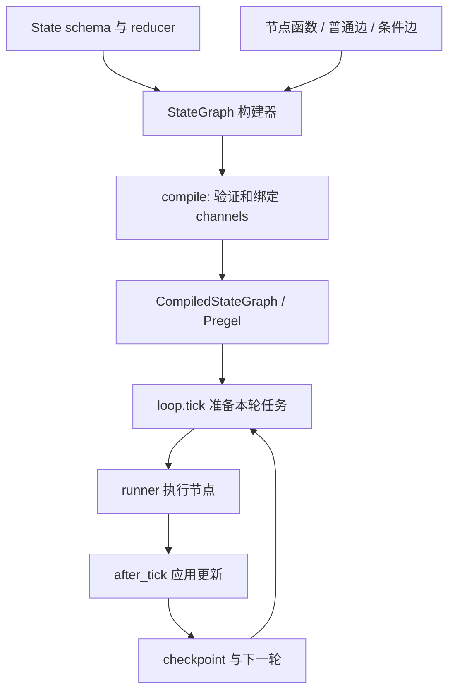

# LangGraph 源码导读：状态更新、路由与检查点

[返回源码导读](README.md) · [ReAct](../papers/react.md) · [RAG](../papers/rag.md) · [Agent 实践](../../labs/agent/README.md) · [RAG 实践](../../labs/rag/README.md)

## 1. 阅读对象与问题

阅读日：**2026-10-03**；固定源码标签：**LangGraph 0.6.7**。实际阅读 `graph/state.py`、`graph/message.py`、`channels/last_value.py`、`pregel/main.py`、`pregel/_loop.py`，路径均位于上游 `libs/langgraph/langgraph/`。这是历史发布版的静态源码导读，没有调用 LLM、启动工具服务或运行上游图。

先修：[B07–B12 搜索与规划](../../docs/01-foundations/b-plus-classical-ai.md)、[O05–O08 RAG 与 Agent](../../docs/04-systems-agents-robotics/o-llm-posttraining-rag-agents.md)。本文关注的不是“模型怎样思考”，而是多个步骤怎样共享状态、选择下一步、合并并行更新和恢复执行。LangGraph 可以组织 ReAct 风格流程，但不是 ReAct 论文原始实现；用它串起检索和生成，也不会自动得到原始 RAG 论文的检索训练目标。

## 2. 从声明式图到执行运行时

| 核心符号 / 固定标签源码 | 实际行为 |
|---|---|
| [StateGraph，state.py:117](https://github.com/langchain-ai/langgraph/blob/0.6.7/libs/langgraph/langgraph/graph/state.py#L117) | 收集状态 schema、节点、边与分支的构建器 |
| [add_node，:349](https://github.com/langchain-ai/langgraph/blob/0.6.7/libs/langgraph/langgraph/graph/state.py#L349) | 将节点动作和策略登记为节点定义 |
| [add_edge，:553](https://github.com/langchain-ai/langgraph/blob/0.6.7/libs/langgraph/langgraph/graph/state.py#L553) | 普通边连接节点；起点列表表示等待所有起点完成 |
| [add_conditional_edges，:607](https://github.com/langchain-ai/langgraph/blob/0.6.7/libs/langgraph/langgraph/graph/state.py#L607) | 将路由函数及返回值映射登记成 branch |
| [compile，:794](https://github.com/langchain-ai/langgraph/blob/0.6.7/libs/langgraph/langgraph/graph/state.py#L794) | 验证构建结果，创建并连接可执行节点与 channels |
| [_get_channel / _is_field_binop，:1334](https://github.com/langchain-ai/langgraph/blob/0.6.7/libs/langgraph/langgraph/graph/state.py#L1334) | 从类型注解选择 channel；没有 reducer 时默认 LastValue |
| [add_messages，message.py:62](https://github.com/langchain-ai/langgraph/blob/0.6.7/libs/langgraph/langgraph/graph/message.py#L62) | 转换消息并按 ID 合并；同 ID 更新不是无条件追加 |
| [Pregel.stream，main.py:2415](https://github.com/langchain-ai/langgraph/blob/0.6.7/libs/langgraph/langgraph/pregel/main.py#L2415) | 驱动任务轮次、流式输出和停止处理 |
| [PregelLoop.after_tick，_loop.py:521](https://github.com/langchain-ai/langgraph/blob/0.6.7/libs/langgraph/langgraph/pregel/_loop.py#L521) | 本轮结束后应用写入、产生值输出并安排 checkpoint |
| [_put_checkpoint，:680](https://github.com/langchain-ai/langgraph/blob/0.6.7/libs/langgraph/langgraph/pregel/_loop.py#L680) | 根据持久化模式创建和提交检查点，维护版本与上下文 |

## 3. state 不是一个随手修改的全局字典

节点接收当前状态并返回局部更新。例如检索节点只返回 `{"evidence": [...]}`，没有必要复制并返回整个状态。构建器把 schema 中的字段转成 channels，字段的 reducer 决定如何把现值与新写入合并。未标注 reducer 的字段默认为 LastValue，适合本轮只有一个写入者的标量结果。

用公式表示单字段更新：

$$s_k^{(t+1)}=R_k\bigl(s_k^{(t)},u_{k,1}^{(t)},u_{k,2}^{(t)},\ldots\bigr).$$

这里 R 是应用定义的数据合并规则，不是神经网络。列表拼接保留多个结果，集合并集可去重，覆盖只保留一个值；选择会改变程序语义。例如重试节点再次返回同一 evidence，列表拼接会重复记录，不能把 reducer 当作“框架随便帮我合一下”。

`_is_field_binop` 要求可调用 reducer 有两个位置参数；它验证函数形态，不证明结合律、交换律或业务正确性。并行合并若依赖固定顺序，就应显式定义顺序语义，而不是假设所有节点完成时间稳定。

`add_messages` 也不只是 list 加法。它把输入转换为消息对象，补充缺失 ID，按 ID 合并；新消息与旧消息 ID 相同时替换旧消息，对删除消息还有额外逻辑。因此“更新某条 assistant 消息”和“再追加一个 assistant 回答”可以是不同操作。稳定消息 ID 是应用状态的一部分。

## 4. 一条完整调用链及具体状态轨迹

考虑一个有证据才回答的教学图：`START → retrieve → judge → answer/abstain → END`。状态包含 question、evidence、supported 和 answer；这里只设计确定性节点行为，不调用模型。question 为“文档规定的重试上限是多少？”，retrieve 返回一条证据“最大重试次数为 2”，judge 检查能否找到直接支持，设置 supported=true，条件边将下一节点选为 answer。

| 逻辑阶段 | 节点读取 | 节点返回的更新 | 下一轮可见的状态变化 |
|---|---|---|---|
| retrieve | question | evidence=[带来源的段落] | evidence 获得内容 |
| judge | question、evidence | supported=true | 路由获得明确条件 |
| answer | evidence | answer="最多重试 2 次" | 产生回答后进入 END |

若检索返回空列表，则 judge 设置 false，走 abstain。这条路径展示了状态与路由；简单字符串规则不能证明自然语言蕴含，真实 RAG 仍需单独评估检索召回、证据支持和回答正确性。

构建完成后 `compile` 创建 `CompiledStateGraph`，附接每个节点、普通边、等待边和条件分支。调用 `invoke` 会消费 `stream` 的输出；`stream` 用 `loop.tick` 准备任务，runner 执行本轮任务，`after_tick` 应用写入，再进入下一轮。源码明确说明：**第 N 轮 channel 更新在第 N+1 轮可见**，同轮节点不能把对共享状态的即时修改当成通信手段。

分支函数应返回已知节点名或由 path_map 映射的值；返回 END 结束流程。路由函数中可以调用模型，但框架仍只看到路由结果，它不会自动验证模型选择是否与任务证据一致。

## 5. checkpoint 保存什么，不能保证什么

`after_tick` 在应用本轮写入后调用 `_put_checkpoint`。后者创建含 channel 状态、版本及元信息的检查点，并在配置了 checkpointer 且持久化模式允许时安排保存。源码通过保存顺序控制，让后一个 checkpoint 不先于前一个完成；同步持久化模式还在轮次边界等待保存结果。没有 checkpointer 时，不能仅因图成功执行就声称状态已持久化。

会话的 thread_id、checkpoint namespace 与具体 checkpoint 标识共同参与恢复上下文。数据库连接对象、外部服务状态或已经发出的 HTTP 副作用并不会因为 state 可保存就自动拥有事务语义。假设节点先对外写入一条记录，随后在完成 checkpoint 前崩溃，恢复后再次执行节点就可能重复写入；需要应用层使用幂等标识、可重入逻辑或明确补偿机制。

这也说明 checkpoint 与长期记忆不是同义词。前者让一次工作流的状态和位置可恢复；后者还需要选择保存哪些知识、怎样检索、何时失效。向量检索并不自动是 checkpoint，保存全量对话也不自动是有效长期记忆。

| Agent 概念 | 代码承担的部分 | 应用仍需承担的部分 |
|---|---|---|
| 观察与状态 | schema、channel、节点更新 | 观察真实性、来源及过期策略 |
| 行动与路由 | conditional edge、下一轮任务 | 模型决策质量与业务许可 |
| 记忆与恢复 | checkpointer、状态版本 | 知识筛选、幂等副作用、外部一致性 |
| 停止与预算 | END、运行轮次上限 | 成功条件、token／费用／时间预算 |

### 并行汇合与条件路由不是同一种边

假设图同时调用关键词检索与向量检索，再融合结果。把两个起点作为一个列表传给 add_edge，语义是等待两者都完成后进入融合；分别添加两条边只是登记各自的连接，不能不经分析就宣称实现了同一条显式汇合屏障。状态字段还需要记录两路检索结果，避免它们并发写同一个默认覆盖字段。

条件边则在源节点结束后根据路由结果选择下一站。把“结果不足时继续检索”写成条件边，比让模型输出一段自由文本再任意解释更容易检查：状态需要什么字段、路由允许哪些返回值、什么时候进入结束节点，均可明确列出。它仍不自动解决证据真假，但把控制错误与推理错误分离出来，有利于定位故障。

### 用一次重试追踪状态是否膨胀

设检索节点第一次返回证据 e1 后，后续步骤超时；应用选择重新检索。如果 evidence 的 reducer 只是列表拼接，第二次又返回 e1，状态会变成两份相同证据。此时引用数量增加不等于独立证据增加，多节点投票也可能在重复材料上制造虚假的支持强度。可选择按稳定来源标识去重，或者用“每个检索器最新结果”的结构覆盖，但两者代表不同业务语义，应由应用明确选择。

状态历史和对话历史也应区别对待。一次工具调用失败记录对诊断很有用，却不一定适合永久拼到发送给模型的消息中；无限追加会消耗上下文，并把陈旧观察混进新决策。检查点可以保留可恢复状态，模型上下文则可以由状态选择性构建。这个分工使恢复、审计和提示构造能够分别演进，而不用把一个 messages 列表当作所有需求的共同容器。

## 6. 失败路径

**并行写入没有 reducer。** 两个同轮节点都更新一个默认 LastValue 字段时，[LastValue.update:56](https://github.com/langchain-ai/langgraph/blob/0.6.7/libs/langgraph/langgraph/channels/last_value.py#L56) 会因收到不止一个值而抛出 InvalidUpdateError，而不是偷偷挑最后到达者。解决方法是把字段设计为有明确合并语义，或让两个节点写不同字段并在后续节点汇总。

**循环没有可靠停止条件。** 工具失败后总是回到同一个节点会不断消耗轮次，直到达到 recursion_limit。增加上限可能只延长失败；应在状态里记录尝试次数、错误类型和剩余预算，并为不可恢复错误设计终止路径。

**编译后修改构建器。** `add_edge` 等路径会警告后续变更不会反映到已编译图。应重建／重新编译执行对象；否则图示、构建器与实际运行行为可能不一致。

## 7. 检测题与解析

1. **两个检索节点并行返回 evidence 列表，为什么不能让最后一个覆盖？** 这会丢失一个检索器的证据，并让结果受执行时序影响。应先定义是否拼接、去重或带排名融合，再选择 reducer。
2. **同 ID 的消息传给 add_messages，会增加消息条数吗？** 普通更新会替换已有消息，不必增加条数；无相同 ID 才追加，删除还有独立语义。
3. **已有 checkpoint 是否保证外部工具只执行一次？** 不能。持久化图状态不等于外部副作用与图状态处在同一事务，重试和恢复需要应用层幂等设计。

完成标准：能用状态表解释一个成功、一个拒答及一个失败恢复流程；再到 [Agent 实践](../../labs/agent/README.md) 注入超时、空证据和循环，分别判断框架能检测什么、应用必须补什么。
