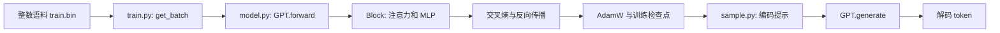

# nanoGPT 源码导读：一段文本怎样变成下一词预测器

[返回源码导读](README.md) · [Transformer 论文](../papers/transformer.md) · [GPT-3 论文](../papers/gpt3.md) · [MiniGPT 实践](../../labs/minigpt/README.md)

## 1. 阅读对象与边界

阅读日：**2026-10-03**。本文以本仓库保存的 [model.py](source-snapshots/nanogpt/model.py)、[train.py](source-snapshots/nanogpt/train.py)、[sample.py](source-snapshots/nanogpt/sample.py) 为源码证据，保留上游 [MIT 许可证](source-snapshots/nanogpt/LICENSE)。这是日历阅读快照，**不是 nanoGPT 发布版，也没有声明对应某个提交版本**；来源与保存方式见[快照说明](source-snapshots/nanogpt/README.md)。所有流程和数值例子均为静态阅读或手工推演，没有在本地运行上游训练。

[上游 README](https://github.com/karpathy/nanoGPT) 已将项目标为旧版、弃用的历史实现，并指向 nanochat。保留它是因为少量文件能展示完整的 GPT 风格训练闭环；不能把它当成当前推荐的生产训练框架，更不能将其训练结果称为 GPT-3 复现。先修为 [D02–D05 深度学习](../../docs/01-foundations/d-deep-learning.md)、[F07–F11 语言模型](../../docs/02-perception-language/f-nlp-transformers-llms.md)。

读完应能解释三个问题：标签在哪里移位？一个注意力层如何保持因果性？为什么逐 token 生成仍然重复计算历史上下文？

## 2. 职责架构与源码证据

| 符号与位置 | 实际职责与值得追踪的行为 |
|---|---|
| [get_batch，train.py:116](source-snapshots/nanogpt/train.py#L116) | 从 uint16 语料读取窗口，把目标序列向后错开一个位置，再转为 int64 |
| [GPTConfig，model.py:109](source-snapshots/nanogpt/model.py#L109) | 管理上下文长度、词表、层数、头数及维度；配置不会自动检查语料语义 |
| [CausalSelfAttention.forward，model.py:52](source-snapshots/nanogpt/model.py#L52) | 一次投影出 Q/K/V，再分头；采用 SDPA 或显式因果注意力 |
| [MLP.forward，model.py:87](source-snapshots/nanogpt/model.py#L87) | 维度扩张至四倍，经 GELU 后投影回原维度 |
| [Block.forward，model.py:103](source-snapshots/nanogpt/model.py#L103) | 两次 pre-LayerNorm 与残差相加 |
| [GPT.forward，model.py:170](source-snapshots/nanogpt/model.py#L170) | token 与绝对位置嵌入相加；训练计算全序列 logits，推理只计算最后位置的输出投影 |
| [configure_optimizers，model.py:263](source-snapshots/nanogpt/model.py#L263) | 按参数维数分组设置 weight decay，构建 AdamW |
| [训练更新，train.py:290](source-snapshots/nanogpt/train.py#L290) | 梯度累积、混合精度缩放、反缩放后裁剪、优化器更新和清梯度 |
| [GPT.generate，model.py:306](source-snapshots/nanogpt/model.py#L306) | 截取上下文，前向预测，应用温度及 top-k，再采样追加 token |

模型层没有读取文本或决定 batch 的职责，训练循环没有重新实现 attention。沿这条边界阅读，比同时追全部配置更容易建立整体认识。

## 3. 从一个 batch 追到梯度

假设整数语料含 `[2, 5, 1, 4, 3]`，取一个长度为 4 的窗口。`get_batch` 给出输入 `[2,5,1,4]` 和目标 `[5,1,4,3]`。第一个位置看到 token 2，要预测 5；最后一个位置看到整个输入窗口，要预测 3。**移位发生在数据加载器，GPT.forward 不再次移位**。若把同样的输入直接当 targets，模型就可能借残差学会复制当前 token。

再设 batch 大小为 2、序列长 4、隐藏维 8、注意力头数 2、词表 10。token embedding 是 `[2,4,8]`，位置 embedding 是 `[4,8]`，广播相加后仍为 `[2,4,8]`。联合 QKV 投影得到 `[2,4,24]`，拆分和转置后每个 Q/K/V 为 `[2,2,4,4]`：最后一个 4 是每头维度。

显式分支计算

$$A=\operatorname{softmax}\left(QK^\top/\sqrt{d_h}+M\right),\qquad Y=AV.$$

这里注意力分数为 `[2,2,4,4]`，上三角位置在 softmax 前置为负无穷。因而第 0 个位置只读自己，第 3 个位置可以读 0–3。合并头后恢复 `[2,4,8]`，输出投影和残差保留这个形状。`Block` 使用先归一化再执行子层的形式；不能直接照搬原始 Transformer 论文图中的层次顺序而忽略实现差异。

最终训练 logits 为 `[2,4,10]`，展平为 `[8,10]`，targets 为 `[8]`。`cross_entropy` 内部完成 log-softmax 与正确类别的负对数概率，不应先对 logits 做 softmax。此实现的忽略值是 **-1**，不同于 Transformers 常用的 -100。

训练主循环把每个 micro-batch 的 loss 除以累积次数，再反向传播。累积 4 次后只执行一次优化器更新，相当于累计更多样本的梯度；这并不自动消除 dropout、浮点求和顺序或不同样本长度带来的差别。fp16 分支先撤销梯度缩放再做范数裁剪，否则裁剪阈值不再对应真实梯度。

## 4. 从提示追到生成结果

[sample.py:35](source-snapshots/nanogpt/sample.py#L35) 用检查点中的 `model_args` 重建模型，再加载权重。随后设置 eval 模式，读取字符级元数据或采用 GPT-2 tokenizer。编码后的提示进入 `GPT.generate`，每轮执行：裁剪为最后 `block_size` 个 token → 完整 `self(idx_cond)` → 取最后位置 logits → 除以温度 → top-k 筛选 → multinomial 采样 → 拼回序列。

要区分两种节省：`GPT.forward` 的推理分支只在最后位置运行 `lm_head`，省的是输出词表投影；前面的各个 Transformer block 仍处理整个输入窗口。这里没有把过去的 K/V 保存在层间缓存接口中，所以它**没有实现增量 KV cache**。相关对照见 [Transformers 导读](transformers.md) 与 [vLLM 导读](vllm.md)。

若提示长为 3，生成 2 个 token，则先处理长度 3，再处理长度 4；返回长度 5。若窗口上限为 4，再生成时只取最后 4 个 token，并重新使用窗口内的位置编号。由此得到的有限窗口行为，不等于任意长上下文推理。

## 5. 公式与实现的关系

| 理论概念 | 对应实现 | 阅读时的边界 |
|---|---|---|
| 自回归负对数似然 | 移位后的 targets 与交叉熵 | 训练并行预测全部位置，但每个位置仍受到因果 mask 限制 |
| 多头注意力 | QKV 联合投影、分头、scaled dot product、合头 | 源码变量 `flash` 只检查是否存在 PyTorch SDPA 接口；不能据此断言硬件上一定使用某个 FlashAttention 内核 |
| 残差路径 | `x + attn(ln(x))` 与 `x + mlp(ln(x))` | 本实现为 pre-LN；与原论文的具体归一化位置不同 |
| 权重共享 | token embedding 与 lm_head 共用权重 | 不能把两处显示的参数形状各计算一次后直接相加 |
| 解码分布 | logits 除温度、top-k、softmax、采样 | 采样规则改变输出，不代表模型参数或语言建模目标改变 |

### 学习率、验证与保存也属于模型闭环

读取 [train.py:216](source-snapshots/nanogpt/train.py#L216) 可以看到，验证函数先切换为 eval，分别从 train/val 抽取若干 batch，求平均损失后恢复 train。这个均值是随机窗口上的估计，不是自动遍历全部验证语料。扩大评估次数通常降低采样波动，却不会修复训练集与验证集内容重叠造成的泄漏。比较两次实验前，先检查分割规则、采样窗口和评估量是否一致。

[get_lr:231](source-snapshots/nanogpt/train.py#L231) 先线性 warmup，再余弦衰减至最小学习率。它改变优化步长，不改变当前 batch 的交叉熵定义。若把训练总步数缩短而保持很长 warmup，训练可能大部分时间还在升学习率；只抄一个“推荐学习率”却不读调度时间尺度，就无法解释收敛差异。优化器分组同样是训练配方：这里按参数维数区分衰减，二维 embedding 也在衰减组，不应误说成只对 attention 矩阵衰减。

保存检查点时不仅有模型权重，还包括优化器状态、模型配置、迭代数和最佳验证损失。只保留权重适合某些推理场景，但恢复训练时丢掉 AdamW 的历史状态，优化轨迹就可能改变。代码在记录 loss 时使用最近一个 micro-batch 的损失再还原缩放，并不是把本轮所有 micro-batch 的损失精确求平均；因此日志有抖动时，先读日志含义再判断训练是否不稳定。

可在纸上设计一个定位表：若 loss 从第一步就极低，优先检查标签是否复制当前输入；若训练下降但验证上升，检查过拟合与分割；若 loss 正常而解码乱码，检查 tokenizer 与权重的对应关系；若生成随调用方式改变，检查 train/eval、温度和随机状态。这些是基于职责分工的排查假设，不是已经观测到的本地故障。

还可以给损失建立一个手算参照：假设词表十项，某位置对全部类别给出相同 logits，则该位置正确目标的概率为十分之一，负对数似然约为二点三零。这个数字来自均匀预测假设，不是随机初始化模型必然达到的值。若预测逐渐集中到正确类别，该位置损失下降；若只对训练集记住答案，验证窗口并不会因此受益。困惑度是平均负对数似然的指数，仍依赖 tokenizer 与计数单位；不同词表或不同分词方式的数值不宜直接排成能力榜单。这样读日志时，才能把数学量、数据单位和模型能力分开理解。

## 6. 失败路径与定位方法

**标签或词表不一致。** 语料使用的 token ID 必须小于模型词表大小；字符 tokenizer 的元数据丢失后，`sample.py` 会退回 GPT-2 编码，这不保证与已训练 embedding 对应。先追读取元数据的分支和 `get_batch` 的窗口，不要只观察生成文本是否“像语言”。

**上下文与头维不合法。** `GPT.forward` 显式检查序列不超过 block_size；注意力构造检查隐藏维可被头数整除。修改这些配置不是任意调小一个数字：位置表长度、检查点参数形状和模型分头都必须一致。

**把训练态采样与采样随机性混为一谈。** `generate` 的 no-grad 只关闭梯度记录，不等于 eval。若调用方没有 `model.eval()`，dropout 仍可能改变输出；温度为零也不等于本代码支持的 greedy 分支，因为它直接做除法。

## 7. 检测题与解析

1. **训练时 `[B,T,V]` 能并行计算，为什么不是偷看未来？** 目标序列是右侧下一 token，输入位置的可见性由因果 mask 控制。并行是计算方式，因果性是信息约束。
2. **两个头每头维度 4，缩放为什么除以 2，而不是除以隐藏维 8 的平方根？** 每次点积只累加单头的 4 个分量，方差缩放应依据该点积维度。
3. **只把输出头改成最后位置，能否达到 KV cache 的速度收益？** 不能。缓存还需要各层保存过去的 K/V，并让新 token 只计算自身投影；这里仍重复计算历史 hidden states。

完成标准：不运行模型也能在纸上追完一个窗口的标签、三处关键形状和一次参数更新；随后在 [MiniGPT 实践](../../labs/minigpt/README.md) 中用教学实现验证，不把本页静态推演当作上游性能测试。
