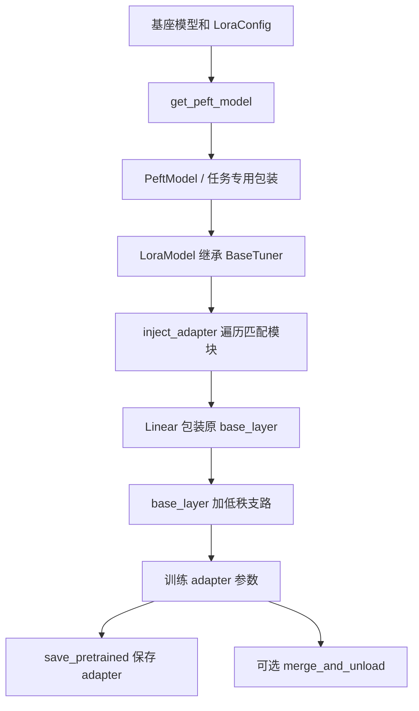

# PEFT 源码导读：LoRA 如何进入已有模型

[返回源码导读](README.md) · [LoRA 论文](../papers/lora.md) · [Transformers 导读](transformers.md) · [后训练实践](../../labs/posttrain/README.md)

## 1. 阅读对象与问题

阅读日：**2026-10-03**；固定源码标签：**PEFT v0.17.1**。本页实际阅读 `mapping_func.py`、`peft_model.py`、`tuners/tuners_utils.py`、`tuners/lora/model.py` 和 `tuners/lora/layer.py`。只讨论普通线性层上的 vanilla LoRA 主路径，量化后端、DoRA、rsLoRA 等只用来标明分支边界；未运行上游微调或模型合并。

先修：[A02–A05 线性代数](../../docs/01-foundations/a-math-statistics-optimization.md)、[O01–O02 后训练](../../docs/04-systems-agents-robotics/o-llm-posttraining-rag-agents.md) 与 [LoRA 精读](../papers/lora.md)。要解决的问题不是重新写一个低秩公式，而是把它装进已经存在的大模型：找到哪些层，替换成什么对象，哪些参数能训练，最后保存什么。

`get_peft_model` 会改变传入模型的模块结构；它不是给调用方制作一份完全独立的基座副本。课程中比较基座和适配模型时，需要意识到这个共享对象关系。

## 2. 架构与源码证据

| 符号 / 固定标签源码 | 实际行为 |
|---|---|
| [get_peft_model，mapping_func.py:31](https://github.com/huggingface/peft/blob/v0.17.1/src/peft/mapping_func.py#L31) | 按配置选择通用或任务专用 PeftModel 包装 |
| [PeftModel.__init__，peft_model.py:105](https://github.com/huggingface/peft/blob/v0.17.1/src/peft/peft_model.py#L105) | 依据 PEFT 类型选择 tuner，将基座交给它处理 |
| [BaseTuner.inject_adapter，tuners_utils.py:443](https://github.com/huggingface/peft/blob/v0.17.1/src/peft/tuners/tuners_utils.py#L443) | 遍历 named_modules，匹配目标，记录目标名并调用替换逻辑 |
| [LoraModel._create_and_replace，lora/model.py:174](https://github.com/huggingface/peft/blob/v0.17.1/src/peft/tuners/lora/model.py#L174) | 处理层级 rank/alpha，创建合适包装或更新已有 LoRA 层 |
| [_mark_only_adapters_as_trainable，:291](https://github.com/huggingface/peft/blob/v0.17.1/src/peft/tuners/lora/model.py#L291) | 冻结非 adapter 参数，并按 bias 配置处理例外 |
| [LoraLayer.update_layer，layer.py:180](https://github.com/huggingface/peft/blob/v0.17.1/src/peft/tuners/lora/layer.py#L180) | 创建 A/B、dropout、缩放值并初始化 |
| [Linear.forward，:744](https://github.com/huggingface/peft/blob/v0.17.1/src/peft/tuners/lora/layer.py#L744) | 处理禁用、已合并和普通低秩分支，最后恢复结果精度 |
| [Linear.get_delta_weight，:710](https://github.com/huggingface/peft/blob/v0.17.1/src/peft/tuners/lora/layer.py#L710) | 形成用于合并的低秩权重增量，处理转置约定 |
| [PeftModel.save_pretrained，peft_model.py:178](https://github.com/huggingface/peft/blob/v0.17.1/src/peft/peft_model.py#L178) | 提取适配器相关状态并保存配置，而非默认导出完整基座 |
| [LoraModel.merge_and_unload，model.py:910](https://github.com/huggingface/peft/blob/v0.17.1/src/peft/tuners/lora/model.py#L910) | 合并后移除 adapter 包装，交还普通模型 |

## 3. 注入过程：公式怎样找到真实线性层

以 Qwen2 的 `q_proj`、`v_proj` 为例。配置中的名字先由 `inject_adapter` 与模块路径匹配；找到父对象、原层和属性名后，进入 `_create_and_replace`。普通 Linear 分支创建新模块，保留原层作为 `base_layer`，然后用 `setattr` 替换父对象里的属性。因此模型前向仍沿原来的 decoder 调用链，抵达这一投影时才进入新的 LoRA 包装。

这解释了两件常见误解。第一，配置里写一个“看起来合理”的名称没有用，必须与基座实际模块命名匹配；nanoGPT 的 QKV 联合投影叫 `c_attn`，不能直接照搬 Qwen2 的目标层名。第二，替换并不是删除预训练权重：普通前向先计算 base_layer，再加 adapter 的输出。

普通 LoRA 参数为

$$W'=W+sBA,\quad s=\alpha/r,\quad A\in\mathbb{R}^{r\times d_{in}},\quad B\in\mathbb{R}^{d_{out}\times r}.$$

对行向量 batch，代码不必真的先构造完整 `BA`，而是计算 `base_layer(x) + lora_B(lora_A(dropout(x)))*scaling`。A 先把最后一维降到 r，B 再升回输出维度。序列的 batch 与 token 维不变；这条支路能直接作用在 `[B,T,d_in]` 上。

## 4. 一个低秩支路的静态推演

设输入维 4、输出维 3、rank=2、alpha=4，则 A 形状 `[2,4]`，B 为 `[3,2]`，缩放 s=2。若输入为 `[2,5,4]`，A 输出 `[2,5,2]`，B 输出 `[2,5,3]`，可以与基座的 `[2,5,3]` 相加。可训练 A/B 共 `2×4+3×2=14` 个参数；此小例子反而多于原层的 12 个权重，说明“低秩省参数”要求 r 相对两侧维度足够小，不是任取一个 r 就成立。

再看一个明确的手算样本：令 `x=[1,2,0,0]`，A 的两行分别选前两维，B 的三行为 `[1,0]`、`[0,1]`、`[1,-1]`，dropout 关闭。A 的结果是 `[1,2]`，B 的结果是 `[1,2,-1]`，乘缩放后给基座输出增加 `[2,4,-2]`。这是为理解矩阵方向构造的教学参数，并非一次训练所得。

默认线性 LoRA 初始化是 A 使用 Kaiming uniform、B 为零，因此刚注入时增量为零。若只分析 adapter 支路，第一步对 A 的梯度含有 B 因子，可以为零；B 的梯度通常非零。这不是 A 被误冻结，也不是一开始就能把 A/B 都置零：二者全零会使普通乘积支路缺少有效起步梯度。

普通 LoRA 的参数节省主要来自冻结 W、减少其梯度和优化器状态，不意味着省去所有基座前向、激活或反向传播。为了得到早层 adapter 的梯度，梯度仍需穿过后续网络；具体显存还受 batch、长度、精度与激活检查点影响。

## 5. 保存、合并与公式边界

`PeftModel.save_pretrained` 调用状态提取函数，并把适配器状态、配置写到目标目录；配置含基座关联信息。默认 adapter 包并不包含完整基座，恢复时还需要匹配的基座版本、tokenizer 和目标模块。额外 embedding 或 `modules_to_save` 会改变保存范围，不能把“只保存 A/B”作为所有配置的绝对承诺。

合并走另一条路：`get_delta_weight` 形成缩放后的 BA，再加到 base weight。推理关闭 dropout、使用相同精度且没有额外变体时，合并前后在数学上对应同一个线性映射；有限精度和量化顺序可能带来误差。`safe_merge` 在副本上检查合并结果是否有限，这不证明任务质量保持，也不证明所有量化后端都可无损合并。

| 论文概念 | 普通路径实现 | 不应混用的分支 |
|---|---|---|
| 低秩增量 | 两个小 Linear 串联后加回基座 | DoRA 等分支并非完全相同的 forward |
| alpha/r | `update_layer` 的 scaling | rsLoRA 使用 alpha/√r，必须记录配置 |
| 冻结预训练参数 | tuner 设置 requires_grad | bias、modules_to_save 会引入可训练例外 |
| 不增加部署矩阵乘法 | 合并权重后普通 base_layer | 未合并时仍需运行 adapter 支路 |

### 再从梯度看“冻结”到底省去了什么

把一个输入写成列向量，忽略 dropout 与 bias，令输出梯度为 g。普通 LoRA 有 `y=Wx+sBAx`，于是 B 的梯度由 `g` 与 `Ax` 的外积构成，A 的梯度则包含 `B` 的转置。B 初始化为零时，A 的首步梯度为零的现象可以直接从这条链式法则得到；不必通过修改 requires_grad 来“修复”。当 B 更新后，下一步 A 通常就能收到非零梯度。

对输入 x 的梯度还要通过基座映射与低秩支路回传。W 不更新，仅意味着不为它优化一份参数增量；若更早的层包含可训练 adapter，依然需要把误差信号送回去。因此冻结参数与截断整个计算图不是同一操作。把大段前向放进 no-grad 以为还能正常训练所有位置的 LoRA，可能意外切断这些路径；应按真实计算依赖检查，而不是只依据参数数量推测。

### 完整模型前向与适配器保存是不同层次

[PeftModel.forward:875](https://github.com/huggingface/peft/blob/v0.17.1/src/peft/peft_model.py#L875) 设置适配器相关 hooks，过滤专用参数，然后调用基座。普通 LoRA 的核心数学并没有集中写在这一层包装中，而是发生在已经替换的各个 Linear.forward 里。这正是源码阅读容易迷路的地方：顶层函数看起来只转发参数，不能据此认为 adapter 没有参与前向；必须沿被改写的子模块继续向下追。

保存也不能仅靠“这个参数现在能否训练”判断内容。序列化需要通过适配器类型、名称和附加保存配置选取状态，并保留加载所需的结构信息。一个训练得很好的 adapter，如果漏记特殊 token 或遗漏新增词向量，即使 A/B 参数文件仍在，也可能无法恢复同一模型行为。反过来，保存完整合并模型之后，文件可以用于独立前向，但原来多个 adapter 的切换能力和独立参数边界不再自然保留。

可以把一次规范的阅读练习分成三张清单：注入清单写实际匹配的层及输入输出维；训练清单写可训练参数与损失来源；交付清单写基座、适配器、tokenizer 和是否合并。三张清单分别对应结构、优化和复现，不应只用“成功调用了 get_peft_model”一个事件代替。

比较不同 rank 时还要留意缩放。若固定 alpha 而增大 rank，普通路径的 alpha/r 随之减小；若让 alpha 随 rank 同比例增长，缩放则保持不变。这两组实验改变的因素不同，不能只把指标差异归因于“秩更高”。实际更新还依赖初始化、学习率、数据和目标层数量，因此保持缩放也不保证更新范数相同。报告至少应写清参数配置、目标层和训练预算，再解释性能与成本的权衡。低秩限制的是单个权重增量的表示形式，不是整个非线性模型只能表达低秩函数；把局部矩阵性质推广成模型全部能力边界，是另一个常见概念错误。

## 6. 失败路径

**匹配不到层或层类型不支持。** 从 `targeted_module_names` 和 `_create_new_module` 分派路径排查；注入过程在没有有效目标时会报错。不要把构造失败改成忽略异常后继续训练，那会失去预期实验对象。

**保存 adapter 却丢失基座语义。** 两个同形状模型可能来自不同训练版本，加载不报维度错误也不代表模型相同。实验记录需保存基座版本、tokenizer、目标层、rank、alpha 和模板，且明确是否合并。

**把 active、trainable、merged 当成同一状态。** 新 adapter 被加入不等于它已是活动 adapter；已合并后 forward 走基座分支；禁用 adapter 时实现还会考虑 unmerge。比较输出前先说明三种状态，而非仅打印参数总数。

## 7. 检测题与解析

1. **LoRA 刚注入后输出为何可以与基座相同？** 普通线性默认 B=0，增量为零；这依赖所选初始化与分支，不适用于所有变体。
2. **rank 越小是否保证显存按同一比例下降？** 不保证。仅 adapter 参数和相应优化器状态随 rank 线性变化，基座权重、序列激活等仍存在。
3. **为何加载 adapter 还必须知道 base model？** adapter 只描述相对某基座的更新；BA 没有独立语言能力，也不能确定 tokenizer 与 embedding 的对应关系。

下一步进入 [TRL](trl.md)，观察“改哪些参数”与“优化什么目标”如何组合；在 [后训练实践](../../labs/posttrain/README.md) 中先检查梯度流和合并误差，再讨论任务分数。
