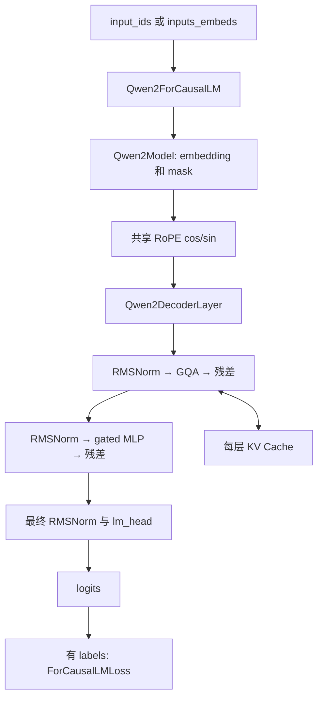

# Transformers 源码导读：沿 Qwen2 追踪解码器与缓存

[返回源码导读](README.md) · [Transformer](../papers/transformer.md) · [LLaMA](../papers/llama.md) · [MiniGPT 实践](../../labs/minigpt/README.md)

## 1. 阅读对象与前置知识

阅读日：**2026-10-03**；固定源码标签：**Transformers v4.57.1**。这是为教学选择的历史发布版，不表示当前最新版。本页实际阅读了该标签的 `models/qwen2/modeling_qwen2.py`、`loss/loss_utils.py` 和 `cache_utils.py`，聚焦 Qwen2 decoder-only 路径；没有运行上游模型、下载权重或验证吞吐。

先修：[F07–F09、F14](../../docs/02-perception-language/f-nlp-transformers-llms.md) 和 [nanoGPT 导读](nanogpt.md)。本页回答：通用模型库怎样组织一个具体架构？训练标签和生成缓存在哪里处理？同为 Transformer，Qwen2 为什么不能直接等同原始 LLaMA？

不要一开始就追 `AutoModel` 的所有注册表。本页从确定的 `Qwen2ForCausalLM` 进入：自动模型工厂解决“选哪个类”，模型实现才回答“这个类怎样计算”。`from_pretrained` 的下载与权重分片、完整 `GenerationMixin` 策略及不同注意力内核属于后续阅读边界。

## 2. 架构与证据入口

下表位置均为固定标签下的源码，不是文档示例行号。

| 符号 / 源码位置 | 静态确认的行为 |
|---|---|
| [Qwen2MLP，modeling_qwen2.py:34](https://github.com/huggingface/transformers/blob/v4.57.1/src/transformers/models/qwen2/modeling_qwen2.py#L34) | 门控投影与上投影逐元素相乘，再下投影 |
| [apply_rotary_pos_emb，:57](https://github.com/huggingface/transformers/blob/v4.57.1/src/transformers/models/qwen2/modeling_qwen2.py#L57) | 对 Q/K 应用旋转位置编码 |
| [eager_attention_forward，:96](https://github.com/huggingface/transformers/blob/v4.57.1/src/transformers/models/qwen2/modeling_qwen2.py#L96) | 扩展 KV 头后计算注意力；softmax 使用 float32 再转回 query dtype |
| [Qwen2Attention.forward，:141](https://github.com/huggingface/transformers/blob/v4.57.1/src/transformers/models/qwen2/modeling_qwen2.py#L141) | 投影、RoPE、缓存更新、后端分派、输出投影 |
| [Qwen2RMSNorm.forward，:196](https://github.com/huggingface/transformers/blob/v4.57.1/src/transformers/models/qwen2/modeling_qwen2.py#L196) | 在 float32 计算均方与归一化，再恢复输入精度 |
| [Qwen2DecoderLayer.forward，:220](https://github.com/huggingface/transformers/blob/v4.57.1/src/transformers/models/qwen2/modeling_qwen2.py#L220) | 注意力及 MLP 各自带 pre-norm 残差 |
| [Qwen2Model.forward，:330](https://github.com/huggingface/transformers/blob/v4.57.1/src/transformers/models/qwen2/modeling_qwen2.py#L330) | 创建／接收缓存，确定位置，建立 mask，逐层调用 |
| [Qwen2ForCausalLM.forward，:419](https://github.com/huggingface/transformers/blob/v4.57.1/src/transformers/models/qwen2/modeling_qwen2.py#L419) | 将隐藏状态投影到词表，有 labels 时调用统一 loss |
| [ForCausalLMLoss，loss_utils.py:45](https://github.com/huggingface/transformers/blob/v4.57.1/src/transformers/loss/loss_utils.py#L45) | 默认在损失内部移位 labels；忽略值为 -100 |
| [DynamicLayer.update，cache_utils.py:98](https://github.com/huggingface/transformers/blob/v4.57.1/src/transformers/cache_utils.py#L98) | 把当前 key/value 沿序列维追加到已有缓存 |

## 3. 一次前向的数据流

用一个缩小的**教学配置**追踪形状：`B=2,T=3,hidden_size=16`，4 个 query 头、2 个 KV 头、每头维度 4；不是某个公开 Qwen2 检查点的真实配置。输入 `[2,3]` 经 embedding 得到 `[2,3,16]`。Q 投影输出 16 维，K/V 各输出 8 维，所以分头后 Q 为 `[2,4,3,4]`，K/V 为 `[2,2,3,4]`。

GQA 让一组 query 头共享 KV 头，减少需要缓存的 K/V；它没有让每个 query 头消失。eager 路径用 `repeat_kv` 将 K/V 扩展到 query 头数再乘矩阵。不同高效后端可能直接处理共享布局，因此不能从 eager 的中间张量推断所有后端都分配同样内存。

Qwen2Model 先计算当前位置的 cos/sin，再把它们传给每个解码层。Attention 将 RoPE 应用于新 Q/K，随后更新该层缓存。位置编码、缓存长度和 attention mask 必须描述同一条序列；仅让 tensor 的维数“能相乘”并不保证语义正确。

每个解码层先 RMSNorm，再注意力和残差相加；再做一次 RMSNorm、门控 MLP 和残差相加。这里

$$\operatorname{RMSNorm}(x)=w\odot x/\sqrt{\operatorname{mean}(x^2)+\epsilon}$$

不减均值。MLP 的核心是 `down_proj(act(gate_proj(x))*up_proj(x))`，与 nanoGPT 中单个 GELU 扩展层不同。最终模型级归一化后，经 `lm_head` 产生 `[B,T,V]`。

## 4. 训练标签与生成缓存的两个闭环

**训练闭环。** 假设输入 token 为 `[4,7,9]`，传入同样的 labels。`ForCausalLMLoss` 在末尾补 -100，再取 `labels[...,1:]`，得到 `[7,9,-100]`：位置 0 预测 7，位置 1 预测 9，最后位置忽略。与 nanoGPT 的数据加载器移位不同，若沿用 nanoGPT 的 `[7,9,下一词]` 再交给这里默认 loss，就会重复移位。存在显式 `shift_labels` 参数时该函数可绕过默认移位，阅读自定义训练器时必须确认究竟是谁负责对齐。

**生成闭环。** prefill 输入 3 个 token，某层缓存 K/V 为 `[2,2,3,4]`；接下来只输入刚生成的 1 个 token，缓存位置应从 3 开始，新 Q 为 `[2,4,1,4]`，追加后 K/V 为 `[2,2,4,4]`。新 query 关注历史 4 个位置，输出本步 token 的 logits。此时过去 K/V 被复用，而不是每轮从三个旧 token 重新计算。

以单层、16 位 KV 为例，每个序列缓存 4 个 token，需要 `2×4×2×4×2=128` 字节；第一个 2 为 K/V，第二个 2 为 KV 头数，最后一个 2 是每元素字节。整个 batch 为 256 字节，实际多层模型再乘层数；这只是 KV 数据量，不含权重、临时激活和分配器开销。公式对应 [F14](../../docs/02-perception-language/f-nlp-transformers-llms.md)，服务级管理继续看 [vLLM](vllm.md)。

## 5. 论文机制怎样进入框架

| 机制 | 源码落点 | 应保留的区别 |
|---|---|---|
| 缩放点积注意力 | `scaling=head_dim**-0.5`，attention backend | 后端可以改变执行方式，不必改变数学目标 |
| RoPE | `Qwen2RotaryEmbedding` 与 `apply_rotary_pos_emb` | 使用位置编号，不是给 embedding 简单加一个向量 |
| LLaMA 风格的现代解码器组件 | RMSNorm、gated MLP、RoPE | 这是架构对照；Qwen2 不等于原始 LLaMA，Q/K/V bias、GQA 和可选滑动窗口需按此版本判断 |
| 自回归似然 | `ForCausalLMLoss` | 推理 cache 和训练 loss mask 是不同机制 |
| 工程上的按需 logits | `logits_to_keep` | 默认 0 在此处表示保留全部；正整数才选择末尾若干位置 |

模型文件带有从 modular 源生成的标记，因此修改上游贡献时还需回到其生成源。本导读只解释读取到的生成文件，不建议把这里的阅读路径当成贡献修改入口。

### 分清三种 mask 与两个位置概念

读模型时最好单独画出一张二维表：横轴是 key 的历史位置，纵轴是当前 query 位置。因果约束删除“看未来”的格子；padding 约束删除无真实内容的 key；loss mask 则决定哪些输出位置参与目标函数，作用在另一张表上。三者常在同一次训练出现，却分别回答“能读什么”“哪里有内容”“哪里受监督”。一个用户提示 token 可以作为有效 key 被后面的回答读取，同时其对应目标位置不计损失。

`cache_position` 用来描述新输入在缓存序列中的位置，`position_ids` 提供旋转位置编码需要的位置编号。简单无 padding 的增量解码中，它们常按相同长度推进，因此容易误以为永远可互换。但自定义批次、左 padding 或不同长度历史会打破这种直觉。此版本在未提供 position_ids 时由 cache_position 派生；使用自定义值就需要自己保证与 mask 及缓存布局相容，而不是指望张量广播替你修正语义。

再考虑长度不同的两个提示，分别有二个和四个有效 token。为了形成同形状 batch，短提示可能被补齐，但补齐位置不应成为第二条真实语言上下文。不能仅比较张量第二维就认定两个请求都已经积累四个有效词。通用生成流程会承担部分输入准备；本页选择直接分析模型入口，恰好能看清调用方必须兑现哪些契约。

### 为什么要同时保留普通实现与高效后端

eager 路径显式出现 query-key 乘积、mask 相加、softmax 和 value 加权，适合建立数学对应。模型又通过注意力接口表选择其他实现，从而适配更高效的执行方式。阅读优化代码时应该先固定“输入语义与输出应当等价”的契约，再分析是否减少中间分配、提高并行度或改变数值顺序。仅看到一个后端名称不能推断它在所有设备、精度和输入形状上都启用相同内核。

RMSNorm 与 attention softmax 都有局部升精度逻辑，说明“模型使用半精度”不意味着每一步都在半精度里算。升精度是为了控制特定累加或归一化误差；它也不意味着所有数值问题消失。若完整前向和缓存前向出现很小差异，先分清浮点容差与 token 对齐错误；前者通常表现为数值微差，后者可能对应完全不同的条件概率。是否足够接近必须在具体后端上实验，本页没有给出通用误差阈值或已经通过的结论。

损失归约同样值得向下追一层。`fixed_cross_entropy` 在没有外部有效项数量时按默认均值归约；收到 `num_items_in_batch` 时先求和再除以该数量。若两个批次分别含十个和一百个有效目标，先各求平均再等权平均，和把一百一十个目标统一平均，给每个 token 的权重不同。普通定长无 padding 示例看不出这个差异，变长对话和梯度累积则很容易遇到。源码提供计数入口，不代表调用方传来的数量一定正确；自定义训练流程应在纸面上明确分母统计了哪些位置，以及已忽略的目标是否被排除。这个问题与模型结构无关，却会直接改变优化尺度和日志含义。

## 6. 失败路径

**重复移位或监督 padding。** 症状可能是 loss 下降而生成异常。检查 tokenizer 后的 input_ids、原始 labels、进入 loss 后的 shift_labels 三者；attention_mask 控制读取，-100 控制监督，二者不能互相替代。

**缓存位置错位。** 把完整历史反复传入仍在增长的 cache，会重复追加历史；手动 cache_position 又不匹配历史长度，会让 RoPE 或 mask 指向错误位置。先在纸上记录每次输入长度和 cache 长度，再比较完整前向与增量前向的对应 logits。该比较是建议实验，本页未执行。

**两种输入同时给或同时不给。** `Qwen2Model.forward` 要求 input_ids 与 inputs_embeds 二选一；这不是库替读者决定如何融合输入。自定义多模态连接器应选择 embeddings 路径，并负责位置和 mask 的一致性。

## 7. 检测题与解析

1. **K/V 头数减半，query 头数不变，注意力输出维度是否减半？** 不会。输出仍按 query 头合并；主要减少 K/V 投影及缓存量。
2. **cache 长度为 100，只输入一个新 token，为什么分数矩阵还有 101 列？** 本步 query 长度为 1，但 key 包括历史和新 token；复用缓存没有取消对历史的读取。
3. **把 padding 的 attention_mask 置零，就能从 loss 中去掉它吗？** 不能。还需将相应 labels 设为 -100；否则这些位置仍可能作为目标计入交叉熵。

完成标准：能从确定模型类走到 attention、cache 和 loss，解释训练与生成的不同张量长度，并明确哪些层属于模型实现、哪些属于通用框架。随后接 [PEFT](peft.md) 查看这些具体线性层怎样被替换。
