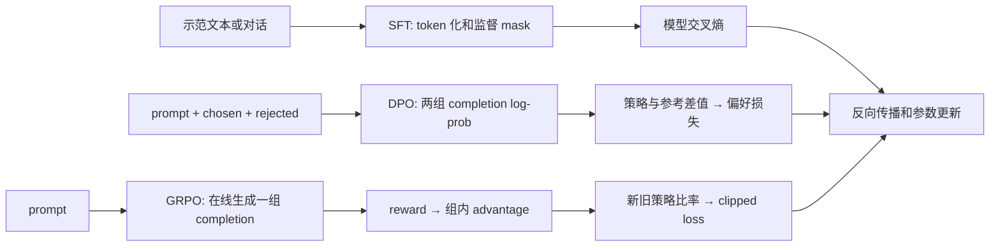

# TRL 源码导读：SFT、DPO 与 GRPO 的三条训练数据流

[返回源码导读](README.md) · [InstructGPT](../papers/instructgpt.md) · [DPO](../papers/dpo.md) · [DeepSeekMath](../papers/deepseekmath.md) · [后训练实践](../../labs/posttrain/README.md)

## 1. 阅读对象与前置知识

阅读日：**2026-10-03**；固定源码标签：**TRL v0.24.0**。实际阅读三个文件：`trl/trainer/sft_trainer.py`、`dpo_trainer.py`、`grpo_trainer.py`。选择普通 PyTorch loss 路径解释，Liger、视觉输入、分布式与 vLLM 同步分支仅指出边界。没有在本地运行上游训练器，也没有复现任何论文分数。

先修：[O01–O04](../../docs/04-systems-agents-robotics/o-llm-posttraining-rag-agents.md)、[I08–I10 策略梯度至 PPO](../../docs/03-decision-specialties/i-reinforcement-learning.md)、[Transformers](transformers.md) 与 [PEFT](peft.md)。InstructGPT 提供 SFT→奖励模型→RLHF 的研究背景；本页的 SFTTrainer 不是完整 InstructGPT 复现。DPO 与 GRPO 也不能仅因共处 TRL 就理解为同一算法的两个名称。

## 2. 三条路线的职责图

SFT 的监督信号来自示范 token；DPO 来自离线偏好对；GRPO 要先采样、评分，再优化策略。PEFT 决定哪些权重能更新，Trainer 决定数据怎样组织、损失怎样计算，两者是可组合的职责。

| 核心符号 / 固定标签源码 | 实际行为 |
|---|---|
| [SFTTrainer._prepare_dataset，sft_trainer.py:871](https://github.com/huggingface/trl/blob/v0.24.0/trl/trainer/sft_trainer.py#L871) | 识别数据形态、模板化、token 化、创建 completion 或 assistant 标记 |
| [DataCollatorForLanguageModeling.torch_call，:157](https://github.com/huggingface/trl/blob/v0.24.0/trl/trainer/sft_trainer.py#L157) | padding，生成 labels，把非监督位置设成 -100 |
| [SFTTrainer.compute_loss，:1080](https://github.com/huggingface/trl/blob/v0.24.0/trl/trainer/sft_trainer.py#L1080) | 禁用 cache 后委托父类损失流程，并统计额外指标 |
| [DPOTrainer.concatenated_inputs，dpo_trainer.py:942](https://github.com/huggingface/trl/blob/v0.24.0/trl/trainer/dpo_trainer.py#L942) | 将 chosen/rejected 打包到统一 batch |
| [DPOTrainer.concatenated_forward，:1475](https://github.com/huggingface/trl/blob/v0.24.0/trl/trainer/dpo_trainer.py#L1475) | 得到 completion 的 token log-prob 并按序列归约 |
| [DPOTrainer.dpo_loss，:1020](https://github.com/huggingface/trl/blob/v0.24.0/trl/trainer/dpo_trainer.py#L1020) | 用策略／参考模型的 chosen-rejected 差形成目标；支持多种变体 |
| [DPOTrainer.get_batch_loss_metrics，:1723](https://github.com/huggingface/trl/blob/v0.24.0/trl/trainer/dpo_trainer.py#L1723) | 串联前向、参考 log-prob、选定 loss 与指标 |
| [GRPOTrainer._prepare_inputs，grpo_trainer.py:983](https://github.com/huggingface/trl/blob/v0.24.0/trl/trainer/grpo_trainer.py#L983) | 按生成周期缓存、拆分和复用采样 batch |
| [GRPOTrainer._generate_and_score_completions，:1350](https://github.com/huggingface/trl/blob/v0.24.0/trl/trainer/grpo_trainer.py#L1350) | 生成、pad、构造 completion mask、评分与计算优势 |
| [GRPOTrainer._compute_loss，:1652](https://github.com/huggingface/trl/blob/v0.24.0/trl/trainer/grpo_trainer.py#L1652) | 逐 token log-prob、重要性比率、clip、可选 KL 和归约 |

## 3. SFT：监督的是哪些 token

普通输入数据先经过 `_prepare_dataset`。若是 prompt/completion，训练器分别处理 prompt 和组合后的完整样本，再建立 completion mask；若是聊天数据，依赖 chat template 返回 assistant 区间。模板不仅负责“显示格式”，还决定角色边界、特殊 token 与监督范围。

Collator 默认可以从 input_ids 复制 labels，随后 pad labels 为 -100。若启用 completion-only 且存在 completion_mask，非 completion 位置设为 -100；若有 assistant_masks，再把非 assistant 位置去掉。**不能说 SFTTrainer 对任意输入都天然只监督 assistant**：行为取决于数据形态、配置和模板实际提供的标记。

静态例子：input_ids=`[10,11,20,21]`，前两个为 prompt，completion mask=`[0,0,1,1]`，得到 labels=`[-100,-100,20,21]`。对于上一页所读的因果模型 loss，内部再移位成 `[-100,20,21,-100]`。模型在位置 1 读完 prompt 后预测首个回答 token 20，位置 2 预测 21。这里“提示不计 loss”并不等于提示不进入注意力；模型仍需读取提示来产生回答。

padding-free 分支还会把多个样本展平，并根据每段 position_ids 的起点屏蔽跨段目标。是否隔离跨样本注意力，还必须配合实际注意力后端与序列边界，不应把“拼成一条长序列”当作天然正确的 packing。

## 4. DPO：四个序列分数怎样形成梯度

对 B 个偏好对，chosen/rejected 在 batch 维形成 2B 条序列。`concatenated_forward` 把 prompt 作为条件，只汇总 completion 的 log-prob。普通 sigmoid DPO 的主路径使用序列 log-prob 之和，不应私自改成按长度均值后仍声称目标不变。具体变体可以使用不同归约，因此必须记录 `loss_type`。

调用链是 `compute_loss → get_batch_loss_metrics → concatenated_forward → compute_ref_log_probs（或缓存值）→ dpo_loss`。设

$$z=(\log\pi_\theta(y_w|x)-\log\pi_\theta(y_l|x))-(\log\pi_{ref}(y_w|x)-\log\pi_{ref}(y_l|x)).$$

当选择 sigmoid、无 label smoothing、普通散度分支时，loss 为 $-\log\sigma(\beta z)$。原始论文公式在源码里对应几次减法和 `logsigmoid`，真正容易出错的是这些标量之前的 token 对齐与 mask。

手算：policy 的 chosen/rejected log-prob 为 -3、-5，reference 为 -4、-4.5，则 z=`2-0.5=1.5`。若 beta=0.1，loss=`-log(sigmoid(0.15))≈0.621`。这说明相对参考模型，策略更偏向 chosen；不意味着 chosen 已成为高概率回答，也不意味着回答事实正确。`get_batch_loss_metrics` 可使用预先计算的参考分数；模板或 tokenization 改变后，旧分数就不再对应同一事件。

## 5. GRPO：先产生经验，再优化经验

`_prepare_inputs` 在训练中按周期生成一批 completion，缓存在 `_buffered_inputs` 并切片复用；评估路径则每批生成。进入 `_generate_and_score_completions` 后，prompt 左 padding，completion 右 padding，二者分别有 mask，再拼接供 log-prob 计算。奖励函数的结果先按权重合并，再以同一个 prompt 的生成组计算平均奖励。

取一个 prompt、4 个完成、奖励 `[1,0,1,0]`。组均值 0.5；此版本 group 标准差调用 `torch.std` 的默认样本标准差，约为 0.577，而不是总体标准差 0.5。因此 `scale_rewards="group"` 时优势约为 `[0.866,-0.866,0.866,-0.866]`，分母另加 `1e-4`。若选择 `none`，只减组均值；若选择 `batch`，分母来自整个 batch。论文简介里的单个公式不能代替配置说明。

设 completion token log-prob 为 `[B,T_c]`，优势为 `[B]`，用 `unsqueeze(1)` 广播到 token。token 级重要性比率为

$$\rho_{it}=\exp(\log\pi_\theta(y_{it}|h)-\log\pi_{old}(y_{it}|h)),$$
$$\ell_{it}=-\min(\rho_{it}A_i,\operatorname{clip}(\rho_{it},1-\epsilon_l,1+\epsilon_h)A_i).$$

正优势鼓励提高采样动作概率，但当比率越过上界后限制进一步放大；负优势也需用完整 min 表达式分析，不能只背“clip 是把梯度截断”。参考策略与旧策略角色不同：旧策略提供采样分布的比率，参考策略用于可选 KL 约束。此版本 beta 不为零时加入 token 级 KL 估计；beta 为零则跳过该分支。

归约也是算法的一部分。`loss_type="grpo"` 先按每条 completion 的有效长度平均，再对样本平均；`bnpo` 按本 batch 有效 token 总数归一；`dr_grpo` 用 batch 大小乘最大 completion 长度。这些分母会改变长短回答的权重。**类名叫 GRPOTrainer，不代表所有默认选项都逐字复刻 DeepSeekMath。**

### 把模型得分与训练指标分开解释

DPO 日志中的 chosen/rejected reward 可以由策略相对参考的 log-prob 构造，并不需要额外训练一个与 InstructGPT 相同的奖励模型。这个名字描述的是目标中的隐式奖励量，而不是经过人类标注再次验证的真实性评分。偏好准确率表示给定偏好对上是否将 chosen 排得更高；它既不是开放问答正确率，也不证明模型在未覆盖问题上更符合用户意图。

GRPO 的奖励函数可以是一个神经模型，也可以是可验证任务的规则。规则的可执行性与规则是否衡量正确目标仍然不同：只要包含最终数字就给分，会鼓励列出许多候选数字；只要出现特定格式就给分，会让格式成为捷径。奖励设计与训练器无关的部分，必须在独立样本上检查漏判、误判及可投机性。训练曲线只能告诉我们优化器提高了所定义的信号，不能替信号本身作保证。

截断还有更具体的影响。一条 completion 达到最大长度却没有正常结束，既可能只是任务需要更长输出，也可能正在循环。源码允许把这类 completion 的有效 mask 清零；这会改变有效样本与有效 token 的数量。若恰好难题更容易被截断，训练中保留下来的奖励分布就可能偏向简单样本。要解释结果，至少同时看长度、截断比例和组内奖励变化，而不是只比较平均 reward。

### 一个便于核对的训练记录格式

纸面记录每步“输入内容、生成来源、打分来源、归约分母、被更新参数”即可区分三条路线。SFT 通常从固定示范得到目标，按有效监督 token 聚合；DPO 从固定偏好对得到两条序列分数及参考差；GRPO 从明确的策略版本采样，再用奖励构造组内优势，且新旧策略比率必须对应相同 token 事件。如果采样模型、训练模型、参考模型不完全相同，应把三者身份分别记录。

这个记录法也解释了为何不能仅比较三个 trainer 打印的 loss 大小：交叉熵、二元偏好目标和带优势的策略目标没有同一尺度。更小的数不代表更强的模型；要比较最终行为，应在相同保留任务、提示模板和生成预算下看正确率、偏好、人评或任务成功率，并保留成本与失败类型。相关实验应在实践阶段明确执行，本页不会用手算的损失冒充真实训练结果。

## 6. 失败路径与实验记录

**监督区间丢失。** 模板不能给出 assistant mask、截断删掉全部回答，或 prompt 单独 token 化与组合后前缀不一致，都可能改变训练目标。源码会对某些前缀不一致情况给出警告；应检查少量样本的 token、mask 和有效监督数量，而不是只看平均 loss。

**参考模型与数据不匹配。** DPO 的参考分数必须对应相同 prompt、回答、tokenizer、截断和模板；换格式后继续复用缓存即使形状正确也会污染差值。PEFT 场景里还需确认参考路径使用的是基座、独立参考 adapter，还是别的明确配置。

**组内奖励完全相同。** GRPO 减去组均值后优势全零，reward 驱动的策略项失去区分信号；如果 KL 开启，仍可能存在 KL 梯度，不能说整体梯度必然为零。奖励只检查格式，还可能鼓励格式投机。记录组内标准差、截断比例、KL 和长度分布，才能解释 reward 上升。

## 7. 检测题与解析

1. **SFT loss 下降能否证明偏好 win-rate 上升？** 不能。示范似然与偏好胜率是不同目标，需独立评测，并控制模板与生成设置。
2. **DPO 为何不需要在线生成当前策略答案？** 它在给定离线偏好对上优化相对参考的概率差；这也意味着其覆盖范围受离线数据限制。
3. **GRPO 去掉 value network 后是否不再需要 baseline？** 仍有 baseline，组平均奖励承担相对比较作用；省去单独的价值模型不等于取消优势估计。

完成标准：对同一任务写出三种数据格式、mask、标量损失来源及策略／旧策略／参考策略的不同角色；结合 [后训练实践](../../labs/posttrain/README.md) 先做可控机制对照，再安排真实模型训练。复述算法时还应说明样本来自哪里、奖励如何产生、哪些配置偏离原论文；只有这三项明确，源码中的损失表达式才对应一项可解释的实验。
