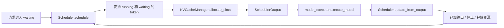

# vLLM 源码导读：V1 如何调度请求与分配 KV 空间

[返回源码导读](README.md) · [PagedAttention](../papers/pagedattention.md) · [FlashAttention](../papers/flashattention.md) · [Transformers](transformers.md) · [MiniGPT 实践](../../labs/minigpt/README.md)

## 1. 阅读对象与问题

阅读日：**2026-10-03**；固定源码标签：**vLLM v0.11.0**。实际阅读 `vllm/v1/engine/core.py`、`vllm/v1/core/sched/scheduler.py`、`vllm/v1/core/kv_cache_manager.py`。本页聚焦 V1 的调度和 KV 管理控制流，没有部署服务、运行 GPU 内核或测量吞吐；它不是整个 vLLM 项目的实现审计。

先修：[F14 长上下文与推理](../../docs/02-perception-language/f-nlp-transformers-llms.md)、[D16 训练系统](../../docs/01-foundations/d-deep-learning.md)、[PagedAttention 精读](../papers/pagedattention.md)。核心问题是：多个长短不一的请求同时到达，怎样决定本轮计算哪些 token，以及怎样为其历史 K/V 留出空间？

FlashAttention 主要解决注意力计算中的数据搬运与中间矩阵开销；PagedAttention 的关键是按块管理 KV 并通过映射访问；连续批处理还涉及请求调度。三者可以组合，不能把其中一个名字当作整个推理服务提速原因。2023 年论文和这里的 V1 代码也不是逐行对应关系。

## 2. 控制层架构与源码证据

| 符号 / 固定标签源码 | 实际职责 |
|---|---|
| [EngineCore.step，engine/core.py:272](https://github.com/vllm-project/vllm/blob/v0.11.0/vllm/v1/engine/core.py#L272) | 顺序调用调度、执行器、输出回写，构成一轮闭环 |
| [Scheduler.schedule，scheduler.py:179](https://github.com/vllm-project/vllm/blob/v0.11.0/vllm/v1/core/sched/scheduler.py#L179) | 根据待计算 token 差值、预算和内存安排请求 |
| [_update_after_schedule，:629](https://github.com/vllm-project/vllm/blob/v0.11.0/vllm/v1/core/sched/scheduler.py#L629) | 调度后推进 num_computed_tokens，保留后续校正空间 |
| [update_from_output，:861](https://github.com/vllm-project/vllm/blob/v0.11.0/vllm/v1/core/sched/scheduler.py#L861) | 对照请求 ID 处理生成 token、停止条件及资源回收 |
| [add_request，:1097](https://github.com/vllm-project/vllm/blob/v0.11.0/vllm/v1/core/sched/scheduler.py#L1097) | 注册请求并加入 waiting 队列 |
| [_free_request，:1147](https://github.com/vllm-project/vllm/blob/v0.11.0/vllm/v1/core/sched/scheduler.py#L1147) | 请求完成后的资源生命周期处理 |
| [KVCacheBlocks，kv_cache_manager.py:19](https://github.com/vllm-project/vllm/blob/v0.11.0/vllm/v1/core/kv_cache_manager.py#L19) | 包装不同 KV cache group 的块集合与块 ID |
| [KVCacheManager.get_computed_blocks，:154](https://github.com/vllm-project/vllm/blob/v0.11.0/vllm/v1/core/kv_cache_manager.py#L154) | 查询已可复用的前缀块和对应 token 数 |
| [allocate_slots，:193](https://github.com/vllm-project/vllm/blob/v0.11.0/vllm/v1/core/kv_cache_manager.py#L193) | 计算新空间需求、检查空闲块、分配；不足时返回 None |
| [free，:306](https://github.com/vllm-project/vllm/blob/v0.11.0/vllm/v1/core/kv_cache_manager.py#L306) | 将请求的块释放交给协调器处理 |

执行器接口在这里是职责边界：它接收本轮调度结果并返回模型输出。具体 GPU 输入打包、kernel block table 布局和不同硬件后端不在本次所读三个文件中，不根据函数名推断其实现细节。

## 3. 调度器怎样统一 prefill 与 decode

V1 的 `schedule` 注释明确说明，调度器不是用两个互斥的“prefill 阶段／decode 阶段”组织请求。每个请求维护已经计算的数量和当前应该计算到的 token 数；一轮调度尝试缩小二者差距。运行中请求的核心差值包含 `num_tokens_with_spec + num_output_placeholders - num_computed_tokens`，再受 token budget、长 prefill 阈值、最大模型长度等约束。

这让长 prompt 可以分块推进，也容纳投机 token。教学时先关闭投机、多模态、远程 KV 和异步占位，仅看文本请求：prefill 是尚未计算的大段输入，decode 是继续追上新增的 token。它们的计算特征仍然不同，只是调度抽象可以统一。

调度器先遍历 running 请求，每个成功分配的请求扣减本轮 token budget。随后在相应条件下接纳 waiting 请求。已有前缀可以减少需要重新计算的 token，但不能因此忽略为复用块维持生命周期。长请求是否可分块，以及本轮接纳顺序，都依赖配置，不能把这个实现简化为永远严格先来先服务。

调度后 `_update_after_schedule` 就推进 `num_computed_tokens`。该字段在控制流程里包含已经安排的工作，不能看到数值增加就断言 GPU 已完成相同数量的计算；投机结果等还可在输出回写时调整。阅读并发系统时，要区分“已分配／已发出／已完成”的时刻。

## 4. KVCacheManager 怎样决定能否分配

`allocate_slots` 接受 request、当前新 token 数、新命中的已计算 token 及可选 lookahead。它先移除本轮不再需要的块，例如滑动窗口之外的部分，然后计算需要容纳的总位置数。协调器给出新增物理块数量；若超过空闲块池，函数返回 None，而不是直接创建无限增长的连续 tensor。

成功后，已有复用块被标记为使用中，新的块被分配给请求。启用缓存时，保存为可复用前缀的范围还受请求已确定 token 数限制；可能被拒绝的投机候选不能直接当作已经确定的上下文。`KVCacheBlocks` 是块引用的包装，不等于把所有真实 K/V 数值都装进 Python 列表。

分块的直觉是将“逻辑上连续的 token 序列”与“物理上连续的显存”分开。例如逻辑块 0、1、2 可以分别映射到物理块 7、2、9。注意力仍按逻辑序列读取历史；块编号跳跃不意味着词序跳跃。下面示例用于解释分配思想，不声称是该版本某个 kernel 的真实内存排列。

## 5. 两个请求的一轮静态推演

假设本轮预算为 4 个 token，内存足够，running 只有请求 A，waiting 只有请求 B，并启用分块 prefill。A 已计算 5 个位置，当前序列已有 6 个 token，需要再处理 1 个；B 有 5 个 prompt token，尚未计算。A 先消耗 1，剩余预算 3，B 本轮处理前 3 个。输出的 token 分配表可以写成 `{A:1,B:3}`，但它不是“生成 A 一词、B 三词”：B 的 3 个位置仍只是 prompt 计算。

再用每块容纳 4 个 token 的概念模型估算空间。A 的 6 个位置需 `ceil(6/4)=2` 块；B 已安排的 3 个位置需 1 块。本轮结束后 B 还有 2 个 prompt 位置未推进，下轮仍要继续计算。这解释了为什么一批请求的请求数不变，每轮 token 数与完成进度也可能变化。

单序列 KV 数据量的理论估算为

$$M\approx 2\,L\,N_{layer}\,H_{kv}\,d_h\,s,$$

其中 2 对应 K/V，s 为每元素字节。若按块分配，L 替换为分配容量，例如 `block_size×ceil(L/block_size)`，才能粗略计入尾块闲置。还需考虑多组 KV、共享、预分配、元数据和设备实现；这个估算不是 `gpu_memory_utilization` 的完整公式，也不是实测显存。

### 前缀命中并不意味着这一请求无需任何计算

`get_computed_blocks` 的一个细节很有教学价值：可复用的是完整块，而且最大命中长度保留了最后一个 token 的重新计算空间，以获得 logits。因为分配接口要求已计算长度按块对齐，这可能导致重新计算不止一个 token。因此，“两个输入文本完全相同”也不能直接推断第二次请求在模型侧零工作。它还必须产生当前采样所需的输出分布，并遵守具体缓存接口。

同一函数在请求需要 prompt log-prob 时跳过前缀缓存路径。原因不能笼统描述为“缓存坏了”：请求要返回的信息变多了，已有缓存是否足以提供这些信息属于另一份接口契约。实验若一组启用 prompt log-prob、另一组没有，却只比较前缀命中率或吞吐，就混入了输出需求差异。阅读参数时要把用户要的结果与系统可以复用的中间状态连起来。

资源释放也并非每次停止都立即擦掉所有物理空间。`_free_request` 先处理连接器完成状态，可能根据远程传输需求延迟块释放；在普通本地路径才继续释放并从请求表移除。这说明一个逻辑请求完成、调度器不再生成新 token，以及相关资源最终可供其他请求使用，可能发生在不同位置。理解这一点后，才能区分资源暂时保留与真正泄漏。

要设计一个有解释力的教学实验，可以固定提示长度和输出长度，逐步增加并发；再保持并发固定，只增加提示长度。前者主要观察批处理与排队，后者增加 prefill 工作及 KV 占用。对两条实验分别记录首 token 延迟、稳态输出间隔、抢占次数及完成请求数，才能把“更快”具体归因到哪一部分。这里只提出控制变量设计，没有实际启动服务或填写数值。

## 6. 失败与恢复路径

**空闲块不足。** running 请求调用 `allocate_slots` 得到 None 后，调度器可以抢占一个运行请求，释放其 KV 与 encoder cache，将状态设为 PREEMPTED，已计算计数归零并放回 waiting。需要重新推进的工作会带来延迟，因此“避免直接报 OOM”不等于没有成本。观察抢占、等待时间和长尾延迟，才知道容量是否足够。

**请求在执行过程中被取消。** `update_from_output` 先按 ID 查询请求；若已经被移除，跳过对应输出。这是正常生命周期竞争的防护，不代表收到的每份模型输出都必须交给用户。

**把吞吐指标代替用户体验。** 连续批处理可以提高设备利用率，但长 prompt、抢占和排队可能影响首 token 延迟与 token 间隔。课程实验需同时报告吞吐、TTFT、输出 token 间延迟、并发与长度分布；本页只给指标设计，没有填写上游运行成绩。

| 论文／讲义概念 | 代码对应 | 阅读边界 |
|---|---|---|
| KV cache 分块与生命周期 | allocate_slots、KVCacheBlocks、free | 这里确认控制流，未解析所有底层内核 |
| 连续批处理 | 每轮 schedule 和 update_from_output | 不同请求可在不同轮次加入或完成 |
| 缓存前缀复用 | get_computed_blocks 和新增已计算量 | 复用条件由缓存实现定义，不是任意语义相似文本 |
| 投机执行 | lookahead 与输出后校正 | 安排的 token 不一定全部成为最终答案 |

## 7. 检测题与解析

1. **预算 16 是不是表示每轮最多服务 16 个请求？** 不是，这里限制的是安排的 token 数；一个长 prompt 可以消耗多项预算，多个 decode 请求也可能各消耗一个。
2. **PagedAttention 是否把注意力计算变成线性时间？** 不直接成立。分块管理解决 KV 存储与访问问题，不能据此改变全注意力随序列长度的数学复杂度。
3. **抢占后请求为何没有丢失，却仍可能变慢？** 请求回到等待队列，但部分 KV 被释放，后续可能需要重新计算上下文；恢复逻辑保持流程可继续，性能仍有代价。

完成标准：给定等待／运行请求、token 预算和块容量，能手工判断本轮可推进的工作，分别解释调度、内存和 GPU 计算三层职责，再回到 [PagedAttention 论文](../papers/pagedattention.md) 比较论文抽象与 V1 工程演化。
